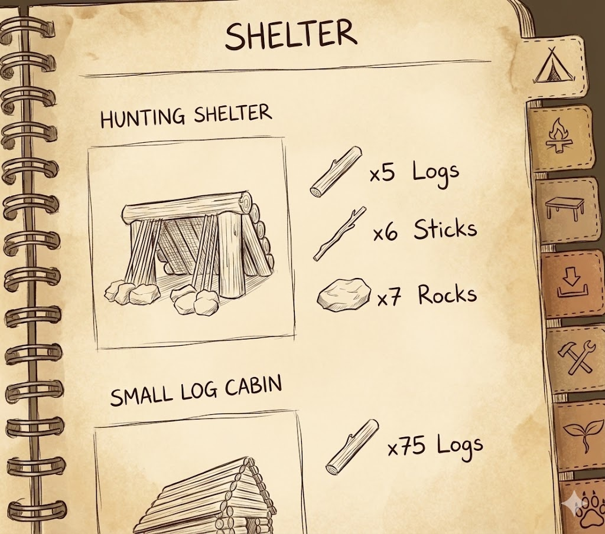

# 需求 
我打算重构当前who was i的布局，我想做成图中这种手绘风格的账本，有三个选项卡：1. 我曾经是谁？ 2.积极重构过去清单 3.重新审视过去参考docs\测试.md。每个选项卡都放置对应数量的问题，这样可以保持页面不变，增加item时，如果是背景图片，页面不会变化，比较好布局。
# 需要的素材

### 1. 基础资源
- **主背景 (Background)**: `notebook_page_bg.png` (1920×1080，羊皮纸/牛皮纸质感纹理)
- **左侧装订 (Spiral Binding)**: `spiral_binding.png` (高度建议 1080px，透明背景线圈)

### 2. 交互选项卡 (Tabs)
- **选项卡 1**: `tab_past.png` (对应 "我曾经是谁")
- **选项卡 2**: `tab_reframe.png` (对应 "积极重构过去")
- **选项卡 3**: `tab_review.png` (对应 "重新审视过去")

### 3. 装饰与状态 (Decorations)
- **分隔线**: `divider_line.png` (手绘风格横向分隔线)
- **空框**: `checkbox_empty.png` (未选中的手绘框)
- **评分态**:
    - `checkbox_plus.png` (标记为 "+" 的选中态)
    - `checkbox_minus.png` (标记为 "-" 的选中态)
    - `checkbox_zero.png` (标记为 "0" 的选中态)

### 4. 推荐字体 (Fonts)
- **中文标题**: `Ma Shan Zheng` (马善政毛笔体)
- **中文正文**: `Zhi Mang Xing` (知忙行书)
- **手写数字/英文**: `Caveat` 或 `Patrick Hand`

# 文件结构
**注意生成的文件需要带版本号！**

frontend/
└── assets/
    └── notebook/
        ├── notebook_page_bg.png      # 主背景
        ├── spiral_binding.png        # 螺旋装订
        ├── tabs/
        │   ├── tab_past_normal.png
        │   ├── tab_past_active.png
        │   ├── tab_reframe_normal.png
        │   ├── tab_reframe_active.png
        │   ├── tab_review_normal.png
        │   └── tab_review_active.png
        └── decorations/
            ├── divider_line.png
            ├── checkbox_empty.png
            ├── checkbox_plus.png
            ├── checkbox_minus.png
            └── checkbox_zero.png