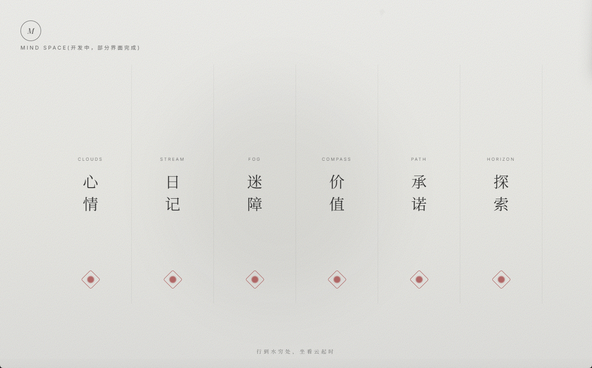

# LifePrism 

LifePrism：您的数据驱动成长伴侣。​ 一站式记录您的外在行为与内在感受，通过目标管理、深度自我剖析（行为模式、矛盾与关系分析），将数据转化为清晰的自我认知与持续的行动指南。

## 功能

### lifewatch

📷 点击展开查看截图

### goalmaster | habit

📷 点击展开查看截图

### mind space

📷 点击展开查看截图

### 拓展内容

📷 点击展开查看截图

  

