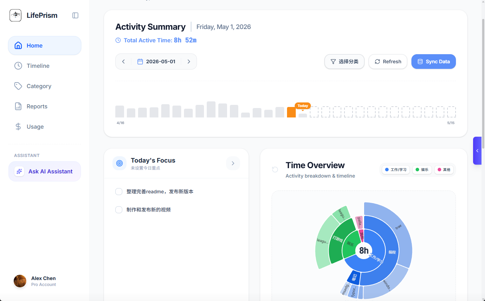
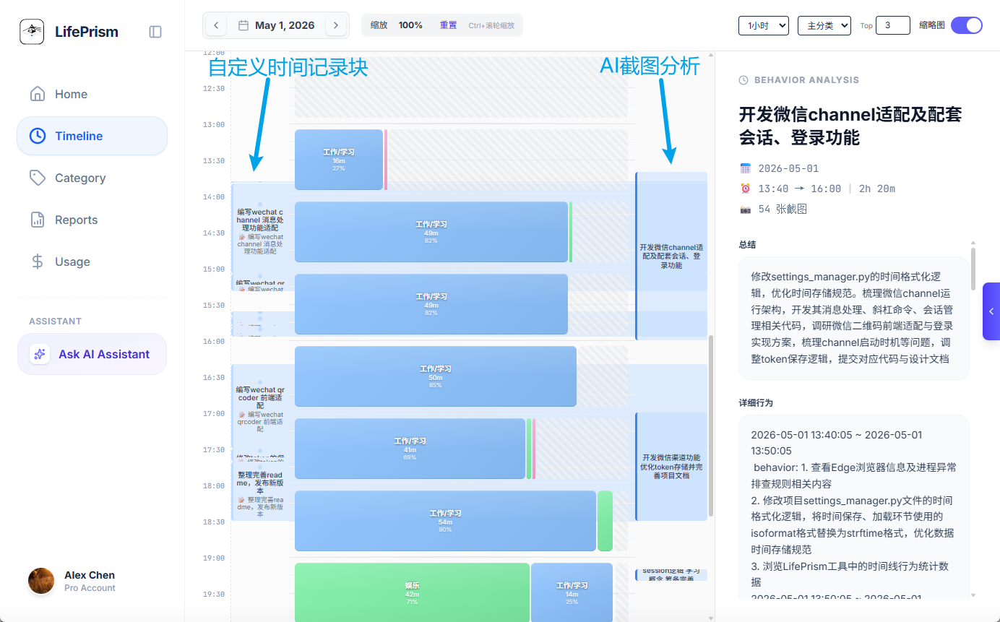
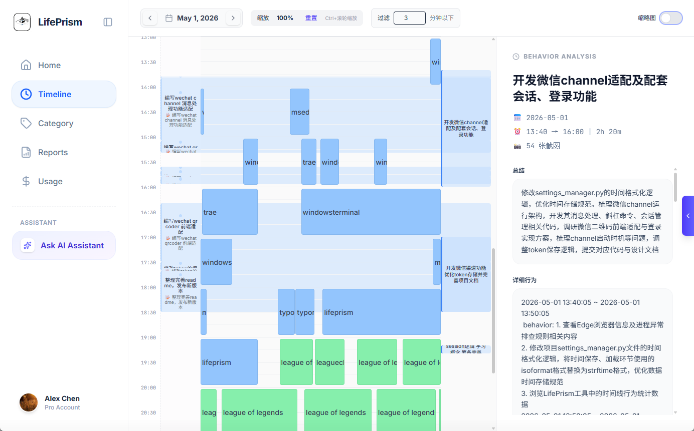
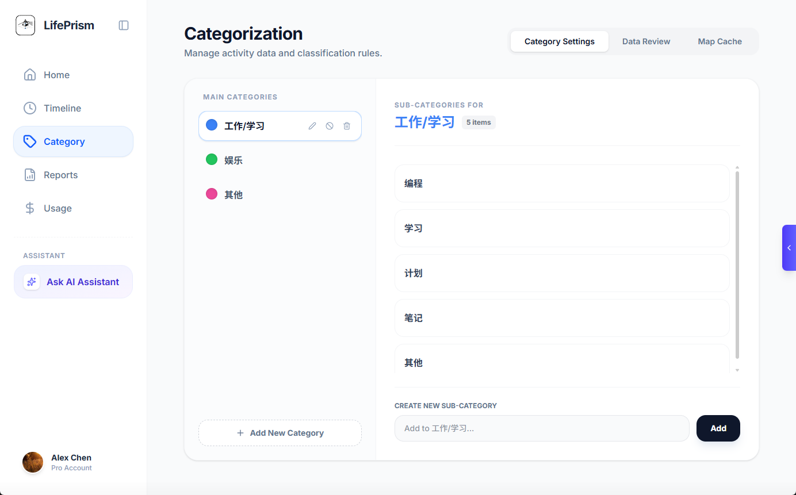
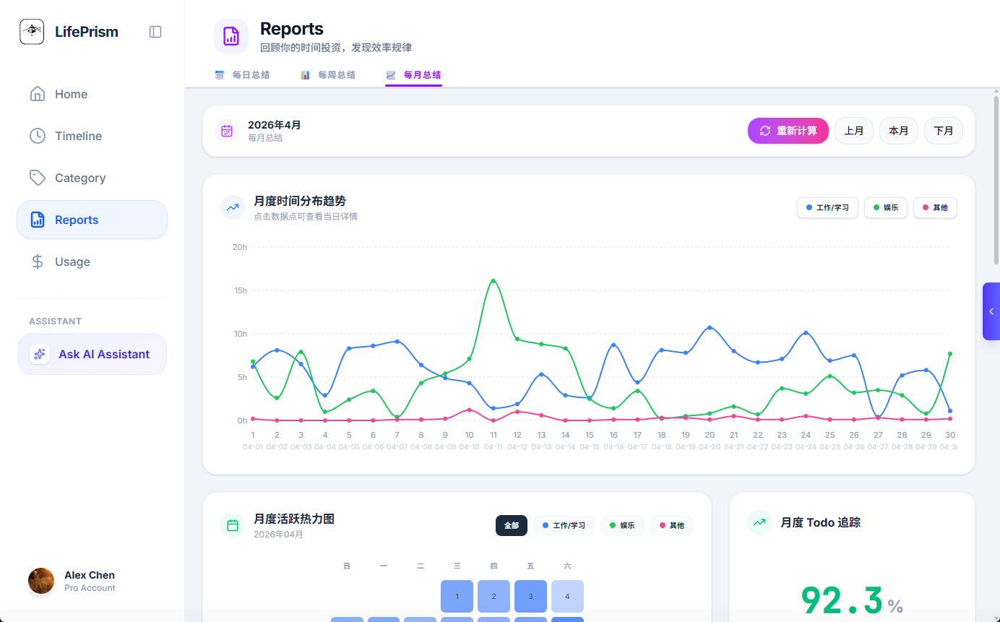
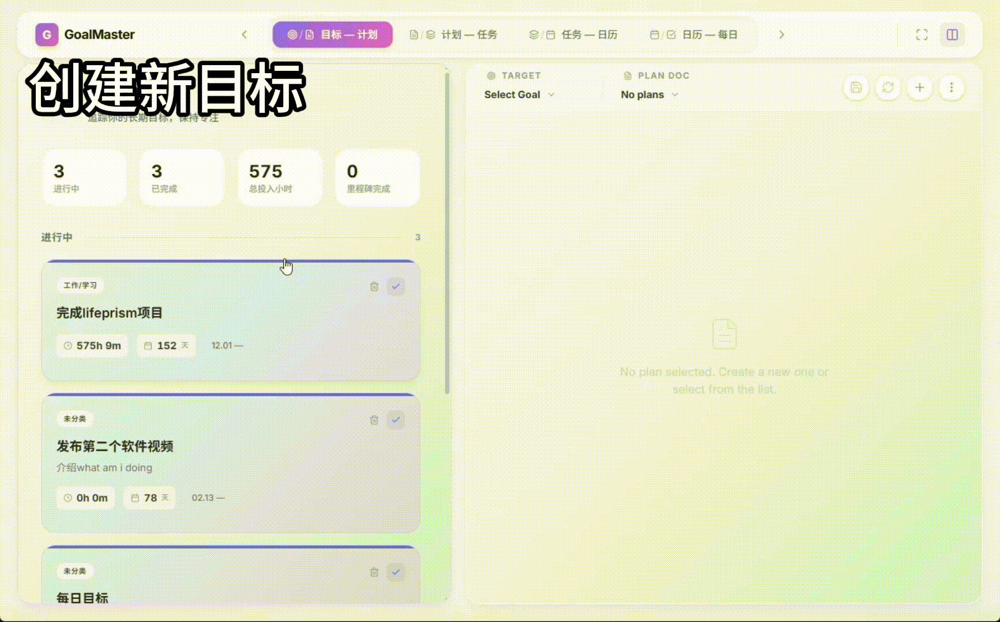
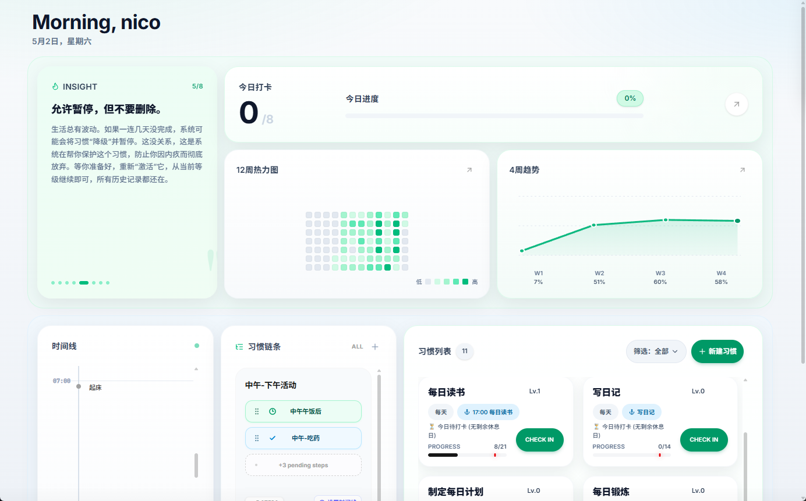
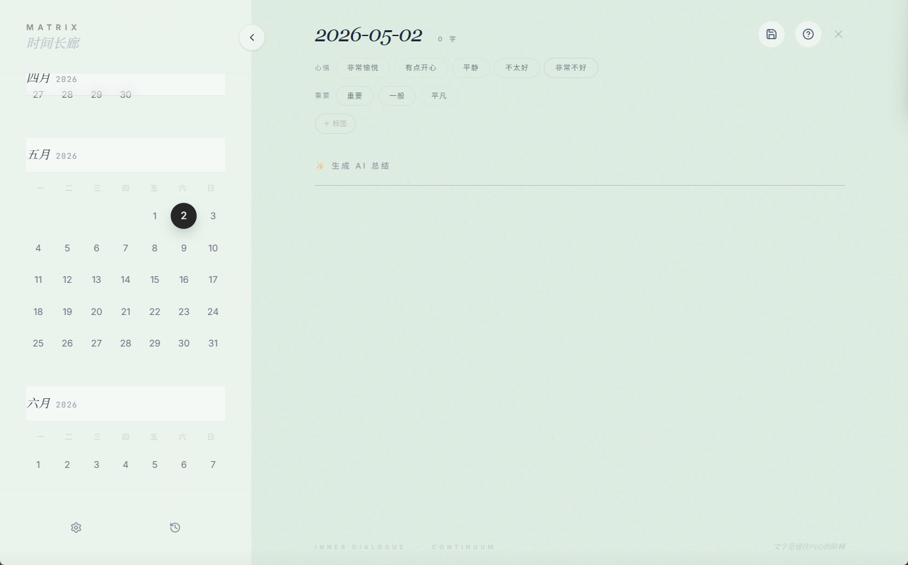
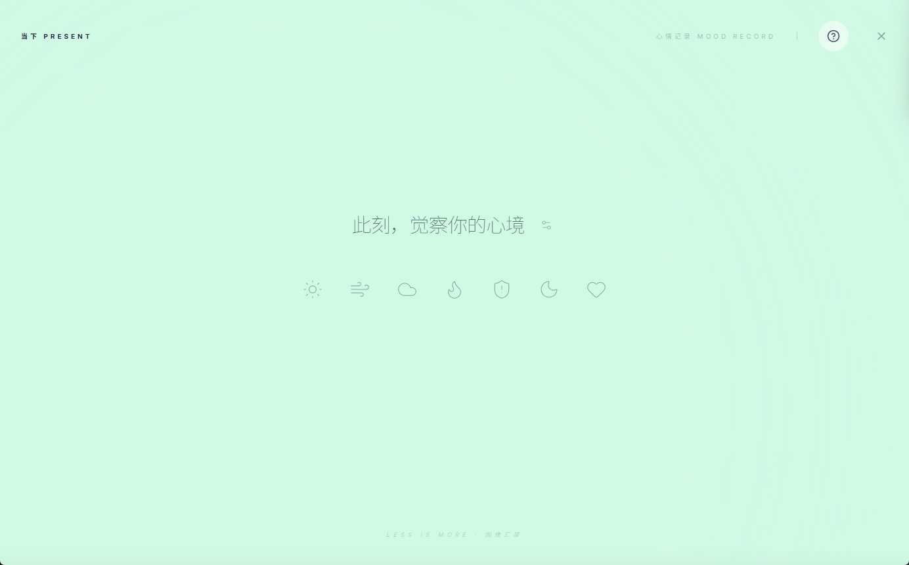
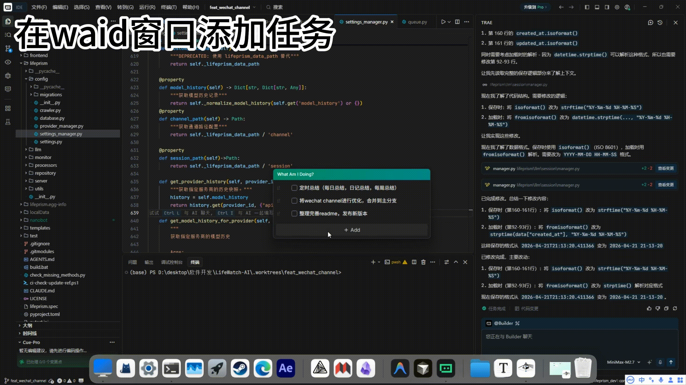

# LifePrism 

LifePrism：您的数据驱动成长伴侣。​ 一站式记录您的外在行为与内在感受，通过目标管理、深度自我剖析（行为模式、矛盾与关系分析），将数据转化为清晰的自我认知与持续的行动指南。

## 功能

### LifeWatch - 时间追踪与行为分析

LifeWatch 是您的个人时间管家，通过自动追踪和智能分类，帮助您深入了解时间的流向。

  
  
<i>首页 - 一目了然的今日活动概览与待办事项</i>

**核心功能：**
- **智能时间追踪**：自动记录您在各个应用和网站上的活动时间
- **可视化时间轴**：24小时时间块展示，精确到分钟级别的活动记录
- **AI 智能分类**：自动将活动归类到工作、学习、娱乐等类别
- **自定义时间块**：手动标记特殊时段，补充自动追踪的盲区
- **行为分析**：深度分析您的行为模式，发现时间使用规律

  
  
  
<i>Timeline - 精确到分钟的时间流动轨迹</i>

  
  
  
<i>左：灵活的分类管理系统 | 右：数据驱动的行为洞察报告</i>

---

### GoalMaster - 目标管理系统

GoalMaster 采用目标-计划-任务池-日历的四层架构，帮助您将宏大目标拆解为可执行的日常行动。

  
  
<i>从目标到行动的完整闭环</i>

**核心功能：**
- **目标管理（Goals）**：设定长期目标，追踪里程碑进度，记录目标日志
- **计划文档（Plans）**：为目标制定详细的执行计划，支持 Markdown 格式
- **任务池（Pool）**：将计划拆解为具体任务，统一管理待办事项
- **日历分配（Assign）**：将任务分配到具体日期，可视化时间安排
- **每日任务（Daily）**：专注于今日待办，快速添加和完成任务
- **时间投入统计**：自动关联 LifeWatch 数据，追踪目标实际投入时间

**设计理念：**
- **双面板布局**：左右分屏，上下文切换零成本
- **灵活视图切换**：单面板/双面板模式自由切换，适应不同工作场景
- **数据联动**：目标、计划、任务、日历四层数据无缝衔接

  
  
<i>习惯追踪 - 培养持续的微小改变</i>

---

### Mind Space - 内心世界探索

Mind Space 是您的私密心灵空间，通过日记、情绪记录和深度反思，帮助您建立与内在自我的连接。

  
  
<i>Mind Space - 禅意美学的心灵入口</i>

**核心功能：**

- **Mood（情绪）**：追踪情绪波动，识别情绪触发因素和模式
- **Journal（日记）**：自由书写，记录生活点滴与内心感悟
- **Being（存在）**：探索自我认知，记录人生价值观和核心信念
- **Commitment（承诺）**：设定个人承诺，追踪自我成长的关键决定
- **Value（价值观）**：梳理核心价值观，建立人生指南针

  
  
  
<i>左：沉浸式日记书写体验 | 右：情绪追踪与可视化</i>

---

### 拓展功能

  
  
<i>What Am I Doing - 实时活动提醒浮窗</i>

**What Am I Doing（WAID）浮窗**：
- 实时显示当前正在进行的活动
- 快速标记和分类当前任务
- 保持专注，避免时间黑洞

## THANKS

1. activitywatch 提供最初的时间追踪灵感，以及内置监控部分代码参考
2. nanobot 提供能llm agent部分的代码架构设计参考

## 免责声明

该系统不会主动发送任何数据信息到外部服务器，也不会收集任何用户个人信息。请管理好您的数据，避免泄露给第三方。
系统AI生成的任何仅供参考，不构成专业建议。
