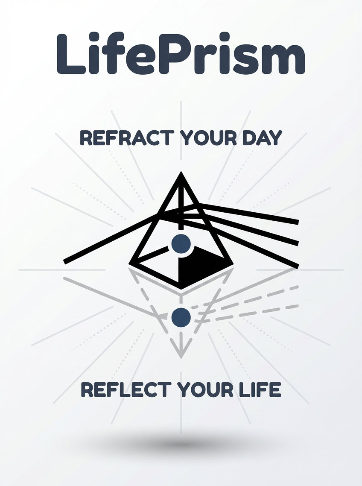

# front-of-lifePrism

LifePrism的前端部分

## 📊 前段开发状态

| 页面 | 状态 | 说明 |
|------|------|------|
| Home | ✅ 已完成 | 首页仪表盘 |
| Timeline | ✅ 已完成 | 时间线视图 |
| Category | ✅ 已完成 | 分类管理 |
| Usage | ✅ 已完成 | API 使用量追踪 |
| Goals | 🚀 即将完成 | 目标管理 |
| Chatbot | ✅ 已完成 | 聊天机器人 |
| Reports | 🚀 即将完成 | 报告统计 |
| Settings | ✅ 已完成 | 设置页面 |
| diary | 🚧 待开发 | 日记界面 | 
| doing | 🚧 待开发 | 任务视图 |

## License

This project is licensed under the Apache License 2.0 - see the [LICENSE](LICENSE) file for details.

## Trademarks

The "LifePrism" name, the logo, and the slogan are trademarks of the project owners. 
The license for this software does not grant you any rights to use these trademarks, except as required for reasonable and customary use in describing the origin of the software and reproducing the content of the NOTICE file.
