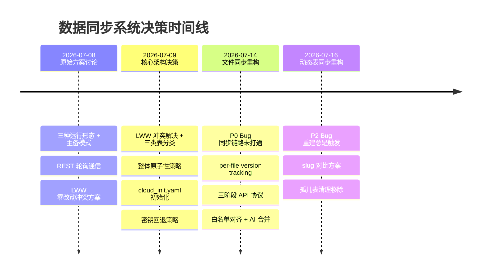

# 数据同步系统：决策时间线

## 版本

| 版本 | 更新内容 |
| ---- | -------- |
| 1.1 | 每个决策阶段增加对应的 Bug 记录链接 + 前提引出的已知限制/技术债链接 |
| 1.0 | 创建时间线初稿，串联 8 篇子 ADR |

## 决策全景



## 阶段 1：原始方案讨论（7/8）

### 1.1 部署形态与主备模式

**来源**：`.scratch/linux-deployment-discussion/sync-solution.md`

确立三种运行形态（完整版 / Web Demo / Agent Only）和主备模式——同一时间只有一端 Agent 在工作。主备模式成为后续所有冲突解决决策的核心前提。

**关联 Bug / 文档**：

| 关联 | 文档 | 说明 |
|------|------|------|
| 🔗 已知限制 | [sync-time-dependency](file:///d:/desktop/软件开发/LifeWatch-AI/docs/known-limitations/sync-time-dependency-and-clock-skew.md) | 主备切换场景下时钟偏差导致数据丢失风险——这是主备模式的前提漏洞 |
| 🔗 已知限制 | [cloud-security-limitations](file:///d:/desktop/软件开发/LifeWatch-AI/docs/known-limitations/cloud-security-limitations.md) | 主备架构下 wxid / API Key 明文存储、HTTPS 未启用 |
| 🔗 P0 Bug（已修复） | [packaged-exit-skips-shutdown](file:///d:/desktop/软件开发/LifeWatch-AI/docs/history-bugs/2026-07-16-packaged-exit-skips-graceful-shutdown.md) | 主备切换的"关闭前同步"在打包环境被跳过 → 云端接管延迟 + 数据丢失 |

### 1.2 决策：REST 轮询通信

→ ADR: [rest-polling-communication](file:///d:/desktop/软件开发/LifeWatch-AI/docs/adr/2026-07-09-rest-polling-communication.md)

选择 HTTP REST API + 本地主动轮询（10 分钟间隔），否决 WebSocket 长连接和云端推送。原因：同步频率低、本地在 NAT 后面、REST 最简单可靠。

**核心前提**：同步频率低（10 分钟），实时性要求低。

### 1.3 决策：LWW 冲突解决

→ ADR: [lww-conflict-resolution](file:///d:/desktop/软件开发/LifeWatch-AI/docs/adr/2026-07-09-lww-conflict-resolution.md)

选择 `updated_at` 比较的 Last-Write-Wins 策略，否决 CRDT 和版本号方案。按主键类型分成三类表（TEXT 主键 / AUTOINCREMENT+UNIQUE / 补充约束），每类有不同写入策略。

**核心前提**：主备模式 + NTP 时钟偏差 < 1 秒 + 主备切换间隔大于时钟偏差。

**关联 Bug / 文档**：

| 关联 | 文档 | 说明 |
|------|------|------|
| 🔗 已知限制 | [sync-time-dependency](file:///d:/desktop/软件开发/LifeWatch-AI/docs/known-limitations/sync-time-dependency-and-clock-skew.md) | LWW 依赖时钟同步，前提 2 和 3 一旦失效 LWW 可能选错版本 |
| 🔗 P1 Bug | [database-delete-not-synced](file:///d:/desktop/软件开发/LifeWatch-AI/docs/history-bugs/2026-07-16-database-delete-not-synced.md) | LWW 只能解决 update 冲突，无法感知 DELETE——被删记录在对端永久保留。与 LWW 是互补问题（LWW 管"写入冲突"，tombstone 管"删除传播"） |

---

## 阶段 2：核心架构决策（7/9）

### 2.1 原子性策略

→ ADR: [sync-atomicity-strategy](file:///d:/desktop/软件开发/LifeWatch-AI/docs/adr/2026-07-09-sync-atomicity-strategy.md)

采用全局 `last_sync_time` 整体原子性——Pull 和 Push 全部成功才更新时间戳，任一表失败则保持旧值。否决 row-level best-effort，因为失败行跳过会导致数据永久丢失。

### 2.2 全量同步策略 + LWW 相等跳过

→ ADR: [sync-full-sync-strategy](file:///d:/desktop/软件开发/LifeWatch-AI/docs/adr/2026-07-14-sync-full-sync-strategy.md)

两个关联决策：(1) 全量同步采用"重置同步进度按钮"（清空本地 `last_sync_time`），否决云端维护 sync_state 表；(2) LWW 中 `updated_at` 相等时跳过而非覆盖。

### 2.3 云端配置初始化 + 密钥回退

→ ADR: [cloud-init-atomic-strategy](file:///d:/desktop/软件开发/LifeWatch-AI/docs/adr/2026-07-09-cloud-init-atomic-strategy.md)
→ ADR: [key-fallback-strategy](file:///d:/desktop/软件开发/LifeWatch-AI/docs/adr/2026-07-09-key-fallback-strategy.md)

cloud_init.yaml 验证失败时不删除文件。密钥从 keyring + config.yaml fallback 改为 keyring + storage.yaml（权限 600），通过 `run_mode` 控制读写隔离。

**关联 Bug / 文档**：

| 关联 | 文档 | 说明 |
|------|------|------|
| 🐛 Bug | [sync-key-regeneration-and-config-fallback](file:///d:/desktop/软件开发/LifeWatch-AI/docs/history-bugs/2026-07-14-sync-key-regeneration-and-config-fallback.md) | 密钥回退策略的直接触发 bug——config.yaml fallback 污染导致 Key 无法重新生成 |
| 🐛 Bug | [cloud-init-provider-display-name-mismatch](file:///d:/desktop/软件开发/LifeWatch-AI/docs/history-bugs/2026-07-11-cloud-init-provider-display-name-mismatch.md) | cloud_init.yaml 中 provider 两层命名导致验证失败 |
| 🔗 已知限制 | [cloud-security-limitations](file:///d:/desktop/软件开发/LifeWatch-AI/docs/known-limitations/cloud-security-limitations.md) | Key 明文存储（限制 2/3）、无法重新生成（限制 3） |

---

## 阶段 3：文件同步重构（7/14 — Bug 驱动）

### 3.1 触发 Bug

**P0 Bug**: [sync-client-not-started-and-empty-file-lww-overwrite](file:///d:/desktop/软件开发/LifeWatch-AI/docs/history-bugs/2026-07-14-sync-client-not-started-and-empty-file-lww-overwrite.md)

两个关联问题：
1. 同步链路未打通 — SyncClient 从未调用 `start_scheduled_sync()`
2. 空文档覆盖 — 云端新部署空文档（mtime 为当前时间）反向覆盖本地有内容文档

Bug 1 修复前 Bug 2 被掩盖未暴露，两者必须一起修复。这个 Bug 是阶段 3 全部 5 个决策的触发根源。

### 3.2 决策 1：per-file version tracking

→ ADR: [file-sync-conflict-resolution](file:///d:/desktop/软件开发/LifeWatch-AI/docs/adr/2026-07-14-file-sync-conflict-resolution.md)（决策 1）

采用 `parent_hash + current_hash` 替代纯 LWW mtime 比较，通过 11 状态决策矩阵区分四种场景（仅本地改 / 仅云端改 / 都改 / 新建）。

### 3.3 决策 2-3：白名单对齐 + 分流策略

→ 同上 ADR（决策 2-3）

同步白名单对齐 Agent 工具白名单（ALLOWED_DIRS + session），chat_history.json 明确排除。MD 冲突由 AI 驱动解决（CONFLICT_RESOLVE 消息类型），JSONL 走文件级 LWW。

**关联 Bug / 文档**：

| 关联 | 文档 | 说明 |
|------|------|------|
| 🔗 技术债 | [behavior-md-large-file-one-way-sync](file:///d:/desktop/软件开发/LifeWatch-AI/docs/technical-debt/behavior-md-large-file-one-way-sync.md) | behavior.md 仅本地 dreaming task 写入（前提 8），但 AI 合并仍纳入浪费 85K+ tokens——白名单对齐决策的遗漏 |
| 🔗 技术债 | [conflict-resolve-ai-merged-garbage](file:///d:/desktop/软件开发/LifeWatch-AI/docs/technical-debt/conflict-resolve-ai-merged-garbage.md) | CONFLICT_RESOLVE 中 AI 自行创建 _merged.md 垃圾文件 + 提示词硬编码——AI 合并决策的实现技术债 |

### 3.4 决策 4：account.json → 数据库

→ 同上 ADR（决策 4）

account.json 改为 wechat_account_state 数据库表存储，从文件白名单移除。

### 3.5 决策 5：三阶段 API 协议

→ 同上 ADR（决策 5）

API 协议从简单的 pull/push 2 端点改为三阶段：check（mtime 过滤 + hash 精确判断 + 存在性查询）→ fetch/push（传输）→ verify/commit（一致性校验）。

### 3.6 Bug 驱动的修正（7/16）

**P0 Bug**: [cloud-missing-files-skipped-by-false-assumption](file:///d:/desktop/软件开发/LifeWatch-AI/docs/history-bugs/2026-07-16-cloud-missing-files-skipped-by-false-assumption.md)

check 端点只返回变更文件不返回完整路径，本地用 `local_parent is not None` 猜测导致云端缺失文件被错误 SKIP。修复：新增 `all_paths` 返回字段（v2.3）。

这个 Bug 是决策 5 三阶段 API 协议设计的遗漏——"远端状态未显式查询"是文件同步的通用设计教训。

**关联 Bug / 文档**：

| 关联 | 文档 | 说明 |
|------|------|------|
| 🐛 P0 Bug | [cloud-missing-files-skipped](file:///d:/desktop/软件开发/LifeWatch-AI/docs/history-bugs/2026-07-16-cloud-missing-files-skipped-by-false-assumption.md) | 3.6 的直接 bug |
| 🔗 部署 | [cloud-code-requires-reinstall-after-pull](file:///d:/desktop/软件开发/LifeWatch-AI/docs/history-bugs/2026-07-16-cloud-code-requires-reinstall-after-pull.md) | 云端部署流程：git pull → pip install -e . → restart。文件同步测试的环境前提 |

---

## 阶段 4：动态表同步重构（7/16 — Bug 驱动）

### 4.1 触发 Bug

**P2 Bug**: [dynamic-tables-rebuild-always-triggered](file:///d:/desktop/软件开发/LifeWatch-AI/docs/history-bugs/2026-07-16-dynamic-tables-rebuild-always-triggered.md)

触发条件方向错误（检测云端→本地，但 rebuild 方向是本地→云端）+ 兜底条件永真。导致每次 sync_once 都触发无意义的云端重建请求。

### 4.2 决策：slug 对比方案

→ ADR: [dynamic-tables-sync-definition-comparison](file:///d:/desktop/软件开发/LifeWatch-AI/docs/adr/2026-07-16-dynamic-tables-sync-definition-comparison.md)

采用"拉取云端定义 → slug 集合对比 → 双向建表"方案。新增 `GET /api/sync/dynamic-tables-definitions` 端点，删除 `get_all_sync_tables`。本地建表只执行 DDL 不写 meta。

**核心前提**：动态表字段不会被修改、主备模式、sync_once 期间无并发修改。

### 4.3 Bug 驱动的修正（7/16）

**P1 Bug**: [dynamic-tables-orphan-cleanup-wipes-remote-data](file:///d:/desktop/软件开发/LifeWatch-AI/docs/history-bugs/2026-07-16-dynamic-tables-orphan-cleanup-wipes-remote-data.md)

`rebuild_dynamic_tables` 的孤儿表清理逻辑错误假设本地是 SSOT，导致云端自己创建的表被 DROP。修复：直接删除孤儿表清理逻辑，删除同步需要独立的 tombstone 机制。

**关联 Bug / 文档**：

| 关联 | 文档 | 说明 |
|------|------|------|
| 🐛 P1 Bug | [orphan-cleanup-wipes-remote-data](file:///d:/desktop/软件开发/LifeWatch-AI/docs/history-bugs/2026-07-16-dynamic-tables-orphan-cleanup-wipes-remote-data.md) | 4.3 的直接 bug |
| 🐛 P2 Bug | [rebuild-always-triggered](file:///d:/desktop/软件开发/LifeWatch-AI/docs/history-bugs/2026-07-16-dynamic-tables-rebuild-always-triggered.md) | 4.1 的触发 bug |
| 🔗 P1 Bug | [database-delete-not-synced](file:///d:/desktop/软件开发/LifeWatch-AI/docs/history-bugs/2026-07-16-database-delete-not-synced.md) | 孤儿表清理修复引出"删除同步需要 tombstone"，与 DELETE 不同步是同一个根因 |

---

## 全局视角

### 决策依赖图

```
主备模式（前提）
  ├─ LWW 冲突解决
  │    ├─ 三类表分类
  │    └─ 🔗 P1 Bug: DELETE 不同步（tombstone 缺失）
  ├─ REST 轮询通信
  ├─ 文件同步 per-file version tracking
  │    ├─ 白名单对齐 ─── 🔗 技术债: behavior.md AI 合并浪费
  │    ├─ AI 合并（微信 MD） ─── 🔗 技术债: _merged.md 垃圾文件
  │    ├─ account.json → 数据库
  │    └─ 三阶段 API ─── 🔗 P0 Bug: all_paths 存在性遗漏
  ├─ 动态表 slug 对比
  │    ├─ 🔗 P2 Bug: 触发条件方向错误
  │    └─ 移除孤儿表清理 ─── 🔗 P1 Bug: SSOT 假设错误
  └─ 心跳消息路由
       └─ 整体原子性策略
```

### 主动设计 vs Bug 驱动修正

| 类型 | 决策 | 触发 | 关联 Bug |
|------|------|------|----------|
| 主动设计 | LWW 冲突解决 | 原始方案讨论 | [DELETE 不同步](file:///d:/desktop/软件开发/LifeWatch-AI/docs/history-bugs/2026-07-16-database-delete-not-synced.md)（LWW 互补问题） |
| 主动设计 | 整体原子性策略 | 原始方案讨论 | — |
| 主动设计 | REST 轮询通信 | 原始方案讨论 | — |
| 主动设计 | 云端配置初始化 | 部署需求 | [Key 无法重新生成](file:///d:/desktop/软件开发/LifeWatch-AI/docs/history-bugs/2026-07-14-sync-key-regeneration-and-config-fallback.md)、[provider 命名不匹配](file:///d:/desktop/软件开发/LifeWatch-AI/docs/history-bugs/2026-07-11-cloud-init-provider-display-name-mismatch.md) |
| Bug 驱动 | per-file version tracking | P0 空文档覆盖 | [同步链路未打通 + 空文档覆盖](file:///d:/desktop/软件开发/LifeWatch-AI/docs/history-bugs/2026-07-14-sync-client-not-started-and-empty-file-lww-overwrite.md) |
| Bug 驱动 | 三阶段 API 协议 | P0 空文档覆盖 | 同上 + [all_paths 遗漏](file:///d:/desktop/软件开发/LifeWatch-AI/docs/history-bugs/2026-07-16-cloud-missing-files-skipped-by-false-assumption.md) |
| Bug 驱动 | all_paths 存在性查询 | P0 文件 SKIP | [cloud-missing-files-skipped](file:///d:/desktop/软件开发/LifeWatch-AI/docs/history-bugs/2026-07-16-cloud-missing-files-skipped-by-false-assumption.md) |
| Bug 驱动 | slug 对比方案 | P2 总是重建 | [rebuild-always-triggered](file:///d:/desktop/软件开发/LifeWatch-AI/docs/history-bugs/2026-07-16-dynamic-tables-rebuild-always-triggered.md) |
| Bug 驱动 | 移除孤儿表清理 | P1 数据丢失 | [orphan-cleanup-wipes-remote-data](file:///d:/desktop/软件开发/LifeWatch-AI/docs/history-bugs/2026-07-16-dynamic-tables-orphan-cleanup-wipes-remote-data.md) |

> 6/9 个决策是 Bug 驱动的。主备模式是唯一从未被挑战的前提，但也是绝大多数 Bug 的根源——同步系统设计时的假设（"本地永远在线"、"本地是权威来源"）在实际使用中被打破后才暴露问题。

### 前提 → 风险文档索引

每个核心前提背后都对应已知限制或技术债。前提一旦失效，对应的文档描述的风险变为现实。

| 核心前提 | 失效后果 | 关联文档 |
|----------|---------|----------|
| 主备模式 | 多端并发写入，LWW 冲突概率增大 | [时钟偏差](file:///d:/desktop/软件开发/LifeWatch-AI/docs/known-limitations/sync-time-dependency-and-clock-skew.md) |
| NTP 时钟偏差 < 1s | LWW 选错版本，本地变覆盖率云端更新 | [时钟偏差](file:///d:/desktop/软件开发/LifeWatch-AI/docs/known-limitations/sync-time-dependency-and-clock-skew.md) |
| 本地永在线 | 打包退出失去同步窗口，数据不一致 | [packaged-exit-shutdown](file:///d:/desktop/软件开发/LifeWatch-AI/docs/history-bugs/2026-07-16-packaged-exit-skips-graceful-shutdown.md) |
| Agent 工具白名单不扩展 | behavior.md 纳入 AI 合并浪费 token | [behavior-md-sync](file:///d:/desktop/软件开发/LifeWatch-AI/docs/technical-debt/behavior-md-large-file-one-way-sync.md) |
| 动态表字段不修改 | 需要从 slug 对比升级为 slug+fields 对比 | ADR [dynamic-tables-sync-definition-comparison](file:///d:/desktop/软件开发/LifeWatch-AI/docs/adr/2026-07-16-dynamic-tables-sync-definition-comparison.md) 前提 1 |
| 无并发建表 | 两端 id 冲突 | ADR 同上 前提 2-3 |
| API Key 安全假设 | 明文泄露导致滥用 | [cloud-security-limitations](file:///d:/desktop/软件开发/LifeWatch-AI/docs/known-limitations/cloud-security-limitations.md) |

### 未解决问题索引

| 类别 | 问题 | 文档 |
|------|------|------|
| P1 Bug | DELETE 操作不同步 | [database-delete-not-synced](file:///d:/desktop/软件开发/LifeWatch-AI/docs/history-bugs/2026-07-16-database-delete-not-synced.md) |
| 已知限制 | 时钟偏差 + 主备切换数据丢失风险 | [sync-time-dependency](file:///d:/desktop/软件开发/LifeWatch-AI/docs/known-limitations/sync-time-dependency-and-clock-skew.md) |
| 已知限制 | API Key / wxid 明文存储 | [cloud-security-limitations](file:///d:/desktop/软件开发/LifeWatch-AI/docs/known-limitations/cloud-security-limitations.md) |
| 技术债 | behavior.md 单向同步 + AI 合并浪费 | [behavior-md-sync](file:///d:/desktop/软件开发/LifeWatch-AI/docs/technical-debt/behavior-md-large-file-one-way-sync.md) |
| 技术债 | AI 合并生成 _merged.md 垃圾文件 | [conflict-resolve-garbage](file:///d:/desktop/软件开发/LifeWatch-AI/docs/technical-debt/conflict-resolve-ai-merged-garbage.md) |

### 相关文档

- **ADR 索引**: [docs/adr/index.md](file:///d:/desktop/软件开发/LifeWatch-AI/docs/adr/index.md)
- **数据同步 Spec 总览**: [docs/specs/2026-07-16-data-sync-overview.md](file:///d:/desktop/软件开发/LifeWatch-AI/docs/specs/2026-07-16-data-sync-overview.md)
- **数据同步 Core Spec**: [docs/specs/2026-07-16-data-sync-core-spec.md](file:///d:/desktop/软件开发/LifeWatch-AI/docs/specs/2026-07-16-data-sync-core-spec.md)
- **文件同步 Spec**: [docs/specs/2026-07-16-data-sync-files-spec.md](file:///d:/desktop/软件开发/LifeWatch-AI/docs/specs/2026-07-16-data-sync-files-spec.md)
- **数据流**: [docs/flows/2026-07-11-data-sync-flow.md](file:///d:/desktop/软件开发/LifeWatch-AI/docs/flows/2026-07-11-data-sync-flow.md)
- **已知限制索引**: [docs/known-limitations/index.md](file:///d:/desktop/软件开发/LifeWatch-AI/docs/known-limitations/index.md)
- **技术债索引**: [docs/technical-debt/index.md](file:///d:/desktop/软件开发/LifeWatch-AI/docs/technical-debt/index.md)
- **历史 Bug 索引**: [docs/history-bugs/index.md](file:///d:/desktop/软件开发/LifeWatch-AI/docs/history-bugs/index.md)
