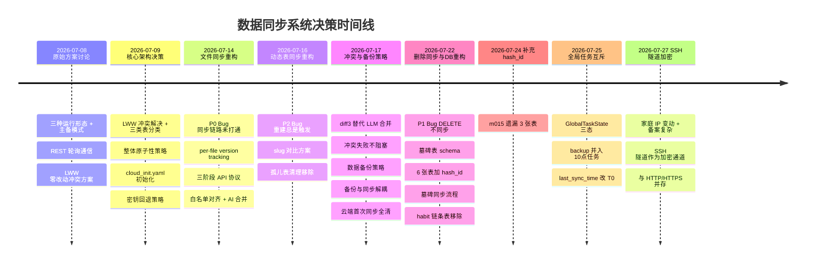

# 数据同步系统：决策时间线

## 版本

| 版本 | 更新内容 |
| ---- | -------- |
| 2.0 | 扩展时间线至 7/27：新增阶段 5（冲突与备份策略完善）、阶段 6（删除同步与数据库重构，Bug 驱动）、阶段 7（全局任务状态互斥）、阶段 8（SSH 隧道加密通道）；文件名从 2026-07-16 改为 2026-07-27 |
| 1.1 | 每个决策阶段增加对应的 Bug 记录链接 + 前提引出的已知限制/技术债链接 |
| 1.0 | 创建时间线初稿，串联 8 篇子 ADR |

## 决策全景



## 阶段 1：原始方案讨论（7/8）

### 1.1 部署形态与主备模式

**来源**：`.scratch/linux-deployment-discussion/sync-solution.md`

确立三种运行形态（完整版 / Web Demo / Agent Only）和主备模式——同一时间只有一端 Agent 在工作。主备模式成为后续所有冲突解决决策的核心前提。

**关联 Bug / 文档**：

| 关联 | 文档 | 说明 |
|------|------|------|
| 🔗 已知限制 | [sync-time-dependency](file:///d:/desktop/软件开发/LifeWatch-AI/docs/known-limitations/sync-time-dependency-and-clock-skew.md) | 主备切换场景下时钟偏差导致数据丢失风险——这是主备模式的前提漏洞 |
| 🔗 已知限制 | [cloud-security-limitations](file:///d:/desktop/软件开发/LifeWatch-AI/docs/known-limitations/cloud-security-limitations.md) | 主备架构下 wxid / API Key 明文存储、HTTPS 未启用 |
| 🔗 P0 Bug（已修复） | [packaged-exit-skips-shutdown](file:///d:/desktop/软件开发/LifeWatch-AI/docs/history-bugs/2026-07-16-packaged-exit-skips-graceful-shutdown.md) | 主备切换的"关闭前同步"在打包环境被跳过 → 云端接管延迟 + 数据丢失 |

### 1.2 决策：REST 轮询通信

ADR: [rest-polling-communication](file:///d:/desktop/软件开发/LifeWatch-AI/docs/adr/2026-07-09-rest-polling-communication.md)

选择 HTTP REST API + 本地主动轮询（10 分钟间隔），否决 WebSocket 长连接和云端推送。原因：同步频率低、本地在 NAT 后面、REST 最简单可靠。

**核心前提**：同步频率低（10 分钟），实时性要求低。

### 1.3 决策：LWW 冲突解决

ADR: [lww-conflict-resolution](file:///d:/desktop/软件开发/LifeWatch-AI/docs/adr/2026-07-09-lww-conflict-resolution.md)

选择 `updated_at` 比较的 Last-Write-Wins 策略，否决 CRDT 和版本号方案。按主键类型分成三类表（TEXT 主键 / AUTOINCREMENT+UNIQUE / 补充约束），每类有不同写入策略。

**核心前提**：主备模式 + NTP 时钟偏差 < 1 秒 + 主备切换间隔大于时钟偏差。

**关联 Bug / 文档**：

| 关联 | 文档 | 说明 |
|------|------|------|
| 🔗 已知限制 | [sync-time-dependency](file:///d:/desktop/软件开发/LifeWatch-AI/docs/known-limitations/sync-time-dependency-and-clock-skew.md) | LWW 依赖时钟同步，前提 2 和 3 一旦失效 LWW 可能选错版本 |
| 🔗 P1 Bug | [database-delete-not-synced](file:///d:/desktop/软件开发/LifeWatch-AI/docs/history-bugs/2026-07-16-database-delete-not-synced.md) | LWW 只能解决 update 冲突，无法感知 DELETE——被删记录在对端永久保留。与 LWW 是互补问题（LWW 管"写入冲突"，tombstone 管"删除传播"） |

---

## 阶段 2：核心架构决策（7/9）

### 2.1 原子性策略

ADR: [sync-atomicity-strategy](file:///d:/desktop/软件开发/LifeWatch-AI/docs/adr/2026-07-09-sync-atomicity-strategy.md)

采用全局 `last_sync_time` 整体原子性——Pull 和 Push 全部成功才更新时间戳，任一表失败则保持旧值。否决 row-level best-effort，因为失败行跳过会导致数据永久丢失。

### 2.2 全量同步策略 + LWW 相等跳过

ADR: [sync-full-sync-strategy](file:///d:/desktop/软件开发/LifeWatch-AI/docs/adr/2026-07-14-sync-full-sync-strategy.md)

两个关联决策：(1) 全量同步采用"重置同步进度按钮"（清空本地 `last_sync_time`），否决云端维护 sync_state 表；(2) LWW 中 `updated_at` 相等时跳过而非覆盖。

### 2.3 云端配置初始化 + 密钥回退

ADR: [cloud-init-atomic-strategy](file:///d:/desktop/软件开发/LifeWatch-AI/docs/adr/2026-07-09-cloud-init-atomic-strategy.md)
ADR: [key-fallback-strategy](file:///d:/desktop/软件开发/LifeWatch-AI/docs/adr/2026-07-09-key-fallback-strategy.md)

cloud_init.yaml 验证失败时不删除文件。密钥从 keyring + config.yaml fallback 改为 keyring + storage.yaml（权限 600），通过 `run_mode` 控制读写隔离。

**关联 Bug / 文档**：

| 关联 | 文档 | 说明 |
|------|------|------|
| 🐛 Bug | [sync-key-regeneration-and-config-fallback](file:///d:/desktop/软件开发/LifeWatch-AI/docs/history-bugs/2026-07-14-sync-key-regeneration-and-config-fallback.md) | 密钥回退策略的直接触发 bug——config.yaml fallback 污染导致 Key 无法重新生成 |
| 🐛 Bug | [cloud-init-provider-display-name-mismatch](file:///d:/desktop/软件开发/LifeWatch-AI/docs/history-bugs/2026-07-11-cloud-init-provider-display-name-mismatch.md) | cloud_init.yaml 中 provider 两层命名导致验证失败 |
| 🔗 已知限制 | [cloud-security-limitations](file:///d:/desktop/软件开发/LifeWatch-AI/docs/known-limitations/cloud-security-limitations.md) | Key 明文存储（限制 2/3）、无法重新生成（限制 3） |

---

## 阶段 3：文件同步重构（7/14 — Bug 驱动）

### 3.1 触发 Bug

**P0 Bug**: [sync-client-not-started-and-empty-file-lww-overwrite](file:///d:/desktop/软件开发/LifeWatch-AI/docs/history-bugs/2026-07-14-sync-client-not-started-and-empty-file-lww-overwrite.md)

两个关联问题：
1. 同步链路未打通 — SyncClient 从未调用 `start_scheduled_sync()`
2. 空文档覆盖 — 云端新部署空文档（mtime 为当前时间）反向覆盖本地有内容文档

Bug 1 修复前 Bug 2 被掩盖未暴露，两者必须一起修复。这个 Bug 是阶段 3 全部 5 个决策的触发根源。

### 3.2 决策 1：per-file version tracking

ADR: [file-sync-conflict-resolution](file:///d:/desktop/软件开发/LifeWatch-AI/docs/adr/2026-07-14-file-sync-conflict-resolution.md)（决策 1）

采用 `parent_hash + current_hash` 替代纯 LWW mtime 比较，通过 11 状态决策矩阵区分四种场景（仅本地改 / 仅云端改 / 都改 / 新建）。

### 3.3 决策 2-3：白名单对齐 + 分流策略

同上 ADR（决策 2-3）

同步白名单对齐 Agent 工具白名单（ALLOWED_DIRS + session），chat_history.json 明确排除。MD 冲突由 AI 驱动解决（CONFLICT_RESOLVE 消息类型），JSONL 走文件级 LWW。

**关联 Bug / 文档**：

| 关联 | 文档 | 说明 |
|------|------|------|
| 🔗 技术债 | [behavior-md-large-file-one-way-sync](file:///d:/desktop/软件开发/LifeWatch-AI/docs/technical-debt/behavior-md-large-file-one-way-sync.md) | behavior.md 仅本地 dreaming task 写入（前提 8），但 AI 合并仍纳入浪费 85K+ tokens——白名单对齐决策的遗漏 |
| 🔗 技术债 | [conflict-resolve-ai-merged-garbage](file:///d:/desktop/软件开发/LifeWatch-AI/docs/technical-debt/conflict-resolve-ai-merged-garbage.md) | CONFLICT_RESOLVE 中 AI 自行创建 _merged.md 垃圾文件 + 提示词硬编码——AI 合并决策的实现技术债 |

### 3.4 决策 4：account.json → 数据库

同上 ADR（决策 4）

account.json 改为 wechat_account_state 数据库表存储，从文件白名单移除。

### 3.5 决策 5：三阶段 API 协议

同上 ADR（决策 5）

API 协议从简单的 pull/push 2 端点改为三阶段：check（mtime 过滤 + hash 精确判断 + 存在性查询）→ fetch/push（传输）→ verify/commit（一致性校验）。

### 3.6 Bug 驱动的修正（7/16）

**P0 Bug**: [cloud-missing-files-skipped-by-false-assumption](file:///d:/desktop/软件开发/LifeWatch-AI/docs/history-bugs/2026-07-16-cloud-missing-files-skipped-by-false-assumption.md)

check 端点只返回变更文件不返回完整路径，本地用 `local_parent is not None` 猜测导致云端缺失文件被错误 SKIP。修复：新增 `all_paths` 返回字段（v2.3）。

这个 Bug 是决策 5 三阶段 API 协议设计的遗漏——"远端状态未显式查询"是文件同步的通用设计教训。

---

## 阶段 4：动态表同步重构（7/16 — Bug 驱动）

### 4.1 触发 Bug

**P2 Bug**: [dynamic-tables-rebuild-always-triggered](file:///d:/desktop/软件开发/LifeWatch-AI/docs/history-bugs/2026-07-16-dynamic-tables-rebuild-always-triggered.md)

触发条件方向错误（检测云端→本地，但 rebuild 方向是本地→云端）+ 兜底条件永真。导致每次 sync_once 都触发无意义的云端重建请求。

### 4.2 决策：slug 对比方案

ADR: [dynamic-tables-sync-definition-comparison](file:///d:/desktop/软件开发/LifeWatch-AI/docs/adr/2026-07-16-dynamic-tables-sync-definition-comparison.md)

采用"拉取云端定义 → slug 集合对比 → 双向建表"方案。新增 `GET /api/sync/dynamic-tables-definitions` 端点，删除 `get_all_sync_tables`。本地建表只执行 DDL 不写 meta。

**核心前提**：动态表字段不会被修改、主备模式、sync_once 期间无并发修改。

### 4.3 Bug 驱动的修正（7/16）

**P1 Bug**: [dynamic-tables-orphan-cleanup-wipes-remote-data](file:///d:/desktop/软件开发/LifeWatch-AI/docs/history-bugs/2026-07-16-dynamic-tables-orphan-cleanup-wipes-remote-data.md)

`rebuild_dynamic_tables` 的孤儿表清理逻辑错误假设本地是 SSOT，导致云端自己创建的表被 DROP。修复：直接删除孤儿表清理逻辑，删除同步需要独立的 tombstone 机制。

**关联 Bug / 文档**：

| 关联 | 文档 | 说明 |
|------|------|------|
| 🐛 P1 Bug | [orphan-cleanup-wipes-remote-data](file:///d:/desktop/软件开发/LifeWatch-AI/docs/history-bugs/2026-07-16-dynamic-tables-orphan-cleanup-wipes-remote-data.md) | 4.3 的直接 bug |
| 🐛 P2 Bug | [rebuild-always-triggered](file:///d:/desktop/软件开发/LifeWatch-AI/docs/history-bugs/2026-07-16-dynamic-tables-rebuild-always-triggered.md) | 4.1 的触发 bug |
| 🔗 P1 Bug | [database-delete-not-synced](file:///d:/desktop/软件开发/LifeWatch-AI/docs/history-bugs/2026-07-16-database-delete-not-synced.md) | 孤儿表清理修复引出"删除同步需要 tombstone"，与 DELETE 不同步是同一个根因 |

---

## 阶段 5：冲突与备份策略完善（7/17 — 主动设计 + 事故驱动）

### 5.1 触发事件：behavior.md 被破坏事件（7/16）

**事故**：2026-07-16 behavior.md 在 CONFLICT_RESOLVE 流程中被 LLM 自主合并破坏，证明 LLM 持有文件工具（read_file）会导致数据截断风险。这是阶段 3"AI 驱动合并"决策（决策 3）的事故暴露。

### 5.2 决策：diff3 替代 LLM 自主合并

ADR: [conflict-resolution-diff3-replaces-llm](file:///d:/desktop/软件开发/LifeWatch-AI/docs/adr/2026-07-17-conflict-resolution-diff3-replaces-llm.md)

文件冲突解决从 LLM 自主合并改为 diff3 算法 + LLM 辅助合并（无工具）。基于 difflib 自研 diff3（约 150 行代码，避免 merge3 包 GPL 协议纠纷）。LLM 输出 JSON 替换指令，串行处理，3 次重试降级 keep_ours。

**演进**：supersede `2026-07-14-file-sync-conflict-resolution.md` 决策 3（原决策为 AI 驱动合并 + LLM 有文件工具）。

### 5.3 决策：冲突失败不阻塞 + 不通知

ADR: [conflict-failure-policy](file:///d:/desktop/软件开发/LifeWatch-AI/docs/adr/2026-07-17-conflict-failure-policy.md)

冲突失败时不阻塞 sync_once（仅跳过冲突文件，其他继续），冲突文件降级 keep_ours，不主动通知用户（仅日志 + sync_conflict/ 备份）。

### 5.4 决策：数据备份策略

ADR: [data-backup-strategy](file:///d:/desktop/软件开发/LifeWatch-AI/docs/adr/2026-07-17-data-backup-strategy.md)

数据备份采用平铺存储（非 zip）+ 复用现有 ScheduleService（APScheduler）+ 不做恢复 API（仅文档指导手工恢复）。文档每天 03:00 备份一次，数据库每 8 小时（00/08/16 点）备份一次，各自保留 3 份。

**注**：此 ADR 中"文档每天 03:00 备份一次"决策后来被 [2026-07-25-global-task-state](file:///d:/desktop/软件开发/LifeWatch-AI/docs/adr/2026-07-25-global-task-state.md) supersede（backup_documents 并入 10点任务）。

### 5.5 决策：备份与同步范围解耦

ADR: [backup-sync-decoupled-scope](file:///d:/desktop/软件开发/LifeWatch-AI/docs/adr/2026-07-17-backup-sync-decoupled-scope.md)

备份范围与同步范围独立定义（`BACKUP_DIRS` 含 plan，`SYNC_DIRECTORIES` 不含 plan）。plan 无同步必要（Agent 无法读取 plan 文件夹），plan 与数据库高度绑定。

### 5.6 决策：云端首次同步全清覆盖

ADR: [cloud-init-first-sync-full-clear](file:///d:/desktop/软件开发/LifeWatch-AI/docs/adr/2026-07-17-cloud-init-first-sync-full-clear.md)

否决"黑名单双向过滤"方案，采用"首次同步云端全清 + 本地全量覆盖"方案。动态表首次只覆盖定义表，实际数据表在后续增量同步处理。

---

## 阶段 6：删除同步与数据库重构（7/22-7/24 — Bug 驱动）

### 6.1 触发 Bug

**P1 Bug**: [database-delete-not-synced](file:///d:/desktop/软件开发/LifeWatch-AI/docs/history-bugs/2026-07-16-database-delete-not-synced.md)

LWW 只能解决 update 冲突，无法感知 DELETE——本地删除的记录在对端永久保留。这个 Bug 在阶段 4.3（孤儿表清理移除）时被识别为"需要独立的 tombstone 机制"，7/22 正式启动设计。

### 6.2 决策 1：墓碑表 schema

ADR: [deletion-log-table](file:///d:/desktop/软件开发/LifeWatch-AI/docs/adr/2026-07-22-deletion-log-table.md)

新增 `deletion_log` 墓碑表，字段用 `target_table`（非 `table_name`，避免与 schema 配置 dict 的 `table_name` 元字段混淆），配置 `update_at: True` 让墓碑表参与 LWW 比较路径，LWW 比较用 `updated_at`（墓碑不更新，等价于 `created_at`）。

**注**：此 ADR 中"deletion_log 加入 SYNC_TABLES"决策后来被 [deletion-sync-tombstone](file:///d:/desktop/软件开发/LifeWatch-AI/docs/adr/2026-07-22-deletion-sync-tombstone.md) supersede（改用专用端点）。

### 6.3 决策 2：6 张 AUTOINCREMENT 表新增 hash_id（数据库重构）

ADR: [add-hash-id-to-autoincrement-tables](file:///d:/desktop/软件开发/LifeWatch-AI/docs/adr/2026-07-22-add-hash-id-to-autoincrement-tables.md)

为实现删除同步，为 6 张 AUTOINCREMENT 表（behavior_events / chat_history / diary_entries / agent_executions / moods / sessions）新增 `hash_id TEXT NOT NULL UNIQUE` 字段作为跨端稳定标识。采用 ALTER TABLE ADD COLUMN + 回填 + CREATE UNIQUE INDEX 方式（不丢数据）。

**数据库重构影响**：
- 迁移脚本 m015：ALTER + 回填 + CREATE UNIQUE INDEX
- Provider 层：`_generic_insert` 兜底生成 hash_id
- 同步表数量：31 张变 29 张（deletion_log 走专用通道）

### 6.4 决策 3：hash_id 定位为同步专用标识

ADR: [hash-id-sync-only-identifier](file:///d:/desktop/软件开发/LifeWatch-AI/docs/adr/2026-07-22-hash-id-sync-only-identifier.md)

hash_id 定位为同步专用标识（非主键），`_PRIMARY_KEY` 保持自增 id 不变，调用方无感知。否决"hash_id 作主键"方案，因改动面扩散到 Provider/API/Service/前端/LLM Tool 全栈 + WHERE 条件静默失败风险。

### 6.5 决策 4：墓碑同步流程

ADR: [deletion-sync-tombstone](file:///d:/desktop/软件开发/LifeWatch-AI/docs/adr/2026-07-22-deletion-sync-tombstone.md)

墓碑同步 5 个关键决策：
- 从 `SYNC_TABLES` 移除 `deletion_log`，新增 3 个专用端点（`/pull-deletion-log`、`/push-deletion-log`、`/cleanup-deletion-log`）
- HTTP 在事务外，DELETE + 墓碑写入在事务内（cursor 变体方法）
- 本地已有墓碑则 `INSERT OR IGNORE` 跳过（不比较 `updated_at`）
- `CustomRecordRepository.__init__` 实例化 `DeletionLogProvider`
- `sync_once` 流程扩展为 7 步（墓碑 Pull → 数据 Pull → 墓碑 Push → 数据 Push → 文件 → 清理 → 更新 `last_sync_time`）

**supersede** `2026-07-22-deletion-log-table.md` 中"deletion_log 加入 SYNC_TABLES"决策。

### 6.6 决策 5：habit 链条表从 SYNC_TABLES 移除

ADR: [habit-chain-tables-not-synced](file:///d:/desktop/软件开发/LifeWatch-AI/docs/adr/2026-07-22-habit-chain-tables-not-synced.md)

habit_chains 和 habit_chain_nodes 因 `chain_id` 引用 `habit_chains.id`（自增 id），同步后两端 id 不一致导致外键断裂。从 SYNC_TABLES 临时移除（仍加 hash_id 字段为未来恢复做准备）。

### 6.7 补充：m015 遗漏 3 张表（7/24）

ADR: [add-hash-id-to-remaining-autoincrement-tables](file:///d:/desktop/软件开发/LifeWatch-AI/docs/adr/2026-07-24-add-hash-id-to-remaining-autoincrement-tables.md)

m015 审计遗漏了 3 张 AUTOINCREMENT 同步表（daily_focus / weekly_focus / category_map_cache），导致墓碑跨端删除命中错误记录。采用与 m015 相同方法（ALTER + CREATE UNIQUE INDEX + 回填）补充 hash_id。

**关联 Bug / 文档**：

| 关联 | 文档 | 说明 |
|------|------|------|
| 🐛 P1 Bug | [database-delete-not-synced](file:///d:/desktop/软件开发/LifeWatch-AI/docs/history-bugs/2026-07-16-database-delete-not-synced.md) | 阶段 6 全部决策的触发根源 |
| 🔗 已知限制 | [delete-update-conflict-not-resolved](file:///d:/desktop/软件开发/LifeWatch-AI/docs/known-limitations/delete-update-conflict-not-resolved.md) | 删除-更新冲突未自动处理（A 删除 + B 更新） |
| 🔗 已知限制 | [delete-recreate-conflict-tombstone-skip](file:///d:/desktop/软件开发/LifeWatch-AI/docs/known-limitations/delete-recreate-conflict-tombstone-skip.md) | 删除-重建冲突（A 删除后 B 重建，墓碑跳过新记录） |
| 🔗 已知限制 | [file-deletion-not-synced](file:///d:/desktop/软件开发/LifeWatch-AI/docs/known-limitations/file-deletion-not-synced.md) | 文件删除不走墓碑通道 |

---

## 阶段 7：全局任务状态互斥（7/25 — 主动设计 + 事故驱动）

### 7.1 触发问题

审查备份功能时发现三类系统性风险，本质均为"本地定时任务与云端 sync_once 之间缺乏全局协调"：
1. 凌晨 3 点未开机不补备份（`backup_documents` 的 `skip_compensation=True`）
2. 三类任务并发产生数据库/文件写冲突（dreaming vs sync_once vs process_session_message）
3. 三类锁完全独立（ActivityWatch asyncio.Lock / 云端同步 threading.Lock / backup/dreaming 无锁）

### 7.2 决策：GlobalTaskState 三态互斥

ADR: [global-task-state](file:///d:/desktop/软件开发/LifeWatch-AI/docs/adr/2026-07-25-global-task-state.md)

引入 GlobalTaskState 单例（IDLE/LOCAL_TASK/CLOUD_SYNC 三态），用 threading.Condition 跨线程协调本地定时任务与云端 sync_once 互斥。8 个决策：
- 三态枚举 + threading.Condition + LazySingleton
- backup_documents 从独立 03:00 cron 移除并入 10点任务子步骤
- 4h process_session_message 纳入 LOCAL_TASK 互斥
- 云端 sync 遇 LOCAL_TASK 放弃本次 + 调 ping 端点
- 10点任务遇 CLOUD_SYNC 用有限等待 + 超时降级（5分钟）
- 数据库备份不参与互斥（SQLite Online Backup 不阻塞读写）
- 跨线程通信用 threading.Condition 而非 asyncio.Lock
- 与现有 SyncClient._is_syncing 共存不整合

### 7.3 反常设计：last_sync_time 更新点改为开始时间 T0

**v1.1 新增**：`sync_once` 入口记录 `sync_cutoff_time`（开始时间 T0），全部步骤成功后 `set_setting("sync.last_sync_time", sync_cutoff_time)`。用开始时间而非结束时间会导致下次 sync 重复 Push 已 Push 过的数据，但避免了 sync 期间其他任务（dreaming / AgentLoop）写入的数据被永久排除。

**关联 Bug / 文档**：

| 关联 | 文档 | 说明 |
|------|------|------|
| 🐛 Bug | [sync-last-sync-time-update-point-data-loss](file:///d:/desktop/软件开发/LifeWatch-AI/docs/history-bugs/2026-07-25-sync-last-sync-time-update-point-data-loss.md) | last_sync_time 用结束时间导致 sync 期间写入数据被永久排除——T0 反常设计的触发 bug |

**supersede** `2026-07-17-data-backup-strategy.md` 中"文档每天 03:00 备份一次"决策。

---

## 阶段 8：SSH 隧道加密通道（7/27 — 外部环境约束驱动）

### 8.1 触发问题

家庭网络 IP 地址经常变动，云端服务器防火墙严格限制 IP 时需要频繁修改规则。若直接放开 IP 端口使用 HTTP 明文传输，API Key 和同步数据会暴露在公网；使用 HTTPS 加密需要 Let's Encrypt 证书，证书需要绑定域名，而国内服务器绑定域名需要 ICP 备案——整个 HTTPS+域名+备案流程特别复杂，用户判断不可接受。

### 8.2 决策：SSH 隧道作为云端同步加密通道

ADR: [ssh-tunnel-encryption](file:///d:/desktop/软件开发/LifeWatch-AI/docs/adr/2026-07-27-ssh-tunnel-encryption.md)

在本地与云端之间建立 SSH 隧道，sync_client 通过 `localhost:{local_port}` 访问云端服务，SSH 协议负责加密传输。与已有 HTTP/HTTPS 模式并存，非侵入式集成。

**9 个决策前提**：
- 前提 1-2：家庭 IP 变动 + 防火墙严格限制
- 前提 3-6：HTTP 明文风险 → HTTPS 需证书 → 证书需域名 → 域名需备案
- 前提 7：HTTPS+域名+备案流程不可接受
- 前提 8：lifeprism 已支持 HTTP/HTTPS，SSH 是新增可选项
- 前提 9：用户对 VPN/内网穿透不熟悉，对 SSH 稍熟悉

**4 个可选方案**：
- 方案 A：HTTPS+域名+备案（备选，备案完成后切换）
- 方案 B：HTTP+API Key（内网测试用）
- 方案 C：SSH 隧道（当前选择）
- 方案 D：VPN/内网穿透（否决，用户不熟悉）

### 8.3 实现：asyncssh + GSSAPI 禁用

**技术实现**：使用 asyncssh 库建立 SSH 隧道，`_read_remote_url` 统一入口在 SSH 模式下返回 `http://localhost:{local_port}`。

**打包环境 Bug**：[packaged-win32timezone-gssapi](file:///d:/desktop/软件开发/LifeWatch-AI/docs/history-bugs/2026-07-27-packaged-win32timezone-gssapi.md) — PyInstaller 打包环境未收集 `win32timezone`（pywin32 子模块），asyncssh 默认初始化 GSSClient 触发导入链失败。修复：`asyncssh.connect()` 传 `options=SSHClientConnectionOptions(gss_host='')` 显式禁用 GSSAPI。

**相关文档**：
- Spec：[data-sync-ssh-tunnel-spec](file:///d:/desktop/软件开发/LifeWatch-AI/docs/specs/2026-07-26-data-sync-ssh-tunnel-spec.md)
- Flow：[ssh-tunnel-flow](file:///d:/desktop/软件开发/LifeWatch-AI/docs/flows/2026-07-26-ssh-tunnel-flow.md)

---

## 全局视角

### 决策依赖图

```
主备模式（前提）
  ├─ LWW 冲突解决
  │    ├─ 三类表分类
  │    └─ 🔗 P1 Bug: DELETE 不同步（tombstone 缺失）
  │         └─ 阶段 6：删除同步与数据库重构
  │              ├─ 墓碑表 schema
  │              ├─ 6+3 张表加 hash_id（数据库重构）
  │              ├─ hash_id 定位为同步专用
  │              ├─ 墓碑同步流程（专用端点）
  │              └─ habit 链条表移除
  ├─ REST 轮询通信
  │    └─ 阶段 8：SSH 隧道加密（外部环境约束驱动）
  ├─ 文件同步 per-file version tracking
  │    ├─ 白名单对齐 ─── 🔗 技术债: behavior.md AI 合并浪费
  │    ├─ AI 合并（微信 MD）
  │    │    └─ 阶段 5：diff3 替代 LLM 自主合并（事故驱动）
  │    ├─ account.json → 数据库
  │    └─ 三阶段 API ─── 🔗 P0 Bug: all_paths 存在性遗漏
  ├─ 动态表 slug 对比
  │    ├─ 🔗 P2 Bug: 触发条件方向错误
  │    └─ 移除孤儿表清理 ─── 🔗 P1 Bug: SSOT 假设错误
  ├─ 心跳消息路由
  │    └─ 整体原子性策略
  │         └─ 阶段 7：global-task-state + last_sync_time T0
  └─ 阶段 5：冲突与备份策略
       ├─ 冲突失败不阻塞
       ├─ 数据备份策略 ─── 阶段 7：backup 并入 10点任务
       ├─ 备份与同步解耦
       └─ 云端首次同步全清
```

### 主动设计 vs Bug 驱动修正

| 类型 | 决策 | 触发 | 关联 Bug |
|------|------|------|----------|
| 主动设计 | LWW 冲突解决 | 原始方案讨论 | [DELETE 不同步](file:///d:/desktop/软件开发/LifeWatch-AI/docs/history-bugs/2026-07-16-database-delete-not-synced.md)（LWW 互补问题） |
| 主动设计 | 整体原子性策略 | 原始方案讨论 | — |
| 主动设计 | REST 轮询通信 | 原始方案讨论 | — |
| 主动设计 | 云端配置初始化 | 部署需求 | [Key 无法重新生成](file:///d:/desktop/软件开发/LifeWatch-AI/docs/history-bugs/2026-07-14-sync-key-regeneration-and-config-fallback.md)、[provider 命名不匹配](file:///d:/desktop/软件开发/LifeWatch-AI/docs/history-bugs/2026-07-11-cloud-init-provider-display-name-mismatch.md) |
| Bug 驱动 | per-file version tracking | P0 空文档覆盖 | [同步链路未打通 + 空文档覆盖](file:///d:/desktop/软件开发/LifeWatch-AI/docs/history-bugs/2026-07-14-sync-client-not-started-and-empty-file-lww-overwrite.md) |
| Bug 驱动 | 三阶段 API 协议 | P0 空文档覆盖 | 同上 + [all_paths 遗漏](file:///d:/desktop/软件开发/LifeWatch-AI/docs/history-bugs/2026-07-16-cloud-missing-files-skipped-by-false-assumption.md) |
| Bug 驱动 | all_paths 存在性查询 | P0 文件 SKIP | [cloud-missing-files-skipped](file:///d:/desktop/软件开发/LifeWatch-AI/docs/history-bugs/2026-07-16-cloud-missing-files-skipped-by-false-assumption.md) |
| Bug 驱动 | slug 对比方案 | P2 总是重建 | [rebuild-always-triggered](file:///d:/desktop/软件开发/LifeWatch-AI/docs/history-bugs/2026-07-16-dynamic-tables-rebuild-always-triggered.md) |
| Bug 驱动 | 移除孤儿表清理 | P1 数据丢失 | [orphan-cleanup-wipes-remote-data](file:///d:/desktop/软件开发/LifeWatch-AI/docs/history-bugs/2026-07-16-dynamic-tables-orphan-cleanup-wipes-remote-data.md) |
| 事故驱动 | diff3 替代 LLM 自主合并 | behavior.md 被破坏事件 | — |
| 主动设计 | 冲突失败不阻塞 | 整体策略一致性 | — |
| 主动设计 | 数据备份策略 | 部署需求 | [sync-last-sync-time-update-point-data-loss](file:///d:/desktop/软件开发/LifeWatch-AI/docs/history-bugs/2026-07-25-sync-last-sync-time-update-point-data-loss.md)（backup 并入 10点任务的触发 bug） |
| 主动设计 | 备份与同步解耦 | 职责分离 | — |
| 主动设计 | 云端首次同步全清 | 部署需求 | — |
| Bug 驱动 | 墓碑表 schema | P1 DELETE 不同步 | [database-delete-not-synced](file:///d:/desktop/软件开发/LifeWatch-AI/docs/history-bugs/2026-07-16-database-delete-not-synced.md) |
| Bug 驱动 | 6 张表加 hash_id | P1 DELETE 不同步 | 同上 |
| 主动设计 | hash_id 定位为同步专用 | 改动面评估 | — |
| Bug 驱动 | 墓碑同步流程（专用端点） | P1 DELETE 不同步 | 同上 |
| Bug 驱动 | habit 链条表移除 | 外键断裂 | — |
| Bug 驱动 | 补充 3 张表 hash_id | m015 审计遗漏 | — |
| 主动设计 | GlobalTaskState 三态互斥 | 并发冲突风险 | — |
| 事故驱动 | last_sync_time 改 T0 | sync 期间数据丢失 | [sync-last-sync-time-update-point-data-loss](file:///d:/desktop/软件开发/LifeWatch-AI/docs/history-bugs/2026-07-25-sync-last-sync-time-update-point-data-loss.md) |
| 外部环境约束 | SSH 隧道加密通道 | 家庭 IP 变动 + 备案复杂 | [packaged-win32timezone-gssapi](file:///d:/desktop/软件开发/LifeWatch-AI/docs/history-bugs/2026-07-27-packaged-win32timezone-gssapi.md) |

> 4 种触发类型：主动设计（8 个）、Bug 驱动（10 个）、事故驱动（2 个）、外部环境约束（1 个）。主备模式是唯一从未被挑战的前提，但也是绝大多数 Bug 的根源——同步系统设计时的假设（"本地永远在线"、"本地是权威来源"）在实际使用中被打破后才暴露问题。

### 前提 → 风险文档索引

每个核心前提背后都对应已知限制或技术债。前提一旦失效，对应的文档描述的风险变为现实。

| 核心前提 | 失效后果 | 关联文档 |
|----------|---------|----------|
| 主备模式 | 多端并发写入，LWW 冲突概率增大 | [时钟偏差](file:///d:/desktop/软件开发/LifeWatch-AI/docs/known-limitations/sync-time-dependency-and-clock-skew.md) |
| NTP 时钟偏差 < 1s | LWW 选错版本，本地变覆盖率云端更新 | [时钟偏差](file:///d:/desktop/软件开发/LifeWatch-AI/docs/known-limitations/sync-time-dependency-and-clock-skew.md) |
| 本地永在线 | 打包退出失去同步窗口，数据不一致 | [packaged-exit-shutdown](file:///d:/desktop/软件开发/LifeWatch-AI/docs/history-bugs/2026-07-16-packaged-exit-skips-graceful-shutdown.md) |
| Agent 工具白名单不扩展 | behavior.md 纳入 AI 合并浪费 token | [behavior-md-sync](file:///d:/desktop/软件开发/LifeWatch-AI/docs/technical-debt/behavior-md-large-file-one-way-sync.md) |
| 动态表字段不修改 | 需要从 slug 对比升级为 slug+fields 对比 | ADR [dynamic-tables-sync-definition-comparison](file:///d:/desktop/软件开发/LifeWatch-AI/docs/adr/2026-07-16-dynamic-tables-sync-definition-comparison.md) 前提 1 |
| 无并发建表 | 两端 id 冲突 | ADR 同上 前提 2-3 |
| API Key 安全假设 | 明文泄露导致滥用 | [cloud-security-limitations](file:///d:/desktop/软件开发/LifeWatch-AI/docs/known-limitations/cloud-security-limitations.md) |
| 删除-更新不冲突 | A 删除 + B 更新时数据不一致 | [delete-update-conflict-not-resolved](file:///d:/desktop/软件开发/LifeWatch-AI/docs/known-limitations/delete-update-conflict-not-resolved.md) |
| 删除-重建不冲突 | A 删除后 B 重建，墓碑跳过新记录 | [delete-recreate-conflict-tombstone-skip](file:///d:/desktop/软件开发/LifeWatch-AI/docs/known-limitations/delete-recreate-conflict-tombstone-skip.md) |
| 家庭 IP 变动 + 备案复杂 | 若备案完成则切换 HTTPS | ADR [ssh-tunnel-encryption](file:///d:/desktop/软件开发/LifeWatch-AI/docs/adr/2026-07-27-ssh-tunnel-encryption.md) 前提 7 |

### 相关文档

- **ADR 索引**: [docs/adr/index.md](file:///d:/desktop/软件开发/LifeWatch-AI/docs/adr/index.md)
- **数据同步 Spec 总览**: [docs/specs/2026-07-16-data-sync-overview.md](file:///d:/desktop/软件开发/LifeWatch-AI/docs/specs/2026-07-16-data-sync-overview.md)
- **数据同步 Core Spec**: [docs/specs/2026-07-16-data-sync-core-spec.md](file:///d:/desktop/软件开发/LifeWatch-AI/docs/specs/2026-07-16-data-sync-core-spec.md)
- **文件同步 Spec**: [docs/specs/2026-07-16-data-sync-files-spec.md](file:///d:/desktop/软件开发/LifeWatch-AI/docs/specs/2026-07-16-data-sync-files-spec.md)
- **SSH 隧道 Spec**: [docs/specs/2026-07-26-data-sync-ssh-tunnel-spec.md](file:///d:/desktop/软件开发/LifeWatch-AI/docs/specs/2026-07-26-data-sync-ssh-tunnel-spec.md)
- **数据流**: [docs/flows/2026-07-11-data-sync-flow.md](file:///d:/desktop/软件开发/LifeWatch-AI/docs/flows/2026-07-11-data-sync-flow.md)
- **SSH 隧道 Flow**: [docs/flows/2026-07-26-ssh-tunnel-flow.md](file:///d:/desktop/软件开发/LifeWatch-AI/docs/flows/2026-07-26-ssh-tunnel-flow.md)
- **已知限制索引**: [docs/known-limitations/index.md](file:///d:/desktop/软件开发/LifeWatch-AI/docs/known-limitations/index.md)
- **技术债索引**: [docs/technical-debt/index.md](file:///d:/desktop/软件开发/LifeWatch-AI/docs/technical-debt/index.md)
- **历史 Bug 索引**: [docs/history-bugs/index.md](file:///d:/desktop/软件开发/LifeWatch-AI/docs/history-bugs/index.md)
