## 版本

| 版本 | 更新内容 |
| ---- | -------- |
| 1.0 | 初始版本 |

# 数据流：ConfigInitState

**Flow 对象**：ConfigInitState
**对应 Spec**：[config-settings-spec](../specs/2026-07-06-config-settings-spec.md)、[config-path-spec](../specs/2026-07-06-config-path-spec.md)

## ConfigInitState 数据结构

```python
@dataclass
class ConfigInitState:
    """配置系统初始化完成后的关键状态"""

    # === 路径体系 ===
    config_base_path: Path       # 配置文件基础路径（固定，不随数据迁移）
                                 # 打包：%LOCALAPPDATA%/LifePrism/lifeprismData
                                 # 开发：localData
    config_path: Path            # config.yaml 完整路径 = config_base_path/config/config.yaml
    lifeprism_data_path: Path    # 数据路径（可迁移），三级优先级解析结果

    # === 配置内容 ===
    config: dict[str, Any]       # 加载后的配置字典（含 migration 结果 + model_history 标准化）

    # === 系统状态 ===
    is_dev: bool                 # 是否为开发环境（not sys.frozen）
    warnings: list[dict]         # 启动警告列表（如数据路径在安装目录内）

    # === 白名单目录 ===
    allowed_dir_path: list[Path] # 允许访问的工作目录绝对路径列表
                                 # = ALLOWED_DIRS 固定白名单 + expand_meta_data.json 扩展目录

    # === Provider 配置 ===
    raw_specs: list[dict]        # providers.yaml 全部 provider 原始 dict（ProviderManager 缓存）
    allowed_providers: list[str] # provider 白名单 name 有序列表（ProviderManager 缓存）
    providers_config_path: Path  # providers.yaml 完整路径
```

**关键字段说明**：
- `config_base_path`：整个路径体系的锚点，固定不随迁移变化。所有配置文件（config.yaml, providers.yaml, config.json）都从此推导
- `lifeprism_data_path`：数据存储根目录，可能不同于 config_base_path（用户迁移后），是所有数据子目录（dataset/, debug_logs/ 等）的父路径
- `config`：初始化后的配置字典，已通过 migration 升级到最新版本，model_history 已完成标准化（兼容旧 list 格式）
- `allowed_dir_path`：文件系统工具的白名单依据，控制 AI Agent 可访问的目录范围
- `raw_specs` / `allowed_providers`：LLM 注册表构建的原始数据源，ProviderManager 独立缓存

## 与其他数据流的耦合

### ConfigInitState <-> ResolvedPaths

**ResolvedPaths 状态字段**：`config_base_path`（源）、`lifeprism_data_path`（源）、`lw_db_path`（派生）、`chat_db_path`（派生）、`session_path`（派生）、`channel_path`（派生）

**耦合关系**：

| ConfigInitState 状态变化 | ResolvedPaths 影响 | 触发位置 |
|-------------------------|-------------------|---------|
| `_config_base_path` 确定 | 所有配置文件路径可解析 | SettingsManager._resolve_config_base_path |
| `_lifeprism_data_path` 确定 | 所有数据子目录路径可解析（dataset/, debug_logs/, session/ 等） | SettingsManager._initialize:102-107 |
| `os.environ["LIFEPRISM_DATA_PATH"]` 同步 | Electron 等外部进程可读取数据路径 | SettingsManager._initialize:110 |
| `_config` 加载完成 | `lifeprism_data_path` 字段可能含迁移后的值，下次启动生效 | SettingsManager._load_config |

**说明**：ConfigInitState 是 ResolvedPaths 的上游依赖。ConfigInitState 完成初始化后，`settings.lifeprism_data_path` 和 `settings.config_base_path` 成为全系统路径解析的唯一数据源。ResolvedPaths flow 中的 `lw_db_path`、`chat_db_path`、`session_path` 等均通过 `settings` 的属性访问器从 `_lifeprism_data_path` 自动推算，不独立存储。

<key_function>
- lifeprism/config/settings_manager.py
  - settings_manager.SettingsManager.__new__:77
  - settings_manager.SettingsManager._initialize:86
  - settings_manager.SettingsManager._resolve_config_base_path:121
  - settings_manager.SettingsManager._load_config:225
  - settings_manager.SettingsManager._resolve_default_data_path:139
  - settings_manager.SettingsManager._setup_logging:192
  - settings_manager.SettingsManager._check_data_path_safety:199
  - settings_manager.SettingsManager._resolve_allowed_dir_paths:158
  - settings_manager.SettingsManager._save_config:241
- lifeprism/config/provider_manager.py
  - provider_manager.ProviderManager.__new__:558
  - provider_manager.ProviderManager._initialize:568
  - provider_manager.ProviderManager._load_config:585
- lifeprism/config/migrations/config_migrator.py
  - config_migrator.run_config_migrations:22
- lifeprism/utils/logger.py
  - logger.setup_file_logging:58
</key_function>

## 流程概览

```mermaid
stateDiagram-v2
    [*] --> SettingsManager___new__ : 模块导入时触发 (settings = SettingsManager())

    state SettingsManager___new__ {
        [*] --> InstanceCheck : _instance is None?
        InstanceCheck --> _initialize : 是（首次）
        InstanceCheck --> ReturnExisting : 否（返回已有实例）

        state _initialize {
            [*] --> Step1_ResolveConfigBase : 步骤1: 确定 config_base_path
            Step1_ResolveConfigBase --> Step2_LoadConfig : 步骤2: 加载 config.yaml
            Step2_LoadConfig --> Step3_ResolveDataPath : 步骤3: 三级优先级解析 data_path
            Step3_ResolveDataPath --> Step4_SyncEnvVar : 步骤4: 同步环境变量
            Step4_SyncEnvVar --> Step5_SetupLogging : 步骤5: 配置文件日志
            Step5_SetupLogging --> Step6_SafetyCheck : 步骤6: 安全检查
            Step6_SafetyCheck --> Step7_AllowedDirs : 步骤7: 白名单目录解析
        }

        Step7_AllowedDirs --> [*] : 初始化完成
    }

    state Step2_LoadConfig {
        [*] --> ConfigExists : config.yaml 存在?
        ConfigExists --> RunMigrations : 是 → 执行 config migration
        ConfigExists --> UseDefaults : 否 → 使用 DEFAULTS + 保存
        RunMigrations --> NormalizeHistory : model_history 标准化
        UseDefaults --> NormalizeHistory : model_history 标准化
        NormalizeHistory --> [*]
    }

    state Step3_ResolveDataPath {
        [*] --> YamlPriority : 优先级1: yaml 配置的 lifeprism_data_path
        YamlPriority --> EnvPriority : 为空 → 优先级2: LIFEPRISM_DATA_PATH 环境变量
        YamlPriority --> [*] : 非空 → 使用 yaml 值
        EnvPriority --> DefaultFallback : 不存在 → 优先级3: config_base_path
        EnvPriority --> [*] : 存在 → 使用环境变量值
        DefaultFallback --> [*]
    }

    [*] --> ProviderManager___new__ : 模块导入时触发 (provider_manager = ProviderManager())

    state ProviderManager___new__ {
        [*] --> PM_InstanceCheck : _instance is None?
        PM_InstanceCheck --> PM__initialize : 是（首次）
        PM_InstanceCheck --> PM_Return : 否（返回已有实例）

        state PM__initialize {
            [*] --> PM_ReadSettings : 延迟导入 settings 读取 config_base_path
            PM_ReadSettings --> PM_CheckFile : providers.yaml 存在?
            PM_CheckFile --> PM_LoadConfig : 是/否 → 加载配置
        }

        state PM_LoadConfig {
            [*] --> PM_RunMigrations : 执行 provider migration
            PM_RunMigrations --> PM_CacheSpecs : 缓存 raw_specs + allowed_providers
            PM_CacheSpecs --> [*]
        }

        PM__initialize --> [*]
    }

    SettingsManager___new__ --> ProviderManager___new__ : 并行初始化（各自独立）
```



**关键分支说明**：
- **步骤2 分支**：config.yaml 存在 → migration + 加载；不存在 → 首次启动，用 DEFAULTS 创建默认配置文件
- **步骤3 三级优先级**：yaml 配置（用户主动迁移）> 环境变量（Electron 传入）> 默认路径（config_base_path）
- **步骤6 分支**：仅打包环境执行安全检查；开发环境直接跳过
- **ProviderManager 分支**：providers.yaml 不存在时，从 DEFAULT_PROVIDER_CONFIG 创建默认文件后继续加载

## 数据流节点

**业务场景说明**：系统启动时，`lifeprism/config/__init__.py` 或任何首次 import `settings` / `provider_manager` 的模块触发两个单例的并行初始化。SettingsManager 先完成 7 步初始化确立路径和配置体系，ProviderManager 依赖 settings.config_base_path 独立加载 providers.yaml。

### 链路 1：SettingsManager 初始化（主链路）

**1. SettingsManager.__new__()**
   单例守卫：首次调用创建实例并触发 `_initialize()`，后续调用返回已有实例
   状态: _instance=None→SettingsManager | 持久化: ❌ | 跨模块: ❌
   步骤: 检查 _instance → 创建实例 → 调用 _initialize()

**2. SettingsManager._initialize() — 初始化入口与前置状态**
   初始化内部状态容器，设定开发/打包环境标志
   状态: _config={}, _warnings=[], _is_dev=bool | 持久化: ❌ | 跨模块: ❌
   步骤: 初始化空 dict → 初始化空 warnings list → 判断 sys.frozen（开发/打包）

**3. _resolve_config_base_path() — 步骤1：确定配置基础路径（固定锚点）**
   根据环境类型确定 config_base_path，此路径固定不随数据迁移
   状态: _config_base_path→Path | 持久化: ❌ | 跨模块: ❌
   步骤: 检查 sys.frozen → 打包：读 LOCALAPPDATA 拼接 LifePrism/lifeprismData / 开发：返回 localData

**4. _load_config() — 步骤2：加载配置（含分支与持久化）**
   加载 config.yaml，执行配置版本迁移，兼容旧 model_history 格式
   状态: _config→dict, _config_path→Path | 持久化: ✅ (config.yaml) | 跨模块: ✅ (config→migrations)
   步骤:
   - 分支A (config.yaml 存在): 延迟导入 config_migrator → 延迟导入 SETTINGS_MIGRATIONS → run_config_migrations 检测版本并执行待运行迁移 → 加载结果
   - 分支B (config.yaml 不存在): 复制 DEFAULTS → _save_config() 写出默认配置文件
   - 合流: _normalize_model_history() 标准化历史记录（兼容旧 list 格式→新 dict 格式）

**5. 步骤3：三级优先级解析 lifeprism_data_path**
   yaml 配置 → 环境变量 → 默认路径的三级回退
   状态: _lifeprism_data_path→Path | 持久化: ❌ | 跨模块: ❌
   步骤: 读取 _config["lifeprism_data_path"] → 非空则使用 yaml 值 / 为空则调用 _resolve_default_data_path() 查 LIFEPRISM_DATA_PATH 环境变量 / 都不存在则 fallback 到 config_base_path

**6. 步骤4：同步环境变量 os.environ["LIFEPRISM_DATA_PATH"]**
   将解析后的数据路径写入系统环境变量，供 Electron 等外部进程读取
   状态: os.environ dict 变更 | 持久化: ❌ | 跨模块: ✅ (config→OS环境)
   步骤: os.environ["LIFEPRISM_DATA_PATH"] = str(_lifeprism_data_path)

**7. _setup_logging() — 步骤5：配置文件日志（跨模块调用）**
   延迟导入 logger 模块，将日志文件输出到数据路径下
   状态: root logger 添加 FileHandler | 持久化: ✅ (debug_logs/lifeprism.log) | 跨模块: ✅ (config→utils.logger)
   步骤: 延迟导入 setup_file_logging → 传入 {lifeprism_data_path}/debug_logs/ → 创建目录 → 添加 FileHandler 到 root logger

**8. _check_data_path_safety() — 步骤6：安全检查（条件执行）**
   仅打包环境执行，检测数据路径是否在安装目录内（NSIS 卸载会清除）
   状态: _warnings 列表可能追加警告 | 持久化: ❌ | 跨模块: ❌
   步骤: 检查 _is_dev → 开发环境直接 return → 打包环境：计算 install_dir → Path.relative_to() 检测 → 若数据路径在安装目录内则追加 warning

**9. _resolve_allowed_dir_paths() — 步骤7：白名单目录解析**
   基于 lifeprism_data_path 计算 AI Agent 可访问的目录白名单
   状态: _allowed_dir_path→list[Path] | 持久化: ❌ | 跨模块: ❌
   步骤: 遍历 ALLOWED_DIRS 固定白名单（user/diary/agent）拼接绝对路径 → 读取 expand_meta_data.json 扩展目录 → 合并返回

### 链路 2：ProviderManager 初始化（并行链路）

**10. ProviderManager.__new__()**
    单例守卫：首次调用创建实例并触发 `_initialize()`
    状态: _instance=None→ProviderManager | 持久化: ❌ | 跨模块: ❌
    步骤: 检查 _instance → 创建实例 → 调用 _initialize()

**11. ProviderManager._initialize() — 初始化入口**
    依赖 SettingsManager 的 config_base_path 确定 providers.yaml 位置
    状态: _raw_specs=[], _allowed_providers=[], _config_path→Path | 持久化: ✅ (providers.yaml 如不存在) | 跨模块: ✅ (provider→settings)
    步骤: 初始化空列表 → 延迟导入 settings 读取 config_base_path → 确定 providers.yaml 路径 → 文件不存在则从 DEFAULT_PROVIDER_CONFIG 创建 → 调用 _load_config()

**12. ProviderManager._load_config() — 加载 Provider 配置（含迁移）**
    执行 provider 配置版本迁移，缓存 raw_specs 和白名单
    状态: _raw_specs→list[dict], _allowed_providers→list[str] | 持久化: ✅ (providers.yaml 写回迁移结果) | 跨模块: ✅ (provider→migrations)
    步骤: 延迟导入 run_config_migrations 和 PROVIDERS_MIGRATIONS → 执行迁移 → 提取 providers 和 allowed_providers → 异常兜底回 DEFAULT_PROVIDER_CONFIG

### 链路 3：配置迁移子流程（被步骤4和步骤12调用）

**13. config_migrator.run_config_migrations() — 通用配置迁移运行器**
    对 YAML 文件执行增量版本迁移，迁移前自动备份
    状态: YAML 文件 config_version 字段更新 | 持久化: ✅ (YAML + .backup-vN 备份) | 跨模块: ❌
    步骤: 检查文件存在 → _load_yaml 解析 → 过滤 pending migrations（version > current_version）→ _backup_config 备份原文件 → 逐个执行 migration.upgrade() → _save_yaml 写回 → 清理旧备份（保留最近3个）

## 异常与清理

- **_load_config 异常**：config.yaml 解析失败或 migration 失败 → 返回空 dict / 迁移前数据，调用方使用 DEFAULTS 兜底，不阻塞启动
- **ProviderManager._load_config 异常**：providers.yaml 解析失败 → 捕获 Exception，回退到 DEFAULT_PROVIDER_CONFIG 的 providers 和 allowed_providers
- **migration 单步失败**：run_config_migrations 中任一步 migration.upgrade() 抛异常 → 记录 error log → 保留备份 → 返回迁移到此为止的数据，不阻塞启动
- **_setup_logging 异常**：日志目录创建失败 → print warning → 不阻塞启动（logger 仍保留控制台输出）
- **_check_data_path_safety 异常**：路径 resolve 失败（ValueError/OSError）→ 静默跳过，不追加警告
- **_resolve_allowed_dir_paths 异常**：expand_meta_data.json 读取失败 → 静默跳过扩展目录，仅使用固定白名单

## 反常设计说明

### 1. 延迟导入避免循环依赖

**设计意图**：SettingsManager 和 ProviderManager 互相引用（SettingsManager 的 keyring 方法需要 ProviderManager 的 get_keyring_username；ProviderManager 需要 SettingsManager 的 config_base_path）。

**当前实现**：两处关键延迟导入：
- `settings_manager.py:336` — `_get_api_key_from_keyring_by_provider()` 方法内延迟 `from lifeprism.config.provider_manager import provider_manager`
- `provider_manager.py:571` — `_initialize()` 方法内延迟 `from lifeprism.config.settings_manager import settings`

**为什么是反常的**：两个单例在模块级互相引用对方的全局实例，但 `_initialize()` 调用链中只有 ProviderManager → SettingsManager 方向是真实的初始化依赖（ProviderManager 需要 config_base_path），反向的 SettingsManager → ProviderManager 仅在 API Key 读写时触发（运行时依赖，非初始化依赖）。

**影响范围**：理解初始化链路时，需要区分「初始化依赖」（ProviderManager → SettingsManager，单向）和「运行时依赖」（双向，通过方法内延迟导入解决）。

**相关位置**：
- `lifeprism/config/settings_manager.py:336`
- `lifeprism/config/provider_manager.py:571`

### 2. _load_config 中 migration 的延迟导入

**设计意图**：config_migrator 模块依赖 yaml 和 shutil 等标准库，没有循环依赖问题，可以放在模块顶部导入。

**当前实现**：`_load_config()` (line 228-229) 和 `ProviderManager._load_config()` (line 587-590) 都在方法内部执行 `from lifeprism.config.migrations.config_migrator import run_config_migrations` 和 `from lifeprism.config.migrations.scripts import SETTINGS_MIGRATIONS / PROVIDERS_MIGRATIONS`。

**为什么是反常的**：这些 import 没有循环依赖需要解决。放在方法内的原因可能是：(1) 减少模块导入时的开销，仅在 config.yaml 存在时才加载 migration 模块；(2) 与项目中其他延迟导入保持一致风格。但从代码意图看，config.yaml 存在的概率远大于首次启动，实际效果有限。

**影响范围**：每次 `_load_config()` / `reload()` 调用时都会重复执行 import（Python 会缓存模块，实际仅首次有开销）。不影响功能正确性。

**相关位置**：
- `lifeprism/config/settings_manager.py:228-229`
- `lifeprism/config/provider_manager.py:587-590`

### 3. 步骤6 安全检查仅打包环境执行

**设计意图**：`_check_data_path_safety()` 检测数据路径是否在安装目录内，防止 NSIS 卸载器清理用户数据。

**当前实现**：通过 `if self._is_dev: return` 直接在开发环境跳过检查（line 201-202）。这意味着开发环境即使手动将 `lifeprism_data_path` 配置到了会被清理的位置，也不会收到警告。

**为什么是反常的**：安全检查不应该与环境类型强绑定，而应该检查「数据路径是否在危险位置」。NSIS 卸载器行为是打包环境的特性，但开发环境也可能存在类似的路径配置错误。当前实现将「环境判断」和「安全判断」耦合在一起。

**影响范围**：仅在打包环境生效，开发环境的路径安全由开发者自行保证。由于开发环境数据路径默认在项目根目录的 `localData/`，实际风险较低。

**相关位置**：`lifeprism/config/settings_manager.py:199-218`

### 4. _setup_logging 必须在 _lifeprism_data_path 确定后调用

**设计意图**：日志文件应写入数据路径下的 `debug_logs/` 目录，随数据迁移自动跟随。

**当前实现**：`_setup_logging()` 在步骤5（line 113），依赖于步骤3（line 102-107）确定的 `_lifeprism_data_path`。这个顺序是硬依赖——如果步骤3未完成，`_lifeprism_data_path` 属性为未定义状态。

**为什么是反常的**：这不是代码级别的反常，但初始化步骤间的隐式依赖（步骤5 依赖步骤3 的产物）没有显式的防御性检查。如果未来有人调整初始化步骤顺序，将 `_setup_logging()` 移到步骤3之前，会导致 AttributeError。

**影响范围**：初始化步骤的顺序是固定的，当前代码正确。风险在于未来的重构可能打破这个隐式契约。

**相关位置**：
- `lifeprism/config/settings_manager.py:113`（调用点）
- `lifeprism/config/settings_manager.py:102-107`（依赖的数据源）

## 相关文档

### Spec 文档
- **[config-path-spec](../specs/2026-07-06-config-path-spec.md)**：定义 config_base_path 和 lifeprism_data_path 的解析规则、优先级和派生路径
- **[config-settings-spec](../specs/2026-07-06-config-settings-spec.md)**：定义配置读写、API Key 安全存储、模型历史管理、Provider 管理

### Flow 文档
- **[config-path-resolution-flow](./2026-07-06-config-path-resolution-flow.md)**：ResolvedPaths 数据流，覆盖路径解析的 5 条链路和 4 项反常设计

### 架构文档
- **[路径配置体系](../authority/path-config.md)**：config_base_path（固定）、lifeprism_data_path（可迁移）、数据库路径（自动推算）的解析规则和优先级
