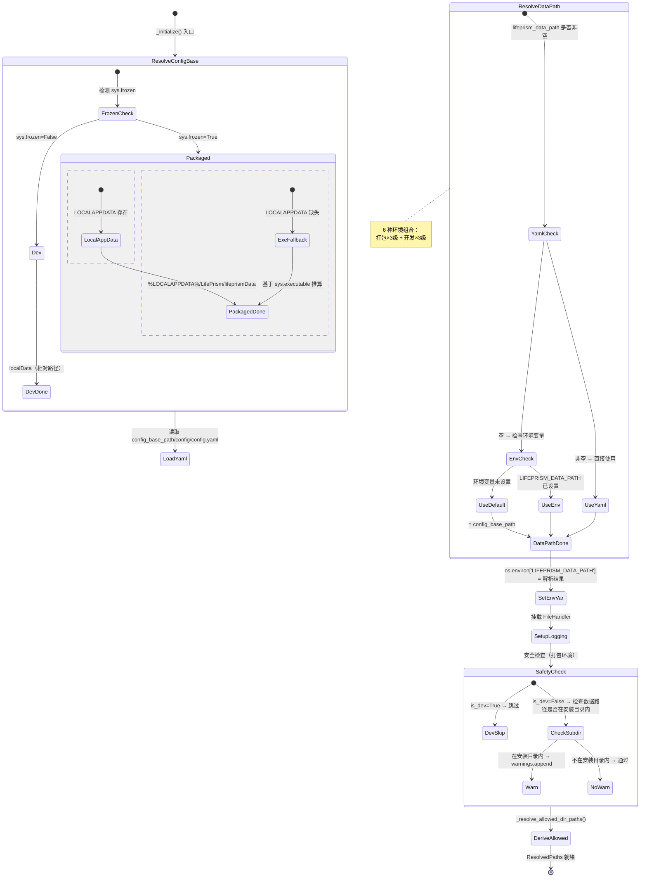

## 版本

| 版本 | 更新内容 |
| ---- | -------- |
| 1.0 | 初始版本 |
| 1.1 | 移除已弃用的 chat_db_path 节点 |

# 数据流：ResolvedPaths

**Flow 对象**：ResolvedPaths — config_base_path 和 lifeprism_data_path 的最终解析结果
**对应 Spec**：[config-path-spec](../specs/2026-07-06-config-path-spec.md)

## ResolvedPaths 数据结构

```python
@dataclass
class ResolvedPaths:
    # === 配置路径（固定，不随数据迁移） ===
    config_base_path: Path          # 配置文件根目录
    config_path: Path               # = config_base_path/config/config.yaml

    # === 数据路径（可迁移） ===
    lifeprism_data_path: Path       # 数据根目录，解析优先级：yaml > env var > default

    # === 派生路径（从 lifeprism_data_path 自动推算） ===
    lw_db_path: Path                # = lifeprism_data_path/dataset/lifewatch_ai.db
    channel_path: Path              # = lifeprism_data_path/channel
    session_path: Path              # = lifeprism_data_path/session
    allowed_dir_path: list[Path]    # = lifeprism_data_path/{user,diary,agent} + expand_meta_data 扩展目录
    debug_log_dir: Path             # = lifeprism_data_path/debug_logs（仅打包环境）

    # === 环境标记 ===
    is_dev: bool                    # = not sys.frozen，影响路径解析和安全检查分支

    # === 告警 ===
    warnings: list[dict]            # 安全检查产生的警告（如数据路径在安装目录内）
```

**关键字段说明**：
- `config_base_path`：**固定不变**，不参与数据迁移。配置文件（config.yaml / providers.yaml / config.json）始终在此路径下。打包环境通过 `%LOCALAPPDATA%` 确定，开发环境为项目根目录下的 `localData`。
- `lifeprism_data_path`：**可迁移**，是系统中几乎所有运行时路径（数据库、日志、session、channel 等）的锚点。三级优先级中 yaml 配置优先生效，意味着用户通过设置页迁移路径后，重启即可生效，环境变量只作为后端 fallback。
- `is_dev`：决定 config_base_path 的计算方式、安全检查是否跳过、以及日志路径行为（开发环境日志写入项目根目录而非 lifeprism_data_path 下）。

## 与其他数据流的耦合

### ResolvedPaths ConfigInitState

**ConfigInitState 状态字段**：`uninitialized` `config_loaded` `data_path_resolved` `logging_ready` `safety_checked` `ready`

**耦合关系**：

| ResolvedPaths 状态变化 | ConfigInitState 影响 | 触发位置 |
|---|---|---|
| config_base_path 解析完成 | `uninitialized` `config_loaded` | `settings_manager.SettingsManager._initialize:86` |
| lifeprism_data_path 解析完成 | `config_loaded` `data_path_resolved` | `settings_manager.SettingsManager._initialize:103-107` |
| os.environ 写入完成 | 跨进程同步：Electron 可通过环境变量读取最新数据路径 | `settings_manager.SettingsManager._initialize:110` |
| 日志 FileHandler 挂载完成 | `data_path_resolved` `logging_ready` | `settings_manager.SettingsManager._setup_logging:192` |
| 安全检查完成 | `logging_ready` `safety_checked` / `ready` | `settings_manager.SettingsManager._check_data_path_safety:199` |
| update() 触发 lifeprism_data_path 变更 | `_lifeprism_data_path` 更新，但不重建 allowed_dir_path、不重配日志、不重检安全 | `settings_manager.SettingsManager.update:516-522` |

**说明**：ResolvedPaths 是 ConfigInitState 的核心产物。`SettingsManager._initialize()` 按严格顺序产生 ResolvedPaths 的各个字段，ConfigInitState 随之推进。注意 update() 触发的路径变更**不完整**：只更新 `_lifeprism_data_path` 和 `os.environ`，不重建派生路径（allowed_dir_path）且不重新检查安全性——这要求调用方在迁移后重启进程。

<key_function>
- lifeprism/config/settings_manager.py
  - settings_manager.SettingsManager._initialize:86
  - settings_manager.SettingsManager._resolve_config_base_path:121
  - settings_manager.SettingsManager._resolve_default_data_path:139
  - settings_manager.SettingsManager._resolve_allowed_dir_paths:158
  - settings_manager.SettingsManager._setup_logging:192
  - settings_manager.SettingsManager._check_data_path_safety:199
  - settings_manager.SettingsManager.update:463
</key_function>

## 流程概览



## 数据流节点

**业务场景说明**：系统启动时（或用户主动迁移数据路径时），需要确定配置文件的读取位置和数据文件的存储位置。两条路径的解耦设计允许用户将数据（数据库、日志、截图等）迁移到任意目录，而配置文件始终固定在默认位置。

---

### 链路 1：config_base_path 解析

config_base_path 是**固定的**配置文件根目录，不依赖 yaml 或环境变量，仅由运行环境（打包/开发）决定。

1. settings_manager.SettingsManager._initialize()
   启动路径解析的入口，设置 is_dev 标记后立即调用 _resolve_config_base_path()
   状态: is_dev = not sys.frozen | 持久化: ❌ | 跨模块: ❌
   步骤: 检测 sys.frozen 标记 → 调用 _resolve_config_base_path() → 存储到 self._config_base_path → 拼接 config_path = config_base_path/config/config.yaml

2. settings_manager.SettingsManager._resolve_config_base_path()
   根据运行环境返回配置基础路径，不读取任何外部配置
   状态: self._config_base_path 赋值 | 持久化: ❌ | 跨模块: ❌
   步骤:
   - **打包环境** (sys.frozen=True)：读取环境变量 LOCALAPPDATA → 拼接 `LifePrism/lifeprismData`
     - 如 LOCALAPPDATA 存在 → 返回 `Path(LOCALAPPDATA) / "LifePrism" / "lifeprismData"`
     - 如 LOCALAPPDATA 缺失（后备）→ 从 `sys.executable` 反推安装目录，拼接 `lifeprismData`
   - **开发环境** (sys.frozen=False)：返回相对路径 `Path("localData")`

<key_function>
- lifeprism/config/settings_manager.py
  - settings_manager.SettingsManager._resolve_config_base_path:121
</key_function>

---

### 链路 2：lifeprism_data_path 解析（三级优先级）

lifeprism_data_path 是**可迁移的**数据根目录。优先级：yaml 配置 > 环境变量 > 默认值（= config_base_path）。此链路产生 6 种环境组合（打包/开发 × 三级优先级）。

3. settings_manager.SettingsManager._initialize() 中的数据路径解析段
   yaml 加载完成后，根据 configured_path 决定走直接使用还是 fallback 到 _resolve_default_data_path()
   状态: self._lifeprism_data_path 赋值 | 持久化: ❌ | 跨模块: ❌
   步骤:
   - 从已加载的 yaml 配置中取 `lifeprism_data_path`
   - **分支 A** (优先级 1)：yaml 中 `lifeprism_data_path` 非空 → `Path(configured_path)` 直接赋值
   - **分支 B** (优先级 2/3)：yaml 中为空 → 调用 `_resolve_default_data_path()`

4. settings_manager.SettingsManager._resolve_default_data_path()
   在 yaml 无配置时，按 env var > config_base_path 的顺序确定数据路径
   状态: 无 | 持久化: ❌ | 跨模块: ❌
   步骤:
   - **优先级 2**：检查环境变量 `LIFEPRISM_DATA_PATH`（由 Electron 启动时传入）→ 如存在则返回 `Path(data_env)`
   - **优先级 3**：返回 `self._config_base_path`（与配置路径相同，即未迁移状态）

5. 环境变量写入
   `os.environ["LIFEPRISM_DATA_PATH"]` = 解析结果
   状态: os.environ 更新 | 持久化: ✅ (进程环境变量) | 跨模块: ✅ config → os.environ (供 Electron 等外部进程读取)
   步骤: 将最终解析的 lifeprism_data_path 写入进程环境变量，覆盖旧值

<key_function>
- lifeprism/config/settings_manager.py
  - settings_manager.SettingsManager._resolve_default_data_path:139
</key_function>

---

### 链路 3：数据路径迁移（update 触发）

当用户通过设置页修改 `lifeprism_data_path` 时，`update()` 负责同步内部状态。注意：此链路只做**最小同步**，不触发完整的重新初始化。

6. settings_manager.SettingsManager.update()
   检测 updates 字典中是否包含 `lifeprism_data_path` 键
   状态: self._lifeprism_data_path 更新, os.environ 更新 | 持久化: ✅ (config.yaml 已在上层 _config.update + _save_config 中持久化) | 跨模块: ✅ config → os.environ
   步骤:
   - 通过 `_config.update(updates)` 和 `_save_config()` 持久化新的 lifeprism_data_path 到 yaml
   - 检测 `"lifeprism_data_path" in updates`
   - **分支**：new_path 非空 → `self._lifeprism_data_path = Path(new_path)`
   - **分支**：new_path 为空 → 调用 `_resolve_default_data_path()` 回退
   - `os.environ["LIFEPRISM_DATA_PATH"]` 同步更新
   - **不执行**：_check_data_path_safety()、_setup_logging()、_resolve_allowed_dir_paths()

<key_function>
- lifeprism/config/settings_manager.py
  - settings_manager.SettingsManager.update:463
</key_function>

---

### 链路 4：派生路径生成

派生路径是从 `_lifeprism_data_path` 自动推算的只读属性，不在 yaml 中独立配置。lifeprism_data_path 变更后，所有派生路径自动跟随。

7. settings_manager.SettingsManager.lw_db_path
   计算 LifeWatch 主数据库路径
   状态: 无（只读计算属性） | 持久化: ❌ | 跨模块: ❌
   步骤: `_lifeprism_data_path / "dataset" / "lifewatch_ai.db"`

8. settings_manager.SettingsManager.channel_path
   计算通道路径
   状态: 无（只读计算属性） | 持久化: ❌ | 跨模块: ❌
   步骤: `_lifeprism_data_path / "channel"`

9. settings_manager.SettingsManager.session_path
    计算会话数据路径
    状态: 无（只读计算属性） | 持久化: ❌ | 跨模块: ❌
    步骤: `_lifeprism_data_path / "session"`

10. settings_manager.SettingsManager._resolve_allowed_dir_paths()
    计算允许访问的目录白名单，用于文件系统工具的安全沙箱
    状态: self._allowed_dir_path 赋值 | 持久化: ❌ | 跨模块: ✅ config → llm/agent/tools（文件系统工具读取 allowed_dir_path 进行路径校验）
    步骤:
    - 基于 `_lifeprism_data_path` 拼接固定白名单：`user/`, `diary/`, `agent/`
    - 读取 `lifeprism_data_path/expand_dir/expand_meta_data.json`
    - 解析其中的 `expand_dirs[].path` 追加到列表
    - 所有路径做 `resolve()` 规范化
    - expand_meta_data.json 读取失败时静默跳过

11. settings_manager.SettingsManager.custom_data_path
    已废弃属性，别名指向 `_lifeprism_data_path`
    状态: 无（只读计算属性） | 持久化: ❌ | 跨模块: ❌
    步骤: 直接返回 `self._lifeprism_data_path`

<key_function>
- lifeprism/config/settings_manager.py
  - settings_manager.SettingsManager._resolve_allowed_dir_paths:158
</key_function>

---

### 链路 5：安全检查

仅在打包环境执行，检测数据路径是否位于安装目录内（NSIS 卸载时会删除安装目录，导致数据丢失）。

13. settings_manager.SettingsManager._check_data_path_safety()
    检查数据路径是否在安装目录子树内
    状态: self._warnings 可能追加 | 持久化: ❌ | 跨模块: ❌
    步骤:
    - **分支**：`is_dev=True` → 直接返回（开发环境不检查）
    - 从 `sys.executable` 反推安装目录：`backend_dir → resources → app → install_dir`（共 4 级 parent）
    - 将 `_lifeprism_data_path` 和 `install_dir` 做 `resolve()`
    - 调用 `resolved_data.relative_to(resolved_install)`
    - **分支**：不抛异常（数据路径是安装目录的子目录）→ `warnings.append` NSIS 卸载风险警告
    - **分支**：抛 ValueError（不是子目录，安全）→ 静默通过
    - **分支**：抛 OSError（resolve 失败）→ 静默通过，不阻塞启动

<key_function>
- lifeprism/config/settings_manager.py
  - settings_manager.SettingsManager._check_data_path_safety:199
</key_function>

---

## 反常设计说明

### _resolve_default_data_path 中缺失 CUSTOM_DATA_PATH 兼容

**设计意图**：项目 MEMORY.md 记载环境变量应同时支持 `LIFEPRISM_DATA_PATH` 和 `CUSTOM_DATA_PATH`（兼容旧版本），`custom_data_path` 属性也在代码中保留为 deprecated 别名。

**当前实现**：`_resolve_default_data_path()` 仅检查 `LIFEPRISM_DATA_PATH`，不存在对 `CUSTOM_DATA_PATH` 的 fallback 读取。

**为什么是反常的**：文档和代码注释声称存在兼容机制，但实际 fallback 路径未实现。如果调用方仅设置了 `CUSTOM_DATA_PATH` 而未设置 `LIFEPRISM_DATA_PATH`，系统将回退到 config_base_path 而非使用用户指定的路径。

**影响范围**：仅影响仍在使用旧环境变量名 `CUSTOM_DATA_PATH` 的外部启动脚本或 Electron 版本。

**相关位置**：`settings_manager._resolve_default_data_path:139-156`、`settings_manager.custom_data_path:689-691`

### 开发环境 localData 为相对路径

**设计意图**：开发环境使用 `Path("localData")` 作为配置和数据根目录，简化开发配置。

**当前实现**：`_resolve_config_base_path()` 在 `sys.frozen=False` 时返回 `Path("localData")`，这是一个**相对路径**，取决于进程的当前工作目录。

**为什么是反常的**：如果从不同目录启动 Python 进程（例如从 IDE 的运行配置中修改了 working directory），`localData` 会解析到不同的绝对路径，导致找不到配置文件或数据丢失。打包环境使用绝对路径（基于 `%LOCALAPPDATA%`），但开发环境没有做 `resolve()` 规范化。

**影响范围**：开发环境启动时，确保从项目根目录（`LifeWatch-AI/`）启动进程，否则 `localData` 解析位置会偏移。

**相关位置**：`settings_manager._resolve_config_base_path:137`

### update() 不重建 allowed_dir_path 且不重配日志

**设计意图**：`update()` 在 `lifeprism_data_path` 变更后同步内部状态。

**当前实现**：`update()` 更新了 `self._lifeprism_data_path` 和 `os.environ`，但**不调用** `_resolve_allowed_dir_paths()`、`_setup_logging()` 和 `_check_data_path_safety()`。

**为什么是反常的**：数据路径迁移后，文件系统工具的目录白名单（`allowed_dir_path`）仍指向旧路径，日志 FileHandler 仍写入旧路径。这意味着迁移后直到重启前，文件系统工具可能拒绝访问新路径下的文件，日志也会继续写入旧位置。这是有意为之的"需要重启"设计，但行为与直觉不符——用户可能认为保存设置后即刻生效。

**影响范围**：设置页修改 `lifeprism_data_path` 后，实际生效需要重启进程。

**相关位置**：`settings_manager.SettingsManager.update:516-522`

### _check_data_path_safety 仅警告不阻止

**设计意图**：防止用户数据因 NSIS 卸载而被删除。

**当前实现**：检测到数据路径在安装目录内时，仅向 `_warnings` 列表追加一条消息，不抛出异常、不弹窗、不自动修正路径。

**为什么是反常的**：安全检查发现明确的数据丢失风险，但采取了最弱的响应策略（静默警告）。前端需要主动查询 `/settings` 端点中的 warnings 字段才会展示。如果前端未实现 warnings 展示，用户完全不知道存在此风险。

**影响范围**：打包环境用户如果将数据路径设置在安装目录内，可能在版本更新卸载旧版本时丢失全部数据。

**相关位置**：`settings_manager._check_data_path_safety:199-218`

## 相关文档

### Spec 文档
- **[config-path-spec](../specs/2026-07-06-config-path-spec.md)**：config 路径体系规格，定义 config_base_path 和 lifeprism_data_path 的解析规则、优先级和派生路径
- **[config-settings-spec](../specs/2026-07-06-config-settings-spec.md)**：配置管理体系规格，定义配置读写、API Key 管理、模型历史

### 架构文档
- **[path-config 权威参考](../authority/path-config.md)**：路径配置体系权威文档，含前后端完整的路径解析流程图、对比表和约束规则

### ADR
- 暂无直接关联的 ADR。路径分离设计（config_base_path 固定 + lifeprism_data_path 可迁移）的决策背景见 path-config 权威参考的"配置文件固定路径设计"章节。
