## 版本

| 版本 | 更新内容 |
| ---- | -------- |
| 1.0 | 初始版本 |

# 数据流：AgentExecutionTrace

**Flow 对象**：AgentExecutionTrace
**对应 Spec**：[llm-agent-spec](../specs/2026-07-06-llm-agent-spec.md)

## AgentExecutionTrace 数据结构

```python
@dataclass
class AgentExecutionTrace:
    """一条消息从入队到回复的完整执行追踪"""

    # === 输入信息 ===
    inbound_msg: InboundMessage        # 原始入站消息（含 type/channel/content/session_id/extra）

    # === 路由决策 ===
    message_type: str                  # 消息功能类型，决定 system_prompt 路径和工具集
                                       #   CHAT: 完整上下文 + 14 工具 + session 持久化
                                       #   DREAM_TASK: extra.system_prompt + 8 工具
                                       #   CLASSIFY: classify_preference.md + 0 工具
                                       #   GENERAL_TASK: extra.system_prompt + 0 工具
    is_command: bool                   # 是否为命令消息（/new, /continue, /session-list）
                                       #   命令消息完全跳过 LLM 调用，由 _process_cmd 直接返回

    # === Context 构建 ===
    system_prompt: str                 # 构建完成的系统提示词，按 MessageType 路由不同组装路径
    registered_tools: list[str]        # 已注册的工具名列表（CHAT=14, DREAM_TASK=8, CLASSIFY=0）

    # === Session 状态 ===
    session_id: str                    # 当前会话 ID（新建或继续）
    compact_triggered: bool            # 是否触发了自动压缩（影响 last_compacted_loc）

    # === LLM 交互核心 ===
    tool_call_chain: list[dict]        # 工具调用审计链，每轮结构：
                                       #   {
                                       #     "round": int,              # 第几轮（从 1 开始）
                                       #     "reasoning": str | None,   # LLM 推理内容（思维链）
                                       #     "tool_calls": [            # 本轮所有工具调用
                                       #       {
                                       #         "id": str,             # 工具调用唯一 ID
                                       #         "name": str,           # 工具名
                                       #         "arguments": dict,     # 调用参数
                                       #         "result": str,         # 执行结果
                                       #         "is_error": bool,      # 结果是否为错误
                                       #       }
                                       #     ]
                                       #   }
    final_response: LLMResponse | None # 最终 LLM 响应（content + tool_calls + usage + reasoning）

    # === 输出 ===
    outbound_msg: OutboundMessage | None  # 发布到 Event Bus 的输出消息（含 response + session_id + extra）
```

**关键字段说明**：
- `message_type`：整个处理流程的顶层路由键。在 `_process_msg()` 中作为唯一决策点，控制 system_prompt 构建路径、工具注册数量、session 保存策略三条独立分支
- `is_command`：为 True 时执行短路逻辑——`_process_cmd()` 直接构造并返回 OutboundMessage，完全跳过 Context 构建、工具注册、LLM 调用、Session 管理。仅 WeChat 渠道生效
- `tool_call_chain`：完整的工具调用审计追踪。每轮携带 LLM 的 reasoning（思维链推理内容），每个 tool_call 附带 is_error 标记。最终通过 `outbound_msg.extra` 传递给 Channel 层
- `compact_triggered`：影响 `session.last_compacted_loc` 的值，后续 `get_history_message()` 调用会从此位置切片，过滤已压缩的历史消息
- `registered_tools`：在 `finally` 块中通过 `ToolRegistry.clear()` 保证清空，防止 CHAT 消息的 14 个工具泄漏到后续 CLASSIFY 消息

## 与其他数据流的耦合

### AgentExecutionTrace <-> Session

**Session 状态字段**：`messages`（消息列表）、`last_compacted_loc`（压缩位置索引）、`id`（会话标识）、`auto_compact`（压缩开关）

**耦合关系**：

| AgentExecutionTrace 状态变化 | Session 影响 | 触发位置 |
|---------------------------|-------------|---------|
| `session_id` 确定（新建或加载） | `Session` 对象创建并加入 `_cache` | SessionManager.get_or_create_session:125 |
| CHAT 类型 user 消息追加 | 立即持久化到 JSONL（第一次 save，确保 user 消息不丢失） | AgentLoop._process_msg:460-462 |
| 每轮工具调用执行 | `tool` 角色消息追加到 `session.messages`（结果已 json.dumps 序列化） | AgentLoop._run_agent_loop:174 |
| 每轮 LLM 回复 | `assistant` 角色消息追加（含 `tool_calls` + `reasoning_content`） | AgentLoop._run_agent_loop:105,203 |
| `compact_triggered = True` | `last_compacted_loc` 更新为当前 `len(messages)`，`system` 和 `user`（压缩总结）消息追加 | AgentLoop.auto_compact:562-567 |
| CHAT 类型 LLM 回复完成 | 再次持久化到 JSONL（第二次 save，保存完整对话） | AgentLoop._process_msg:478-480 |

**说明**：AgentExecutionTrace 是 Session 的消费者和生产者。关键设计：
- **两次保存策略（仅 CHAT）**：第一次在 LLM 调用前保存 user 消息，确保即使 LLM 调用崩溃 user 输入也不丢失；第二次在 LLM 回复完成后保存 assistant 消息。DREAM_TASK / CLASSIFY / GENERAL_TASK 不保存 session
- **`last_compacted_loc` 的读取**：`Session.get_history_message()` 使用 `self.messages[last_compacted_loc:]` 切片，压缩后 LLM 只看到压缩摘要 + 后续新消息
- **缓存机制**：`SessionManager._cache` 按 session_id 缓存已加载的 Session 对象，`get_or_create_session` 优先从缓存读取

<key_function>
- lifeprism/llm/agent/loop.py
  - loop.AgentLoop.__init__:66
  - loop.AgentLoop.loop:570
  - loop.AgentLoop.stop:594
  - loop.AgentLoop._process_msg:463
  - loop.AgentLoop._process_cmd:319
  - loop.AgentLoop._run_agent_loop:72
  - loop.AgentLoop.auto_compact:597
- lifeprism/llm/agent/context.py
  - context.Context.build_system_prompt:51
  - context.Context.build_prompt:86
  - context.Context._build_identity:90
  - context.Context._build_bootstrap:137
  - context.Context._build_user_message:188
  - context.Context._bulid_recent_state:200
- lifeprism/llm/bus/queue.py
  - queue.MessageQueue.send:105
  - queue.MessageQueue.consume_inbound:48
  - queue.MessageQueue.publish_outbound:51
- lifeprism/llm/session/manager.py
  - manager.SessionManager.get_or_create_session:132
  - manager.SessionManager.save_session:199
</key_function>

## 流程概览

```mermaid
stateDiagram-v2
    [*] --> AgentLoop_loop : agent_loop 首次访问时 LazySingleton 创建

    state AgentLoop_loop {
        [*] --> WaitMessage : while _running
        WaitMessage --> ConsumeInbound : bus.consume_inbound() 阻塞等待
        ConsumeInbound --> CreateTask : asyncio.create_task(_process_msg)
        CreateTask --> WaitMessage : 继续等待下一条消息
    }

    state _process_msg {
        [*] --> CheckCmd : 提取消息文本

        state CheckCmd {
            [*] --> IsCmd : _process_cmd(msg)
            IsCmd --> CmdReturn : 返回 OutboundMessage（命令已处理）
            IsCmd --> NotCmd : 返回 None（进入通用处理）
        }

        CmdReturn --> PublishCmd : publish_outbound
        PublishCmd --> [*]

        NotCmd --> BuildSystemPrompt : Context.build_system_prompt(msg)

        state BuildSystemPrompt {
            [*] --> ChatBranch : msg.type == CHAT
            [*] --> ClassifyBranch : msg.type == CLASSIFY
            [*] --> OtherBranch : GENERAL_TASK / DREAM_TASK

            ChatBranch --> BuildIdentity : _build_identity()
            BuildIdentity --> BuildBootstrap : _build_bootstrap()
            BuildBootstrap --> BuildRecent : _bulid_recent_state()
            BuildRecent --> LoadSkills : skill_loader.load_skills()
            LoadSkills --> LoadFrontmatter : skill_loader.load_frontmatters()
            LoadFrontmatter --> [*]

            ClassifyBranch --> ReadClassifyPref : _read_file(classify_preference.md)
            ReadClassifyPref --> MergeExtra : 拼接 extra.system_prompt
            MergeExtra --> [*]

            OtherBranch --> UseExtraOnly : 直接使用 extra.system_prompt
            UseExtraOnly --> [*]
        }

        BuildSystemPrompt --> RegisterTools : 按 MessageType 注册工具

        state RegisterTools {
            [*] --> Chat14Tools : CHAT → 14 工具（含 session 查询 + bootstrap 删除）
            [*] --> Dream8Tools : DREAM_TASK → 8 工具（数据查询 + 文件系统）
            [*] --> NoTools : CLASSIFY → 0 工具
        }

        RegisterTools --> GetSession : session_manager.get_or_create_session()
        GetSession --> AutoCompact : auto_compact(session, tools)

        state AutoCompact {
            [*] --> EstimateToken : estimate_prompt_tokens()
            EstimateToken --> CheckLimit : > settings.token_limit?
            CheckLimit --> SkipCompact : 否 → 返回原 session
            CheckLimit --> TriggerCompact : 是 → 调用独立 LLM 压缩
            TriggerCompact --> MarkCompacted : 记录 last_compacted_loc
            MarkCompacted --> SaveCompact : 保存 session
            SaveCompact --> [*]
            SkipCompact --> [*]
        }

        AutoCompact --> AddUserMsg : session.add_message("user", ...)
        AddUserMsg --> SaveSession1 : CHAT 类型第一次保存（LLM 调用前）
        SaveSession1 --> RunAgentLoop : _run_agent_loop(session, system_prompt, tools)

        state RunAgentLoop {
            [*] --> BuildPrompt : Context.build_prompt()
            BuildPrompt --> LLMChat1 : llm.chat(messages, tools)
            LLMChat1 --> AddAssistant1 : session.add_message("assistant", ...)
            AddAssistant1 --> CheckToolCalls : response.tool_calls 存在?

            CheckToolCalls --> ReturnResult : 否 → 返回 (response, chain)
            CheckToolCalls --> WhileLoop : 是 → 进入工具调用循环

            state WhileLoop {
                [*] --> ExecTools : for each tool_call: registry.execute()
                ExecTools --> CheckError : result 是否以 ERROR 开头?
                CheckError --> CountError : 是 → 累加 tool_error[name]
                CountError --> CheckThreshold : > MAX_TOOL_ERROR_COUNT(5)?
                CheckThreshold --> AppendWarning : 是 → 追加放弃提示
                CheckThreshold --> SerializeResult : 否
                CheckError --> SerializeResult : 否
                AppendWarning --> SerializeResult
                SerializeResult --> AddToolMsg : dict/list → json.dumps → session.add_message("tool")
                AddToolMsg --> RecordRound : tool_call_chain.append({round, reasoning, tool_calls})
                RecordRound --> RebuildMsg : Context.build_prompt() 重建
                RebuildMsg --> LLMChatN : llm.chat(messages, tools)
                LLMChatN --> AddAssistantN : session.add_message("assistant", ...)
                AddAssistantN --> IncCount : tool_call_count += 1
                IncCount --> CheckContinue : tool_calls 存在 AND count ≤ MAX_TOOL_CALL(20)?
                CheckContinue --> ExecTools : 是 → 继续循环
                CheckContinue --> CheckOvertime : 否 → 退出循环
            }

            CheckOvertime --> ForceText : tool_calls 仍存在 AND count > 20?
            ForceText --> InjectSystem : 注入 system 消息强制文本回复
            InjectSystem --> FinalLLMChat : llm.chat(messages)
            FinalLLMChat --> ReturnResult

            CheckOvertime --> RecordReasoning : response.reasoning_content 非空?
            RecordReasoning --> AppendFinalReasoning : 追加最终 reasoning 到 chain
            AppendFinalReasoning --> ReturnResult
            CheckOvertime --> ReturnResult : reasoning_content 为空
        }

        RunAgentLoop --> PublishResult : publish_outbound(OutboundMessage)
        PublishResult --> SaveSession2 : CHAT 类型第二次保存（LLM 回复后）
        SaveSession2 --> FinallyClear : finally → ToolRegistry.clear()
        FinallyClear --> [*]
    }

    state ErrorHandler {
        ValueError --> ReRaise : re-raise（参数错误）
        Exception --> PublishError : publish_outbound([ERROR])
        PublishError --> FinallyClear
    }
```



**关键分支说明**：
- **命令分支**：`_process_cmd` 返回 OutboundMessage 时直接 publish 并 return，短路跳过所有后续处理；返回 None 时进入通用消息处理
- **MessageType 三路分支**：CHAT（完整 context 层级 + 14 工具 + session 持久化）、DREAM_TASK（extra.system_prompt + 8 工具）、CLASSIFY（classify_preference.md + 0 工具）
- **工具循环分支**：LLM 返回 tool_calls 时进入 while 循环；无 tool_calls 时直接返回；超出 MAX_TOOL_CALL(20) 仍有 tool_calls 时注入 system 消息强制文本回复
- **自动压缩分支**：token 未超标时直接返回（热路径，大部分请求走此分支）；超标时触发独立 LLM 调用进行压缩
- **异常分支**：ValueError re-raise 让调用方感知；其他 Exception 兜底发布 `[ERROR]` 消息；`finally` 块保证 ToolRegistry 清空

## 数据流节点

**业务场景说明**：AgentLoop 是 LifeWatch-AI 的运行时核心，从 Event Bus 消费消息，构建上下文、注册工具、调用 LLM、执行工具操作，最终将结果发布回 Event Bus。整个流程覆盖 6 条链路：消息分发、命令处理、通用消息处理、工具调用循环、Context 构建、自动压缩。

### 链路 1：消息消费与分发

**1. AgentLoop.loop()**
   主事件循环，阻塞等待消息并创建异步 Task 处理
   状态: _running=True | 持久化: ❌ | 跨模块: ✅ (Event Bus → Agent)
   步骤: while _running → bus.consume_inbound() 阻塞等待 → asyncio.create_task(_process_msg) → 注册到 _active_tasks → done_callback 清理 + 异常捕获 → 继续循环

**2. MessageQueue.consume_inbound()**
   从 asyncio.Queue 中阻塞获取 InboundMessage
   状态: _inbound queue 出队 | 持久化: ❌ | 跨模块: ✅ (Channel → Agent)
   步骤: await self.inbound.get() → 返回 InboundMessage

**3. done_callback 异常处理**
   Task 完成时自动清理并捕获未处理异常
   状态: _active_tasks 移除 task | 持久化: ❌ | 跨模块: ❌
   步骤: 从 _active_tasks[msg_id] 移除 task → 调用 t.exception() → 存在异常则记录 ERROR 日志

**4. AgentLoop.stop()**
   设置 _running = False，loop() 在下一次迭代时退出
   状态: _running→False | 持久化: ❌ | 跨模块: ❌

### 链路 2：命令处理分支

**5. AgentLoop._process_msg() — 命令检测入口**
   提取消息文本，调用 _process_cmd() 判断是否为命令
   状态: is_command 确定 | 持久化: ❌ | 跨模块: ❌
   步骤: _message_text() 提取纯文本 → _process_cmd(msg) → 分支A(有返回)：publish_outbound + return / 分支B(返回None)：进入通用消息处理

**6. AgentLoop._process_cmd() — 命令路由**
   仅 WeChat 渠道生效，检测 `/` 前缀并分发到具体命令处理
   状态: is_command=True | 持久化: ✅ (/new 创建 session 文件) | 跨模块: ✅ (→ SessionManager)
   步骤:
   - 非 WeChat 渠道：直接 return None，进入通用处理
   - `/new`：提取旧 session_id → session_manager.get_or_create_session() 创建新 session → save_session 持久化 → 构造带旧 session 恢复提示的 OutboundMessage
   - `/continue <id>`：提取 session_id → 参数为空返回 ERROR → session 不存在返回 ERROR → 存在则加载 session → 倒序提取最后 user + assistant 消息 → 拼接到 OutboundMessage
   - `/session-list [date]`：提取日期参数 → show_session_content_list(date) 查询 → 无记录返回友好提示 → 有记录拼接列表

### 链路 3：通用消息处理主线

**7. Context.build_system_prompt() — 按 MessageType 构建系统提示词**
   根据 msg.type 路由到不同的 Context 构建路径
   状态: system_prompt→str | 持久化: ❌ | 跨模块: ✅ (→ Context → Skill)
   步骤: 见链路 5（Context 构建详细展开）

**8. 按 MessageType 注册工具**
   根据 msg.type 向 ToolRegistry 注册不同数量和类型的工具
   状态: registered_tools→list[str], ToolRegistry._tools 填充 | 持久化: ❌ | 跨模块: ❌
   步骤:
   - CHAT: 注册 14 个工具（5 系统数据 + 6 文件系统 + 2 Session 查询 + 1 条件性 DeleteBootstrapTool）
   - DREAM_TASK: 注册 8 个工具（2 系统数据 + 6 文件系统，不含 Session 查询和 Bootstrap 删除）
   - CLASSIFY: tools = []（不注册任何工具）

**9. SessionManager.get_or_create_session() — 获取或创建 Session**
   按 session_id 查询缓存 → 文件加载 → 新建的三级策略获取 Session
   状态: session_id→str | 持久化: ❌ (仅加载，不保存) | 跨模块: ✅ (→ SessionManager)
   步骤: session_id 在缓存中 → 直接返回缓存 / session_id 不在缓存 → _load_session 从 JSONL 文件加载 / session_id 为 None → 创建新 Session → 加入 _cache

**10. AgentLoop.auto_compact() — 自动压缩检测**
    估算 session 历史消息的 token 数，超标时触发 LLM 压缩
    状态: compact_triggered→bool | 持久化: ✅ (触发时 save_session) | 跨模块: ✅ (→ Session → LLM)
    步骤: 见链路 6（自动压缩详细展开）

**11. Context._build_user_message() — 构建用户消息**
    将 runtime 上下文（时间、渠道）+ 用户原始内容拼接为多模态 content block 列表
    状态: session.messages 追加 user 消息 | 持久化: ❌ | 跨模块: ❌
    步骤: 构建 runtime 上下文 text block → 拼接 msg.content 原始 blocks → 返回 list[dict]

**12. Session.add_message("user", ...) — 追加用户消息**
    将用户消息追加到 session.messages 并更新 updated_at
    状态: session.messages 长度+1 | 持久化: ❌ | 跨模块: ❌

**13. CHAT 类型第一次保存（LLM 调用前）**
    立即持久化 session 到 JSONL，确保 LLM 调用失败时 user 消息不丢失
    状态: JSONL 文件写入 | 持久化: ✅ | 跨模块: ✅ (→ SessionManager)
    步骤: 检查 msg.type == CHAT → session_manager.save_session(session)

**14. AgentLoop._run_agent_loop() — LLM 工具调用循环核心**
    进入 LLM 交互循环，处理多轮工具调用直到 LLM 返回纯文本或达到上限
    状态: final_response→LLMResponse, tool_call_chain→list[dict] | 持久化: ❌ (消息追加到 session 但在此方法内不保存) | 跨模块: ✅ (→ LLM Provider → ToolRegistry)
    步骤: 见链路 4（工具调用循环详细展开）

**15. MessageQueue.publish_outbound() — 发布结果到 Event Bus**
    将 OutboundMessage 发布到 outbound 队列，由 _receive_loop 匹配 Future
    状态: outbound_msg 发布 | 持久化: ❌ | 跨模块: ✅ (Agent → Event Bus)
    步骤: await self.outbound.put(msg)

**16. CHAT 类型第二次保存（LLM 回复后）**
    再次持久化 session，保存包含 assistant 回复的完整对话
    状态: JSONL 文件写入 | 持久化: ✅ | 跨模块: ✅ (→ SessionManager)
    步骤: 检查 msg.type == CHAT → session_manager.save_session(session)

**17. finally 块 — ToolRegistry.clear()**
    清空工具注册表，避免工具累积和不同 MessageType 工具混用
    状态: ToolRegistry._tools→{} | 持久化: ❌ | 跨模块: ❌
    步骤: self._tool_registry.clear()

### 链路 4：LLM 工具调用循环（最核心）

**18. AgentLoop._run_agent_loop() — 入口与首次 LLM 调用**
    创建 LLM 客户端，构建完整 messages，执行首次 chat 调用
    状态: llm 客户端创建, messages 构建 | 持久化: ❌ | 跨模块: ✅ (→ LLM Provider)
    步骤: create_llm_client() → Context.build_prompt(system_prompt, session.get_history_message()) → llm.chat(messages, tools) → session.add_message("assistant", ...) 记录回复（含 tool_calls + reasoning_content）

**19. while 循环入口 — 检测 tool_calls**
    判断 LLM 是否返回了工具调用请求
    状态: tool_call_count=1 | 持久化: ❌ | 跨模块: ❌
    步骤: 判断 response.tool_calls 非空 AND tool_call_count <= MAX_TOOL_CALL(20) → 进入循环 / 否则跳过循环

**20. for each tool_call — 逐个执行工具**
    遍历 LLM 返回的 tool_calls，通过 ToolRegistry 执行每个工具
    状态: tool_error[] 字典更新 | 持久化: ❌ | 跨模块: ✅ (→ ToolRegistry → 各 Tool)
    步骤:
    - ToolRegistry.execute(name, arguments) → result
    - 检查 result 是否以 ERROR 开头 → is_error 标记
    - 记录到 round_tool_calls（含 id/name/arguments/result/is_error）
    - 若 is_error: tool_error[name] += 1 → 超过 MAX_TOOL_ERROR_COUNT(5) 则在 result 末尾追加警告："已连续调用 N 次，超过最大错误次数，请立即放弃该工具调用"

**21. 结果序列化与 Session 记录**
    将工具执行结果转为字符串并追加到 session.messages
    状态: session.messages 追加 tool 角色消息 | 持久化: ❌ | 跨模块: ❌
    步骤: isinstance(result, (dict, list)) → json.dumps(result, ensure_ascii=False) / 否则 str(result) → session.add_message("tool", result_content, tool_call_id=tool_call.id)

**22. 记录本轮 tool_call_chain**
    将当前轮次的工具调用和推理内容追加到审计链
    状态: tool_call_chain 追加一轮 | 持久化: ❌ | 跨模块: ❌
    步骤: tool_call_chain.append({round: tool_call_count, reasoning: response.reasoning_content, tool_calls: round_tool_calls})

**23. 重建 messages 并再次调用 LLM**
    基于更新后的 session 历史重建完整 messages，再次调用 LLM
    状态: messages 重建, response 更新 | 持久化: ❌ | 跨模块: ✅ (→ LLM Provider)
    步骤: Context.build_prompt(system_prompt, session.get_history_message()) → llm.chat(messages, tools) → session.add_message("assistant", ...) → tool_call_count += 1

**24. 超限强制文本回复**
    当 tool_call_count > MAX_TOOL_CALL(20) 且 response 仍有 tool_calls 时，注入 system 消息强制 LLM 生成纯文本
    状态: 注入 system 消息 | 持久化: ❌ | 跨模块: ✅ (→ LLM Provider)
    步骤: session.add_message("system", "已达到最大工具调用次数...") → Context.build_prompt 重建 → llm.chat(messages) 不带 tools 参数 → 记录 assistant 回复

**25. 记录最终 reasoning**
    循环结束后，若最后一次 response 有 reasoning_content，追加到 tool_call_chain（即使没有工具调用也记录，避免丢失最终思考过程）
    状态: tool_call_chain 追加最终 reasoning | 持久化: ❌ | 跨模块: ❌
    步骤: 检查 response.reasoning_content 非空 → tool_call_chain.append({round, reasoning, tool_calls: []})

**26. 返回结果**
    返回最终 LLMResponse 和完整 tool_call_chain
    状态: 返回值 (response, tool_call_chain) | 持久化: ❌ | 跨模块: ❌

### 链路 5：Context 构建（按 MessageType）

**27. CHAT 类型 — 五层系统提示词组装**
    Context.build_system_prompt() 检测到 MessageType.CHAT 时，按固定层级构建完整系统提示词
    状态: system_prompt 为 5 层拼接结果 | 持久化: ❌ | 跨模块: ✅ (→ 文件系统)

    组装层级（由上到下拼接，`\n\n` 分隔）：
    1. `_build_identity()`：加载 `agent/chat/identity.md` → 文件不存在使用默认 identity → 名称为空追加询问提示 → 末尾注入工作目录路径和 ALLOWED_DIRS
    2. `_build_bootstrap()`：加载 `agent/chat/bootstrap.md`（优先）/ 然后加载 soul.md + agent.md（注入 {agent_path}/{user_path}/{diary_path}/{expand_dir} 参数）+ tool.md + user.md（四件套）
    3. `_bulid_recent_state()`：加载 `user/daily_data/recent_state.md`（用户最近状态）
    4. `skill_loader.load_skills(skill_load_list)`：加载 `_ALWAYS_LOAD`（user-data-guide）+ extra.skill_list 指定的 skill 完整正文，返回 `<skills type="loaded">` XML
    5. `skill_loader.load_frontmatters(skill_load_list)`：加载其余可用 skill 的 frontmatter 摘要，排除已加载 skill，返回 `<skills type="available">` XML

**28. CLASSIFY 类型 — 分类偏好 + 自定义 prompt**
    加载 `agent/classify/classify_preference.md` 并与 extra.system_prompt 拼接
    状态: system_prompt 为两个来源拼接 | 持久化: ❌ | 跨模块: ❌
    步骤: _read_file(classify_preference.md) → 文件存在则 `extra.system_prompt + "\n\n" + content` / 不存在则仅 `extra.system_prompt`

**29. GENERAL_TASK / DREAM_TASK 类型 — 直接使用 extra.system_prompt**
    不添加任何额外 Context，调用方通过 extra.system_prompt 自行控制
    状态: system_prompt = extra.system_prompt | 持久化: ❌ | 跨模块: ❌

**30. Context.build_prompt() — 最终消息组装**
    将 system_prompt 与 session 历史消息合并为 LLM API 所需的 messages 格式
    状态: 返回完整 messages list | 持久化: ❌ | 跨模块: ❌
    步骤: `[{"role": "system", "content": system_prompt}] + message`

### 链路 6：自动压缩

**31. AgentLoop.auto_compact() — Token 阈值检测**
    估算 session 历史消息的 token 数，与 settings.token_limit 比较
    状态: compact_triggered 判断 | 持久化: ❌ | 跨模块: ❌
    步骤: session.get_history_message() → estimate_prompt_tokens(messages, tools) → 未超过 token_limit → 直接返回原 session（热路径）

**32. 压缩 LLM 调用**
    触发压缩时，创建独立 LLM 客户端，使用压缩专用 system_prompt 调用 LLM
    状态: 压缩进行中 | 持久化: ❌ | 跨模块: ✅ (→ LLM Provider)
    步骤: create_llm_client() → 构建压缩专用 messages（压缩提示词 + json.dumps(messages)）→ llm.chat(messages) → 异常时返回原 session

**33. 记录压缩位置与注入总结**
    更新 last_compacted_loc，追加 system 消息和压缩总结 user 消息
    状态: last_compacted_loc 更新, session.messages 追加 2 条消息 | 持久化: ✅ (save_session) | 跨模块: ✅ (→ SessionManager)
    步骤: session.last_compacted_loc = len(session.messages) → add_message("system", "conversation compacted") → add_message("user", 压缩总结, is_compact_summary=True) → session_manager.save_session(session)

**压缩 LLM 的 system_prompt 提取规则**：
- user msg：完整保留最后 5 条 user 消息
- event-工具查询：简要说明查询内容和基本结果，提示必要时重新查询
- event-情绪/事件记录：保留相关 ID，便于后续查询
- event-非工具事件：确认时间、经过、用户反应
- event-情绪事件：记录诱发原因、反应、心情

## 异常与清理

- **_process_msg ValueError**：re-raise 让调用方感知参数错误（如无效的 MessageType），不发布 OutboundMessage
- **_process_msg Exception 兜底**：捕获所有其他异常 → 记录 ERROR 日志（含 exc_info=True）→ 发布 `OutboundMessage(response=LLMResponse(content="[ERROR] {e}"))` → finally 块仍然执行 ToolRegistry.clear()
- **_run_agent_loop 工具执行异常**：ToolRegistry.execute() 在工具层捕获 execute() 异常并转为 `ERROR: ...` 字符串 → is_error 标记 → 不影响循环继续 → 错误次数累计到 MAX_TOOL_ERROR_COUNT 后追加警告
- **_run_agent_loop LLM 调用异常**：未在本方法内捕获，冒泡到 _process_msg 的 Exception 兜底
- **auto_compact LLM 调用异常**：捕获 Exception → 记录 ERROR 日志 → 返回原 session（不阻塞消息处理）
- **finally 块保证**：无论正常返回还是异常退出，ToolRegistry.clear() 都会执行，防止工具累积和 MessageType 混用
- **done_callback 异常捕获**：Task 未捕获的异常通过 `t.exception()` 获取并记录 ERROR 日志，防止异常被静默忽略
- **_receive_loop 取消**：CancelledError 触发时遍历清理所有 pending futures（取消 + 清空），防止资源泄漏

## 反常设计说明

### 1. _build_bootstrap 始终加载四件套，与注释行为不一致

**设计意图**：注释 `# bootstrap.md 不存在 或 json 不存在 或 json bootstrap 为 False # 添加 soul.md agent.md tool.md user.md` 表明仅在 bootstrap.md 不存在时加载四件套作为回退。Spec 中也明确说明 "bootstrap.md 优先级高于 soul.md/agent.md/tool.md/user.md"。

**当前实现**：`_build_bootstrap()` (context.py:137-173) 的实际代码在 bootstrap.md 存在时，先将 bootstrap 内容追加到 parts，随后**无条件**加载 soul.md、agent.md、tool.md、user.md 并追加到同一个 parts 列表。即无论 bootstrap.md 是否存在，四件套都会被加载并拼接在 bootstrap 后面。

```python
if bootstrap_file:
    parts.append(f"{bootstrap_file}")
# 以下代码无 else 保护，始终执行：
soul_content = Context._read_file(soul_path)
...
if soul_content:
    parts.append(f"\n{soul_content}")
# agent.md, tool.md, user.md 同样处理
```

**为什么是反常的**：这导致 system_prompt 中同时包含 bootstrap（Agent 自主生成的优化版本）和 soul/agent/tool/user（用户手动编写的原始配置），可能造成内容冗余和指令冲突。例如 bootstrap.md 中已重新定义了 agent 能力边界，但 agent.md 中的旧版定义也被同时注入。

**影响范围**：每次 CHAT 类型消息的 system_prompt 都比设计意图多了四件套内容，增加 token 消耗。由于 bootstrap 在前、四件套在后，LLM 可能受后面的四件套指令影响，削弱 bootstrap 的优先级。

**相关位置**：`lifeprism/llm/agent/context.py:137-173`

### 2. auto_compact 的 token_limit 为静态常量

**设计意图**：`token_limit` 应根据当前使用的 LLM 模型的上下文窗口动态计算（如 `context_window * 0.6`），以适配不同模型的容量差异。

**当前实现**：`auto_compact()` (loop.py:524) 直接使用 `settings.token_limit`，这是一个配置文件中的固定值。代码中已有注释标注："这里暂定token_limit是常数，但是实际上应该是依据模型的上下文窗口*0.6或者其他系数来限制"。

**为什么是反常的**：当用户切换模型时（如从 128K 上下文的模型切换到 32K 模型），固定 token_limit 不会自动调整。如果 limit 设得比模型窗口大，压缩永远不触发，导致 LLM 调用因超出上下文窗口而失败；如果设得太小，则频繁触发压缩，损失对话历史。

**影响范围**：目前仅作为已知技术债存在，功能正确性取决于用户是否手动将 token_limit 配置为与当前模型匹配的值。

**相关位置**：`lifeprism/llm/agent/loop.py:524`

### 3. Session 在 CHAT 消息处理中被保存两次

**设计意图**：典型的消息处理流程中，session 应在 LLM 回复完成后一次性保存完整对话。

**当前实现**：`_process_msg()` (loop.py:460-462, 478-480) 在 CHAT 类型消息处理中对 session 执行两次保存：
- 第一次（line 460-462）：user 消息加入 session 后立即 save，发生在 `_run_agent_loop()` 之前
- 第二次（line 478-480）：`_run_agent_loop()` 返回并发布结果后再次 save

**为什么是反常的**：这不是代码缺陷，而是防御性设计——第一次保存确保用户消息在 LLM 调用崩溃或超时时不丢失。但两次保存增加了 I/O 开销，且第一次保存是同步写磁盘（`open(path, "w")`），可能成为延迟瓶颈。两次保存之间的状态不一致风险：第一次保存后、LLM 调用前若发生异常，JSONL 中只有 user 消息而无后续 assistant 回复。

**影响范围**：仅影响 CHAT 类型（DREAM_TASK、CLASSIFY 不保存 session）。功能正确，但 I/O 效率有优化空间（如改为异步写入或仅追加增量行）。

**相关位置**：`lifeprism/llm/agent/loop.py:460-462, 478-480`

### 4. 命令处理仅在 WeChat 渠道生效

**设计意图**：`/new`、`/continue`、`/session-list` 命令是会话管理工具，应在所有渠道可用。

**当前实现**：`_process_cmd()` (loop.py:273) 以 `if msg.channel == ChannelType.WECHAT:` 为前置条件，非 WeChat 渠道直接 `return None`，导致命令被当作普通消息送入 LLM 处理。

**为什么是反常的**：非 WeChat 渠道（如本地 Local Chat）用户输入 `/new` 时，不会被识别为命令，而是作为普通文本发送给 LLM。LLM 可能误解用户意图或返回无关回复。从代码结构看，命令逻辑本身不依赖 WeChat 特有功能（session 操作是通用的），限制在 WeChat 渠道似乎是未完成的多渠道支持。

**影响范围**：仅 WeChat 渠道支持命令；Local 渠道的命令输入被静默降级为普通对话。

**相关位置**：`lifeprism/llm/agent/loop.py:273`

### 5. MAX_TOOL_CALL 和 MAX_TOOL_ERROR_COUNT 硬编码为模块级常量

**设计意图**：工具调用轮数上限和单工具错误容忍度可能需要根据消息类型、模型能力或用户偏好动态调整。

**当前实现**：`MAX_TOOL_CALL = 20` 和 `MAX_TOOL_ERROR_COUNT = 5` 在 loop.py:41-42 定义为模块级常量，`_run_agent_loop()` 中的 while 条件 (line 129) 和错误阈值检查 (line 164) 直接引用这些常量。

**为什么是反常的**：对于简单查询（如"今天天气怎么样"），20 轮上限过高；对于复杂任务（如多文件代码重构），20 轮可能不够。不同模型（如 Claude 擅长长工具链 vs 通义千问容易循环调用）可能需要不同的上限。目前无法按消息或会话粒度调整。

**影响范围**：功能正确性不受影响（边界值合理），但灵活性受限。Spec 中已将此列为已知限制。

**相关位置**：`lifeprism/llm/agent/loop.py:41-42, 129, 164`

## 相关文档

### Spec 文档
- **[llm-agent-spec](../specs/2026-07-06-llm-agent-spec.md)**：Agent 执行引擎核心契约 — AgentLoop 主循环、Context 系统提示词构建、Skill 加载与匹配、Tool 注册/校验/安全沙箱、Event Bus 消息队列、Session 自动压缩

### 架构文档
- **[LLM 基础设施 Spec](../specs/2026-07-06-llm-infrastructure-spec.md)**：LLMResponse / ToolCallRequest 数据结构、create_llm_client 工厂函数、LLM 提供商实现
- **[LLM 通信与会话 Spec](../specs/2026-07-06-llm-communication-spec.md)**：Channel 消息平台接入、Session 持久化、ChatBot 对话入口

### Flow 文档
- **[config-initialization-flow](./2026-07-06-config-initialization-flow.md)**：ConfigInitState 数据流，AgentLoop 依赖的 SettingsManager 初始化链路
