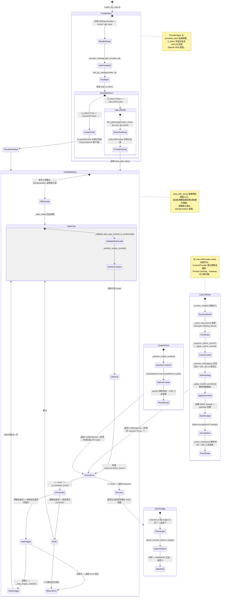

## 版本

| 版本 | 更新内容 |
| ---- | -------- |
| 1.0 | 初始版本 |

# 数据流：LLMCallTrace

**Flow 对象**：LLMCallTrace -- 一次完整 LLM 调用的全链路追踪
**对应 Spec**：[llm-infrastructure-spec](../specs/2026-07-06-llm-infrastructure-spec.md)

## LLMCallTrace 数据结构

```python
@dataclass
class LLMCallTrace:
    # === 请求标识 ===
    provider_id: str                      # Provider 标识名，如 "dashscope"、"openrouter"
    model: str                            # 用户请求的模型名
    is_direct: bool                       # True -> CustomProvider 直连，False -> LiteLLMProvider

    # === 消息处理 ===
    messages: list[dict]                  # 原始消息列表
    sanitized_messages: list[dict]        # 清理后的消息列表（空内容修复 + 字段过滤）

    # === 模型名解析（仅 LiteLLM 路径） ===
    resolved_model: str                   # 前缀注入后的最终模型名（如 "anthropic/claude-sonnet-4-5"）

    # === 请求参数 ===
    max_tokens: int                       # 最大输出 Token
    temperature: float                    # 采样温度
    tool_choice: str | dict | None        # 工具选择策略
    reasoning_effort: str | None          # 深度思考强度

    # === 调用结果 ===
    response: LLMResponse                 # 最终响应（含 content / tool_calls / finish_reason / usage）
    raw_error: str | None                 # 首次错误消息（用于重试决策）

    # === 重试与降级 ===
    retry_count: int                      # 实际重试次数（0 表示首次成功）
    image_stripped: bool                  # 是否执行了图片降级（纯文本重试）

    # === 用量持久化 ===
    usage_saved: bool                     # Token 用量是否已持久化
    usage_session_id: str | None          # 用量关联的 session_id
```

**关键字段说明**：
- `is_direct`：决定整个调用链的分支走向。`True` 时走 CustomProvider（AsyncOpenAI 直连），跳过模型名解析、Prompt Caching、Gateway 注入等 LiteLLM 专属逻辑。`False` 时走 LiteLLMProvider 的完整解析-缓存-规范化链路。
- `resolved_model`：仅在 `is_direct=False` 时有意义。LiteLLM 要求模型名带 provider 前缀（如 `deepseek/deepseek-chat`），`_resolve_model()` 通过 `find_by_model()` 和 `find_gateway()` 自动注入此前缀。如果 `is_direct=True`，CustomProvider 直接将 model 原样传给 AsyncOpenAI。
- `image_stripped`：chat_with_retry() 的关键降级标志。当非瞬态错误且消息包含图片时，自动移除图片以纯文本重试一次。如果重试成功，response 中是纯文本调用的结果，原始 messages 仍含图片。
- `retry_count`：0 表示首次调用成功；1-3 表示瞬态错误触发的延迟重试（1s/2s/4s）。如果 `image_stripped=True` 且 `retry_count=0`，说明首次调用非瞬态失败后触发了图片降级（不算 retry_count）。

## 与其他数据流的耦合

### LLMCallTrace ConfigInitState

**ConfigInitState 状态字段**：`providers_loaded`

**耦合关系**：

| LLMCallTrace 状态变化 | ConfigInitState 影响 | 触发位置 |
|---|---|---|
| `create_llm_client()` 读取 `settings.provider` | 依赖 `config_loaded`：settings 必须先完成 config.yaml 加载 | `build_llm_client.create_llm_client:18` |
| `create_llm_client()` 调用 `provider_manager.get_api_key(provider)` | 依赖 `providers_loaded`：provider_manager 必须先完成 providers.yaml 加载和 keyring 初始化 | `build_llm_client.create_llm_client:29` |
| `PROVIDERS` 全局注册表构建 | 依赖 `providers_loaded`：`_build_providers()` 调用 `provider_manager.get_raw_specs()` 读取已解析的 yaml 数据 | `registry._build_providers:87` |

**说明**：LLMCallTrace 的可用性强依赖 ConfigInitState。`create_llm_client()` 从 `settings.provider` / `settings.model` / `settings.api_base` 读取用户配置，通过 `provider_manager.get_api_key()` 从 keyring 获取 API key。如果 settings 未初始化或 providers.yaml 未加载，`create_llm_client()` 会因 `provider` 为空而抛出 `ValueError`。`PROVIDERS` 注册表在模块导入时构建（`registry.py:107`），也间接依赖 provider_manager 的 yaml 解析结果。

<key_function>
- lifeprism/llm/providers/llm_providers/registry.py
  - registry._build_providers:87
</key_function>

## 流程概览



## 数据流节点

**业务场景说明**：系统中有两条典型的 LLM 调用链路 --

- **LiteLLM 路径**：通过 LiteLLM 适配层调用 18+ 个 LLM 服务商，经过模型名解析、Prompt Caching、消息规范化、Gateway 参数注入等完整流程。适用于标准 Provider 和 Gateway（如 OpenRouter、AiHubMix）。
- **直连路径**：通过 OpenAI SDK 直连 OpenAI 兼容 API，跳过 LiteLLM 层。适用于 `is_direct=True` 的 Provider（如 Custom 端点、Xiaomi MIMO）。

两条链路共享 `chat_with_retry()` 的重试与降级逻辑，以及 `LLMUsageDataProvider` 的 Token 用量持久化。

---

### 链路 1：create_llm_client() -- Provider 工厂创建

**场景**：业务代码调用 `create_llm_client()` 获取可用的 LLM Provider 实例。这是所有 LLM 调用的统一入口。

1. create_llm_client()
   从 settings 读取用户配置，通过 registry 查找 ProviderSpec，根据 `is_direct` 路由到对应 Provider。
   状态: provider_id / model / is_direct 已确定 | 持久化: ❌ | 跨模块: ✅ config 模块 -> llm/providers 模块
   步骤:
   - `provider_manager.get_provider_id(settings.provider)` 将前端显示名转为 provider id
   - `find_by_name(provider)` 从 PROVIDERS 注册表精确查找 ProviderSpec
   - **分支**：provider 为空 -> `raise ValueError("config.yaml中没有设置provider...")`
   - **分支**：spec 为 None -> `raise ValueError(f"无效的provider: {provider}")`
   - **分支**：`spec.is_direct == True` -> 创建 `CustomProvider(api_key, api_base, default_model)`
   - **分支**：`spec.is_direct == False` -> 创建 `LiteLLMProvider(api_key, api_base, default_model, provider_name=provider)`
   - API key 通过 `provider_manager.get_api_key(provider)` 从 keyring 获取
   - `is_direct` 标志写入 LLMCallTrace，后续所有步骤依此分流

2. PROVIDERS 全局注册表构建（模块导入时）
   `_build_providers()` 从 provider_manager 读取 providers.yaml 解析结果，构建 ProviderSpec 元组。
   状态: PROVIDERS 元组就绪 | 持久化: ❌ | 跨模块: ✅ providers.yaml 文件 -> registry 内存
   步骤: `provider_manager.get_raw_specs()` 获取已解析的 yaml 数据 -> 按 `_VALID_FIELDS` 过滤字段 -> list 类型字段转换为 tuple（env_extras / model_overrides / keywords / skip_prefixes） -> 返回 `tuple[ProviderSpec, ...]`

3. find_by_name()
   按 config field name 精确匹配 ProviderSpec。create_llm_client() 的关键查找步骤。
   状态: 确定了 is_direct 路由 | 持久化: ❌ | 跨模块: ❌
   步骤: 遍历 PROVIDERS -> `spec.name == name` -> 返回 ProviderSpec

4. LiteLLMProvider.__init__() 中的 Gateway 检测
   `find_gateway(provider_name, api_key, api_base)` 三级检测判断 provider 是否为 Gateway 或本地部署。
   状态: self._gateway 确定，影响后续 6 个行为 | 持久化: ❌ | 跨模块: ❌
   步骤: 1) provider_name 直接匹配 gateway/local spec -> 2) api_key 前缀检测（如 "sk-or-" -> OpenRouter） -> 3) api_base 关键词检测（如 "aihubmix" -> AiHubMix） -> 设置 `self._gateway`

5. CustomProvider.__init__() 中 AsyncOpenAI 客户端创建
   使用 OpenAI SDK 创建直连客户端，自动注入 `x-session-affinity` header 提升缓存命中率。
   状态: self._client 就绪 | 持久化: ❌ | 跨模块: ❌
   步骤: 生成 `uuid4().hex` 作为 session affinity -> 合并 extra_headers -> 创建 `AsyncOpenAI(api_key, base_url, default_headers)`

<key_function>
- lifeprism/llm/providers/llm_providers/build_llm_client.py
  - build_llm_client.create_llm_client:14
- lifeprism/llm/providers/llm_providers/registry.py
  - registry.find_by_name:168
  - registry.find_gateway:137
- lifeprism/llm/providers/llm_providers/litellm_provider.py
  - litellm_provider.LiteLLMProvider.__init__:45
- lifeprism/llm/providers/llm_providers/custom_provider.py
  - custom_provider.CustomProvider.__init__:19
</key_function>

---

### 链路 2：LiteLLMProvider.chat() -- LiteLLM 多服务商路径

**场景**：通过 LiteLLM 适配层调用 OpenAI、Anthropic、DeepSeek、MiniMax、DashScope 等 18+ 个 LLM 服务商。这是 `is_direct=False` 时的调用路径。

1. LiteLLMProvider.chat()
   LiteLLM 路径的完整入口：消息校验 -> 模型名解析 -> Prompt Caching -> 参数覆盖 -> 消息规范化 -> acompletion 调用 -> 响应解析。
   状态: LLMCallTrace 逐步填充 resolved_model / sanitized_messages / response | 持久化: ❌ | 跨模块: ❌
   步骤:
   - `_validate_last_user_content_is_multimodal(messages)`：确保最后一条 user 消息的 content 是多模态列表而非字符串
   - `model = self._resolve_model(original_model)`：自动注入 provider 前缀
   - `_extra_msg_keys(original_model, model)`：判断是否保留 Anthropic thinking_blocks
   - `_supports_cache_control(original_model)` 为 True -> `_apply_cache_control(messages, tools)` 注入 ephemeral cache
   - `max_tokens = max(1, max_tokens)`：防止非正值导致 acompletion 拒绝
   - `_apply_model_overrides(model, kwargs)`：如 kimi-k2.5 强制 temperature=1.0
   - 如果有 `self._gateway` -> 注入 `gateway.litellm_kwargs`
   - `self._sanitize_messages(self._sanitize_empty_content(messages), extra_keys=extra_msg_keys)`：双重清理
   - 构建 kwargs（api_key / api_base / extra_headers / reasoning_effort / tools）
   - `await acompletion(**kwargs)`：发起 LiteLLM 请求
   - `self._parse_response(response)`：解析响应
   - **异常分支**：任意步骤抛异常 -> 返回 `LLMResponse(content="Error calling LLM: ...", finish_reason="error")`

2. LiteLLMProvider._resolve_model()
   根据 Gateway 或标准 Provider Spec 为模型名添加 LiteLLM 前缀。
   状态: resolved_model 从原始 model 变为带前缀的完整模型名 | 持久化: ❌ | 跨模块: ❌
   步骤:
   - **分支**：`self._gateway` 存在 -> 如果 `gateway.strip_model_prefix` -> 先剥离已有前缀（`model.split("/")[-1]`） -> 应用 `gateway.litellm_prefix` -> 返回 `"{prefix}/{model}"`
   - **分支**：无 gateway -> `find_by_model(model)` 查找标准 Provider -> 如果有 `spec.litellm_prefix` 且 model 不以 `skip_prefixes` 中的前缀开头 -> 返回 `"{prefix}/{model}"`
   - **分支**：找不到匹配的 spec 或无需前缀 -> 原样返回 model

3. LiteLLMProvider._apply_cache_control()
   对支持 Prompt Caching 的 Provider（如 Anthropic）在消息中注入 cache_control 标记。
   状态: messages 末尾注入 ephemeral cache 标记 | 持久化: ❌ | 跨模块: ❌
   步骤:
   - system 消息：如果 content 是字符串 -> 转为 `[{type: "text", text: content, cache_control: {type: "ephemeral"}}]`；如果是 list -> 最后一个元素注入 cache_control
   - tools：最后一个 tool 定义注入相同标记
   - 返回新的 messages 和 tools 副本（不修改原始对象）

4. LiteLLMProvider._sanitize_messages()
   过滤非标准消息字段，规范化 tool_call_id（兼容 Mistral 9 字符限制），保持 tool_calls 与 tool_call_id 引用一致性。
   状态: sanitized_messages 更新（字段过滤 + ID 规范化） | 持久化: ❌ | 跨模块: ❌
   步骤:
   - `LLMProvider._sanitize_request_messages(messages, allowed_keys)`：保留 _ALLOWED_MSG_KEYS + extra_keys，移除 _meta 等内部字段
   - 遍历每条消息：如果 `tool_calls` 是列表 -> 调用 `_normalize_tool_call_id()` 缩短每个 tc.id
   - 如果 `tool_call_id` 存在 -> 同样规范化
   - `id_map` 字典确保 assistant 的 tool_calls.id 和 tool 的 tool_call_id 指向相同的规范化 ID

5. LiteLLMProvider._parse_response()
   将 LiteLLM 原始响应转换为 LLMResponse，处理多 choice 合并、XML 工具调用解析、Token 用量提取。
   状态: response 填充 content / tool_calls / finish_reason / usage / reasoning_content / thinking_blocks | 持久化: ❌ | 跨模块: ❌
   步骤:
   - 遍历所有 choices：合并 tool_calls（处理 GitHub Copilot 跨 choice 拆分场景） -> 合并 content
   - 每个 tool_call：解析 arguments（JSON 字符串用 json_repair.loads） -> 提取 provider_specific_fields -> 创建 ToolCallRequest
   - **分支**：`finish_reason == "tool_calls"` 且 tool_calls 为空且 content 含 `<tool_call>` -> `_parse_xml_tool_calls(content)` 解析 XML 格式
   - 提取 usage（prompt_tokens / completion_tokens / total_tokens）
   - 提取 reasoning_content 和 thinking_blocks

6. LiteLLMProvider._apply_model_overrides()
   根据模型名匹配 `spec.model_overrides` 中的 (pattern, overrides) 元组，覆盖 kwargs 参数。
   状态: kwargs 中某参数被覆盖（如 temperature） | 持久化: ❌ | 跨模块: ❌
   步骤: `find_by_model(model)` 获取 spec -> 遍历 `spec.model_overrides` -> 如果 pattern 出现在 model_lower 中 -> `kwargs.update(overrides)`

<key_function>
- lifeprism/llm/providers/llm_providers/litellm_provider.py
  - litellm_provider.LiteLLMProvider.chat:232
  - litellm_provider.LiteLLMProvider._resolve_model:105
  - litellm_provider.LiteLLMProvider._apply_cache_control:141
  - litellm_provider.LiteLLMProvider._sanitize_messages:201
  - litellm_provider.LiteLLMProvider._parse_response:371
  - litellm_provider.LiteLLMProvider._parse_xml_tool_calls:316
  - litellm_provider.LiteLLMProvider._apply_model_overrides:169
  - litellm_provider.LiteLLMProvider._extra_msg_keys:179
  - litellm_provider.LiteLLMProvider._normalize_tool_call_id:192
  - litellm_provider.LiteLLMProvider._canonicalize_explicit_prefix:125
  - litellm_provider.LiteLLMProvider._supports_cache_control:134
</key_function>

---

### 链路 3：CustomProvider.chat() -- OpenAI SDK 直连路径

**场景**：通过 OpenAI SDK 直连 OpenAI 兼容 API（Custom 端点、Xiaomi MIMO 等），不经过 LiteLLM 层。这是 `is_direct=True` 时的调用路径。

1. CustomProvider.chat()
   直连路径的完整入口：消息校验 -> 消息清理 -> AsyncOpenAI 调用 -> 响应解析。
   状态: LLMCallTrace 逐步填充 sanitized_messages / response | 持久化: ❌ | 跨模块: ❌
   步骤:
   - `_validate_last_user_content_is_multimodal(messages)`：确保最后一条 user 消息是多模态列表
   - `self._sanitize_empty_content(messages)`：修复空内容块
   - `model or self.default_model`：确定模型名（无 _resolve_model 步骤）
   - `max(1, max_tokens)`：防止非正值
   - `await self._client.chat.completions.create(**kwargs)`：调用 OpenAI SDK
   - `self._parse(response)`：解析响应
   - **异常分支**：优先从异常对象获取 API body 内容（`getattr(e, "doc", None)` 或 `getattr(getattr(e, "response", None), "text", None)`），截断到 500 字符 -> 返回 `LLMResponse(content="Error: ...", finish_reason="error")`

2. CustomProvider._parse()
   将 OpenAI SDK 响应转换为 LLMResponse，处理空 choices、XML 工具调用解析、Token 用量提取。
   状态: response 填充 | 持久化: ❌ | 跨模块: ❌
   步骤:
   - **分支**：`response.choices` 为空 -> 返回 error LLMResponse
   - 提取 content / finish_reason / tool_calls / usage
   - **分支**：`finish_reason == "tool_calls"` 且 tool_calls 为空且 content 含 `<tool_call>` -> `_parse_xml_tool_calls(content)`
   - 提取 usage（prompt_tokens / completion_tokens / total_tokens）或空 dict

<key_function>
- lifeprism/llm/providers/llm_providers/custom_provider.py
  - custom_provider.CustomProvider.chat:41
  - custom_provider.CustomProvider._parse:122
  - custom_provider.CustomProvider._parse_xml_tool_calls:74
</key_function>

---

### 链路 4：LLMProvider.chat_with_retry() -- 重试与降级

**场景**：带自动重试的聊天补全入口，处理瞬态错误重试和图片降级。这是推荐的外部调用方式，直接调用 `chat()` 不会自动重试。

1. LLMProvider.chat_with_retry()
   参数默认值从 `self.generation` 读取 -> 循环调用 `_safe_chat()` -> 检查错误类型 -> 重试或降级。
   状态: retry_count / image_stripped 变化 | 持久化: ❌ | 跨模块: ❌
   步骤:
   - `max_tokens is self._SENTINEL` -> 使用 `self.generation.max_tokens`
   - `temperature is self._SENTINEL` -> 使用 `self.generation.temperature`
   - `reasoning_effort is self._SENTINEL` -> 使用 `self.generation.reasoning_effort`
   - 进入重试循环（最多 3 次，延迟 1s/2s/4s）
   - `response = await self._safe_chat(**kw)`：调用 chat() 并用 try/except 包装
   - **分支**：`response.finish_reason != "error"` -> 直接返回
   - **分支**：`response.finish_reason == "error"` -> `_is_transient_error(response.content)` 检查 -> 瞬态 -> 延迟重试
   - **分支**：非瞬态错误 -> `_strip_image_content(messages)` 检查是否含图片 -> 含图片则纯文本重试一次 -> 否则返回 error
   - 3 次重试后仍失败 -> 返回最后一次的 error 响应

2. LLMProvider._safe_chat()
   包装 `self.chat()` 调用，将未预期的异常转换为 error LLMResponse。
   状态: raw_error 被填充（异常时） | 持久化: ❌ | 跨模块: ❌
   步骤: try: `return await self.chat(**kwargs)` -> except asyncio.CancelledError: raise -> except Exception: `return LLMResponse(content=f"Error calling LLM: {exc}", finish_reason="error")`

3. LLMProvider._is_transient_error()
   检查错误消息是否匹配 12 种瞬态错误标记。
   状态: 决定是否进入重试分支 | 持久化: ❌ | 跨模块: ❌
   步骤: 将 error content 转小写 -> 匹配 `_TRANSIENT_ERROR_MARKERS`（429 / rate limit / 500 / 502 / 503 / 504 / overloaded / timeout / timed out / connection / server error / temporarily unavailable）

4. LLMProvider._strip_image_content()
   将消息中的 `image_url` 块替换为 `[image: path]` 文本占位符。
   状态: image_stripped = True | 持久化: ❌ | 跨模块: ❌
   步骤: 遍历 messages -> 找到 type="image_url" 的 content block -> 从 `_meta.path` 提取文件路径 -> 替换为 `[image: path]` 或 `[image omitted]` -> 返回新 messages；无图片则返回 None

<key_function>
- lifeprism/llm/providers/llm_providers/base.py
  - base.LLMProvider.chat_with_retry:246
  - base.LLMProvider._safe_chat:237
  - base.LLMProvider._is_transient_error:211
  - base.LLMProvider._strip_image_content:216
</key_function>

---

### 链路 5：Token 用量持久化

**场景**：LLM 调用完成后，调用方（Agent loop、定时任务等）将 `response.usage` 保存到数据库，按 session 维度聚合统计。

1. LLMUsageDataProvider.save_usage()
   将单次 LLM 调用的 Token 用量持久化到数据库。
   状态: usage_saved = True / False | 持久化: ✅ (写入 SQLite llm_usage 表) | 跨模块: ❌
   步骤:
   - **分支**：`session_id` 或 `usage` 为空 -> 返回 0（不执行写入）
   - 构建 `usage_data = {input_tokens: prompt_tokens, output_tokens: completion_tokens, total_tokens: total_tokens, mode: mode}`
   - `self.upsert_session_tokens_usage(session_id, usage_data)`：同一 session 多次调用自动合并更新
   - **异常分支**：任意步骤抛异常 -> WARNING 日志 -> 返回 0（辅助操作兜底，不影响主流程）

2. LLMUsageDataProvider.batch_save_usage()
   批量保存多条 Token 用量记录。
   状态: 多条记录持久化 | 持久化: ✅ | 跨模块: ❌
   步骤:
   - **分支**：`usage_list` 为空 -> 返回 0
   - `self.save_tokens_usage(usage_list)`：批量写入
   - **异常分支**：WARNING 日志 -> 返回 0

3. llm_usage_db_provider 全局单例
   `LazySingleton(LLMUsageDataProvider)` 确保全局唯一实例，延迟到首次调用 `save_usage()` 时才连接数据库。
   状态: 首次访问时触发 DB 连接 | 持久化: ❌ | 跨模块: ❌
   步骤: 首次 `llm_usage_db_provider.save_usage(...)` 触发 `LLMUsageDataProvider.__init__()` -> `super().__init__(db_manager)` -> 连接 SQLite

<key_function>
- lifeprism/llm/providers/llm_providers/llm_usage_db_provider.py
  - llm_usage_db_provider.LLMUsageDataProvider.save_usage:26
  - llm_usage_db_provider.LLMUsageDataProvider.batch_save_usage:55
</key_function>

---

### 消息清理公共路径（LiteLLM 和 Custom 共享）

两个 Provider 在 chat() 内部都调用了基类的消息清理方法，这是共享的基础设施。

6. LLMProvider._sanitize_empty_content()
   修复消息中的空内容块：空字符串 content -> None（如有 tool_calls）或 "(empty)"；list 内容中移除空 text / input_text / output_text 块和 `_meta` 字段。
   状态: messages 中空内容被修复 | 持久化: ❌ | 跨模块: ❌
   步骤:
   - 遍历每条消息
   - 空字符串 content -> 根据是否有 tool_calls 决定改为 None 或 "(empty)"
   - list content -> 过滤空的 text/input_text/output_text 块 -> 移除 `_meta` 字段 -> 如果过滤后为空 -> 同样根据 tool_calls 决定 None 或 "(empty)"
   - dict content -> 包装为 `[content]`
   - 其他类型原样保留

7. LLMProvider._validate_last_user_content_is_multimodal()
   确保最后一条 user 消息的 content 是多模态列表。防止图片 base64 被 stringify 丢失。
   状态: 验证通过或抛出 ValueError | 持久化: ❌ | 跨模块: ❌
   步骤: 反向遍历 messages 找最后一条 role="user" 的消息 -> 如果 content 是 str -> `raise ValueError("last user message content must be a multimodal list, got str")`

8. LLMProvider._sanitize_request_messages()
   按 `allowed_keys` 白名单过滤消息字段，确保 assistant 消息有 content key。
   状态: messages 中多余字段被移除 | 持久化: ❌ | 跨模块: ❌
   步骤: 遍历消息 -> `{k: v for k, v in msg.items() if k in allowed_keys}` -> 如果 assistant 消息缺少 content -> 补充 `"content": None`

<key_function>
- lifeprism/llm/providers/llm_providers/base.py
  - base.LLMProvider._sanitize_empty_content:102
  - base.LLMProvider._validate_last_user_content_is_multimodal:170
  - base.LLMProvider._sanitize_request_messages:155
</key_function>

## 异常与清理

### chat() 方法的异常处理策略

两个 Provider 的 `chat()` 都不向调用方抛异常，而是返回 `LLMResponse(content="Error...", finish_reason="error")`。这意味着调用方需要检查 `finish_reason` 判断成功或失败。

11. LiteLLMProvider.chat() 的异常处理
    `acompletion()` 抛出的任何异常都被捕获，转换为 error LLMResponse。
    状态: response.finish_reason = "error", response.content = "Error calling LLM: ..." | 持久化: ❌ | 跨模块: ❌
    步骤: try: acompletion + parse -> except Exception: `LLMResponse(content=f"Error calling LLM: {str(e)}", finish_reason="error")`

12. CustomProvider.chat() 的异常处理
    优先从异常对象提取 API 返回的 body 内容，提供比通用异常消息更有用的错误信息。
    状态: response.finish_reason = "error", response.content 含截断的 API body | 持久化: ❌ | 跨模块: ❌
    步骤: try: AsyncOpenAI create + parse -> except Exception: 提取 `e.doc` 或 `e.response.text`（body） -> 截断到 500 字符 -> `LLMResponse(content=f"Error: {body}", finish_reason="error")`

### chat_with_retry() 的降级路径

13. 图片降级重试
    当首次调用因非瞬态错误（如模型不支持图片）失败，且消息包含 image_url 块时，自动移除图片以纯文本重试。
    状态: image_stripped = True | 持久化: ❌ | 跨模块: ❌
    步骤: 首次 `_safe_chat()` 返回 error -> `_is_transient_error()` 返回 False -> `_strip_image_content(messages)` 找到 image_url 块 -> 替换为 `[image: path]` 占位符 -> 再次 `_safe_chat()` 纯文本调用 -> 返回结果

14. 3 次重试后仍失败
    所有瞬态错误重试耗尽后，返回最后一次的 error 响应。
    状态: retry_count = 3 | 持久化: ❌ | 跨模块: ❌
    步骤: 循环结束后 -> `return await self._safe_chat(**kw)` 最后一次尝试 -> 返回 error 响应

### Token 用量的静默失败

15. LLMUsageDataProvider.save_usage() 的异常兜底
    Token 用量保存失败不抛异常，仅记录 WARNING 日志。这是刻意设计 -- 用量记录是辅助功能，不应阻塞主流程。
    状态: usage_saved = False | 持久化: ❌（写入失败） | 跨模块: ❌
    步骤: upsert_session_tokens_usage() 抛异常 -> `logger.warning("保存 token 使用情况失败: %s", e)` -> 返回 0

## 反常设计说明

### Provider.chat() 不抛异常，返回 error LLMResponse

**设计意图**：Python 的惯用错误处理是通过异常传播。调用方期望 try/except 捕获 LLM 调用失败。

**当前实现**：`LiteLLMProvider.chat()` 和 `CustomProvider.chat()` 在异常时都不 raise，而是返回 `LLMResponse(finish_reason="error")`。调用方必须检查 `response.finish_reason != "error"` 来判断操作是否成功。

**为什么是反常的**：这违反了 Python 的 "EAFP"（Easier to Ask for Forgiveness than Permission）惯例。调用方如果不检查 `finish_reason`，可能将错误消息当作正常 LLM 输出使用，导致下游逻辑出错。`chat_with_retry()` 依赖 `finish_reason == "error"` 来判断是否需要重试，如果调用方绕过 `chat_with_retry()` 直接调用 `chat()`，错误不会自动处理。

**影响范围**：所有 LLMProvider 的调用方。Agent loop（`lifeprism/llm/agent/loop.py`）和定时任务（`lifeprism/llm/function/agent_schedule_job.py`）都通过 `chat_with_retry()` 间接调用，如果这些调用方有不检查 `finish_reason` 的代码路径，可能存在隐患。

**相关位置**：`litellm_provider.py:308-313`（LiteLLM 异常返回 error）、`custom_provider.py:64-71`（Custom 异常返回 error）

### chat_with_retry() 中 retry_count 不包含图片降级

**设计意图**：重试计数器追踪所有类型的重试，包括瞬态错误重试和图片降级重试。

**当前实现**：图片降级发生在 `enumerate(self._CHAT_RETRY_DELAYS, start=1)` 循环内部，但不在 `for` 循环的迭代路径上 -- 它直接 `return await self._safe_chat(...)` 跳出循环。因此即使执行了图片降级重试，`retry_count` 不会增加，`image_stripped=True` 但 `retry_count=0`。

**为什么是反常的**：调用方看到 `retry_count=0` 会认为调用一次成功，但实际可能经历了失败+降级。`image_stripped=True` 是这个场景的唯一标志。如果调用方只看 `retry_count` 判断调用是否顺利，会遗漏图片降级情况。

**影响范围**：依赖 retry_count 做统计或告警的代码。当前代码中 retry_count 仅在 chat_with_retry() 内部使用（控制重试次数），不向外暴露。但如果未来添加了基于 retry_count 的监控逻辑，需要注意这个差异。

**相关位置**：`base.py:285-291`（图片降级路径不增加 retry_count）

### LiteLLMProvider 的 Gateway 检测先于 find_by_model

**设计意图**：模型名解析应该统一通过 `find_by_model()` 进行，保持路由逻辑集中。

**当前实现**：`_resolve_model()` 中，如果 `self._gateway` 存在，直接使用 gateway 的 `litellm_prefix` 做前缀注入，完全跳过 `find_by_model()`。只有当 `self._gateway` 为 None 时，才走 `find_by_model()` 的标准 Provider 匹配路径。

**为什么是反常的**：Gateway 路由和标准 Provider 路由在 `_resolve_model()` 中是两套独立的逻辑分支。`find_by_model()` 被设计为统一的"按模型名查找 Provider"入口，但由于 Gateway 先判断并短路，`find_by_model()` 对于 Gateway 路由的场景完全不可见。这种设计使得两个分支的维护独立，如果有新的前缀规则需要在两处都更新。

**影响范围**：仅影响 LiteLLM 路径的模型名解析。CustomProvider 完全不经过 `_resolve_model()`。标准 Provider 不受影响（走 find_by_model 分支）。

**相关位置**：`litellm_provider.py:105-122`（_resolve_model 中的两套分支）

### _ON_CONFLICT 默认策略未在 LLMUsageDataProvider 中显式覆盖

**设计意图**：`LWBaseDataProvider._ON_CONFLICT = "replace"`，子类按需覆盖。

**当前实现**：`LLMUsageDataProvider` 继承 `LWBaseDataProvider`，未显式覆盖 `_ON_CONFLICT`。`save_usage()` 通过 `upsert_session_tokens_usage()` 写入，该方法内部使用 UPSERT 逻辑（session 维度聚合），继承了基类的 `"replace"` 策略。

**为什么是反常的**：对于 Token 用量统计，"replace" 意味着同一 session 的用量记录会被完全删除再插入。如果 `upsert_session_tokens_usage()` 只更新 total_tokens 而不保留历史记录，这是正确的行为（合并聚合）。但如果未来增加了每日用量明细等需要保留历史的功能，"replace" 策略会导致数据丢失。详见 `docs/flows/2026-07-06-repository-data-access-flow.md` 中关于 `_ON_CONFLICT` 的反常设计讨论。

**影响范围**：仅影响 Token 用量数据的持久化行为。当前仅做 session 级别的聚合更新，replace 策略符合需求。

**相关位置**：`llm_usage_db_provider.py:15-24`（LLMUsageDataProvider 继承 LWBaseDataProvider）

### LiteLLMProvider 和 CustomProvider 各自实现 XML 工具调用解析

**设计意图**：共享的解析逻辑应该在基类或工具函数中定义，避免代码重复。

**当前实现**：`LiteLLMProvider._parse_xml_tool_calls()` 和 `CustomProvider._parse_xml_tool_calls()` 是两套独立但几乎完全相同的实现（约 50 行代码）。唯一的区别是 tool_call id 生成方式：LiteLLM 使用 `_short_tool_id()`（SHA1 哈希取前 9 位），Custom 使用 `uuid.uuid4()[:9]`。

**为什么是反常的**：代码重复是明确的技术债信号。XML 工具调用解析逻辑是为 MIMO/MiniMax 等不返回标准 OpenAI tool_calls 格式的模型准备的，这个需求与具体 Provider 类型无关。应该提取到基类 `LLMProvider` 或独立的工具函数中，让两个子类共享。

**影响范围**：维护成本 -- 修改 XML 解析逻辑时需要同时修改两个文件。功能层面无影响，两套实现的行为一致（ID 生成方式不同但都满足 9 字符要求）。

**相关位置**：`litellm_provider.py:316-369`、`custom_provider.py:74-120`

## 相关文档

### Spec 文档
- **[llm-infrastructure-spec](../specs/2026-07-06-llm-infrastructure-spec.md)**：LLM 基础设施模块核心契约，定义 Provider 抽象、Client 工厂、用量追踪、Prompt 管理、Schema 定义、工具函数和异常体系

### Flow 文档
- **[config-initialization-flow](./2026-07-06-config-initialization-flow.md)**：ConfigInitState 数据流，覆盖 SettingsManager 和 ProviderManager 的初始化。LLMCallTrace 依赖 settings.provider 和 provider_manager.get_api_key()
- **[repository-initialization-flow](./2026-07-06-repository-initialization-flow.md)**：RepoInitState 数据流，覆盖 DatabaseManager 创建和 LazySingleton 延迟实例化。LLMUsageDataProvider 继承 LWBaseDataProvider，依赖 Repository 初始化完成

### 架构文档
- 暂无直接关联的架构文档。Provider 注册表机制（providers.yaml 驱动 vs 硬编码）的设计决策记录在 Spec 的 Design Rationale 中。
