## 版本

| 版本 | 更新内容 |
| ---- | -------- |
| 1.0 | 初始版本 |

# 数据流：SessionLifecycleTrace

**Flow 对象**：SessionLifecycleTrace
**对应 Spec**：[llm-communication-spec](../specs/2026-07-06-llm-communication-spec.md)

## SessionLifecycleTrace 数据结构

```python
@dataclass
class SessionLifecycleTrace:
    """Session 从创建到销毁的完整生命周期追踪"""

    # === 标识 ===
    session_id: str                  # Session 唯一标识（UUID 格式）

    # === 生命周期阶段 ===
    phase: str                       # CREATED | LOADING | ACTIVE | COMPACTING | PERSISTED | DELETED

    # === 加载状态 ===
    cache_hit: bool                  # 是否命中内存缓存（True=从 _cache 返回，False=从文件加载或新建）

    # === 消息状态 ===
    message_count: int               # 当前消息总数（含 system/compact 标记消息）
    token_estimate: int              # 估算的 prompt token 数量（由 estimate_prompt_tokens 计算）

    # === 压缩状态 ===
    compact_triggered: bool          # 本次是否触发了自动压缩
    last_compacted_loc: int          # 最后一次压缩时消息列表的索引位置

    # === 持久化 ===
    jsonl_path: Path                 # 对应的 JSONL 文件路径（session_path / {session_id}.jsonl）
```

**关键字段说明**：
- `phase`：Session 生命周期阶段的核心指标，决定当前 Session 处于何种操作状态。从一个阶段到另一个阶段的转换由 SessionManager 的 CRUD 方法驱动
- `cache_hit`：双层架构的核心性能指标。内存缓存命中时跳过 JSONL 文件解析，大幅降低 I/O 开销；未命中时需要逐行解析 JSONL 重建 Session 对象
- `token_estimate`：自动压缩的触发依据。当 `estimate_prompt_tokens(messages, tools) > settings.token_limit` 时触发压缩，这是控制 LLM 调用成本的防火墙
- `last_compacted_loc`：压缩的边界标记。`get_history_message()` 方法通过此字段过滤已压缩的消息，确保 LLM 只看到压缩摘要而非完整历史。取值含义：`0` = 从未压缩，`>0` = 上次压缩时的消息索引
- `jsonl_path`：持久化的物理锚点。所有 Session 数据以 JSONL 格式存储在该路径，删除操作也通过删除该文件实现

## 与其他数据流的耦合

### SessionLifecycleTrace <-> ConfigInitState

**ConfigInitState 状态字段**：`lifeprism_data_path`（源，间接提供 `session_path`）

**耦合关系**：

| SessionLifecycleTrace 状态变化 | ConfigInitState 影响 | 触发位置 |
|-------------------------------|---------------------|---------|
| `session_path` 确定（从 `settings.session_path` 读取） | 依赖 ConfigInitState 已解析的 `lifeprism_data_path`，`session_path` 由其自动推算 | `SessionManager.__init__` 通过 `settings.session_path` 延迟引用 |
| JSONL 文件创建/读取/删除 | 文件操作全部在 `session_path` 目录下进行 | `_load_session` / `save_session` / `delete_session` |

**说明**：SessionLifecycleTrace 是 ConfigInitState 的下游依赖。`SessionManager` 通过 `settings.session_path` 获取存储路径，该路径由 SettingsManager 在初始化时从 `lifeprism_data_path` 自动推算。这意味着 `SessionManager` 的使用必须在 ConfigInitState 完成之后，由 `LazySingleton` 延迟实例化保证。

### SessionLifecycleTrace <-> AgentLoop

**AgentLoop 状态字段**：消息处理循环、工具注册状态

**耦合关系**：

| SessionLifecycleTrace 状态变化 | AgentLoop 影响 | 触发位置 |
|-------------------------------|---------------|---------|
| `compact_triggered=True` | AgentLoop 在 `_process_msg` 中调用 `auto_compact`，压缩后 `Session.last_compacted_loc` 更新，后续 `get_history_message()` 返回截断后的消息列表 | `AgentLoop._process_msg:458` |
| `phase=ACTIVE` | AgentLoop 通过 `session.add_message("user", ...)` 追加用户消息，通过 `save_session` 持久化 | `AgentLoop._process_msg:459-462` |

**说明**：AgentLoop 是 Session 生命周期中的主要消费者和驱动者。它在处理每条入站消息前检查 token 是否超标并触发压缩，然后追加用户消息到 Session。压缩后的 Session 通过 `last_compacted_loc` 字段影响 `get_history_message()` 的返回值，从而间接控制后续 LLM 调用的上下文窗口大小。

### SessionLifecycleTrace <-> ChatHistoryManager

**ChatHistoryManager 状态字段**：`histories`、`last_processed_time`

**耦合关系**：

| SessionLifecycleTrace 状态变化 | ChatHistoryManager 影响 | 触发位置 |
|-------------------------------|------------------------|---------|
| `last_processed_loc` 增加（process_session_message 处理完毕后更新） | ChatHistoryManager 提取的聊天内容写入 `chat_history.json`，关联 `session_id` | `agent_schedule_job.process_session_message` |
| `phase=DELETED` | ChatHistoryManager 中的历史记录不受影响（聊天历史独立于 Session 生命周期） | 无直接耦合 |

**说明**：ChatHistoryManager 与 Session 的耦合是单向的——它从 Session 的 JSONL 文件中提取聊天内容（通过 `last_processed_loc` 定位增量消息），但 Session 的删除不清理对应的聊天历史记录。两者使用不同的存储文件（Session 用 `{session_id}.jsonl`，ChatHistoryManager 用 `chat_history.json`）。

<key_function>
- lifeprism/llm/session/manager.py
  - manager.Session:21
  - manager.Session.add_message:47
  - manager.Session.get_history_message:55
  - manager.SessionManager._load_session:82
  - manager.SessionManager.get_or_create_session:132
  - manager.SessionManager.delete_session:155
  - manager.SessionManager._remove_image_content:156
  - manager.SessionManager.save_session:199
  - manager.SessionManager.get_session_metadata:214
  - manager.SessionManager.remove_from_cache:249
  - manager.SessionManager.show_session_list:261
  - manager.SessionManager.show_session_content_list:268
  - manager.ChatHistoryManager.load_histories:347
  - manager.ChatHistoryManager.get_histories_to_dream:384
  - manager.ChatHistoryManager.add_content:397
  - manager.ChatHistoryManager.save_history:424
- lifeprism/llm/agent/loop.py
  - loop.AgentLoop._process_msg:468
  - loop.AgentLoop.auto_compact:606
- lifeprism/llm/chat/chat_bot.py
  - chat_bot.ChatBot.chat:17
</key_function>

## 流程概览

```mermaid
stateDiagram-v2
    [*] --> CREATED : ChatBot.chat() / AgentLoop._process_msg()

    state CREATED {
        [*] --> GenUUID : 生成 UUID
        GenUUID --> NameGen : name = session_YYYYMMDDHHMM
        NameGen --> InitFields : 初始化 created_at / updated_at / messages=[]
        InitFields --> AddCache : 加入 _cache
        AddCache --> CreateJSONL : 保存空 Session（写入 metadata 行）
        CreateJSONL --> [*] : phase → ACTIVE
    }

    CREATED --> ACTIVE : get_or_create_session(None)

    state ACTIVE {
        [*] --> AddMsg : add_message(role, content)
        AddMsg --> RoleCheck : 校验 role ∈ allow_role
        RoleCheck --> AppendTimestamp : 追加 timestamp
        AppendTimestamp --> TokenCheck : auto_compact() 检测 token

        state TokenCheck {
            [*] --> EstTokens : estimate_prompt_tokens(messages, tools)
            EstTokens --> Branch : tokens > settings.token_limit?
            Branch --> Normal : 否 → 直接追加
            Branch --> Compact : 是 → 触发压缩
        }

        Normal --> [*] : phase 保持 ACTIVE
        Compact --> [*] : phase → COMPACTING
    }

    ACTIVE --> COMPACTING : token 超标触发

    state COMPACTING {
        [*] --> BuildPrompt : 构建压缩 system_prompt
        BuildPrompt --> CallLLM : create_llm_client().chat(messages)
        CallLLM --> RecordLoc : last_compacted_loc = len(messages)
        RecordLoc --> AddSystemMsg : add_message("system", "conversation compacted")
        AddSystemMsg --> AddSummary : add_message("user", compact_summary)
        AddSummary --> Save : save_session(session)
        Save --> [*] : phase → ACTIVE
    }

    COMPACTING --> ACTIVE : 压缩完成

    ACTIVE --> PERSISTED : save_session(session)

    state PERSISTED {
        [*] --> BuildMetadata : 构建 metadata 行（_type="metadata" + 所有字段）
        BuildMetadata --> WriteLine1 : json.dumps → 写入第 1 行
        WriteLine1 --> FilterMessages : 遍历 messages 过滤(user/assistant/tool)
        FilterMessages --> StripImages : user 消息 _remove_image_content()
        StripImages --> WriteLines : 逐行 json.dumps → 追加
        WriteLines --> UpdateCache : 更新 _cache
        UpdateCache --> [*] : phase 保持 PERSISTED
    }

    PERSISTED --> ACTIVE : 继续追加消息

    ACTIVE --> DELETED : delete_session(session_id)

    state DELETED {
        [*] --> RemoveJSONL : os.remove(jsonl_path)
        RemoveJSONL --> RemoveCache : del _cache[session_id]
        RemoveCache --> [*] : 生命周期结束
    }

    DELETED --> [*]
```



**关键分支说明**：
- **缓存命中 vs 文件加载**：`get_or_create_session(session_id)` 先查 `_cache`，命中直接返回（跳过文件 I/O）；未命中再从 JSONL 文件逐行解析重建 Session 对象
- **压缩触发**：仅在 `estimate_prompt_tokens(messages, tools) > settings.token_limit` 时触发，是 LLM 调用成本的保护机制。压缩本身是一次独立的 LLM 调用，会消耗额外的 token
- **消息角色过滤**：保存时仅持久化 `user`、`assistant`、`tool` 三种角色。`system` 消息（包括压缩标记）不持久化，但保留在内存中供当前会话使用
- **图片去除**：`_remove_image_content()` 仅在消息角色为 `user` 且 content 类型为 `list` 时触发，过滤 `image` 和 `image_url` 类型的 content block

## 数据流节点

**业务场景说明**：Session 生命周期有两个主要入口：(1) ChatBot.chat() — 用户主动发起对话时创建/获取 Session；(2) AgentLoop._process_msg() — 消息总线消费入站消息时，在处理前获取 Session 并检查是否需要压缩。Session 的数据存储在双层架构中：内存 `_cache` 提供快速读取，JSONL 文件提供持久化。压缩是异步的独立 LLM 调用，在 token 超标时自动触发。

### 链路 1：Session 创建

**1. ChatBot.chat(content, session_id, **extra) — 用户对话入口**
   接收用户消息，调用 `get_or_create_session(session_id)` 获取或创建 Session，发送到消息总线
   状态: session_id 确定（新建或复用） | 持久化: ✅ (首次创建时写入空 JSONL) | 跨模块: ✅ (chat → session → bus)
   步骤:
   - `get_or_create_session(session_id)` → 分支A (session_id=None): 创建新 Session → 分支B (session_id 已存在): 加载已有 Session
   - 构建 InboundMessage(content, session_id=session.id, type=CHAT) → `bus.send(msg)` 发送到消息总线
   - 记录 LLM 调用日志（构建 system_prompt → llm_call_logger.log_call）
   - 包装响应：OutboundMessage / LLMResponse / str → 统一返回 LLMResponse

**2. AgentLoop._process_msg(msg) — 消息总线消费入口**
   从消息总线消费入站消息，在处理前获取 Session 并检查压缩
   状态: Session 就绪（新建或加载） | 持久化: ✅ (CHAT 类型立即 save_session) | 跨模块: ✅ (bus → agent)
   步骤:
   - 根据 msg.type 注册对应工具（CHAT/DREAM_TASK/CLASSIFY/GENERAL_TASK）
   - `get_or_create_session(msg.session_id)` 获取 Session
   - 调用 `auto_compact(session, tools)` 检查 token 是否超标
   - `session.add_message("user", content=...)` 追加用户消息
   - 分支 (msg.type==CHAT): 立即 `save_session(session)` — 其他类型延迟到 Agent 执行完成后保存

**3. SessionManager.get_or_create_session(session_id) — 创建/加载决策**
   根据 session_id 参数决定创建新 Session 还是加载已有 Session，结果加入 `_cache`
   状态: session_id=None → 创建新 Session / session_id 已缓存 → 缓存命中 / session_id 未缓存 → 文件加载 | 持久化: ✅ (新创建时) | 跨模块: ❌
   步骤:
   - 分支A (session_id 且 in _cache): 缓存命中 → 直接返回 `_cache[session_id]`
   - 分支B (session_id 但不在 _cache): 未命中 → 调用 `_load_session(session_id)` 从文件加载
   - 分支C (session_id 为 None 或空): 创建新 `Session()` — 生成 UUID → name=`session_YYYYMMDDHHMM` → messages=[] → created_at=now → updated_at=now
   - 所有分支最终: `_cache[session.id] = session` → 返回 session

**4. Session 数据类实例化 — 字段默认值初始化**
   `Session()` 构造时通过 `dataclass field(default_factory=...)` 自动填充默认值
   状态: 所有字段初始化为默认值 | 持久化: ❌ | 跨模块: ❌
   步骤: id=uuid4() → name=session_YYYYMMDDHHMM → messages=[] → created_at=now → updated_at=now → last_compacted_loc=0 → auto_compact=True → last_processed_loc=0

### 链路 2：Session 加载（缓存命中与文件读取两条子路径）

**5. 子路径 A：缓存命中 — get_or_create_session(existing_id) 直接返回**
   session_id 已存在于 `_cache` dict 中，直接返回缓存的 Session 对象
   状态: cache_hit=True, 无 I/O | 持久化: ❌ | 跨模块: ❌
   步骤: `if session_id and session_id in self._cache:` → `return self._cache[session_id]`

**6. 子路径 B：文件加载 — SessionManager._load_session(session_id)**
   缓存未命中时，打开 JSONL 文件逐行解析 metadata 和 messages，构建 Session 对象
   状态: cache_hit=False → Session 从文件重建 | 持久化: ❌ (仅读取) | 跨模块: ❌
   步骤:
   - 拼接路径 `settings.session_path / {session_id}.jsonl`
   - 分支A (文件不存在): `logger.error` → 抛出 `NotFoundError`
   - 分支B (文件存在): 逐行读取 JSONL
     - 首行 `_type=="metadata"`: 解析 created_at / updated_at / last_compacted_loc / last_processed_loc / name
     - 后续行: 直接 `messages.append(data)` 追加到消息列表
   - 构建 Session(id, name, messages, created_at, updated_at, last_compacted_loc, last_processed_loc)
   - 返回 Session（调用方将其加入 `_cache`）

**7. SessionManager.get_session_metadata(session_id) — 轻量元数据读取**
   只读 JSONL 文件首行 metadata，不解析 messages 列表（避免加载大量历史消息）
   状态: 返回 metadata dict 或 None | 持久化: ❌ (仅读取) | 跨模块: ❌
   步骤:
   - 分支A (文件不存在): logger.warning → 返回 None
   - 分支B (文件存在): 读首行 → json.loads → 检查 `_type=="metadata"` → 返回字典 / 格式错误返回 None
   - 异常捕获: 任何 Exception → logger.error → 返回 None（安全兜底，调用方可降级处理）

### 链路 3：消息追加与自动压缩

**8. Session.add_message(role, content, **kwargs) — 消息追加与角色校验**
   向消息列表追加新消息，自动注入 timestamp 并更新 updated_at
   状态: messages 列表长度 +1, updated_at 刷新 | 持久化: ❌ (仅内存) | 跨模块: ❌
   步骤:
   - 角色校验: `role not in allow_role` (user/assistant/tool/system) → 抛出 ValueError
   - 构建消息字典: `{"role": role, "content": content, "timestamp": now.isoformat(), **kwargs}`
   - 追加到 `self.messages` → 更新 `self.updated_at = now()`

**9. AgentLoop.auto_compact(session, tools) — Token 超标检测与压缩触发**
   计算当前消息的 token 数量，超标时通过独立 LLM 调用压缩对话历史
   状态: compact_triggered: False→True / last_compacted_loc: 0→N | 持久化: ✅ (压缩后立即 save_session) | 跨模块: ✅ (agent → LLM provider)
   步骤:
   - 调用 `session.get_history_message()` 获取未压缩消息（从 `last_compacted_loc` 开始）
   - `estimate_prompt_tokens(messages, tools)` 计算 token 数
   - 分支A (tokens <= settings.token_limit): 未超标 → 直接返回 session（不压缩）
   - 分支B (tokens > settings.token_limit): 超标 → 进入压缩流程
     - 构建压缩 system_prompt（要求：保留最后 5 条 user 消息 + 提取客观事实事件 + 工具类简记 + 情绪类详细记录）
     - `create_llm_client().chat(messages)` 调用 LLM 执行压缩
     - 记录压缩位置: `session.last_compacted_loc = len(session.messages)`
     - 插入压缩标记: `add_message("system", "conversation compacted")`
     - 插入压缩摘要: `add_message("user", compact_summary, is_compact_summary=True)`
     - `session_manager.save_session(session)` 立即持久化
   - LLM 调用异常: logger.error → 返回原 session（压缩失败不阻塞流程）

**10. Session.get_history_message() — 未压缩消息获取**
    根据 `last_compacted_loc` 返回尚未被压缩的消息片段
    状态: 返回 messages[last_compacted_loc:] | 持久化: ❌ | 跨模块: ❌
    步骤:
   - 分支A (auto_compact=True): `load_loc = self.last_compacted_loc` → 返回 `self.messages[load_loc:]`
   - 分支B (auto_compact=False): `load_loc = 0` → 返回完整 `self.messages`（不跳过任何消息）

### 链路 4：Session 持久化（save_session）

**11. SessionManager.save_session(session) — JSONL 格式写入**
    将 Session 完整状态序列化为 JSONL 文件（首行 metadata + 多行消息），同时更新内存缓存
   状态: phase → PERSISTED, JSONL 文件写入磁盘 | 持久化: ✅ (完整覆盖写入) | 跨模块: ❌
   步骤:
   - 确保目录存在: `settings.session_path.mkdir(parents=True, exist_ok=True)`
   - 写入 metadata 首行: `{"_type": "metadata", "name": ..., "created_at": ..., "updated_at": ..., "last_compacted_loc": ..., "last_processed_loc": ..., "message_len": ...}`
   - 遍历 `session.messages`，过滤角色:
     - 角色不在 ALLOW_SAVE_MESSAGE_TYPE (user/assistant/tool) → 跳过
     - role=="user" → 调用 `_remove_image_content(msg)` 剥离图片 base64 数据
     - 逐行 `json.dumps(msg, ensure_ascii=False) + "\n"` 写入
   - 隐式更新缓存: `_cache` 中持有的是同一个 Session 对象引用，内存中的修改已生效

**12. SessionManager._remove_image_content(msg) — 图片 base64 剥离**
    对 user 消息的 content 列表进行深拷贝，过滤图片类型的 content block
   状态: 消息 content 中移除 image/image_url block | 持久化: ❌ (辅助方法) | 跨模块: ❌
   步骤:
   - 分支A (role != "user"): 直接返回原 msg（不处理）
   - 分支B (content 不是 list): 直接返回原 msg（非多模态内容）
   - 分支C (role=="user" 且 content 为 list): 深拷贝 → 遍历 content block
     - block["type"] in ("image", "image_url") → 跳过（不写入）
     - 其他类型 → 保留 → 返回处理后的 msg_copy

**13. JSONL 格式契约说明**
    文件结构严格遵守以下格式契约，任何违反都可能导致加载失败：

    ```jsonl
    {"_type": "metadata", "name": "session_202607061200", "created_at": "2026-07-06T12:00:00", "updated_at": "2026-07-06T12:05:00", "last_compacted_loc": 0, "last_processed_loc": 0, "message_len": 2}
    {"role": "user", "content": "你好", "timestamp": "2026-07-06T12:00:00"}
    {"role": "assistant", "content": "你好，有什么可以帮助你的？", "timestamp": "2026-07-06T12:00:05"}
    ```

    **格式约束**：
    - 第 1 行必须是 `_type="metadata"` 的对象，包含 name/created_at/updated_at/last_compacted_loc/last_processed_loc/message_len
    - 后续每行一个消息对象，包含 role/content/timestamp（可能含额外字段如 is_compact_summary）
    - 持久化的消息角色仅限于 `user`、`assistant`、`tool`，`system` 消息不写入
    - user 消息的 content 如果是多模态 list，图片内容已在写入前剥离
    - `message_len` 字段为保存时的消息总数（含所有角色），实际写入行数可能少于此值（system 被过滤）

### 链路 5：Session 删除与缓存管理

**14. SessionManager.delete_session(session_id) — 物理删除**
    删除 JSONL 文件并从内存缓存移除，完成 Session 生命周期的最终阶段
   状态: phase → DELETED, JSONL 文件删除 | 持久化: ✅ (文件删除) | 跨模块: ❌
   步骤:
   - 拼接路径 `get_session_path_by_id(session_id)` → `settings.session_path / {session_id}.jsonl`
   - 分支A (文件存在): `os.remove(path)` 删除文件
   - 分支B (文件不存在): 跳过删除（不报错）
   - `if session_id in self._cache: del self._cache[session_id]` 清理缓存

**15. SessionManager.remove_from_cache(session_id) — 缓存逐出**
    仅从内存缓存移除，不删除 JSONL 文件。用于定时任务处理后释放内存
   状态: Session 从 _cache 移除，JSONL 文件保留 | 持久化: ❌ | 跨模块: ❌
   步骤: 检查 `session_id in self._cache` → 存在则 `del` 并返回 True → 不存在返回 False

**16. ChatHistoryManager — 聊天历史提取与保存**
    独立的聊天历史管理器（非单例），负责将 Session 中提取的有效信息写入 `chat_history.json`
   状态: histories 列表更新、last_processed_time 更新 | 持久化: ✅ (chat_history.json) | 跨模块: ✅ (session → chat_history)
   步骤:
   - `load_histories()`: 从 chat_history.json 加载 — 首行 metadata（含 last_processed_time）→ 后续行 history 记录
     - 兼容 JSONL 格式（每行一个对象）和旧格式（第二行为整个 JSON 数组）
     - 保留最近 1000 条记录
   - `add_content(content, session_id)`: content 非空时追加记录（timestamp + content + session_id）
   - `get_histories_to_dream()`: 筛选 `timestamp > last_processed_time` 的未处理记录
   - `save_history(last_processed_time)`: 写入 JSONL — metadata 首行 + 逐行 history 记录

**17. SessionManager.show_session_list(path) — 全量列表**
    扫描 `session_path` 下所有 `.jsonl` 文件，返回 session_id 列表（不带后缀）
   状态: 返回文件名列表 | 持久化: ❌ | 跨模块: ❌
   步骤: `path.glob("*.jsonl")` → 提取 `f.stem` → 返回列表

**18. SessionManager.show_session_content_list(date_filter, path) — 带预览的列表**
    扫描所有 session 文件，返回 session_id + 最新 user 消息前 20 字符 + 日期筛选
   状态: 返回含预览信息的列表 | 持久化: ❌ | 跨模块: ❌
   步骤:
   - 遍历 `path.glob("*.jsonl")` → 每个文件读取 metadata（获取 updated_at）和最后一条 user 消息
   - 分支 (date_filter 且 updated_at 不以 date_filter 开头): 跳过
   - 提取 msg_preview: str 取 `[:20]` / list 取 `str(list)[:20]`
   - 返回 `[{"session_id": ..., "session_current_msg": ...}, ...]`

## 异常与清理

- **Session 创建异常**：`get_or_create_session(None)` 中 Session() 构造失败 → 原始异常冒泡 → 调用方（ChatBot.chat / AgentLoop._process_msg）处理
- **JSONL 文件不存在**：`_load_session(session_id)` 中 path.exists() 为 False → `logger.error` → 抛出 `NotFoundError` → 上层需捕获处理。ChatBot.get_session() 通过 try/except 转换为返回 None（safe-getter 语义）
- **JSONL 格式错误**：`_load_session` 中 json.loads() 失败 → 原始 json.JSONDecodeError 冒泡 → 上层捕获后可能导致 Session 加载失败
- **save_session 写入失败**：`open(path, "w")` 或 json.dumps 失败 → 原始异常冒泡 → 调用方（AgentLoop.auto_compact / ChatBot）处理。注意：此时内存中的 Session 状态已更新，但文件写入失败，可能出现内存与文件不一致
- **delete_session 文件不存在**：`os.remove(path)` 仅在 path.exists() 为 True 时执行 → 文件不存在时静默跳过 → 缓存清理仍执行
- **auto_compact LLM 调用失败**：`create_llm_client().chat(messages)` 抛出异常 → `logger.error` → 返回原 session → 压缩失败不阻塞消息处理流程，但 token 超标状态未解决，后续消息会持续触发压缩尝试
- **ChatHistoryManager 并发写入**：ChatHistoryManager 不是单例，多实例同时调用 `save_history()` 可能导致文件写入竞争。最后一个写入者覆盖前面的结果（非原子操作）
- **_remove_image_content 深拷贝失败**：`copy.deepcopy(msg)` 失败 → 原始异常冒泡 → save_session 中断 → 该 Session 的持久化失败
- **缓存一致性**：`save_session` 写入文件后，`_cache` 中的 Session 对象仍保留在内存中。如果外部进程修改了 JSONL 文件，缓存的 Session 不会感知。`remove_from_cache` 后下次 `get_or_create_session` 会重新从文件加载

## 反常设计说明

### 1. ChatHistoryManager 不是单例

**设计意图**：`SessionManager` 通过 `LazySingleton(SessionManager)` 包装为全局单例，所有调用方共享同一个缓存和实例。按照一致性原则，`ChatHistoryManager` 也应该使用相同的单例模式。

**当前实现**：`ChatHistoryManager` 在 `manager.py` 第 325 行定义为普通类，每次使用时直接 `ChatHistoryManager()` 创建新实例。每创建一个实例都会调用 `load_histories()` 从文件重新加载全量数据。

**为什么是反常的**：多实例并发写入 `chat_history.json` 时存在数据竞争——两个实例各自维护内存中的 `histories` 列表，先后调用 `save_history()` 时，后写入者会覆盖先写入者的数据。这与 `SessionManager` 的单例设计形成对比——SessionManager 通过 `LazySingleton` 保证全局唯一，避免了此类问题。

**影响范围**：`process_session_message` 定时任务中可能同时处理多个 session，每个处理周期都创建新的 ChatHistoryManager 实例。如果定时任务并发执行（当前非并发但设计上未防护），可能导致聊天历史记录丢失。

**相关位置**：
- `lifeprism/llm/session/manager.py:325`（ChatHistoryManager 类定义，非单例）
- `lifeprism/llm/session/manager.py:322`（session_manager 的 LazySingleton 包装，对比）

### 2. save_session 使用覆盖写入模式而非追加写入

**设计意图**：JSONL 格式天然支持追加写入——每行一个 JSON 对象，新消息可以通过追加行来实现增量持久化，避免重写整个文件。

**当前实现**：`save_session` 在 `manager.py` 第 196 行使用 `open(path, "w")` 覆盖写入模式，每次都完整序列化整个 Session（metadata + 所有消息行）。即使是 Appending 一条新消息后再保存，也需要重新写入所有已有消息。

**为什么是反常的**：这违背了 JSONL 格式的设计优势。JSONL 的核心价值之一是支持追加写入（append-only），`save_session` 的覆盖模式使得文件 I/O 量与消息总量成正比，长对话（消息数多）时性能下降明显。实际上每次 `add_message` 后调用 `save_session` 都在做全量重写。

**影响范围**：长对话场景下（消息数 > 100），每次 `save_session` 都需要序列化并写入全部消息。ChatBot.chat() 在发送消息前会调用 `save_session`（line 461），AgentLoop 在 auto_compact 后也会调用。对话越长，这一开销越大。

**相关位置**：
- `lifeprism/llm/session/manager.py:196`（`open(path, "w")` 覆盖写入模式）

### 3. auto_compact 压缩后注入 system 消息但不持久化

**设计意图**：压缩完成后插入两条标记消息——`system` 角色的 "conversation compacted" 和 `user` 角色的压缩摘要，目的是在后续 LLM 调用中告知模型对话已被压缩。

**当前实现**：`auto_compact` 方法（loop.py 第 564-567 行）插入一条 `system` 消息和一条带 `is_compact_summary=True` 标记的 `user` 消息。但 `save_session`（manager.py 第 208 行）的 `ALLOW_SAVE_MESSAGE_TYPE = ["user", "assistant", "tool"]` 不包含 `system`，因此 `system` 消息不会被持久化。而压缩摘要的 `user` 消息会被持久化。

**为什么是反常的**：`system` 消息仅在当前进程内存中有效，重启后丢失。但压缩摘要的 `user` 消息被持久化了。这意味着重启后加载 Session 时，消息列表中只有压缩摘要消息而没有对应的 "conversation compacted" 标记，语义不完整。不过这在实践中影响有限——AgentLoop 在每次处理前都会重新调用 `auto_compact` 判断是否需要压缩。

**影响范围**：重启后 `get_history_message()` 返回的消息列表可能包含旧的压缩摘要（作为普通 user 消息），但不影响新的压缩检测（基于 token 计数而非消息标记）。

**相关位置**：
- `lifeprism/llm/agent/loop.py:564`（system 消息注入）
- `lifeprism/llm/session/manager.py:65`（ALLOW_SAVE_MESSAGE_TYPE 不含 system）

### 4. Session 的 auto_compact 字段默认为 True 但注释说默认不开启

**设计意图**：`Session` 数据类的第 30 行注释写道"默认不自动进行压缩 这个是因为 lifeprism 里目前没有长对话"，暗示设计上默认应该关闭压缩功能。

**当前实现**：`auto_compact: bool = True`（第 30 行）— 字段默认值为 True，即压缩功能默认开启。`get_history_message()` 方法（第 57 行）依赖此字段判断消息截取位置。

**为什么是反常的**：注释与代码行为矛盾。注释说"默认不自动进行压缩"但代码默认值为 True。这可能导致阅读代码的人误解压缩行为——实际上压缩是默认开启的，只是因为 LifeWatch-AI 的对话通常较短，很少触发 token 超标的压缩阈值。

**影响范围**：如果未来有人根据注释修改了默认值为 False，会导致 `get_history_message()` 返回完整消息列表（等同于 `last_compacted_loc=0`），可能导致 token 超标场景下没有跳过已压缩消息，LLM 上下文膨胀。

**相关位置**：
- `lifeprism/llm/session/manager.py:30`（`auto_compact: bool = True` + 矛盾注释）

### 5. delete_session 不检查文件存在则静默跳过

**设计意图**：删除操作应该明确反馈操作结果——告知调用方文件是否存在、是否成功删除。

**当前实现**：`delete_session`（manager.py 第 148-153 行）先检查 `path.exists()` 再 `os.remove()`。如果文件不存在，静默跳过删除，但仍会清理缓存。没有返回值和日志记录。

**为什么是反常的**：调用方无法区分"删除成功"和"文件本就不存在"两种情况。对于业务逻辑来说这两种情况的意义不同——前者是正常操作，后者可能意味着数据已经丢失或 session_id 错误。

**影响范围**：ChatBot.delete_session() 委托此方法，前端调用删除 API 时无法获得明确的操作结果反馈。

**相关位置**：
- `lifeprism/llm/session/manager.py:148-153`

## 相关文档

### Spec 文档
- **[llm-communication-spec](../specs/2026-07-06-llm-communication-spec.md)**：LLM 通信与会话模块核心契约，定义 Session 管理、ChatBot、ChatHistoryManager 的接口规范和技术决策

### Flow 文档
- **[config-initialization-flow](./2026-07-06-config-initialization-flow.md)**：ConfigInitState 数据流，提供 SessionManager 依赖的 `settings.session_path`
- **[config-path-resolution-flow](./2026-07-06-config-path-resolution-flow.md)**：ResolvedPaths 数据流，说明 `lifeprism_data_path` 三级优先级解析

### 技术债
- **[API 冗余异常处理](../technical-debt/api-redundant-exception-handling.md)**：API 层的 try/except 违规模式，与 Session 管理 API 的错误处理规范相关
