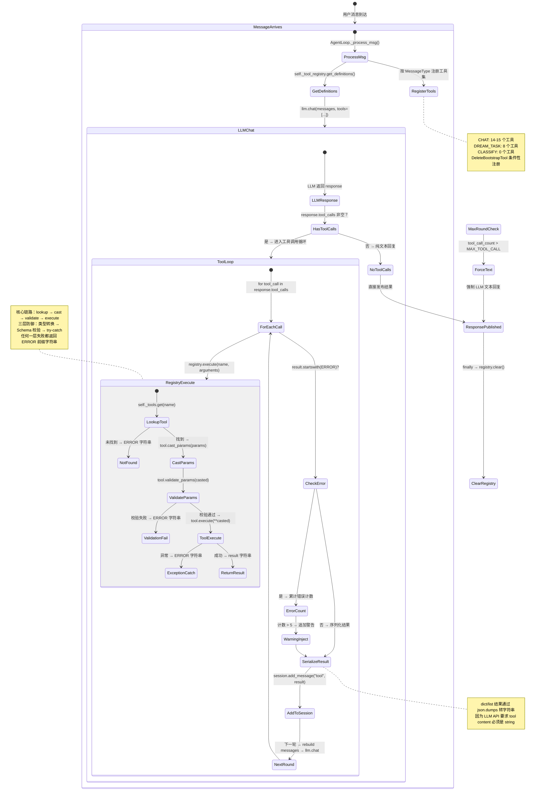

## 版本

| 版本 | 更新内容 |
| ---- | -------- |
| 1.0 | 初始版本 |

# 数据流：ToolExecutionTrace

**Flow 对象**：ToolExecutionTrace — 一次工具调用的完整追踪，从 LLM 传入参数到结果返回
**对应 Spec**：[llm-agent-spec](../specs/2026-07-06-llm-agent-spec.md)

## ToolExecutionTrace 数据结构

```python
@dataclass
class ToolExecutionTrace:
    # === 工具标识 ===
    tool_name: str                    # 工具名称，与 Tool.name 属性对应

    # === 参数处理 ===
    raw_params: dict                  # LLM 传入的原始参数（均为字符串或基础类型）
    casted_params: dict               # 经过 cast_params 类型转换后的参数

    # === 参数验证 ===
    validation_errors: list[str]      # validate_params 返回的错误列表，空列表 = 校验通过

    # === 安全检查（仅文件系统工具） ===
    security_check: dict              # {passed: bool, detail: str}
                                      # passed=False 时 detail 为拒绝原因

    # === 执行结果 ===
    result: str                       # 工具执行结果字符串（成功以 "Success: " 开头，错误以 "Error: " 开头）
    is_error: bool                    # 结果是否为错误（result 以 "Error: " 开头）
    execution_time_ms: float          # 工具执行耗时（毫秒）
```

**关键字段说明**：
- `raw_params` 与 `casted_params`：LLM 返回的 JSON 参数值都是字符串（如 `{"limit": "10"}`），`cast_params` 将语义正确的类型转为 Python 原生类型（`int(10)`）。转换失败时保留原始值，由后续 `validate_params` 报告类型错误。这是两层防护中的第一层。
- `security_check`：仅文件系统工具（`_FileTool` 子类）产生此字段。白名单为空时直接放行（无沙箱模式）。白名单非空时通过 `Path.resolve()` + `relative_to()` 逐条比对。Shell 版工具额外执行 `_check_command_safety()` 黑名单检测。
- `is_error`：由 `_run_agent_loop()` 通过 `result.startswith(ERROR)` 判断（`ERROR = "Error: "`）。连续错误超过 5 次触发警告注入，引导 LLM 放弃该工具。注意：`tool.execute()` 内部的 `{ERROR}` 前缀也会被 `ToolRegistry.execute()` 识别并追加提示。

## 与其他数据流的耦合

### ToolExecutionTrace AgentMessageFlow

**AgentMessageFlow 状态字段**：`system_prompt_built` `tools_registered` `llm_calling` `tools_executing` `response_published`

**耦合关系**：

| ToolExecutionTrace 状态变化 | AgentMessageFlow 影响 | 触发位置 |
|---|---|---|
| 工具注册完成 → get_definitions() 生成 schema | tools_registered → llm_calling：tools 参数传递给 llm.chat() | `loop.AgentLoop._process_msg:441` |
| LLM 返回 tool_calls → registry.execute() 被调用 | llm_calling → tools_executing：进入 while 循环逐轮执行工具 | `loop.AgentLoop._run_agent_loop:136` |
| 工具结果写入 session → add_message("tool", ...) | 影响后续 `build_prompt` 重建 messages：工具结果作为上下文参与下一轮 LLM 推理 | `loop.AgentLoop._run_agent_loop:174` |
| 工具注册表清空（finally 块） | tools_executing → response_published：确保下一条消息不会泄漏工具 | `loop.AgentLoop._process_msg:489` |

**说明**：ToolExecutionTrace 是 AgentMessageFlow 中 `tools_executing` 状态的子粒度追踪。一次 Agent 消息处理可能触发多轮工具调用（最多 MAX_TOOL_CALL=20 轮），每轮可能包含多个并行工具调用（LLM 一次返回多个 tool_calls）。ToolExecutionTrace 记录的是单个工具的调用过程，而 `tool_call_chain`（`_run_agent_loop` 的返回值）记录的是所有轮次的聚合。

<key_function>
- lifeprism/llm/agent/loop.py
  - loop.AgentLoop._process_msg:407
  - loop.AgentLoop._run_agent_loop:68
- lifeprism/llm/agent/tools/registry.py
  - registry.ToolRegistry.register:22
  - registry.ToolRegistry.get_definitions:42
  - registry.ToolRegistry.execute:46
- lifeprism/llm/agent/tools/base.py
  - base.Tool.name:48
  - base.Tool.description:54
  - base.Tool.parameters:60
  - base.Tool.execute:149
  - base.Tool.cast_params:161
  - base.Tool.validate_params:235
  - base.Tool.to_schema:291
</key_function>

## 流程概览



## 数据流节点

**业务场景说明**：系统中有四条核心链路——

- **链路 1**：工具注册 — 从 AgentLoop 按消息类型选择工具集，经过 ToolRegistry 注册，最终通过 `get_definitions()` 生成 OpenAI function schema 传递给 LLM。
- **链路 2**：工具执行通用路径 — LLM 返回 tool_calls 后，ToolRegistry.execute() 协调 lookup → cast_params → validate_params → execute 的完整流程。
- **链路 3**：文件系统安全沙箱 — `_FileTool` 基类的 `_check_workspace_permission()` 白名单机制和 Shell 版额外的 `_check_command_safety()` 黑名单检测。
- **链路 4**：工具结果序列化与反馈 — 工具结果经过类型序列化、session 存储、错误计数、messages 重建后重新进入 LLM 推理。

以下以 **ReadFileTool**（文件系统工具，读文件）和 **UserActivitySummaryTool**（系统数据工具，查询活动数据）作为两条典型穿透路径，展示工具执行的完整链路。

---

### 链路 1：工具注册 — 从 MessageType 到 OpenAI Schema

**场景**：用户发送一条 CHAT 类型消息，AgentLoop 需要为 LLM 提供可用的工具列表。注册流程按 MessageType 分支，CHAT 类型注册 14-15 个工具，DREAM_TASK 注册 8 个，CLASSIFY 注册 0 个。

1. AgentLoop._process_msg()
   消息处理编排器，按 MessageType 分支注册不同的工具集。
   状态: ToolExecutionTrace 尚未创建（注册阶段不涉及具体工具调用） | 持久化: ❌ | 跨模块: ❌
   步骤: 检测命令消息（cmd 直接返回）→ 构建 system prompt → 按 MessageType 注册工具 → get_definitions() → auto_compact → 调用 LLM
   分支:
   - `MessageType.CHAT`：注册 14 个固定工具（ActivitySummary / ComputerLog / BehaviorNote / MoodQuery / MoodCreate / ReadFile / WriteFile / EditFile / FileTree / SearchFile / SearchString / SessionList / SessionHistory）+ 条件性注册 DeleteBootstrapTool（仅当 `bootstrap.md` 存在时）
   - `MessageType.DREAM_TASK`：注册 8 个工具（前 5 个数据工具 + 6 个文件系统工具中的前 5 个，不含 Session 查询和 Bootstrap）
   - `MessageType.CLASSIFY`：不注册任何工具

2. ToolRegistry.register()
   将工具实例以 `tool.name` 为 key 存入内部 `_tools` dict。
   状态: 工具实例存入 `_tools` dict | 持久化: ❌ | 跨模块: ❌
   步骤: `self._tools[tool.name] = tool` → 如果同名已存在则覆盖（无冲突检测）

3. ToolRegistry.get_definitions()
   遍历所有已注册工具，调用每个工具的 `to_schema()` 方法生成 OpenAI function schema 列表。
   状态: 生成 `list[dict]` 传给 LLM 的 `tools` 参数 | 持久化: ❌ | 跨模块: ✅ Agent → LLM Provider
   步骤: `[tool.to_schema() for tool in self._tools.values()]`

4. Tool.to_schema()
   将工具的 name、description、parameters 组装为 OpenAI 格式。
   状态: 生成 `{"type": "function", "function": {"name": ..., "description": ..., "parameters": ...}}` | 持久化: ❌ | 跨模块: ❌
   步骤: 直接返回固定结构的 dict，无需额外转换

5. finally 清空注册表
   无论消息处理成功或失败，finally 块中调用 `ToolRegistry.clear()` 清空所有已注册工具。
   状态: `_tools` dict 被清空 | 持久化: ❌ | 跨模块: ❌
   步骤: `self._tools.clear()` → 下一条消息重新按 MessageType 注册

<key_function>
- lifeprism/llm/agent/loop.py
  - loop.AgentLoop._process_msg:407
- lifeprism/llm/agent/tools/registry.py
  - registry.ToolRegistry.register:22
  - registry.ToolRegistry.get_definitions:42
  - registry.ToolRegistry.clear:30
- lifeprism/llm/agent/tools/base.py
  - base.Tool.to_schema:291
</key_function>

---

### 链路 2：工具执行通用路径 — ToolRegistry.execute()

**场景**：LLM 返回 tool_calls（如 `{"name": "read_file", "arguments": {"file_path": "user/user.md", "offset": 1, "limit": 50}}`），`_run_agent_loop()` 逐条调用 `ToolRegistry.execute()`。本链路以 ReadFileTool 和 UserActivitySummaryTool 为典型路径展示。

#### 路径 2a：ReadFileTool — 文件读取工具执行

6. AgentLoop._run_agent_loop() — 工具调用循环入口
   LLM 返回的 tool_calls 被逐条处理，每条调用 registry.execute()。
   状态: `tool_call_chain` 追加当前轮次 | 持久化: ❌ | 跨模块: ✅ Agent → Tool
   步骤: 遍历 `response.tool_calls` → `registry.execute(tool_call.name, tool_call.arguments)` → 记录结果 → 判断 is_error → 累计错误计数

7. ToolRegistry.execute("read_file", {"file_path": "user/user.md", "offset": 1, "limit": 50})
   执行的三阶段流程：lookup → cast → validate → execute。
   状态: ToolExecutionTrace 逐步填充 | 持久化: ❌ | 跨模块: ❌
   步骤:
   - **lookup**：`self._tools.get("read_file")` → 找到 ReadFileTool 实例 → 未找到返回 `ERROR: Tool 'xxx' not found`
   - **cast**：`tool.cast_params(params)` → 按 schema 做安全类型转换
   - **validate**：`tool.validate_params(params)` → JSON Schema 校验
   - **execute**：`await tool.execute(**casted_params)` → 执行工具逻辑

8. Tool.cast_params() — 类型转换
   在 validate 之前将 LLM 传来的字符串参数转为 Python 原生类型。
   状态: raw_params → casted_params | 持久化: ❌ | 跨模块: ❌
   步骤:
   - 读取 `self.parameters` schema → 调用 `_cast_object(params, schema)` 递归处理
   - `offset`(schema type="integer", 原始值 1) → 已经是 int，跳过
   - `limit`(schema type=["integer","null"], 原始值 50) → 已经是 int，跳过
   - `file_path`(schema type="string", 原始值 "user/user.md") → 已经是 str，跳过
   - 关键转换规则：`str("10")` → `int(10)`（integer）、`str("3.14")` → `float(3.14)`（number）、`str("true")` / `str("1")` / `str("yes")` → `True`（boolean）、`str("false")` / `str("0")` / `str("no")` → `False`
   - 递归：array 元素逐个 `_cast_value` + object 递归 `_cast_object`

9. Tool.validate_params() — JSON Schema 校验
   按 JSON Schema 逐字段校验参数，返回错误列表（空列表 = 通过）。
   校验覆盖维度:
   - **类型检查**：integer / number / boolean / string / array / object 精确匹配（bool 不会被误判为 int）
   - **可空类型**：`"type": ["string", "null"]` 时 null 值直接放行
   - **枚举约束**：值必须在 `enum` 列表中
   - **数值范围**：`minimum` / `maximum`
   - **字符串长度**：`minLength` / `maxLength`
   - **必填字段**：顶层 schema 的 `required` 数组 + 嵌套 object 的 required
   - **嵌套对象**：object 内每个存在字段递归校验（通过 `properties` 映射查找子 schema）
   - **数组元素**：array 的每个元素递归校验（通过 `items` 子 schema）
   分支: 校验失败 → ToolRegistry.execute() 返回 `ERROR: Invalid parameters for tool 'read_file': ...` 并附带所有错误详情

10. ReadFileTool.execute(file_path="user/user.md", offset=1, limit=50, only_frontmatter=False)
    工具逻辑入口：权限检查 → 调用底层 `_read_file()` → 格式化为 JSON 返回。
    状态: security_check + result 填充 | 持久化: ❌ | 跨模块: ❌
    步骤:
    - 参数提取（使用默认值：offset 默认 1，limit 默认 None，only_frontmatter 默认 False）
    - **安全沙箱**：`_check_workspace_permission(file_path)` → 详见链路 3
    - offset 转为 0-based start_line：`start_line = offset - 1`
    - 调用 `_read_file(file_path, start_line, end_line, only_frontmatter)` 读取文件
    - 将返回 dict 通过 `json.dumps` 序列化，前缀 `SUCCESS`
    - 异常捕获：无异常则正常返回，有异常则由 `ToolRegistry.execute()` 的 try-except 兜底

#### 路径 2b：UserActivitySummaryTool — 系统数据查询工具执行

11. ToolRegistry.execute("query_user_activity_summary", {"query_option": ["computer_overview"], "start_time": "2026-07-06 00:00:00", "end_time": "2026-07-06 23:59:59"})
    与前一步相同的三阶段流程，但该工具不涉及文件系统安全沙箱。
    步骤:
    - **lookup** → 找到 UserActivitySummaryTool 实例
    - **cast_params**：`query_option`(array, 元素类型 string) → 直接使用，无需转换。`start_time` / `end_time`(string) → 保持字符串
    - **validate_params**：校验 `query_option` 非空（minItems=1）、每个元素在 enum 中、`start_time` 和 `end_time` 存在且为字符串
    - **execute**：调用 `query_user_activity_summary(query_option, start_time, end_time)` → 按选项查询 Repository → 格式化返回字符串

12. UserActivitySummaryTool.execute() — 业务逻辑转发
    参数校验通过后直接转发给模块级函数 `query_user_activity_summary()`。
    状态: 持久化: ❌（内部 Repository 调用有数据读取但不写入） | 跨模块: ✅ Tool → Repository
    步骤: 提取 query_option / start_time / end_time → 调用 `query_user_activity_summary(set(query_option), start_time, end_time)` → 内部按选项分支：high_usage_segments（调用 `computer_usage_repository` + `build_time_segments`）+ computer_overview（分类统计）+ user_behavior_notes（`custom_block_repository`）+ ai_behavior_notes（`behavior_analysis_repository`）+ todolist（`todo_repository`）→ 合并为 Markdown 格式字符串返回

13. ToolRegistry.execute() 异常捕获与 ERROR 返回
    无论哪个阶段的错误，均被捕获并返回 ERROR 前缀字符串。
    状态: is_error = True | 持久化: ❌ | 跨模块: ❌
    步骤:
    - tool.execute(**kwargs) 抛出任何 Exception → `catch Exception as e` → 返回 `f"{ERROR} executing {name}: {str(e)}"` + `_HINT`（引导 LLM 尝试其他方式）
    - 工具返回的结果以 `"{ERROR}"` 开头 → 追加 `_HINT` 后返回
    - `_HINT = "\n\n[Analyze the error above and try a different approach.]"` — 此提示追加到每个错误结果末尾，引导 LLM 调整策略

<key_function>
- lifeprism/llm/agent/loop.py
  - loop.AgentLoop._run_agent_loop:68
- lifeprism/llm/agent/tools/registry.py
  - registry.ToolRegistry.execute:46
- lifeprism/llm/agent/tools/base.py
  - base.Tool.cast_params:161
  - base.Tool._cast_object:169
  - base.Tool._cast_value:185
  - base.Tool.validate_params:235
  - base.Tool._validate:244
- lifeprism/llm/agent/tools/filesystem.py
  - filesystem.ReadFileTool.execute:102
- lifeprism/llm/agent/tools/lifeprismsystem.py
  - lifeprismsystem.UserActivitySummaryTool.execute:101
  - lifeprismsystem.query_user_activity_summary:166
</key_function>

---

### 链路 3：文件系统安全沙箱

**场景**：文件系统工具（`_FileTool` 子类）在执行任何文件操作前必须通过安全沙箱校验。纯 Python 版使用白名单路径比对，Shell 版额外增加命令黑名单检测。

#### 路径 3a：白名单路径校验 — `_FileTool._check_workspace_permission()`

14. _FileTool.__init__()
    从 settings 获取白名单目录列表。
    状态: `self.allowed_dir_path` 初始化 | 持久化: ❌ | 跨模块: ✅ Tool → Config
    步骤: `self.allowed_dir_path: list[Path] = settings.allowed_dir_path` → 来源为 `settings._allowed_dir_path`，由 `ALLOWED_DIRS` 常量（`["user", "agent", "dataset", "workflow", "plan", "external_files"]`）与 `lifeprism_data_path` 拼接后 resolve 得到

15. _FileTool._check_workspace_permission(file_path)
    核心白名单比对逻辑。所有文件系统工具（ReadFile / WriteFile / EditFile / FileTree / SearchFile / SearchString）在执行前调用此方法。
    状态: security_check = {passed: True/False, detail: ""} | 持久化: ❌ | 跨模块: ❌

    算法步骤:
    1. **白名单为空** → 直接返回 `(True, "")`（无沙箱模式，开发/调试场景）
    2. **解析绝对路径** → `Path(file_path).resolve()` 将相对路径或含 `../` 的路径转为绝对路径
    3. **逐条比对白名单** → for 循环遍历 `self.allowed_dir_path`：
       - `file_path_obj.relative_to(allowed_dir)` → 如果 file_path 是 allowed_dir 的子路径则成功
       - `except ValueError` → 不在此白名单内，继续下一条
    4. **全部未匹配** → 返回 `(False, "没有权限访问该文件: {file_path}，允许的工作目录为: {[...]}")`

    **安全特性**：
    - `Path.resolve()` 解析符号链接和 `..`，防止路径穿越攻击（如 `../../../etc/passwd` 解析后会被发现不在白名单内）
    - 白名单而非黑名单：只允许预定义的目录集合，默认拒绝所有其他路径
    - 在 `_FileTool` 基类中实现，所有子类自动继承，新增文件系统工具不会遗漏安全检查

    **典型场景**（以 ReadFileTool 为例）：
    - `file_path = "user/user.md"` → `Path.resolve()` → `D:\...\lifeprismData\user\user.md` → `relative_to(Path("D:\...\lifeprismData\user"))` → 成功通过
    - `file_path = "../config/config.yaml"` → `Path.resolve()` → `D:\...\lifeprismData\config\config.yaml` → 不在白名单任何目录下 → 被拒绝

#### 路径 3b：Shell 版命令黑名单 — `_check_command_safety()`

Shell 版文件系统工具（`filesystem_shell_version.py`）在执行 PowerShell 命令前额外通过 `_check_command_safety()` 检测。

16. _check_command_safety(command)
    对构造的 Shell 命令字符串进行正则黑名单匹配。
    状态: 仅 Shell 版工具产生此检查 | 持久化: ❌ | 跨模块: ❌

    黑名单覆盖类别（DANGEROUS_COMMANDS，25+ 模式）:
    - **删除命令**：`rm` / `rmdir` / `del` / `erase` / `rd` / `Remove-Item` / `Remove-ItemProperty` / `Clear-RecycleBin`
    - **格式化磁盘**：`format [drive letter]:` / `Format-Volume`
    - **系统关键操作**：`shutdown` / `reboot` / `Stop-Computer` / `Restart-Computer`
    - **权限提升**：`sudo` / `runas` / `Start-Process ... -Verb RunAs`
    - **外发数据**：`curl ... https?://` / `wget ... https?://` / `Invoke-WebRequest ... https?://` / `Invoke-RestMethod ... https?://`
    - **进程操作**：`kill` / `taskkill` / `Stop-Process`
    - **注册表操作**：`reg ... delete` / `reg ... add` / `Remove-ItemProperty ... HKLM` / `Remove-ItemProperty ... HKCU`
    - **磁盘操作**：`diskpart` / `Clear-Disk` / `Initialize-Disk`
    - **危险 PowerShell 命令**：`Invoke-Expression` / `Invoke-Command` / `iex` / `icm`
    - **文件覆盖**：`> nul` / `2>&1` / `/dev/null`

    步骤: 遍历 DANGEROUS_COMMANDS → 对每个 pattern 执行 `re.search(pattern, command, re.IGNORECASE)` → 匹配到则记录 WARNING 日志并返回 `(False, "检测到高危命令模式: {matched}，已阻止执行")` → 全部未匹配返回 `(True, "")`

    **已知安全问题**（代码中已标注）:
    - 黑名单可被绕过：PowerShell 别名、字符串拼接、编码、变量引用
    - 正则存在 ReDoS 风险（部分 pattern 使用 `.*`）
    - 转义不完整：仅转义了单双引号，未处理反引号、美元符、分号、管道等特殊字符
    - 当前仅作为辅助防护，不应作为唯一安全措施

<key_function>
- lifeprism/llm/agent/tools/filesystem.py
  - filesystem._FileTool.__init__:18
  - filesystem._FileTool._check_workspace_permission:22
- lifeprism/llm/agent/tools/filesystem_shell_version.py
  - filesystem_shell_version._check_command_safety:75
</key_function>

---

### 链路 4：工具结果序列化与反馈 — 从 Tool 输出到 LLM 再推理

**场景**：工具执行完毕后，结果需要序列化为字符串、存入 Session、可能触发错误警告，然后重建 messages 再次调用 LLM。

17. AgentLoop._run_agent_loop() — 结果后处理
    工具结果返回后的完整处理流程。
    状态: session 消息追加 + tool_call_chain 更新 | 持久化: ✅（通过 session.add_message 追加到内存，后续 save_session 持久化到 JSONL） | 跨模块: ✅ Tool → Session → LLM

    步骤:
    - **is_error 判断**：`result.startswith(ERROR)` → 确定是否计入错误计数
    - **错误计数与警告注入**：统计每个工具名的连续错误次数，超过 MAX_TOOL_ERROR_COUNT(5) 时在结果末尾追加警告信息
    - **dict/list 序列化**：`isinstance(result, (dict, list))` → `json.dumps(result, ensure_ascii=False)` 转为 JSON 字符串（因为 LLM API 要求 tool 消息的 content 必须是 string）
    - **写入 Session**：`session.add_message("tool", result_content, tool_call_id=tool_call.id)`
    - **重建 messages**：`Context.build_prompt(system_prompt, session.get_history_message())` 获取包含最新工具结果的完整上下文
    - **再次调用 LLM**：`await llm.chat(messages=messages, tools=tools)` — 带着工具结果进行下一轮推理

    **错误警告注入示例**：
    ```
    工具 read_file 返回：Error: 文件 xxx 不存在
    → tool_error["read_file"] = 6
    → 结果末尾追加："，已连续调用6次，超过最大错误次数5，请立即放弃该工具调用，尝试切换其他工具。若无可替代工具，向用户说明情况"
    ```

18. MAX_TOOL_CALL 兜底
    达到最大轮数（20）但 LLM 仍有 tool_calls 时的处理。
    状态: 强制生成纯文本回复 | 持久化: ✅ | 跨模块: ✅ Agent → LLM
    步骤: 注入 system 消息 → "已达到最大工具调用次数 20，请直接向用户说明当前情况，让用户判断是否继续工作。" → 再次 `llm.chat(messages)`（不带 tools）→ 强制 LLM 生成文本回复

    **分支**：最后一轮 LLM 有 reasoning_content（思维链）但无 tool_calls → 仍追加到 `tool_call_chain`（round=最终轮，tool_calls=[]）

19. 最终发布
    工具调用循环结束后，结果通过 Event Bus 发布。
    状态: response_published | 持久化: ❌（session 已在循环中保存） | 跨模块: ✅ AgentLoop → Event Bus
    步骤: 构建 `OutboundMessage(id=msg.id, response=result, session_id=session.id, extra={tool_call_chain})` → `bus.publish_outbound(out_msg)` → 同时异步保存 token 统计到数据库

<key_function>
- lifeprism/llm/agent/loop.py
  - loop.AgentLoop._run_agent_loop:68
</key_function>

---

## 异常与清理

### 工具执行异常捕获层级

工具执行过程中有三层异常防护，确保任何错误都不会导致 AgentLoop 崩溃：

20. Tool.execute() 内部异常
    工具自身逻辑中的异常，在 Tool 的 execute() 方法内通过 try-except 捕获并转为 `ERROR` 前缀字符串。
    状态: result 以 `ERROR` 开头 | 持久化: ❌ | 跨模块: ❌
    示例: ReadFileTool 的 execute() 内部 `except Exception` → 返回 `f"{ERROR}读取文件时出错: {str(e)}"`（注意：Tool 内部返回 ERROR 字符串后，ToolRegistry.execute() 会检测并以 `{ERROR}` 前缀再次追加 `_HINT`）
    分支: Tool 内部没有 try-except 的异常（如 UserActivitySummaryTool 本身的 execute() 内无全局 catch）→ 由 ToolRegistry.execute() 兜底

21. ToolRegistry.execute() 兜底捕获
    无论 Tool 内部是否处理，ToolRegistry.execute() 都有 `except Exception as e` 全局兜底。
    状态: is_error = True | 持久化: ❌ | 跨模块: ❌
    步骤: 捕获异常 → 返回 `f"{ERROR} executing {name}: {str(e)}"` + `_HINT`
    注意: Tool 内部已返回 ERROR 字符串的不会被此层捕获（正常返回不是异常）

22. AgentLoop._run_agent_loop() 中的警告注入
    错误计数逻辑：即使在循环层面也不中断，而是追加警告信息。
    状态: 工具结果末尾追加警告文本 | 持久化: ❌ | 跨模块: ❌
    步骤: 连续错误 > 5 次 → `result += f"，已连续调用{count}次..."` → LLM 在下一轮推理中看到此警告

### ToolRegistry 清空（finally 块）

23. AgentLoop._process_msg() 中的 finally 块
    无论消息处理成功或异常，finally 块确保 ToolRegistry 被清空。
    状态: `_tools` dict 被清空 | 持久化: ❌ | 跨模块: ❌
    步骤: `self._tool_registry.clear()` → 避免工具累积和不同 MessageType 的工具混用

24. AgentLoop._process_msg() 的全局异常捕获
    最外层 `except Exception` 兜底，发布 `[ERROR]` 消息到 Event Bus 并记录完整 traceback。
    状态: 错误通过 OutboundMessage 发布 | 持久化: ❌ | 跨模块: ✅ AgentLoop → Event Bus
    步骤: `logger.error("[AgentLoop] ...", exc_info=True)` → `bus.publish_outbound(OutboundMessage(id=msg.id, response=LLMResponse(content=f"[ERROR] {e}")))`

**异常层级总结**：
```
Tool.execute() 内部 try-except (Layer 1)
    ↓ 未捕获则 →
ToolRegistry.execute() try-except (Layer 2)
    ↓ 未捕获则? 实际上此层 catch Exception，不会漏
    ↓
AgentLoop._run_agent_loop() 无 try-except，因为 registry.execute() 已兜底
    ↓
AgentLoop._process_msg() except ValueError: re-raise / except Exception: catch (Layer 3)
```

<key_function>
- lifeprism/llm/agent/tools/registry.py
  - registry.ToolRegistry.execute:46
- lifeprism/llm/agent/loop.py
  - loop.AgentLoop._process_msg:407
  - loop.AgentLoop._run_agent_loop:68
</key_function>

## 反常设计说明

### Tool.execute() 内部返回 ERROR 字符串后 ToolRegistry 再次追加 _HINT

**设计意图**：Tool.execute() 应只返回业务结果，错误格式由框架层统一处理。

**当前实现**：部分 Tool（如 ReadFileTool）在 execute() 内部通过 try-except 捕获异常并返回 `f"{ERROR}错误描述"`。ToolRegistry.execute() 随后检测到结果以 `{ERROR}` 开头，再次追加 `_HINT`。这意味着错误结果被双重包装：「Makefile 内部已包装为 `Error: xxx`，registry 层又检测到 `{ERROR}` 后追加 `[Analyze the error above...]`」。

**为什么是反常的**：两层错误包装导致冗余，且 Tool 开发者需要了解框架层已有 _HINT 机制。如果 Tool 内部不捕获（如 UserActivitySummaryTool 内部的 ValueError handle 又向上抛出），则由 `except Exception` 在 registry 层统一包装，反而更一致。

**影响范围**：ReadFileTool、WriteFileTool、EditFileTool、FileTreeTool、SearchFileTool、SearchStringTool 均存在此模式。UserActivitySummaryTool 等 lifeprismsystem 工具则靠 registry 兜底。

**相关位置**：`base.py:12`（ERROR="Error: "）、`registry.py:65-66`（检测 `{ERROR}` 并追加 _HINT）、`filesystem.py:141`（ReadFileTool.execute 内部返回 `f"{ERROR}{result['error']}"`）

### cast_params 类型转换失败时静默保留原始值

**设计意图**：类型转换失败时应立即报告错误，让问题在早期暴露。

**当前实现**：`_cast_value()` 在转换失败时返回原始值（如 `int("abc")` 抛出 ValueError → 返回原字符串 "abc"）。校验阶段由 `validate_params()` 捕获类型错误。这遵循 "先尽力转换，转换不了再报错" 的宽容策略。

**为什么是反常的**：两阶段设计（cast 静默失败 + validate 报告错误）导致错误信息不够精确 —— validate 只报告 "应为 integer"，不会说明 "LLM 传入了 'abc' 但我们期望 integer"。对于调试 LLM 行为，知道 LLM 传入的原始错误值可能比单纯说类型不符更有帮助。

**影响范围**：所有工具的类型转换均受影响。当前 LLM 返回的参数通常类型正确，因此实际影响较小。

**相关位置**：`base.py:185-233`（_cast_value 的转换逻辑）、`base.py:244-289`（_validate 的类型校验）

### _check_command_safety 黑名单机制已知可绕过

**设计意图**：提供命令注入防护。

**当前实现**：使用正则黑名单检测高危命令，代码顶部有大段注释明确标注了已知绕过风险（别名、拼接、编码、变量引用等）。Shell 版工具在执行前调用此函数，但代码中注释明确指出"仅作为辅助防护，不应作为唯一的安全措施"。

**为什么是反常的**：安全机制在设计时就已知不安全，这是典型的"有比没有好"的权衡。当前桌面单用户场景风险可控，但如果日后用于多用户或服务端场景，需要替换为 create_subprocess_exec 参数化执行或纯 Python 原生实现。

**影响范围**：仅 Shell 版工具（`filesystem_shell_version.py`）受影响。`loop.py` 当前导入的是纯 Python 版工具，但 Shell 版工具可能在其他地方被使用。

**相关位置**：`filesystem_shell_version.py:13-72`（DANGEROUS_COMMANDS 列表 + 安全警告注释）、`filesystem_shell_version.py:75-104`（_check_command_safety 实现）

### cast_params 的 boolean 判断在 integer 之前执行

**设计意图**：类型检查应该先判断具体类型，再判断兼容类型。

**当前实现**：在 `_cast_value()` 中，boolean 判断（`if target_type == "boolean" and isinstance(val, bool)`）在 integer 判断（`if target_type == "integer" and isinstance(val, int) and not isinstance(val, bool)`）之前执行。这是正确的顺序 —— 因为 Python 中 `bool` 是 `int` 的子类，`isinstance(True, int)` 返回 True。`validate_params()` 中的 `_validate()` 也正确处理了这个问题（`isinstance(val, bool)` 排除）。

**为什么记录**：这不是反常，而是必要的防御性设计。Python 的类型系统陷阱（bool is int）如果不处理，会导致 True 被当作 1（integer）、False 被当作 0（integer），在 JSON Schema 校验中产生隐蔽的类型混乱。两个方法都正确地处理了此问题，但值得在文档中显式记录以帮助理解代码。

**影响范围**：`base.py:189-192`（_cast_value）、`base.py:252-260`（_validate）

**相关位置**：`base.py:189-192`、`base.py:252-260`

## 相关文档

### Spec 文档
- **[llm-agent-spec](../specs/2026-07-06-llm-agent-spec.md)**：Agent 执行引擎核心契约，Tool 系统部分定义了 Tool 基类抽象接口（name/description/parameters/execute/cast_params/validate_params/to_schema）、ToolRegistry 生命周期、文件系统安全沙箱设计、参数校验覆盖维度

### 架构文档
- **[ARCHITECTURE.md](../ARCHITECTURE.md)**：项目顶层架构地图，说明 llm/agent 模块在整体系统中的位置及与其他模块的依赖关系

### ADR
- 暂无直接关联的 ADR。双版本文件系统工具（纯 Python vs Shell）的设计决策、ToolRegistry 在每条消息处理后清空的设计、工具结果 dict/list 自动转 JSON 的位置选择等决策已在 Spec 的 Design Rationale 中记录。
