## 版本

| 版本 | 更新内容 |
| ---- | -------- |
| 1.0 | 初始版本 |

# 数据流：WechatMessageTrace

**Flow 对象**：WechatMessageTrace
**对应 Spec**：[llm-communication-spec](../specs/2026-07-06-llm-communication-spec.md)

## WechatMessageTrace 数据结构

```python
@dataclass
class WechatMessageTrace:
    """一条微信消息从接收到回复的完整追踪"""

    # === 来源数据 ===
    raw_update: dict                       # 微信 API 原始 update 数据（getupdates 返回的单条 msg）
    from_user_id: str                      # 发送者微信 ID（parse_message 提取）
    message_type: str                      # 消息类型：ITEM_TEXT | IMAGE | VOICE | FILE | VIDEO

    # === 消息内容 ===
    content: str                           # 归一化后的文本内容（多段文本拼接而成）
    context_token: str                     # 微信上下文 token（维持对话连续性）

    # === 媒体处理 ===
    media_files: list[Path]               # 下载到本地的媒体文件路径列表（download_media 产物）
    is_allowed: bool                       # 权限检查结果（is_allowed 白名单判定）

    # === Bus 交互 ===
    inbound_msg: InboundMessage            # 发送到 MessageQueue 的入站消息
    outbound_msg: OutboundMessage          # Agent 返回的出站消息（含 LLMResponse）

    # === 回复发送 ===
    sent_success: bool                     # sendmessage 是否成功发送回复
```

**关键字段说明**：
- `context_token`：微信 iLink Bot API 的会话上下文标识，必须在回复时原样带回以维持微信端的对话上下文。由 `parse_message` 从原始消息中提取，保存到 `_user_data` 的内存字典中，并在 `send()` 时通过 `build_text_message` 附带
- `from_user_id`：消息发送者的微信唯一 ID，是整个用户数据体系的主键。用于权限检查、context_token 查询、session_id 关联
- `media_files`：下载并解密后的媒体文件本地路径列表，作为 `InboundMessage.extra["media"]` 传递给 AgentLoop，供 VLM 分析使用
- `inbound_msg.session_id`：start() 时为 None（让 AgentLoop 自动创建），后续消息从 `_user_data["last_session_id"]` 恢复，回复后由 `outbound_msg.session_id` 更新

## 与其他数据流的耦合

### WechatMessageTrace <-> InboundMessage/OutboundMessage

**InboundMessage/OutboundMessage 状态字段**：`id`（消息标识）、`session_id`（会话关联）、`extra.wechat_user_id`（回复路由）、`extra.media`（媒体路径）

**耦合关系**：

| WechatMessageTrace 状态变化 | InboundMessage/OutboundMessage 影响 | 触发位置 |
|---|---|---|---|
| parse_message 解析完成 | InboundMessage 构建：content + channel=WECHAT + type=CHAT | WechatChannel._handle_wechat_message:310-319 |
| bus.send() 返回 | OutboundMessage 返回：response + session_id + usage | MessageQueue.send:105 |
| session_id 更新 | 下次 InboundMessage 携带最新 session_id 实现对话延续 | WechatChannel._handle_wechat_message:341-348 |
| response.extra 注入 wechat_user_id | send() 路由到正确的微信用户 | WechatChannel._handle_wechat_message:363-365 |

**说明**：WechatMessageTrace 是 InboundMessage 的上游生产者（Channel → Bus），也是 OutboundMessage 的下游消费者（Bus → Channel → 微信用户）。session_id 在两个方向上的传递实现了微信会话的持续性：入站时从 `_user_data` 读取上次 AgentLoop 返回的最新 session_id，出站后将其写回 `_user_data`。

### WechatMessageTrace <-> _user_data（用户数据内存字典）

**_user_data 状态字段**：`{wechat_user_id: {"context_token": str, "last_session_id": str | None}}`

**耦合关系**：

| WechatMessageTrace 状态变化 | _user_data 影响 | 触发位置 |
|---|---|---|---|
| context_token 提取 | 更新 `_user_data[id]["context_token"]` | _handle_wechat_message:289-294 |
| session_id 更新 | 更新 `_user_data[id]["last_session_id"]` | _handle_wechat_message:345-348 |
| account.json 持久化 | 将最新的 token + _user_data 写入文件 | auth.save_state:218 |
| stop() 兜底保存 | 停止时最后一次写入 token + _user_data | stop:153-159 |

**说明**：`_user_data` 是 Channel 内存中的用户数据缓存，以 wechat_user_id 为 key。每次消息处理后统一持久化到 `account.json`（避免多次写文件）。`context_token` 和 `last_session_id` 两个字段分别服务于微信端对话连续性和 LifeWatch 端 session 延续。

<key_function>
- lifeprism/llm/channel/wechat/channel.py
  - channel.WechatChannel.__init__:53
  - channel.WechatChannel.start:242
  - channel.WechatChannel.stop:305
  - channel.WechatChannel.send:329
  - channel.WechatChannel._poll_loop:370
  - channel.WechatChannel._handle_wechat_message:414
- lifeprism/llm/channel/wechat/auth.py
  - auth.WechatAuth.load_state:135
  - auth.WechatAuth.save_state:224
  - auth.WechatAuth.qr_login:252
  - auth.WechatAuth.delete_token:102
- lifeprism/llm/channel/wechat/client.py
  - client.WechatClient.__init__:29
  - client.WechatClient.api_get:80
  - client.WechatClient.api_post:102
- lifeprism/llm/channel/wechat/message.py
  - message.WechatMessage.parse_message:38
  - message.WechatMessage.build_text_message:71
- lifeprism/llm/channel/wechat/media.py
  - media.WechatMedia.download_media:59
- lifeprism/llm/bus/queue.py
  - queue.MessageQueue.send:105
- lifeprism/llm/channel/base.py
  - base.BaseChannel.is_allowed:64
</key_function>

## 流程概览

```mermaid
stateDiagram-v2
    [*] --> WechatChannel_start : Module import → LazySingleton 首次访问

    state WechatChannel_start {
        [*] --> InitClient : 初始化 WechatClient
        InitClient --> InitAuth : 初始化 WechatAuth
        InitAuth --> LoadState : load_state() 加载 token+user_data

        state LoadState {
            [*] --> KeyringCheck : keyring 有 token?
            KeyringCheck --> FileCheck : 无 → 读取 account.json
            KeyringCheck --> KeyringDone : 有 → 使用 keyring token
            FileCheck --> FileTokenCheck : 文件有 token?
            FileTokenCheck --> MigrateToken : 有 → 自动迁移到 keyring
            FileTokenCheck --> OldFormatCheck : 无 → 检查旧格式
            MigrateToken --> LoadUserData
            OldFormatCheck --> LoadUserData : 兼容 context_tokens → user_data
            KeyringDone --> LoadUserData
            LoadUserData --> [*] : 返回 state
        }

        LoadState --> TokenCheck : state 返回

        state TokenCheck {
            [*] --> HasToken : token 非空?
            HasToken --> YesToken : 是 → client.token = token
            HasToken --> NoToken : 否 → 放弃启动 (qr_login 已注释)
            YesToken --> TestToken : 测试 token (getupdates)
            NoToken --> [*] : _running = False, return
            TestToken --> TestResult : 测试结果?
            TestResult --> TestOK : 成功 → 仅 INFO 日志
            TestResult --> TestFail : 失败 → 仅 ERROR 日志
            TestOK --> [*]
            TestFail --> [*]
        }

        TokenCheck --> InitMedia : 初始化 WechatMedia
        InitMedia --> StartPoll : 启动 _poll_loop() 后台任务
    }

    WechatChannel_start --> PollLoop : _poll_loop 持续运行

    state PollLoop {
        [*] --> GetUpdates : api_post getupdates (长轮询)
        GetUpdates --> ParseResponse : 解析 get_updates_buf + msgs
        ParseResponse --> HasMessages : msgs 列表为空?
        HasMessages --> HandleMessage : 非空 → 逐条处理
        HasMessages --> UpdateBuf : 空 → 更新游标
        HandleMessage --> HandleMessage : 下一条
        HandleMessage --> UpdateBuf : 处理完毕
        UpdateBuf --> GetUpdates : 继续轮询
    }

    GetUpdates --> NetworkError : 网络/HTTP 错误
    NetworkError --> Sleep5s : sleep(5)
    Sleep5s --> GetUpdates : 重试
    ParseResponse --> ParseError : 数据解析错误
    ParseError --> Sleep5s : sleep(5)
    Sleep5s --> GetUpdates : 重试

    state HandleMessage {
        [*] --> ParseMsg : WechatMessage.parse_message()
        ParseMsg --> CheckPerm : is_allowed(from_user_id)
        CheckPerm --> NotAllowed : 未授权 → return
        CheckPerm --> SaveCT : 已授权 → 保存 context_token
        SaveCT --> HasMedia : 有媒体?
        HasMedia --> DownloadMedia : 是 → media.download_media()
        HasMedia --> BuildInbound : 否 → 跳过
        DownloadMedia --> BuildInbound
        BuildInbound --> BusSend : bus.send(inbound_msg)
        BusSend --> LogLLM : 记录 LLM 调用日志 (>500 token 过滤)
        LogLLM --> UpdateSessionId : 更新 session_id
        UpdateSessionId --> SaveState : 持久化 token + user_data
        SaveState --> SendReply : self.send(response)
        SendReply --> [*]
    }

    [*] --> WechatChannel_stop : 外部调用 stop()

    state WechatChannel_stop {
        [*] --> SaveState2 : auth.save_state(token + _user_data)
        SaveState2 --> CancelTask : 取消 poll_task
        CancelTask --> CloseClient : 关闭 HTTP 客户端
        CloseClient --> [*]
    }
```



**关键分支说明**：
- **start() Token 分支**：有 token → 继续启动 + 测试（测试失败不阻止启动）；无 token → 放弃启动（qr_login 代码被注释）
- **load_state() 双层读取**：keyring 优先 → 文件 fallback → 旧格式 context_tokens 自动迁移到新格式 user_data
- **is_allowed 分支**：allow_from 为 `["*"]` 时允许所有用户；allow_from 为 `[]` 时拒绝所有并 WARNING；否则精确匹配
- **_poll_loop 容错**：网络错误和解析错误分别 catch，均 sleep(5) 后重试，不退出循环
- **_handle_wechat_message 统一持久化**：context_token 变更和 session_id 变更后统一调用一次 save_state，避免多次写文件

## 数据流节点

**业务场景说明**：WechatChannel 是微信消息的唯一接入点。Channel 启动时完成认证与客户端初始化，之后通过长轮询持续拉取微信消息，每条消息经过解析、权限检查、媒体下载后发送到 MessageQueue，等待 AgentLoop 处理后发送回复。整个过程涉及 4 个子模块（auth/client/message/media）与 Bus 的协作。

### 链路 1：Channel 启动与认证

**1. WechatChannel.__init__(config, bus)**
   初始化路径和状态容器，设置 _running=False 和各模块为 None
   状态: wechat_dir/media_dir/state_file→Path, _user_data→{} | 持久化: ❌ | 跨模块: ✅ (settings→channel 路径解析)
   步骤: 调用 BaseChannel.__init__ 设置 config+bus → 从 settings.channel_path 推导 wechat_dir → 计算 media_dir 和 state_file 子路径 → 初始化各模块属性为 None

**2. WechatChannel.start() — 入口与幂等守卫**
   检查 _running 标志，已运行时直接返回，防止重复启动
   状态: _running=False→True | 持久化: ❌ | 跨模块: ❌
   步骤: 检查 _running → 已运行则 return → 设置 _running=True → 初始化客户端 → 初始化认证 → 加载状态

**3. WechatClient.__init__ + __aenter__ — 初始化 HTTP 客户端**
   创建 httpx.AsyncClient(timeout=60s)，建立到微信 API 的连接
   状态: client→WechatClient, client._client→httpx.AsyncClient | 持久化: ❌ | 跨模块: ❌
   步骤: 构造 WechatClient(base_url) → 调用 __aenter__ 创建 AsyncClient

**4. WechatAuth.__init__(client, state_file) — 初始化认证模块**
   绑定 HTTP 客户端和状态文件路径
   状态: auth→WechatAuth | 持久化: ❌ | 跨模块: ❌
   步骤: 保存 client 和 state_file 引用

**5. WechatAuth.load_state() — 加载认证状态（双层 + 迁移）**
   依次尝试 keyring 和文件加载 token，兼容旧格式数据自动迁移
   状态: state→{token, user_data} | 持久化: ✅ (旧格式迁移时写回文件) | 跨模块: ✅ (channel→keyring OS密钥链)
   步骤:
   - 分支A (keyring 优先): _load_token_from_keyring() 读取 → 成功则填充 state["token"]
   - 分支B (文件 fallback): account.json 存在 → 读取 file_token → 若 keyring 无 token 则执行自动迁移（保存到 keyring + 从文件清除 token）→ 若迁移失败则 fallback 到文件
   - 分支C (旧格式兼容): 文件含 context_tokens（旧格式 {user_id: token_str}）→ 迁移为 user_data（新格式 {user_id: {context_token, last_session_id}}）→ 写回新格式
   - 合流: 返回完整 state

**6. start() 内加载 user_data 与旧格式兼容**
   将 load_state 返回的 state 提取到内存字典
   状态: _user_data→{wechat_user_id: {context_token, last_session_id}} | 持久化: ❌ | 跨模块: ❌
   步骤: 读取 state["user_data"] → 检查旧格式 context_tokens → 若存在且 user_data 为空则执行内存中的格式迁移

**7. Token 分支判定 — 有 token 路径**
   将 token 设置到 client，继续启动
   状态: client.token→str | 持久化: ❌ | 跨模块: ❌
   步骤: token 非空 → self.client.token = token → 进入媒体初始化阶段

**8. Token 分支判定 — 无 token 路径（qr_login 已注释）**
   当前实现中 qr_login 代码被注释，无 token 时直接放弃启动
   状态: _running=True→False | 持久化: ❌ | 跨模块: ❌
   步骤: 记录 INFO 日志 → 设置 _running=False → return（不执行后续初始化）

**9. WechatMedia.__init__(client, media_dir) — 初始化媒体处理**
   创建媒体下载模块，确保 media_dir 目录存在
   状态: media→WechatMedia, media_dir 目录创建 | 持久化: ✅ (目录创建) | 跨模块: ❌
   步骤: 保存 client 引用 → mkdir parents=True exist_ok=True

**10. asyncio.create_task(self._poll_loop()) — 启动轮询后台任务**
    创建异步后台任务启动长轮询循环
    状态: _poll_task→asyncio.Task | 持久化: ❌ | 跨模块: ❌
    步骤: asyncio.create_task 创建协程任务 → 不 await（后台运行）

**QR 登录分支（WechatAuth.qr_login，当前被注释禁用）**：

**Q1. qr_login(timeout=300) — 获取二维码**
   调用 get_bot_qrcode API → 终端打印 ASCII QR 码 → 进入轮询
   状态: qrcode_id→str | 持久化: ❌ | 跨模块: ❌
   步骤: api_get "ilink/bot/get_bot_qrcode" (auth=False) → 提取 qrcode_id 和 qrcode_img → _print_qr_code 终端打印 → 进入状态轮询循环

**Q2. QR 状态轮询 — 3 种结果分支**
   每秒检查一次 get_qrcode_status 直到超时或完成
   状态: 无状态变化 / token 保存 | 持久化: ✅ (confirmed 时 save_state) | 跨模块: ✅ (channel→keyring)
   步骤: 循环中 api_get "ilink/bot/get_qrcode_status" (auth=False) → 解析 status 字段 → confirmed（保存 token + save_state → return True）/ expired（return False）/ scanning（continue）/ 超时（return False）

### 链路 2：消息轮询与解析

**11. _poll_loop() — 长轮询主循环**
   持续调用 getupdates 拉取新消息，使用游标机制实现增量拉取
   状态: get_updates_buf 游标推进, poll_count 递增 | 持久化: ❌ | 跨模块: ✅ (channel→微信API)
   步骤: 进入 while _running 循环 → 构建请求体 {"get_updates_buf": 上次游标} → api_post "ilink/bot/getupdates" → 解析响应提取 get_updates_buf 和 msgs → msgs 非空则逐条调用 _handle_wechat_message → 更新 get_updates_buf 游标 → 循环继续

**12. _poll_loop() 异常处理 — 网络错误分支**
   捕获 HTTP 层错误，等待 5 秒后重试，不退出循环
   状态: 无状态变化 | 持久化: ❌ | 跨模块: ❌
   步骤: 捕获 httpx.HTTPStatusError / httpx.RequestError → 记录 ERROR 日志 → asyncio.sleep(5) → 下次循环重试

**13. _poll_loop() 异常处理 — 数据解析错误分支**
   捕获 JSON/字典键错误，等待 5 秒后重试，不退出循环
   状态: 无状态变化 | 持久化: ❌ | 跨模块: ❌
   步骤: 捕获 KeyError / ValueError → 记录 ERROR 日志 → asyncio.sleep(5) → 下次循环重试

**14. WechatMessage.parse_message(msg) — 消息解析**
   从微信原始消息中提取结构化字段：from_user_id、content、media、context_token
   状态: from_user_id→str, content→str, media→list[dict], context_token→str | 持久化: ❌ | 跨模块: ❌
   步骤: 提取 from_user_id 和 context_token → 遍历 item_list → 对 ITEM_TEXT(1) 追加 text 到 content → 对 ITEM_IMAGE(2)/VOICE(3)/FILE(4)/VIDEO(5) 将 {type, info} 推入 media 列表

**15. BaseChannel.is_allowed(sender_id) — 权限检查**
   白名单检查：`"*"` 通配全部允许，空列表拒绝全部，否则精确匹配
   状态: is_allowed→bool | 持久化: ❌ | 跨模块: ❌
   步骤: 读取 config.allow_from → 空列表（拒绝所有 + WARNING 日志）→ 含 "*"（允许所有）→ 否则 check sender_id in allow_from

**16. 保存 context_token 到 _user_data**
   将微信上下文 token 按用户 ID 存储到内存字典
   状态: _user_data[wechat_user_id]["context_token"]→str | 持久化: ❌ (仅标记 need_save) | 跨模块: ❌
   步骤: 检查 context_token 非空 → 确保 _user_data 有该用户条目 → 写入 context_token → 设置 need_save=True

**17. WechatMedia.download_media(media_info, type) — 媒体下载（逐文件）**
   遍历 media 列表，逐个下载并解密媒体文件（详细步骤见链路 3）
   状态: media_paths→list[Path] | 持久化: ✅ (媒体文件写入 media_dir) | 跨模块: ✅ (channel→微信CDN)
   步骤: 遍历 parsed["media"] → 每个 media_item 调用 media.download_media(media_info, media_type) → 成功则追加到 media_paths

**18. 构建 InboundMessage — 发送到 MessageQueue**
   组装符合 MessageQueue 契约的入站消息
   状态: inbound_msg→InboundMessage | 持久化: ❌ | 跨模块: ✅ (channel→bus)
   步骤: 从 _user_data 读取 last_session_id（or None 规范空字符串）→ 构造 InboundMessage(type=CHAT, channel=WECHAT, content=文本, session_id=会话ID, extra={media, wechat_user_id})

**19. MessageQueue.send(inbound_msg) — Bus 发送并等待 Agent 回复**
   将消息发布到消息总线，限速等待后获得 AgentLoop 处理结果的 OutboundMessage
   状态: outbound_msg→OutboundMessage | 持久化: ✅ (token usage 异步写入) | 跨模块: ✅ (bus→agent loop)
   步骤: _ensure_receive_task 懒启动接收循环 → _wait_for_rate_limit 滑动窗口限速（60 RPM * 0.7）→ publish_inbound 发布 → 等待 future（超时 1000s）→ 收到 OutboundMessage → 异步保存 token usage

**20. 记录 LLM 调用日志（条件执行）**
   非命令消息（不以 "/" 开头）时记录完整的 LLM 调用信息
   状态: 无状态变化 | 持久化: ✅ (LLM 调用日志) | 跨模块: ✅ (channel→llm_call_logger)
   步骤: 检查 content 不以 "/" 开头 → Context.build_system_prompt 构建 system prompt → llm_call_logger.log_call 记录输入输出 → 日志记录失败仅 WARNING 不阻塞主流程

**21. 更新 session_id 到 _user_data**
   从 AgentLoop 返回的 OutboundMessage 中提取最新 session_id
   状态: _user_data[wechat_user_id]["last_session_id"]→str | 持久化: ❌ (标记 need_save) | 跨模块: ❌
   步骤: 检查 response.session_id 非空 → 更新 _user_data 中的 last_session_id → 设置 need_save=True

**22. auth.save_state() — 统一持久化用户数据**
   context_token 和 session_id 变更后，一次性将最新的 token + user_data 写入文件
   状态: account.json 文件内容更新 | 持久化: ✅ (account.json) | 跨模块: ✅ (channel→keyring)
   步骤: 构建 state={token, user_data} → save_state → token 写 keyring（失败则 fallback 到文件写整个 state）→ user_data 写文件

**23. WechatChannel.send(response) — 发送回复到微信**
   将 Agent 回复文本通过 sendmessage API 发送给微信用户
   状态: sent_success→bool | 持久化: ❌ | 跨模块: ✅ (channel→微信API)
   步骤: 从 response.extra 提取 wechat_user_id → 从 _user_data 获取 context_token → 提取 response.content → 内容为空则跳过 → WechatMessage.build_text_message 构建请求体 → api_post "ilink/bot/sendmessage" 发送

**24. WechatMessage.build_text_message(to_user_id, text, context_token) — 构建回复消息**
   构造符合微信 API 格式的文本消息字典
   状态: 无状态变化 | 持久化: ❌ | 跨模块: ❌
   步骤: 生成 client_id "lifeprism-{uuid.hex[:12]}" → 构建消息结构（from_user_id=""、to_user_id、message_type=2 机器人、message_state=2 完成、item_list=[{type:1, text_item:{text}}]）→ context_token 非空时附带

### 链路 3：媒体下载与解密

**25. WechatMedia.download_media(media_info, type) — 下载入口**
   从微信 CDN 下载加密/非加密媒体文件，解密后保存到本地
   状态: file_path→str（本地文件路径）| 持久化: ✅ (media_dir 下文件写入) | 跨模块: ✅ (channel→微信CDN)
   步骤: 提取 full_url/encrypt_query_param/aes_key → 构建下载 URL（优先 full_url，fallback 到 CDN 拼接 encrypt_query_param）→ HTTP GET 下载原始数据 → 有 aes_key 时 AES-ECB 解密 → 根据 type 确定文件扩展名 → 生成 filename "{type}_{uuid.hex[:12]}.{ext}" → file_path.write_bytes 保存

**26. WechatMedia._decrypt_aes_ecb(data, key_b64) — AES-ECB 解密（静态方法）**
   使用微信提供的 Base64 编码密钥对加密数据进行 AES-ECB 解密
   状态: 无状态变化 | 持久化: ❌ | 跨模块: ❌
   步骤: base64.b64decode 解码密钥 → 创建 AES-ECB Cipher → decryptor.update + decryptor.finalize → 返回解密后字节

### 链路 4：Channel 停止

**27. WechatChannel.stop() — 停止入口**
   按顺序执行状态保存、任务取消、客户端关闭
   状态: _running=True→False | 持久化: ✅ (account.json) | 跨模块: ✅ (channel→keyring)
   步骤: 设置 _running=False → 保存最新状态 → 取消 poll_task → 关闭 HTTP 客户端

**28. stop() 内 save_state — 停止时兜底保存**
   将最新的 token 和 _user_data 持久化
   状态: account.json 文件更新 | 持久化: ✅ | 跨模块: ✅ (channel→keyring)
   步骤: 检查 auth/client/_user_data 均存在 → 构造 state={token, user_data} → auth.save_state(state) → 保存失败仅记录 ERROR 不阻止停止流程

**29. stop() 内取消 poll_task + 关闭客户端**
   清理后台轮询任务和 HTTP 连接
   状态: _poll_task→None, client._client→closed | 持久化: ❌ | 跨模块: ❌
   步骤: _poll_task.cancel() → suppress CancelledError 等待任务结束 → client.__aexit__ 关闭 AsyncClient

## 异常与清理

- **start() 无 token**：记录 INFO 日志 → 设置 _running=False → return（不执行后续初始化，不抛异常）
- **start() Token 失效**：2026-08-19 移除启动时 token 预测试段（避免 lifespan 阻塞），token 有效性由 _poll_loop 首次调用 getupdates 暴露 → ERROR 日志 → sleep(5) → 下一次循环重试（详见 [ADR 2026-08-19-startup-optimization-phased-strategy](../adr/2026-08-19-startup-optimization-phased-strategy.md)）
- **_poll_loop 网络错误**：捕获 httpx.HTTPStatusError / httpx.RequestError → ERROR 日志 → sleep(5) → 下一次循环重试（不退出轮询）
- **_poll_loop 数据解析错误**：捕获 KeyError / ValueError → ERROR 日志 → sleep(5) → 下一次循环重试（不退出轮询）
- **_handle_wechat_message 消息解析错误**：捕获 KeyError/ValueError/TypeError → ERROR 日志 → 抛出 WechatMessageError（由 _poll_loop 的通用异常处理兜底）
- **_handle_wechat_message 媒体下载错误**：捕获 httpx.HTTPStatusError / httpx.RequestError → ERROR 日志 → 抛出 WechatMessageError
- **bus.send() 处理失败**：捕获 LWBaseError → ERROR 日志 → 构建错误 OutboundMessage 尝试发送 → 错误消息发送失败仅 ERROR 日志
- **LLM 调用日志记录失败**：捕获 Exception（合法场景：辅助操作）→ WARNING 日志 → 不影响主流程
- **save_state 持久化失败**：OSError → ERROR 日志（包含 exc_info）→ 不抛异常，不阻塞消息处理或停止流程
- **stop() 保存失败**：捕获 Exception（合法场景：辅助操作，兜底保障）→ ERROR 日志 → 不影响后续 poll_task 取消和客户端关闭
- **媒体下载中异常**：httpx 错误 / KeyError/ValueError / OSError 分别转换为 WechatMediaError 抛出，由 _handle_wechat_message 的媒体下载异常处理捕获
- **send() 发送回复失败**：httpx.HTTPStatusError / httpx.RequestError → ERROR 日志 → 抛出 WechatAPIError

## 反常设计说明

### 1. QR 登录代码被注释，无 token 直接放弃启动

**设计意图**：WechatChannel 启动时若无可用的 token，应自动进入 QR 扫码登录流程（`auth.qr_login()`），用户在终端扫描二维码完成认证后继续启动。

**当前实现**：`start()` 方法第 120-129 行的 qr_login 调用被注释掉，无 token 时直接记录 INFO 日志、设置 `_running=False` 并 return。用户需要预先通过其他方式获取 token 并配置到 keyring 或 account.json 中。

**为什么是反常的**：完整的认证流程（qr_login 方法实现完整：获取二维码 → 终端打印 → 轮询状态 → 保存 token）已经实现且功能可用，但入口被禁用。这与 Spec 中描述的"微信扫码登录"功能存在差异——Spec 将此列为 Functional Checklist 第一项和 Design Rationale 的核心设计决策。

**影响范围**：首次使用或 token 过期后无法自动恢复，必须手动配置 token。如果未来需要启用，只需取消注释并确保终端支持 ASCII QR 码输出。

**相关位置**：`lifeprism/llm/channel/wechat/channel.py:120-129`

### 2. Token 测试失败不阻止启动

**设计意图**：Token 测试（调用 getupdates API 验证 token 有效性）的结果应该影响 Channel 是否能成功启动。

**当前实现**：`start()` 方法第 131-137 行的 token 测试捕获了所有异常（`httpx.HTTPStatusError` / `httpx.RequestError` / `RuntimeError`），但测试失败仅记录 ERROR 日志，不设置 `_running=False`，也不 return。Channel 继续初始化 media 和启动 poll_loop。

**为什么是反常的**：一个无效的 token 意味着后续所有 getupdates 和 sendmessage 调用都会失败。当前实现允许 Channel 以无效 token 启动，将在 _poll_loop 的每次调用中持续失败并重试，产生大量 ERROR 日志。用户可能误认为 Channel 已正常启动，实际上无法收发消息。

**影响范围**：Channel 可能以无效 token 运行，产生重复错误日志，直到用户发现并手动修复 token。如果 token 仅在特定端点有效（如 getupdates 测试失败但 sendmessage 可用），这个设计提供了容错性——但这种情况在微信 iLink Bot API 中不太可能。

**相关位置**：`lifeprism/llm/channel/wechat/channel.py:131-137`

### 3. Token 双层存储：keyring vs 文件的设计不对称

**设计意图**：Token 优先存储在 OS 级安全 keyring，文件作为 fallback。`save_state()` 中 token 写 keyring、user_data 写文件，两者分离存储。

**当前实现**：
- `save_state()` (auth.py:218)：token 写 keyring，user_data 写文件；若 keyring 失败则将整个 state（含 token）fallback 到文件
- `load_state()` (auth.py:129)：先读 keyring token，再读文件 token。keyring 有值时文件中的 token 会被自动清除（迁移逻辑）
- `stop()` (channel.py:153-159)：调用 `save_state` 时构造包含 token + user_data 的完整 state

**为什么是反常的**：`stop()` 和 `_handle_wechat_message` 中调用 `save_state` 时都传入了完整 state（含 token），但 `save_state` 内部将 token 和 user_data 分开存储。这意味着：(1) token 的权威来源名义上是 keyring，但在运行过程中 client.token 是内存中的真实值；(2) 如果 keyring 一直可用，文件中的 token 永远为空，文件仅存储 user_data；(3) 如果 keyring 不可用，文件会存储完整 state（含 token），`load_state` 下次启动时会再次尝试迁移。这是一个"正常运行 → 存储分离"和"降级运行 → 存储合并"之间的不对称设计。

**影响范围**：理解 token 的存储位置需要区分两种场景。对于正常运行场景，token 仅在 keyring 中；对于 keyring 不可用场景，token 在文件中。

**相关位置**：
- `lifeprism/llm/channel/wechat/auth.py:218-243`（save_state）
- `lifeprism/llm/channel/wechat/auth.py:129-216`（load_state）
- `lifeprism/llm/channel/wechat/channel.py:351-359`（_handle_wechat_message 中调用 save_state）

### 4. getupdates 使用游标而非时间戳分页

**设计意图**：微信 iLink Bot API 的 `getupdates` 使用游标 `get_updates_buf` 作为增量分页标识，每次请求将上次返回的游标值原样传回。类似于 Twitter API 的 since_id 机制。

**当前实现**：`_poll_loop()` (channel.py:210-252) 中的 `get_updates_buf` 仅作为游标，不包含时间戳。轮询间隔由 API 自身的 `poll_timeout`（35s）控制，不需要客户端做时间窗口管理。

**为什么是反常的**：与一些消息平台 API 不同（需要传 last_update 来限制返回范围），微信 iLink Bot API 的游标机制更简洁——客户端只需记住上次的游标值即可。不是反常设计，但值得文档化。

**影响范围**：简化了客户端实现，但限制了对消息拉取粒度的控制（无法按时间范围查询历史消息）。

**相关位置**：`lifeprism/llm/channel/wechat/channel.py:217-232`

### 5. account.json 中 user_data 的 last_session_id 可能为 None

**设计意图**：`_user_data[user_id]` 的 `last_session_id` 字段保存用户的最后会话 ID，以便下次消息能够延续同一会话。

**当前实现**：旧格式 context_tokens 迁移时（start() 方法第 103-111 行），迁移后的 `_user_data[user_id]` 仅包含 `context_token`，不包含 `last_session_id`（`last_session_id` 键不存在而非空字符串）。在 `_handle_wechat_message` 第 307 行读取时使用 `or None` 规范化为 None，确保空字符串不会被误传为有效 session_id。

**为什么是反常的**：新用户（旧格式迁移后首次发消息）和长期用户（有 session_id）的 `_user_data[user_id]` 字典结构不同——前者缺少 `last_session_id` 键。这是"缺失键"和"键值为 None"之间的语义差异，调用方必须使用 `.get("last_session_id") or None` 而非直接 `.get("last_session_id")` 来正确区分。理想情况下数据格式应该统一。

**影响范围**：读取 `last_session_id` 时，代码已通过 `or None` 正确处理了这个差异。但如果未来有其他代码直接访问 `_user_data[user_id]["last_session_id"]`，可能抛出 KeyError。

**相关位置**：
- `lifeprism/llm/channel/wechat/channel.py:103-111`（旧格式迁移，不设置 last_session_id）
- `lifeprism/llm/channel/wechat/channel.py:307`（读取时用 or None 规范化）

## 相关文档

### Spec 文档
- **[llm-communication-spec](../specs/2026-07-06-llm-communication-spec.md)**：LLM 通信与会话模块核心契约，定义 WeChatChannel 的对外接口、认证流程、消息处理、媒体处理的完整功能清单和技术契约

### Flow 文档
- **[config-initialization-flow](./2026-07-06-config-initialization-flow.md)**：ConfigInitState 数据流，覆盖 SettingsManager 初始化链路（wechat_channel 的 channel_path 依赖 settings 的路径体系）

### 架构文档
- **[路径配置体系](../authority/path-config.md)**：config_base_path 和 lifeprism_data_path 的解析规则，channel_path 推导规则
