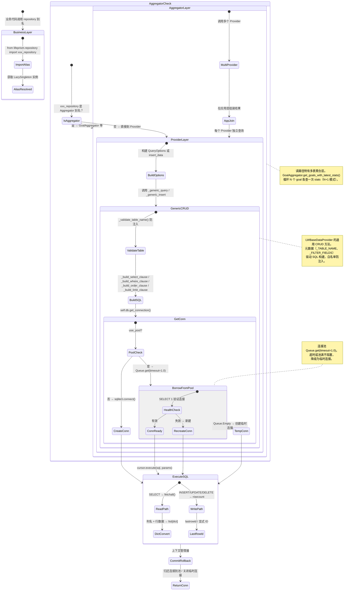

## 版本

| 版本 | 更新内容 |
| ---- | -------- |
| 1.0 | 初始版本 |

# 数据流：DataAccessTrace

**Flow 对象**：DataAccessTrace — 一次完整数据请求从 Repository 入口到 sqlite3 驱动层的穿透路径
**对应 Spec**：[repository-core-spec](../specs/2026-07-06-repository-core-spec.md)

## DataAccessTrace 数据结构

```python
@dataclass
class DataAccessTrace:
    # === 请求标识 ===
    request_id: str                    # 请求唯一标识
    operation: str                     # "query" | "insert" | "update" | "delete"
    target_table: str                  # 最终落到的数据库表名

    # === 路径追踪 ===
    entry_point: str                   # 入口别名，如 "goal_repository"、"diary_repository"
    layer_path: list[str]              # 穿透路径，如 ["GoalAggregator", "GoalProvider", "LWBaseDataProvider", "DatabaseManager"]
    has_aggregator: bool               # 是否经过 Aggregator 层（多表聚合场景）

    # === 查询参数（读操作） ===
    query_options: QueryOptions | None # 查询选项：filters、date_range、order_by、page 等

    # === 写入数据（写操作） ===
    insert_data: dict | None           # 待插入的字段字典
    conflict_strategy: str             # 冲突策略: "abort" | "ignore" | "replace"

    # === 连接状态 ===
    connection_status: str             # "idle" → "borrowed" → "executing" → "returned"
    pool_used: bool                    # 是否走连接池路径
    is_temp_connection: bool           # 是否为池满时创建的临时连接

    # === SQL 执行 ===
    sql_generated: str                 # 最终执行的 SQL 语句
    sql_params: list                   # 参数化查询的参数列表

    # === 结果（读操作） ===
    result_data: list[dict] | None     # 查询结果（dict 列表）
    total_count: int                   # 总记录数（分页场景）

    # === 结果（写操作） ===
    affected_rows: int                 # 影响行数
    returned_id: str | None            # 插入返回的 ID（lastrowid 或显式 ID）

    # === 错误 ===
    error: DataAccessError | None      # 穿透路径上任一层的异常
```

**关键字段说明**：
- `layer_path`：记录请求穿过的每一层，是 DataAccessTrace 的核心追踪信息。读路径经过 Aggregator 时比写路径多一层。同层内的多次调用（如 Aggregator 循环调 Provider）会在 path 中重复出现。
- `connection_status`：连接池借还的状态机。正常路径为 `idle → borrowed → executing → returned`。池满时创建临时连接则 `is_temp_connection=True`，归还时直接关闭不入池。
- `conflict_strategy`：写操作的关键决策点。基类默认 `"replace"`（INSERT OR REPLACE），子类如 DiaryProvider 继承此默认值，因为 date 是主键、同日覆盖合理。但 `"replace"` 会先删后插，未在 INSERT 中指定的列会丢失旧值。

## 与其他数据流的耦合

### DataAccessTrace RepoInitState

**RepoInitState 状态字段**：`uninitialized` `db_managers_created` `providers_ready` `operational`

**耦合关系**：

| DataAccessTrace 状态变化 | RepoInitState 影响 | 触发位置 |
|---|---|---|
| entry_point 解析（import repository 模块） | 依赖 `uninitialized` `db_managers_created`：settings 必须先完成 data_path_resolved，否则 db_path 不存在 | `repository/__init__.py` 模块级代码 |
| DatabaseManager 连接池初始化 | `db_managers_created`：预创建 pool_size 个连接，填充 Queue | `DatabaseManager._init_connection_pool:60` |
| LazySingleton 首次访问（创建 Provider/Aggregator 实例） | `db_managers_created` `providers_ready`：首次调用 `goal_repository.xxx()` 时才实例化 GoalAggregator | `LazySingleton.__call__` |
| 第一次 get_connection() 借出连接 | `providers_ready` `operational`：验证连接有效性（SELECT 1），失效则重建 | `DatabaseManager._get_pooled_connection:82` |

**说明**：DataAccessTrace 的可用性依赖 RepoInitState 的推进。`repository/__init__.py` 在模块导入时创建 DatabaseManager 实例并预填充连接池，这一步要求 settings 已完成路径解析（`data_path_resolved`）。如果 settings 未初始化就 import repository 模块，`settings.lw_db_path` 可能为 None 导致 DatabaseManager 创建失败。Provider/Aggregator 使用 LazySingleton，延迟到首次业务调用时才实例化，因此模块导入不会触发数据库连接。

<key_function>
- lifeprism/repository/__init__.py
  - 模块级 DatabaseManager 实例化:35
- lifeprism/repository/database_manager.py
  - database_manager.DatabaseManager._init_connection_pool:60
  - database_manager.DatabaseManager._create_connection:70
  - database_manager.DatabaseManager._get_pooled_connection:82
  - database_manager.DatabaseManager._return_pooled_connection:105
  - database_manager.DatabaseManager.get_connection:136
</key_function>

## 流程概览



## 数据流节点

**业务场景说明**：系统中有两条典型的数据访问链路——

- **读路径**：以"查询目标列表（含统计数据）"为例，展示 Aggregator 层如何聚合多个 Provider 的结果，以及通用查询方法如何从 QueryOptions 构建 SQL 并穿透到 sqlite3。
- **写路径**：以"写入一条日记"为例，展示 Provider 如何利用基类的通用插入方法完成 INSERT，以及冲突策略（replace）的作用。

两条链路在 Provider 层以下共享同一套 BaseProvider → DatabaseManager → sqlite3 基础设施。

---

### 链路 1：读路径 — 查询目标列表（含统计数据）

**场景**：前端请求目标列表，每个目标需要附带最新一天的统计数据。涉及 goal 表和 goal_stats 表的跨表聚合。

1. 模块导入：`from lifeprism.repository import goal_repository`
   `goal_repository` 是 `goal_aggregator` 的别名（`__init__.py` 中 `as` 重命名），指向 `LazySingleton(GoalAggregator)`。
   状态: entry_point = "goal_repository" | 持久化: ❌ | 跨模块: ❌
   步骤: import repository 模块 → 别名解析为 LazySingleton 包装的 GoalAggregator → 此时尚未实例化

2. GoalAggregator.get_goals_with_latest_stats()
   聚合入口：分别查询 goal 表和 goal_stats 表，在应用层组装结果。
   状态: layer_path 追加 "GoalAggregator" | 持久化: ❌ | 跨模块: ❌
   步骤: 调用 goal_provider.get_goals() 获取目标列表 → 循环每个 goal 调用 stats_provider.get_stats_by_goal() 获取最新统计 → 将 latest_stat 注入每个 goal 字典 → 返回组装后的列表
   分支: goal 列表为空时 → 不进入循环，直接返回空列表（不会触发 stats 查询）

3. GoalProvider.get_goals()
   将业务参数转换为 QueryOptions，委托给基类通用查询。
   状态: layer_path 追加 "GoalProvider" | 持久化: ❌ | 跨模块: ❌
   步骤: 构建 filters（status + category_id） → 创建 QueryOptions(filters, order_by="order_index", order_desc=False, page, page_size) → 调用 self._generic_query(options)

4. LWBaseDataProvider._generic_query()
   通用查询引擎：表名验证 → SQL 子句构建 → 执行 → 结果转换。
   状态: layer_path 追加 "LWBaseDataProvider" | 持久化: ❌ | 跨模块: ❌
   步骤:
   - `_validate_table_name()`：正则 `^[a-zA-Z_][a-zA-Z0-9_]*$` 验证 `_TABLE_NAME`，防 SQL 注入
   - `_build_select_clause(options)`：如果 options.fields 非空，白名单验证（`_SELECT_FIELDS`）后拼接列名；否则返回 `*`
   - `_build_where_clause(options)`：处理 date_range（用 `_DATE_FIELD`）→ 处理 time_range（用 `_TIME_FIELD`）→ 处理 filters（白名单验证 `_FILTER_FIELDS`，支持 `IS NULL`、`IN`、`=` ）
   - `_build_order_clause(options)`：白名单验证 `_ORDER_FIELDS`，构建 `ORDER BY col DESC/ASC`
   - `_build_limit_clause(options)`：page+page_size 优先（构建 `LIMIT n OFFSET m`），否则用 limit
   - `self.db.get_connection()` 获取连接 → `cursor.execute(query, params)` → `cursor.fetchall()` → 列名提取 → `dict(zip(columns, row))` 逐行转换
   - 执行 COUNT 查询获取 total
   分支: GoalProvider 未定义 `_DATE_FIELD` 和 `_TIME_FIELD` → date_range/time_range 不生效（不会报错，因为没有传入这些选项）

5. DatabaseManager.get_connection()
   连接池上下文管理器：借连接 → 执行 → commit → 归还。
   状态: connection_status "idle" → "borrowed" | 持久化: ❌ | 跨模块: ✅ repository → sqlite3 驱动
   步骤:
   - `use_pool=True` → 调用 `_get_pooled_connection()`
   - `Queue.get(timeout=1.0)` 从连接池取连接
   - `SELECT 1` 验证连接有效性 → 无效则重建
   - **分支**：池空（`Queue.Empty`）→ 创建临时连接（`is_temp_connection=True`）
   - yield conn → 调用方执行 SQL → 返回后 `conn.commit()`
   - **分支**：sqlite3.Error → `conn.rollback()` → 抛出 DataAccessError
   - finally：`_return_pooled_connection(conn)` 归还（`put_nowait`）或关闭临时连接
   - connection_status "executing" → "returned"

6. GoalStatsProvider.get_stats_by_goal()
   在 Aggregator 的循环中被调用（每个 goal 一次），同样是通用查询路径。
   状态: layer_path 追加 "GoalStatsProvider" → "LWBaseDataProvider"（复用） | 持久化: ❌ | 跨模块: ❌
   步骤: 构建 QueryOptions(filters={"goal_id": goal_id}, order_by="date", order_desc=True, limit=1) → `_generic_query(options)` → 返回最近 1 条统计记录

<key_function>
- lifeprism/repository/aggregators/goal_aggregator.py
  - goal_aggregator.GoalAggregator.get_goals_with_latest_stats:57
- lifeprism/repository/providers/goal_providers.py
  - goal_providers.GoalProvider.get_goals:118
  - goal_providers.GoalStatsProvider.get_stats_by_goal:564
- lifeprism/repository/base_providers/lw_base_data_provider.py
  - lw_base_data_provider.LWBaseDataProvider._generic_query:967
  - lw_base_data_provider.LWBaseDataProvider._build_select_clause:1251
  - lw_base_data_provider.LWBaseDataProvider._build_where_clause:1261
  - lw_base_data_provider.LWBaseDataProvider._build_order_clause:1315
  - lw_base_data_provider.LWBaseDataProvider._build_limit_clause:1326
</key_function>

---

### 链路 2：写路径 — 写入一条日记

**场景**：用户在日记页面保存当天的日记内容。diary 表以 `date` 为主键，`_ON_CONFLICT = "replace"`，同一天重复保存会覆盖旧内容。

1. 模块导入：`from lifeprism.repository import diary_repository`
   `diary_repository` 是 `diary_provider` 的别名，指向 `LazySingleton(DiaryProvider)`。diary 是单表操作，没有 Aggregator 层。
   状态: entry_point = "diary_repository", has_aggregator = False | 持久化: ❌ | 跨模块: ❌
   步骤: import repository 模块 → 别名解析为 LazySingleton 包装的 DiaryProvider

2. DiaryProvider.create_diary()
   构建插入数据，白名单验证，委托基类通用插入。
   状态: layer_path = ["DiaryProvider"] | 持久化: ❌ | 跨模块: ❌
   步骤: 构建 `insert_data = {"date": date}` → 合并 data 中的字段 → 白名单验证（`_UPDATE_FIELDS`，因为 diary 表的可插入字段与可更新字段一致） → 调用 `self._generic_insert(insert_data)`

3. LWBaseDataProvider._generic_insert()
   通用插入引擎：ID 生成（可选）→ order_index 自动计算（可选）→ 冲突策略选择 → SQL 构建 → 执行。
   状态: layer_path 追加 "LWBaseDataProvider" | 持久化: ❌ | 跨模块: ❌
   步骤:
   - `_validate_table_name()`：正则验证表名
   - 无 `id_prefix` → 不生成 UUID 前缀 ID（diary 使用 date 作为主键）
   - 无 `auto_order_index` → 不查询 MAX(order_index)
   - `conflict_strategy = self._ON_CONFLICT = "replace"` → SQL 为 `INSERT OR REPLACE INTO diary (...) VALUES (...)`
   - `self.db.get_connection()` 获取连接 → `cursor.execute(sql, values)` → `conn.commit()`
   - 返回 `data.get("id", str(cursor.lastrowid))` → diary 的 data 中有 "date" 键，返回 date 值
   分支: `conflict_strategy = "ignore"` 且 `rowcount == 0` → 返回 None（冲突被静默忽略）

4. DatabaseManager.get_connection()
   与读路径共享同一连接池（`lw_db_manager`）。流程完全一致：借连接 → execute → commit → 归还。
   状态: connection_status "borrowed" → "executing" → "returned" | 持久化: ✅ (INSERT 写入 SQLite) | 跨模块: ✅ repository → sqlite3
   步骤: 连接池借出 → cursor.execute(INSERT OR REPLACE ...) → conn.commit() → 连接归还

5. DiaryProvider.update_diary() 的特殊路径
   当日记已存在需要更新时，`update_diary()` **不使用** `_generic_update()`，而是直接写 SQL。
   状态: 绕过通用 CRUD 的自动时间戳和白名单验证 | 持久化: ✅ | 跨模块: ❌
   步骤: 白名单验证 → 构建 SET 子句 → 手动追加 `updated_at = datetime('now','localtime')`（SQLite 特定函数） → `cursor.execute(sql, values)` → `conn.commit()`
   分支: data 中已包含 `updated_at` 字段 → 走 `_generic_update()` 通用路径

<key_function>
- lifeprism/repository/providers/diary_provider.py
  - diary_provider.DiaryProvider.create_diary:112
  - diary_provider.DiaryProvider.update_diary:142
- lifeprism/repository/base_providers/lw_base_data_provider.py
  - lw_base_data_provider.LWBaseDataProvider._generic_insert:1032
  - lw_base_data_provider.LWBaseDataProvider._generic_update:1141
  - lw_base_data_provider.LWBaseDataProvider._validate_table_name:947
</key_function>

---

### 链路 3：连接池生命周期（读写共享）

连接池是读路径和写路径的共享基础设施。DatabaseManager 实例在 `__init__.py` 模块导入时创建，连接池在构造时预填充。

6. DatabaseManager._init_connection_pool()
   模块导入时触发，预创建 pool_size 个连接放入 Queue。
   状态: RepoInitState `db_managers_created` | 持久化: ❌ | 跨模块: ❌
   步骤: 创建 `Queue(maxsize=pool_size)` → 循环 pool_size 次调用 `_create_connection()` → `queue.put(conn)` 填充

7. DatabaseManager._create_connection()
   创建原生 sqlite3 连接，设置 row_factory。
   状态: 新连接创建 | 持久化: ❌ | 跨模块: ✅ Python → sqlite3 C 驱动
   步骤: `readonly=True` → `sqlite3.connect("file:{path}?mode=ro", uri=True)` → `readonly=False` → `sqlite3.connect(path, check_same_thread=False)` → `conn.row_factory = sqlite3.Row`

8. DatabaseManager._return_pooled_connection()
   请求结束后归还连接到池，或关闭临时连接。
   状态: connection_status → "returned" | 持久化: ❌ | 跨模块: ❌
   步骤: `queue.put_nowait(conn)` 尝试归还 → **分支**：队列已满（`Exception`）→ `conn.close()` 直接关闭 → 临时连接（`is_temp_connection=True`）也是直接 `conn.close()`

9. DatabaseManager._close_connection_pool()
   进程退出时（`atexit` 注册）清空连接池。
   状态: RepoInitState → 终结 | 持久化: ❌ | 跨模块: ❌
   步骤: 循环 `queue.get_nowait()` → `conn.close()` → `self._connection_pool = None`

<key_function>
- lifeprism/repository/database_manager.py
  - database_manager.DatabaseManager._init_connection_pool:60
  - database_manager.DatabaseManager._create_connection:70
  - database_manager.DatabaseManager._return_pooled_connection:105
  - database_manager.DatabaseManager._close_connection_pool:119
</key_function>

## 异常与清理

### EntityNotFoundError 的处理路径

EntityNotFoundError 在 Aggregator 层产生，向 API 层冒泡，由全局异常处理器转换为 HTTP 404。

10. GoalAggregator.sync_goal_stats()
    先查询目标是否存在，不存在则抛出 EntityNotFoundError。
    状态: error = EntityNotFoundError | 持久化: ❌ | 跨模块: ✅ repository → API 全局异常处理器
    步骤: `goal_provider.get_goal_by_id(goal_id)` → 返回 None → `raise EntityNotFoundError(entity_type="Goal", entity_id=goal_id)` → 异常冒泡到 API 层 → 全局 handler 读取 `code="ENTITY_NOT_FOUND"` → 映射为 HTTP 404

### 连接池归还（finally 块）

11. DatabaseManager.get_connection() 中的 finally
    无论操作成功或失败，连接都会被归还或关闭，防止连接泄漏。
    状态: 连接回到池中或关闭 | 持久化: ❌ | 跨模块: ❌
    步骤: try-yield-commit → except sqlite3.Error → rollback → raise DataAccessError → finally → `_return_pooled_connection(conn)` 归还

### DataAccessError 的转换链

sqlite3.Error 在首次发现点被转换为 DataAccessError，逐层向上冒泡。

12. LWBaseDataProvider._generic_insert() 中的异常转换
    Provider 层捕获 sqlite3.Error，包装上下文后抛出 DataAccessError。
    状态: error = DataAccessError | 持久化: ❌ | 跨模块: ❌
    步骤: `cursor.execute(sql, values)` 触发 sqlite3.Error → `logger.error("通用插入失败: table=%s, error=%s", ...)` → `raise DataAccessError(message=..., details={...}, cause=e)` → 上层（Aggregator/API）可选择继续包装或透传

13. DatabaseManager.get_connection() 中的异常转换
    DatabaseManager 层在 with 块的 except 中统一转换。
    步骤: `conn.commit()` 或 cursor 操作触发 sqlite3.Error → `conn.rollback()` → `logger.error("数据库操作失败，已回滚: ...")` → `raise DataAccessError(...)` → finally 归还连接

<key_function>
- lifeprism/repository/aggregators/goal_aggregator.py
  - goal_aggregator.GoalAggregator.sync_goal_stats:181
- lifeprism/repository/exceptions.py
  - exceptions.EntityNotFoundError:26
</key_function>

## 反常设计说明

### BaseProvider 使用元数据驱动而非 ORM

**设计意图**：数据访问层通常使用 SQLAlchemy 等 ORM 框架，通过模型类定义表结构、关系映射、自动迁移。

**当前实现**：LWBaseDataProvider 要求子类定义类变量（`_TABLE_NAME`、`_FILTER_FIELDS`、`_ORDER_FIELDS` 等），通用 CRUD 方法通过读取这些元数据动态构建 SQL。没有 ORM、没有关系映射、没有 migration 工具。

**为什么是反常的**：缺少 ORM 的类型安全检查（字段名拼写在运行时才暴露）、缺少关系映射（Aggregator 手动做应用层 JOIN）、缺少 migration 管理（表结构变更依赖 `lifeprism/config/migrations/` 下的手动脚本）。但这是刻意选择：零外部依赖、SQL 完全透明可调试、对 SQLite 的轻量场景足够。

**影响范围**：新增表需要同时定义 TABLE_CONFIG（`config/database.py`）、Provider 类变量、以及可能的 migration 脚本。三个位置需要保持一致性。

**相关位置**：`lw_base_data_provider.py:56-66`（元数据定义）、`database.py:TABLE_CONFIGS`（表配置）、`config/migrations/`（迁移脚本）

### 查询返回 dict 列表，DatabaseManager 返回 DataFrame

**设计意图**：DatabaseManager.query() 返回 `pd.DataFrame`，利用 pandas 的数据处理能力。

**当前实现**：LWBaseDataProvider._generic_query() 在拿到 cursor 后手动做 `dict(zip(columns, row))` 转换，返回 `list[dict]`。DatabaseManager 层的 DataFrame 能力在通用 CRUD 链路中**完全未被利用**。但 BaseProvider 的其他方法（如 `get_activity_logs()`）和 DatabaseManager.query() 的直接调用者又大量使用 DataFrame。

**为什么是反常的**：同一套基础设施产生了两种返回格式（DataFrame 和 list[dict]），调用方需要根据调用的入口方法判断返回类型。通用 CRUD 链路无法享受 pandas 的向量化操作优势。

**影响范围**：Provider 的子类方法如果直接使用 `self.db.query()` 返回 DataFrame，与通用 CRUD 的 `list[dict]` 不一致。GoalProvider 内部混用了两种模式（`query_goals` → `_generic_query` → `list[dict]`，`get_active_goals_with_category` → 直接 cursor → `list[dict]`）。

**相关位置**：`lw_base_data_provider.py:1018-1019`（dict 转换）、`database_manager.py:182-245`（query 返回 DataFrame）

### Aggregator 在应用层做 N+1 JOIN

**设计意图**：多表关联查询应使用 SQL JOIN 在数据库层完成，减少网络往返和应用层循环。

**当前实现**：`GoalAggregator.get_goals_with_latest_stats()` 先查询 goal 列表，再对**每个** goal 分别查询 goal_stats（N+1 查询模式）。SQLite 完全支持 JOIN，可以在一次查询中完成。

**为什么是反常的**：N+1 是经典的性能反模式。在当前场景下（目标数通常 < 100，SQLite 是本进程内数据库），实际性能影响很小。代码简单直观，每个 Provider 独立可测试。但如果目标数量增长到数百个，需要改为 JOIN 或批量 IN 查询。

**影响范围**：`get_goals_with_latest_stats()` 和 `get_cumulative_stats()` 都是 N+1 模式。其他 Aggregator（habit_aggregator、mood_aggregator）可能有类似模式。

**相关位置**：`goal_aggregator.py:57-75`（get_goals_with_latest_stats 的 for 循环）、`goal_aggregator.py:71`（stats_provider.get_stats_by_goal 在循环内）

### 连接池超时降级为临时连接

**设计意图**：连接池满载时应阻塞等待或快速失败，让调用方感知资源紧张。

**当前实现**：`_get_pooled_connection()` 使用 `Queue.get(timeout=1.0)`，超时后捕获 `Empty`，**不阻塞等待也不抛异常**，而是创建临时连接。临时连接用后即关（不归还池），且不受 `pool_size` 限制。

**为什么是反常的**：高并发场景下连接池被绕过，临时连接不受池大小约束，可能导致连接数膨胀。1 秒超时太短，轻度并发就可能触发降级。这是"宁可多用连接也不阻塞"的策略，适合当前单用户桌面应用的场景，但不适合多用户服务端。

**影响范围**：`lw_db_manager` 的 `pool_size=5`，如果 5 个连接全部被占用超过 1 秒，第 6 个请求就会创建临时连接。在桌面应用中极少触发，但如果 LLM 分析任务长时间持有连接（如 `get_activity_logs` 扫描大量数据），可能触发。

**相关位置**：`database_manager.py:89-103`（临时连接创建逻辑）

### _ON_CONFLICT 默认 "replace" 存在数据丢失风险

**设计意图**：基类提供安全的默认冲突策略，子类按需覆盖。

**当前实现**：`LWBaseDataProvider._ON_CONFLICT = "replace"`。SQLite 的 `INSERT OR REPLACE` 实际上是 DELETE + INSERT，未在 INSERT 语句中出现的列会被重置为默认值（通常是 NULL）。DiaryProvider 适用于此策略（date 为主键，同日覆盖），但**任何新 Provider 如果不显式覆盖 `_ON_CONFLICT`，就会继承这个危险的默认值**。

**为什么是反常的**：对于大多数业务表，"ignore"（静默跳过）或 "abort"（抛异常让调用方决定）是更安全的默认值。"replace" 的数据丢失是静默的——不会报错，但旧数据已被删除。

**影响范围**：DiaryProvider 使用 replace 是正确的（`date` 是主键，全量覆盖符合业务语义）。GoalProvider 的 `_ON_CONFLICT` 未被显式覆盖，继承了基类的 replace，但 goal 表的 `create_goal()` 生成新 UUID，实际不会触发冲突。新 Provider 开发者需要意识到这个默认值。

**相关位置**：`lw_base_data_provider.py:62`（`_ON_CONFLICT = "replace"`）、`diary_provider.py:32`（`_ON_CONFLICT = "replace"` 显式覆盖）

### DiaryProvider.update_diary() 绕过通用 CRUD

**设计意图**：`_generic_update()` 是通用的更新方法，包含白名单验证和自动时间戳（Python `datetime.now().isoformat()`）。

**当前实现**：`DiaryProvider.update_diary()` **不使用** `_generic_update()`，而是直接构建 SQL 并添加 `updated_at = datetime('now','localtime')`（SQLite 特定函数）。原因是 SQLite 的 `datetime('now','localtime')` 使用数据库服务器时间，而 Python 的 `isoformat()` 是应用服务器时间，格式和行为不同。

**为什么是反常的**：Provider 对同一张表 (diary) 的更新操作分散在两条路径中——`update_diary()` 用手写 SQL，`_generic_update()` 通过基类。白名单验证在 `update_diary()` 中手动重复了一次（`_UPDATE_FIELDS`）。如果未来基类增加新的横切关注点（如审计日志、变更事件），`update_diary()` 不会自动受益。

**影响范围**：仅影响 diary 表的更新操作。当前只有这一个 Provider 需要 SQLite 特定时间戳函数。如果其他 Provider 也有类似需求，应该抽象为基类的可配置选项。

**相关位置**：`diary_provider.py:142-190`（update_diary 的自定义 SQL）、`lw_base_data_provider.py:1141-1209`（_generic_update）

## 相关文档

### Spec 文档
- **[repository-core-spec](../specs/2026-07-06-repository-core-spec.md)**：数据访问层核心规格，定义 Provider-Aggregator 模式、通用 CRUD 契约、QueryOptions 规范
- **[repository-initialization-flow](./2026-07-06-repository-initialization-flow.md)**：Repository 模块初始化流程，覆盖 DatabaseManager 构造、连接池预填充、LazySingleton 延迟实例化

### 架构文档
- **[Provider-Aggregator 架构调研](../../docs/temp/Investigation/2026-04-24-provider-aggregator-architecture-research.md)**：Provider-Aggregator 分离设计的技术调研和决策背景

### ADR
- 暂无直接关联的 ADR。元数据驱动而非 ORM 的决策、查询返回 list[dict] 而非 ORM 对象的决策，均为项目早期定型，未记录为 ADR。
