## 版本

| 版本 | 更新内容 |
| ---- | -------- |
| 1.0 | 初始版本 |

# 数据流：RepoInitState

**Flow 对象**：RepoInitState
**对应 Spec**：[repository-core-spec](../specs/2026-07-06-repository-core-spec.md)

## RepoInitState 数据结构

```python
@dataclass
class RepoInitState:
    """Repository 层初始化完成后的关键状态"""

    # === DB 实例（全局单例） ===
    lw_db_manager: DatabaseManager     # LifeWatch 读写 DB，连接池=5，use_pool=True
    aw_db_manager: DatabaseManager     # ActivityWatch 只读 DB，连接池=1，readonly=True
    chat_history_db_manager: DatabaseManager  # 聊天历史只读 DB，连接池=2，readonly=True

    # === DB 文件状态 ===
    lw_db_path: Path                   # LifeWatch DB 文件完整路径（从 settings 读取）
    chat_db_path: Path                 # 聊天历史 DB 文件完整路径（从 settings 读取）
    aw_db_path: Path                   # ActivityWatch DB 文件完整路径（从 settings 读取）
    db_files_exist: bool               # 3 个 DB 文件是否都已存在（True=跳过创建）

    # === 表结构状态 ===
    tables_created: dict[str, bool]    # 各表是否创建成功（table_name → bool）
    tables_count: int                  # 已创建的表总数（TABLE_CONFIGS 长度）

    # === 迁移状态 ===
    schema_version: int                # 当前 schema_version 版本号（迁移后）
    migrations_pending: list           # 待执行迁移列表（version > current_version）
    migrations_executed: int           # 本次启动执行的迁移数量

    # === 默认数据状态 ===
    categories_seeded: bool            # 默认分类是否已填充
    sub_categories_seeded: bool        # 默认子分类是否已填充
    example_goal_seeded: bool          # 示例目标是否已填充
    example_plan_doc_seeded: bool      # 示例计划书是否已填充
    mood_types_seeded: bool            # 默认心情类型是否已填充
    mood_impacts_seeded: bool          # 默认影响因素是否已填充
    daily_goal_seeded: bool            # 每日目标是否已填充

    # === 资源文件状态 ===
    templates_source: Path             # templates 源目录路径（打包=bundle_dir，开发=仓库根目录）
    resources_copied: int              # 本次初始化复制的资源文件数量
    resources_overwritten: int         # 本次初始化强制覆盖的资源文件数量
```

**关键字段说明**：
- `lw_db_manager`：整个 Repository 层的主数据库入口，所有 LifeWatch 表的读写操作都经过此实例。连接池=5 意味着同时最多 5 个并发数据库操作
- `aw_db_manager` 和 `chat_history_db_manager`：只读模式，用于外部数据源（ActivityWatch）和聊天历史查询，连接池较小因为并发需求低
- `schema_version`：迁移状态的核心指标，决定了哪些迁移需要执行。初始值为 0，每次迁移执行后递增
- `tables_created`：表结构初始化的结果快照，由 TABLE_CONFIGS 配置驱动，任何表创建失败都会中断整个 init_database 流程
- `resources_overwritten`：仅在 OVERWRITE_DIR_LIST 中的目录（prompts/tool/agent）会强制覆盖，其他资源文件仅在目标不存在时复制

## 与其他数据流的耦合

### RepoInitState <-> ConfigInitState

**ConfigInitState 状态字段**：`config_base_path`（源）、`lifeprism_data_path`（源）、`lw_db_path`（派生）、`chat_db_path`（派生）、`aw_db_path`（派生）

**耦合关系**：

| RepoInitState 状态变化 | ConfigInitState 影响 | 触发位置 |
|-----------------------|---------------------|---------|
| `lw_db_path` / `chat_db_path` / `aw_db_path` 确定 | 依赖 settings 的属性访问器从 `_lifeprism_data_path` 自动推算 | `__init__.py` 模块级读取 `settings.lw_db_path` 等 |
| DB 文件创建（mkdir + touch）完成 | 后续 DatabaseManager.__init__ 可以正常连接 | `__init__.py` 模块级 for 循环 |
| resource_initializer 读取 settings | 依赖 `settings.config_base_path` 和 `settings.lifeprism_data_path` 确定目标路径 | `resource_initializer.initialize_resources():33-42` |
| migration_runner 读取 settings | `run_migrations(str(settings.lw_db_path))` 需要 ConfigInitState 已就绪 | `main.py` lifespan:205 |

**说明**：RepoInitState 是 ConfigInitState 的下游依赖。`__init__.py` 模块级代码在 import 时就会读取 `settings.lw_db_path`、`settings.chat_db_path`、`settings.aw_db_path`，因此 Repository 层初始化必须在 SettingsManager 单例完成初始化之后。`main.py` 通过显式的 import 顺序（line 38-39 先导入 settings，line 142-164 再导入 repository 模块）保证这一依赖关系。

<key_function>
- lifeprism/repository/__init__.py
  - __init__:27-44
- lifeprism/repository/database_manager.py
  - database_manager.DatabaseManager.__init__:30-58
  - database_manager.DatabaseManager._init_connection_pool:60-68
  - database_manager.DatabaseManager._create_connection:70-80
  - database_manager.DatabaseManager._close_connection_pool:119-134
- lifeprism/repository/lw_table_manager.py
  - lw_table_manager.LWTableManager.init_database:36-50
  - lw_table_manager.LWTableManager._create_table_from_config:52-109
  - lw_table_manager.init_database:115-121
- lifeprism/repository/migrations/migration_runner.py
  - migration_runner.run_migrations:22-58
  - migration_runner._get_current_version:61-68
  - migration_runner._backup_database:71-96
  - migration_runner._execute_migration:108-133
  - migration_runner._cleanup_old_backups:99-105
- lifeprism/repository/data_initializer.py
  - data_initializer.DataInitializer.initialize_default_data:200-217
  - data_initializer.DataInitializer._is_table_empty:219-237
  - data_initializer.DataInitializer._initialize_default_categories:239-266
  - data_initializer.DataInitializer._initialize_default_sub_categories:268-295
  - data_initializer.DataInitializer._initialize_example_goal:297-338
  - data_initializer.DataInitializer._initialize_example_plan_doc:340-377
  - data_initializer.DataInitializer._initialize_default_mood_types:415-447
  - data_initializer.DataInitializer._initialize_default_mood_impacts:449-474
  - data_initializer.DataInitializer._initialize_daily_goal:476-588
  - data_initializer.initialize_default_data:591-597
- lifeprism/repository/resource_initializer.py
  - resource_initializer.initialize_resources:27-78
- lifeprism/server/main.py
  - lifespan:174-306
</key_function>

## 流程概览

```mermaid
stateDiagram-v2
    [*] --> __init__py : from lifeprism.repository import ... 首次执行

    state __init__py {
        [*] --> ImportSettings : import settings
        ImportSettings --> CheckDBFiles : 检查 lw_db_path / chat_db_path 是否存在
        CheckDBFiles --> CreateIfMissing : 任一不存在 → mkdir + touch
        CheckDBFiles --> SkipCreate : 都存在 → 跳过

        state CreateIfMissing {
            [*] --> CreateDir : db_path.parent.mkdir()
            CreateDir --> TouchFile : db_path.touch()
            TouchFile --> [*]
        }

        CreateIfMissing --> CreateLW : 创建 lw_db_manager (use_pool=True, pool_size=5)
        SkipCreate --> CreateLW : 创建 lw_db_manager (use_pool=True, pool_size=5)

        state CreateLW {
            [*] --> LW_InitPool : use_pool=True → _init_connection_pool()
            LW_InitPool --> LW_Queue : 创建 pool_size 个连接放入 Queue
            LW_Queue --> LW_Atexit : 注册 atexit 清理
        }

        CreateLW --> CreateAW : 创建 aw_db_manager (use_pool=True, pool_size=1, readonly=True)

        state CreateAW {
            [*] --> AW_InitPool : use_pool=True → _init_connection_pool()
            AW_InitPool --> AW_Queue : 创建 1 个只读连接放入 Queue
            AW_Queue --> AW_Atexit : 注册 atexit 清理
        }

        CreateAW --> CreateChat : 创建 chat_history_db_manager (use_pool=True, pool_size=2, readonly=True)

        state CreateChat {
            [*] --> Chat_InitPool : use_pool=True → _init_connection_pool()
            Chat_InitPool --> Chat_Queue : 创建 2 个只读连接放入 Queue
            Chat_Queue --> Chat_Atexit : 注册 atexit 清理
        }

        CreateChat --> [*] : 3 个 DB 实例创建完成
    }

    __init__py --> InitDatabase : lifespan 阶段调用

    state InitDatabase {
        [*] --> LWTM_init : LWTableManager().init_database()
        LWTM_init --> IterateConfigs : 遍历 TABLE_CONFIGS
        IterateConfigs --> CreateTable : _create_table_from_config() 逐个

        state CreateTable {
            [*] --> BuildColumns : 构建列定义（column_definitions）
            BuildColumns --> CheckTimestamps : timestamps 配置?
            CheckTimestamps --> AddCreatedAt : True → 添加 created_at TIMESTAMP 列
            CheckTimestamps --> SkipTimestamps : False → 跳过
            AddCreatedAt --> CheckUpdateAt : update_at 配置?
            SkipTimestamps --> BuildSQL
            CheckUpdateAt --> AddUpdatedAt : True → 添加 updated_at TIMESTAMP 列
            CheckUpdateAt --> BuildSQL : False
            AddUpdatedAt --> BuildSQL
            BuildSQL --> ExecSQL : CREATE TABLE IF NOT EXISTS
            ExecSQL --> CreateIndexes : 遍历 indexes 创建索引
            CreateIndexes --> [*]
        }

        IterateConfigs --> [*] : 所有表创建完毕
    }

    InitDatabase --> RunMigrations : lifespan 阶段调用

    state RunMigrations {
        [*] --> CheckDBExists : DB 文件存在?
        CheckDBExists --> GetVersion : 是 → _get_current_version()
        CheckDBExists --> SkipMigration : 否 → 跳过（将由 init_database 创建）

        GetVersion --> FilterPending : 过滤 pending (version > current_version)
        FilterPending --> HasPending : pending 非空?
        HasPending --> SkipMigration : 否 → 跳过
        HasPending --> Backup : 是 → _backup_database()

        state Backup {
            [*] --> WALCheckpoint : PRAGMA wal_checkpoint(TRUNCATE)
            WALCheckpoint --> CopyFile : shutil.copy2() 备份
            CopyFile --> CleanupOld : _cleanup_old_backups(keep=3)
            CleanupOld --> [*]
        }

        Backup --> ExecuteLoop : 逐个执行 pending migrations

        state ExecuteLoop {
            [*] --> CheckApplied : check_if_applied()
            CheckApplied --> SkipUpgrade : True → 补录版本记录
            CheckApplied --> RunUpgrade : False → migration.upgrade()
            SkipUpgrade --> InsertVersion : INSERT OR IGNORE schema_version
            RunUpgrade --> InsertVersion : INSERT OR IGNORE schema_version
            InsertVersion --> Commit : conn.commit()
            Commit --> NextOrDone : 下一个 / 全部完成
            NextOrDone --> [*]
        }

        ExecuteLoop --> [*] : 迁移完成
    }

    RunMigrations --> InitDefaultData : lifespan 阶段调用

    state InitDefaultData {
        [*] --> CheckCategory : _is_table_empty("category")
        CheckCategory --> SeedCategory : True → INSERT 4 种默认分类
        CheckCategory --> SkipCategory : False → 跳过

        SeedCategory --> CheckSubCat : _is_table_empty("sub_category")
        SkipCategory --> CheckSubCat
        CheckSubCat --> SeedSubCat : True → INSERT 4 种子分类
        CheckSubCat --> SkipSubCat : False → 跳过

        SeedSubCat --> CheckGoal : _is_table_empty("goal")
        SkipSubCat --> CheckGoal
        CheckGoal --> SeedGoal : True → INSERT 示例目标 (id="goal-example")
        CheckGoal --> SkipGoal : False → 跳过

        SeedGoal --> CheckPlanDoc : _is_table_empty("plan_doc")
        SkipGoal --> CheckPlanDoc
        CheckPlanDoc --> SeedPlanDoc : True → INSERT 示例计划书
        CheckPlanDoc --> SkipPlanDoc : False → 跳过

        SeedPlanDoc --> CheckMoodTypes : _is_table_empty("mood_types")
        SkipPlanDoc --> CheckMoodTypes
        CheckMoodTypes --> SeedMoodTypes : True → INSERT 7 种心情类型
        CheckMoodTypes --> SkipMoodTypes : False → 跳过

        SeedMoodTypes --> CheckMoodImpacts : _is_table_empty("mood_impacts")
        SkipMoodTypes --> CheckMoodImpacts
        CheckMoodImpacts --> SeedMoodImpacts : True → INSERT 18 种影响因素
        CheckMoodImpacts --> SkipMoodImpacts : False → 跳过

        SeedMoodImpacts --> InitDailyGoal : _initialize_daily_goal()
        SkipMoodImpacts --> InitDailyGoal

        state InitDailyGoal {
            [*] --> CheckDailyConflict : 查询同名/同id冲突记录
            CheckDailyConflict --> NoConflict : 无冲突 → INSERT
            CheckDailyConflict --> MultiConflict : 多条冲突 → 跳过
            CheckDailyConflict --> SingleConflict : 单条冲突 → 分支判断
            SingleConflict --> SameIdName : id相同+名相同 → 跳过
            SingleConflict --> SameIdDiffName : id相同+名不同 → 跳过（用户改名）
            SingleConflict --> DiffIdSameName : id不同+名相同 → UPDATE id
        }

        InitDailyGoal --> [*] : 数据填充完成
    }

    InitDefaultData --> InitResources : lifespan 阶段调用

    state InitResources {
        [*] --> DetectEnv : 判断打包/开发环境
        DetectEnv --> PackedTemplates : 打包 → templates_dir = _MEIPASS/templates
        DetectEnv --> DevTemplates : 开发 → templates_dir = 仓库根目录/templates

        PackedTemplates --> CheckTemplatesExist : templates_dir 存在?
        DevTemplates --> CheckTemplatesExist

        CheckTemplatesExist --> SkipResources : 否 → 跳过
        CheckTemplatesExist --> ScanFiles : 是 → rglob("*") 扫描

        ScanFiles --> CheckOverwrite : rel.parts[0] in OVERWRITE_DIR_LIST?
        CheckOverwrite --> ForceCopy : 是 → mkdir + shutil.copy2 强制覆盖
        CheckOverwrite --> CheckAgentChat : 否 → 继续判断

        CheckAgentChat --> SkipBootstrap : rel == "agent/chat/bootstrap.md" 且 agent/chat 已存在 → 跳过
        CheckAgentChat --> CheckExists : 其他 → 检查目标是否存在
        SkipBootstrap --> NextFile

        CheckExists --> SkipFile : 存在 → 跳过
        CheckExists --> CopyFile : 不存在 → mkdir + shutil.copy2
        ForceCopy --> NextFile : 继续下一个文件
        CopyFile --> NextFile : 继续下一个文件

        NextFile --> ScanFiles : 遍历所有文件
        NextFile --> [*] : 扫描完毕

        SkipResources --> [*]
    }

    InitResources --> [*] : Repository 初始化完成
```



**关键分支说明**：
- **__init__.py DB 文件检查**：即使 aw_db_manager 和 chat_history_db_manager 是只读模式，`__init__.py` 在创建 DatabaseManager 实例之前也会对这两个路径执行 touch 创建。这是为了防止只读模式（`mode=ro` + uri）在文件不存在时连接失败
- **迁移版本检测**：`_get_current_version()` 通过查询 `schema_version` 表的最大 version 号获取当前版本。表不存在时返回 0，所有迁移都会被标记为 pending
- **迁移幂等检查**：每个迁移的 `check_if_applied()` 支持跳过已生效的迁移（如通过其他方式已经应用了表结构变更），仅补录版本记录
- **data_initializer 空表检测**：每个 `_initialize_*` 方法先通过 `_is_table_empty()` 检查表是否为空，非空则跳过。这保证了默认数据仅在首次安装时填充，后续启动不会重复插入
- **resource_initializer OVERWRITE_DIR_LIST**：prompts/tool/agent 三个目录始终被强制覆盖，确保 LLM 提示词和工具配置始终是最新版本。其他资源文件仅在目标不存在时复制，保留用户修改

## 数据流节点

**业务场景说明**：Repository 层初始化分为两个阶段：(1) 模块导入阶段，`__init__.py` 的模块级代码在 `from lifeprism.repository import ...` 首次执行时创建 3 个 DatabaseManager 单例；(2) `main.py` 的 lifespan 阶段，依次执行表结构初始化、数据库迁移、默认数据填充、资源文件初始化。

### 链路 1：模块导入时的 DB 实例创建（__init__.py）

**1. 模块级代码执行（__init__.py 第 21-44 行）**
   `from lifeprism.config.settings_manager import settings` → 读取 `settings.lw_db_path`、`settings.chat_db_path` → 遍历两个路径检查是否存在 → 不存在则 `mkdir + touch` 创建空 DB 文件 → 创建 3 个 DatabaseManager 实例（含连接池初始化）
   状态: 3 个 DB 文件确保存在 + 3 个 DatabaseManager 单例创建完成 | 持久化: ✅ (空 DB 文件) | 跨模块: ✅ (settings→repository)
   步骤:
   - 导入 settings 获取 lw_db_path、chat_db_path（注意：aw_db_path 不在 touch 循环中，但同理需要路径存在）
   - 分支A (db_path 不存在): `parent.mkdir(parents=True, exist_ok=True)` → `touch()` 创建空文件
   - 分支B (db_path 已存在): 跳过 touch
   - lw_db_manager: `DatabaseManager(DB_PATH, use_pool=True, pool_size=5)` — 读写模式，大连接池
   - aw_db_manager: `DatabaseManager(DB_PATH, use_pool=True, pool_size=1, readonly=True)` — 只读，小连接池
   - chat_history_db_manager: `DatabaseManager(DB_PATH, use_pool=True, pool_size=2, readonly=True)` — 只读，中连接池

**2. DatabaseManager.__init__() — 连接池模式分支**
   根据 use_pool 参数决定是否初始化连接池，readonly 参数决定连接打开模式
   状态: _connection_pool=Queue(N), readonly=bool | 持久化: ❌ | 跨模块: ❌
   步骤: 存储 DB_PATH / use_pool / pool_size / readonly → 初始化 _connection_pool=None / _pool_lock=Lock → 分支：use_pool=True → _init_connection_pool()

**3. DatabaseManager._init_connection_pool() — 连接池预热**
   创建 Queue 并预先建立 pool_size 个数据库连接放入池中
   状态: _connection_pool 从 None→Queue(已填充) | 持久化: ❌ | 跨模块: ❌
   步骤: 创建 Queue(maxsize=pool_size) → 循环 pool_size 次调用 _create_connection() → 每个连接 put 入 Queue → atexit.register(_close_connection_pool)

**4. DatabaseManager._create_connection() — 创建单个连接（readonly 分支）**
   根据 readonly 参数选择不同的连接模式
   状态: 返回 sqlite3.Connection | 持久化: ❌ | 跨模块: ❌
   步骤:
   - 分支A (readonly=True): 使用 URI 模式 `file:{DB_PATH}?mode=ro` 打开只读连接（用于 ActivityWatch / 聊天历史 DB）
   - 分支B (readonly=False): 使用普通路径模式 `sqlite3.connect(DB_PATH)` 打开读写连接
   - 统一设置 `conn.row_factory = sqlite3.Row`

### 链路 2：数据库表结构初始化（lifespan 阶段）

**5. init_database() 便捷函数 — 入口**
   创建 LWTableManager 实例并调用 init_database()
   状态: 触发完整的表结构创建流程 | 持久化: ✅ (SQLite 表结构) | 跨模块: ✅ (server→repository)
   步骤: LWTableManager() 实例化（默认延迟导入 lw_db_manager）→ init_database()

**6. LWTableManager.init_database() — 配置驱动建表循环**
   获取连接，遍历 TABLE_CONFIGS 中的所有表配置，逐个创建
   状态: tables_created 从空 dict→所有表创建完成 | 持久化: ✅ (N 个表 + M 个索引写入 DB) | 跨模块: ❌
   步骤: 获取连接（get_connection() 从池中取）→ 遍历 TABLE_CONFIGS.items() → 每个表调用 _create_table_from_config(cursor, config) → 记录创建总数

**7. LWTableManager._create_table_from_config() — 单表创建（含时间戳分支）**
   根据表配置字典生成 CREATE TABLE SQL 并执行，含 timestamps/update_at 分支
   状态: 单个表从不存在→已创建 | 持久化: ✅ (CREATE TABLE + 索引) | 跨模块: ❌
   步骤:
   - 构建列定义：遍历 config["columns"] → 组装 `col_name col_type [constraints]`
   - 分支 (timestamps=True): 添加 `created_at TIMESTAMP DEFAULT (datetime('now', 'localtime'))`
     - 子分支 (update_at=True): 额外添加 `updated_at TIMESTAMP DEFAULT (datetime('now', 'localtime'))`
   - 合并表级约束（config["table_constraints"]）→ 组装 `CREATE TABLE IF NOT EXISTS` → 执行
   - 遍历 config["indexes"] → 组装 `CREATE INDEX IF NOT EXISTS` → 执行

### 链路 3：数据库迁移（lifespan 阶段）

**8. run_migrations(db_path) — 迁移主入口**
   检测当前数据库版本，过滤待执行迁移，执行前备份，完成后版本更新
   状态: schema_version 从 current_version→最高迁移版本 | 持久化: ✅ (DB 结构变更 + schema_version 记录 + 备份文件) | 跨模块: ✅ (server→repository.migrations)
   步骤:
   - 分支A (db_file 不存在): 直接返回，跳过迁移（将由 init_database 创建新库）
   - 分支B (db_file 存在): 创建独立 sqlite3 连接（不走连接池）→ 获取当前版本
   
**9. _get_current_version(cursor) — 版本检测**
   查询 schema_version 表获取当前版本号，表不存在返回 0
   状态: current_version→int | 持久化: ❌ | 跨模块: ❌
   步骤: 检查 schema_version 表是否存在 → 不存在返回 0 / 存在则 SELECT MAX(version) → 返回版本号

**10. _backup_database(db_file, current_version) — 迁移前备份**
    执行 WAL checkpoint 后将数据库文件复制到带版本号和时间戳的备份文件
    状态: 生成备份文件 backup-v{version}-{timestamp}.db | 持久化: ✅ (备份文件) | 跨模块: ❌
    步骤: 生成备份文件名 → PRAGMA wal_checkpoint(TRUNCATE) → shutil.copy2() → _cleanup_old_backups(keep=3)

**11. _execute_migration(conn, migration) — 单迁移执行（含幂等分支）**
    检查迁移是否已生效，执行 upgrade 或补录版本记录
    状态: schema_version 记录新增一行 | 持久化: ✅ (commit + INSERT OR IGNORE schema_version) | 跨模块: ❌
    步骤:
    - 分支A (check_if_applied()=True): 迁移已生效 → 仅 INSERT OR IGNORE schema_version 补录记录
    - 分支B (check_if_applied()=False): 迁移未生效 → migration.upgrade(cursor) → INSERT OR IGNORE schema_version
    - conn.commit() → 失败则 conn.rollback() + raise

### 链路 4：默认数据填充（lifespan 阶段）

**12. initialize_default_data() 便捷函数 — 入口**
    创建 DataInitializer 实例并调用 initialize_default_data()
    状态: 触发 7 个子初始化方法 | 持久化: ✅ (多表 INSERT) | 跨模块: ✅ (server→repository)
    步骤: DataInitializer() 实例化（默认延迟导入 lw_db_manager）→ initialize_default_data()

**13. _is_table_empty(table_name) — 空表检测（每个子方法调用的前置检查）**
    查询表行数，返回是否为空
    状态: bool (True=表为空需要填充) | 持久化: ❌ | 跨模块: ❌
    步骤: SELECT COUNT(*) FROM table_name → count==0 返回 True

**14. 默认数据填充子方法 — 按表依次检测+填充**
    每个 `_initialize_*` 方法先检查对应表是否为空，为空则插入预定义默认数据
    状态: 7 个表的 seeded 标志各自独立 | 持久化: ✅ (INSERT) | 跨模块: ❌
    步骤:
    - `_initialize_default_categories()`: category 表空 → INSERT 4 条（工作/学习/娱乐/其他）
    - `_initialize_default_sub_categories()`: sub_category 表空 → INSERT 4 条（各分类的"其他"子分类）
    - `_initialize_example_goal()`: goal 表空 → INSERT 示例目标（id="goal-example"）
    - `_initialize_example_plan_doc()`: plan_doc 表空 → INSERT 示例计划书（id="示例-planDoc"）
    - `_initialize_default_mood_types()`: mood_types 表空 → INSERT 7 种心情类型（喜悦/宁静/沉思/愤怒/内疚/忧郁/悲伤）
    - `_initialize_default_mood_impacts()`: mood_impacts 表空 → INSERT 18 种影响因素
    - `_initialize_daily_goal()`: 复杂冲突检测 → 5 种分支判断 → INSERT 或 UPDATE 或跳过

### 链路 5：资源文件初始化（lifespan 阶段）

**15. initialize_resources() — 资源文件扫描与复制**
    扫描 templates 目录下所有文件，按路径映射规则复制到 config_path 或 data_path
    状态: resources_copied / resources_overwritten 计数 | 持久化: ✅ (文件复制到磁盘) | 跨模块: ✅ (settings 路径体系→文件系统)
    步骤:
    - 分支A (打包环境): templates_dir = sys._MEIPASS / "templates"
    - 分支B (开发环境): templates_dir = 仓库根目录 / "templates"
    - templates_dir 不存在 → 直接返回
    - 存在 → rglob("*") 扫描所有文件 → 计算相对路径 rel
    - 路径映射：rel.parts[0]=="config" → target = config_path / rel / 其他 → target = data_path / rel
    - 分支 (rel.parts[0] in OVERWRITE_DIR_LIST): 强制覆盖（prompts/tool/agent 目录）
    - 分支 (rel=="agent/chat/bootstrap.md" 且 agent/chat 初始化前已存在): 跳过（保护用户修改）
    - 默认分支 (target.exists()): 跳过 / 不存在 → mkdir + shutil.copy2

## 异常与清理

- **__init__.py DB 文件创建异常**：`mkdir` 或 `touch` 失败 → 原始 OSError 冒泡 → 模块导入失败 → 应用无法启动
- **DatabaseManager.__init__ 连接池创建异常**：`_create_connection()` 中 `sqlite3.connect()` 失败 → 原始 sqlite3.Error 冒泡 → 模块导入中断
- **init_database 表创建异常**：`_create_table_from_config()` 中任一表创建失败 → Exception 冒泡 → `init_database()` 整体失败 → lifespan 中 catch 后 log ERROR + raise → 应用启动中断
- **run_migrations DB 文件不存在**：返回 None，正常跳过（新安装场景，由 init_database 创建表）
- **run_migrations 备份失败**：RuntimeError 抛出让应用启动失败（宁可失败也不冒险迁移）
- **run_migrations 单步迁移失败**：conn.rollback() → RuntimeError 抛出 → 应用启动中断。备份文件保留用于恢复
- **data_initializer 默认数据插入异常**：`_is_table_empty()` 失败返回 False（保守跳过）→ 单表初始化失败不中断整个流程，但 Exception 会冒泡到 initialize_default_data → lifespan catch
- **resource_initializer 资源复制异常**：单个文件复制失败不会中断整体流程（lifespan 中 catch 后 WARNING 日志）。但整个 initialize_resources() 失败是非致命的（WARNING 不 raise）
- **连接池清理**：`_close_connection_pool()` 通过 atexit 注册 → 程序退出时自动执行 → 遍历 Queue 关闭所有连接 → 连接池设置为 None

## 反常设计说明

### 1. __init__.py 在模块级别执行 DB 文件创建

**设计意图**：Python 模块的 `__init__.py` 通常只做导入和单例声明，不执行有副作用的文件 I/O 操作。

**当前实现**：`lifeprism/repository/__init__.py` 第 27-32 行在模块级别直接执行 `for db_path in [settings.lw_db_path, settings.chat_db_path]: if db_path and not db_path.exists(): db_path.parent.mkdir(parents=True, exist_ok=True); db_path.touch()`。这意味着任何 `from lifeprism.repository import ...` 的首次执行都会触发文件系统写操作。

**为什么是反常的**：模块导入是隐式触发，调用方（如测试代码、脚本）可能并不期望 import 操作会产生文件系统副作用。这不是延迟初始化模式——DB 文件在 import 阶段就已经创建，而不是在显式调用初始化方法时。

**影响范围**：所有 import repository 模块的代码都会间接触发 DB 文件创建。好处是确保了 DatabaseManager 构造时文件一定存在（避免 `mode=ro` 的只读连接因文件不存在而失败）；代价是 import 顺序很重要——必须在 settings 初始化之后才能 import repository。

**相关位置**：
- `lifeprism/repository/__init__.py:27-32`

### 2. aw_db_manager 和 chat_history_db_manager 是只读的，但 __init__.py 仍然 touch 创建

**设计意图**：只读数据库（ActivityWatch、聊天历史）的数据由外部进程写入，LifePrism 只需读取。如果文件不存在，说明外部数据源尚未产生数据，正常情况下连接失败是可以接受的。

**当前实现**：`__init__.py` 第 27 行的 touch 循环遍历的是 `[settings.lw_db_path, settings.chat_db_path]`（注意：没有 aw_db_path），但 `chat_db_path` 也指向一个 `readonly=True` 的 DatabaseManager。touch 创建空文件是为了防止 `sqlite3.connect("file:...?mode=ro", uri=True)` 在文件不存在时抛出 `sqlite3.OperationalError`。

**为什么是反常的**：只读数据库的空文件创建不是业务需求——它纯粹是为了满足 SQLite URI 只读模式的连接要求（文件必须存在才能以 `mode=ro` 打开）。这是技术约束驱动的设计，而非业务逻辑驱动的设计。

**影响范围**：如果外部数据源（如 ActivityWatch）尚未运行，LifePrism 会连接到空的 chat_history DB 文件（表结构由外部进程创建）。aw_db_path 不在 touch 循环中——如果 ActivityWatch 尚未产生数据文件，aw_db_manager 的连接池创建会失败。

**相关位置**：
- `lifeprism/repository/__init__.py:27-32`（touch 循环）
- `lifeprism/repository/database_manager.py:72-75`（readonly 连接模式要求文件存在）

### 3. data_initializer 使用固定 ID（如 "goal-example"、"goal-daily"）

**设计意图**：示例数据和系统内置数据（如每日目标）需要持久化的固定标识符，以便前端和后续逻辑可以通过 ID 引用。

**当前实现**：`data_initializer.py` 中 `EXAMPLE_GOAL_ID = "goal-example"`、`DAILY_GOAL_ID = "goal-daily"` 等固定 ID。`_initialize_daily_goal()` 方法中有复杂的冲突处理逻辑（5 种分支），包括"同名但不同 id 则 UPDATE id 为固定值"——这会修改用户手动创建的目标的 id。

**为什么是反常的**：`_initialize_daily_goal()` 的冲突处理逻辑（line 548-558）会在检测到"同名但不同 id"时自动执行 `UPDATE goal SET id = ? WHERE id = ?`，将用户的 id 替换为固定的 `DAILY_GOAL_ID`。这是一种隐式的数据修正行为——用户创建了一个名为"每日目标"的目标，系统自动将其 id 修改为固定值，但用户可能并不知道这个 id 被修改了。

**影响范围**：如果用户创建了名为"每日目标"的目标但使用了不同的 id，系统会在下次启动时静默修改其 id。前端通过 id 绑定数据的场景下无影响，但如果有外部脚本或导出数据依赖原始 id，会导致引用断裂。

**相关位置**：
- `lifeprism/repository/data_initializer.py:63`（DAILY_GOAL_ID 定义）
- `lifeprism/repository/data_initializer.py:549-558`（UPDATE id 逻辑）
- `lifeprism/repository/data_initializer.py:29`（EXAMPLE_GOAL_ID 定义）

### 4. resource_initializer 的 OVERWRITE_DIR_LIST 无条件覆盖

**设计意图**：prompts/、tool/、agent/ 三个目录包含 LLM 提示词模板和工具配置，这些文件在新版本中可能会更新，需要确保用户使用的是最新版本。

**当前实现**：`resource_initializer.py` 第 24 行定义 `OVERWRITE_DIR_LIST = ["prompts", "tool", "agent"]`，第 62-66 行对这三个目录下的所有文件执行强制 `shutil.copy2()` 覆盖，无论目标文件是否已存在。其他目录下的文件仅在目标不存在时复制。

**为什么是反常的**：这与资源初始化的默认语义（"仅在缺失时补充"）不同——OVERWRITE_DIR_LIST 中的文件每次启动都会被覆盖，用户的任何手动修改都会丢失。如果用户修改了 prompt 模板或 agent 配置，下次启动后修改会被静默还原。

**影响范围**：用户对 prompts/tool/agent 目录下文件的任何自定义修改都不会持久化，每次应用重启后都会被 templates 中的版本覆盖。这符合"LLM 配置由开发团队控制"的设计意图，但对有自定义需求的用户不友好。

**相关位置**：
- `lifeprism/repository/resource_initializer.py:24`（OVERWRITE_DIR_LIST 定义）
- `lifeprism/repository/resource_initializer.py:62-66`（强制覆盖逻辑）

### 5. migration_runner 使用独立 sqlite3 连接而不走连接池

**设计意图**：数据库迁移涉及 DDL 操作（ALTER TABLE、CREATE TABLE），应在不受其他连接干扰的情况下执行。

**当前实现**：`migration_runner.py` 第 37 行直接 `conn = sqlite3.connect(db_path)` 创建独立连接，不通过 DatabaseManager 的连接池。迁移在主线程中同步执行（lifespan 阶段，此时尚无并发请求）。

**为什么是反常的**：这绕过了 DatabaseManager 的统一连接管理。迁移操作直接使用裸 sqlite3 连接，不经过 `get_connection()` 上下文管理器的 commit/rollback 逻辑。但这不是设计缺陷——迁移需要独立的事务控制（每个迁移独立 commit），且迁移在 lifespan 阶段执行，此时连接池虽已创建但尚未被业务代码使用。

**影响范围**：迁移期间的 DDL 操作不会被连接池中的其他连接感知（SQLite 的 WAL 模式在一定程度上缓解了这个问题）。迁移完成后，连接池中的连接可以正常访问新表结构。

**相关位置**：
- `lifeprism/repository/migrations/migration_runner.py:37`
- `lifeprism/repository/database_manager.py:56`（连接池初始化）

## 相关文档

### Spec 文档
- **[repository-core-spec](../specs/2026-07-06-repository-core-spec.md)**：Repository 层的核心架构规范，定义 Provider/Aggregator 分层、DatabaseManager 接口、数据访问模式

### Flow 文档
- **[config-initialization-flow](./2026-07-06-config-initialization-flow.md)**：ConfigInitState 数据流，Repository 初始化依赖 SettingsManager 提供的路径体系

### 架构文档
- **[路径配置体系](../authority/path-config.md)**：config_base_path（固定）、lifeprism_data_path（可迁移）、数据库路径（自动推算）的解析规则和优先级

### 技术债
- **[API 冗余异常处理](../technical-debt/api-redundant-exception-handling.md)**：lifespan 中 init_database 调用链的异常处理模式需遵守分层规则
