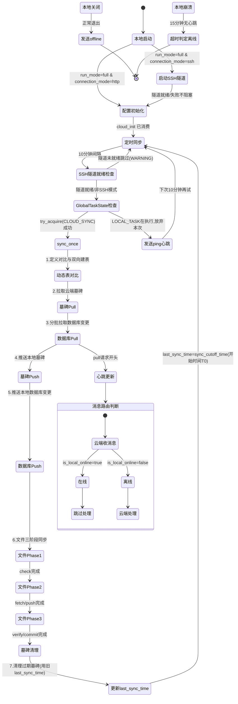

## 版本

| 版本 | 更新内容 |
| ---- | -------- |
| 3.0 | 同步对齐 spec v2.1（墓碑同步）和 ADR 2026-07-25（global_task_state + last_sync_time 改为开始时间 T0）：sync_once 流程从 4 步扩展为 7 步（含墓碑 Pull/Push/清理）；新增链路 5（全局任务状态互斥）和链路 6（SSH 模式 sync_once 路径）；新增反常设计 last_sync_time 更新点改为开始时间 T0；更新 Mermaid 图和 key_function |
| 2.0 | 链路 2 合并动态表定义对比与双向建表（`_sync_dynamic_tables_definitions`）；链路 3 替换为三阶段文件同步协议；更新 Mermaid 图和 key_function |
| 1.0 | 初始版本 |

# 数据流动：SyncData

**Flow 对象**：SyncData — 表示本地与云端之间的数据同步状态
**对应 Spec**：[`docs/specs/2026-07-16-data-sync-overview.md`](../specs/2026-07-16-data-sync-overview.md)

## SyncData 数据结构

```
# 同步配置
remote_url: str            # 云端服务器 URL（HTTP/HTTPS 模式实际使用；SSH 模式仅前端展示）
api_key: str               # 同步认证 Key（本地 keyring，云端 config.yaml）
last_sync_time: str        # 上次成功同步开始时间（ISO 8601 UTC），空字符串表示首次
sync_cutoff_time: str      # 本次 sync_once 的开始时间戳，作为末尾更新的 last_sync_time 值

# 同步范围
db_tables: list[str]       # 需同步的数据库表（静态 29 张 + 动态 custom_{slug}）
file_directories: list[str] # 需同步的目录/文件列表

# 同步状态（本地 SyncClient）
is_syncing: bool           # 当前是否正在同步中（threading.Lock 保护，仅防 sync 自身并发）

# 全局任务状态（GlobalTaskState 单例，ADR 2026-07-25）
global_task_state: TaskState  # IDLE / LOCAL_TASK / CLOUD_SYNC 三态枚举
                             # 跨"本地任务（10点/4h）vs 云端 sync_once"互斥
                             # threading.Condition 保护，跨线程安全

# SSH 隧道状态（SSHTunnel 实例，data-sync-ssh-tunnel-spec v1.0）
ssh_tunnel: SSHTunnel | None       # 隧道实例（None 表示未启动）
ssh_tunnel_state: ConnectionState  # DISCONNECTED/CONNECTING/CONNECTED/RECONNECTING/FAILED
connection_mode: str               # 'http' | 'ssh'，决定 _read_remote_url 返回值

# 心跳状态（云端 HeartbeatManager）
last_heartbeat: datetime   # 最近一次心跳时间
last_event: str            # 最近生命周期事件（'online' | 'offline' | 'ping'）
```

**关键字段说明**：
- `last_sync_time`：所有同步步骤（定义对比 + 墓碑 Pull/Push + 数据 Pull/Push + 文件三阶段 + 墓碑清理）全部成功后原子更新；任一步骤失败则不更新，下次从同一时间点重试
- `sync_cutoff_time`：**关键设计**——记录 sync_once 的开始时间（而非结束时间）作为下次 last_sync_time，避免 sync 期间其他任务（dreaming / AgentLoop）写入的数据被永久排除（详见反常设计"last_sync_time 更新点改为开始时间 T0"）
- `is_syncing`：原子 check-then-set 的并发控制标志，仅防止 sync_once 自身并发（启动同步 vs 定时同步 vs 手动触发）；不防止与本地任务（dreaming/backup）的冲突，后者由 `global_task_state` 负责
- `global_task_state`：跨任务互斥状态，云端 sync_once 启动前 `try_acquire(CLOUD_SYNC, timeout=0)`，本地任务（10点/4h）启动前 `try_acquire(LOCAL_TASK, timeout=300s)`
- `ssh_tunnel_state`：SSH 模式下 sync_once 是否可执行的判定依据，未就绪时 `_read_remote_url` 返回空字符串触发跳过
- `last_event`：`"offline"` 优先级最高，使 `is_local_online()` 立即返回 False，不等超时

## 与其他数据流的耦合

### SyncData ↔ ConfigInitState

**ConfigInitState 状态字段**：cloud_init.yaml 存在 / 已消费

**耦合关系**：

| SyncData 状态变化 | ConfigInitState 影响 | 触发位置 |
|-------------------|---------------------|----------|
| 首次生成 cloud_init.yaml | cloud_init.yaml 文件创建 | `CloudConfigGenerator.generate_cloud_config()` |
| 云端消费 cloud_init | cloud_init.yaml 删除 + config.yaml/providers.yaml 更新 | `CloudInitializer.initialize()` |

**说明**：SyncData 的云端配置初始化链路依赖 Config 模块的 CloudInitializer。cloud_init.yaml 是数据同步的"引导配置"，桥接了本地 config 和云端 config。

<key_function>
- lifeprism/config/cloud_config_generator.py
  - cloud_config_generator.CloudConfigGenerator.generate_cloud_config:55
  - cloud_config_generator.CloudConfigGenerator._collect_provider_keys:116
  - cloud_config_generator.CloudConfigGenerator._build_config:150
- lifeprism/config/cloud_initializer.py
  - cloud_initializer.CloudInitializer.initialize:91
  - cloud_initializer.CloudInitializer._validate:164
  - cloud_initializer.CloudInitializer._write_config_yaml:221
  - cloud_initializer.CloudInitializer._write_providers_yaml:255
</key_function>

### SyncData ↔ AgentExecutionTrace（WeChat Message）

**AgentExecutionTrace 状态字段**：消息处理中 / 已回复

**耦合关系**：

| SyncData 状态变化 | AgentExecutionTrace 影响 | 触发位置 |
|-------------------|------------------------|----------|
| 本地在线 (is_local_online=true) | 云端跳过微信消息处理 | `WeChatChannel.on_message_received()` |
| 本地离线 (is_local_online=false) | 云端接管微信消息处理 | `WeChatChannel.on_message_received()` |

**说明**：心跳状态直接影响 Agent 的消息路由决策。心跳和 Agent Loop 是并发的（各自独立的 asyncio Task / 线程），心跳管理器的线程安全通过 `threading.Lock` 保证。

<key_function>
- lifeprism/sync/heartbeat_manager.py
  - heartbeat_manager.HeartbeatManager.is_local_online:81
  - heartbeat_manager.HeartbeatManager.update_heartbeat:48
  - heartbeat_manager.HeartbeatManager.set_event:63
</key_function>

### SyncData ↔ SSHTunnel

**SSHTunnel 状态字段**：`_state`（DISCONNECTED/CONNECTING/CONNECTED/RECONNECTING/FAILED）

**耦合关系**：

| SyncData 状态变化 | SSHTunnel 影响 | 触发位置 |
|-------------------|---------------|---------|
| sync_once 读取 remote_url | SSH 模式 + 隧道就绪 → 返回 `http://localhost:{local_port}` | `sync_client.SyncClient._read_remote_url:382` |
| sync_once 读取 remote_url | SSH 模式 + 隧道未就绪 → 返回空字符串触发跳过 | `sync_client.SyncClient._read_remote_url:401` |
| 定时同步循环入口 | `_ensure_tunnel_ready()` 检查隧道状态，未就绪跳过本次 | `sync_client.SyncClient._run_sync_loop:217` |

**说明**：SSH 隧道对 sync_once 是透明的——所有 HTTP 请求代码不变，仅 `_read_remote_url()` 入口条件性切换 remote_url。HTTP/HTTPS 模式下 `_should_use_ssh_tunnel()` 返回 False，所有 SSH 相关代码被跳过。详见 [2026-07-26-ssh-tunnel-flow](./2026-07-26-ssh-tunnel-flow.md) 链路 4。

<key_function>
- lifeprism/sync/sync_client.py
  - sync_client.SyncClient._should_use_ssh_tunnel:254
  - sync_client.SyncClient._is_tunnel_ready:273
  - sync_client.SyncClient._ensure_tunnel_ready:281
  - sync_client.SyncClient._read_remote_url:382
</key_function>

### SyncData ↔ GlobalTaskState

**GlobalTaskState 状态字段**：`_state`（IDLE / LOCAL_TASK / CLOUD_SYNC）

**耦合关系**：

| SyncData 状态变化 | GlobalTaskState 影响 | 触发位置 |
|-------------------|---------------------|---------|
| 启动同步 sync_once 入口 | `try_acquire(CLOUD_SYNC, timeout=0)`，失败放弃本次 + 调 ping | `server.main._start_sync_on_startup` / `sync_client._run_sync_loop:232` |
| 定时同步 sync_once 入口 | 同上 | `sync_client.SyncClient._run_sync_loop:232` |
| 手动 API 触发 sync_once 入口 | 同上 | `server.api.sync_status_api` |
| sync_once 完成或异常 | `release()` 唤醒等待 LOCAL_TASK 的任务 | finally 块 |

**说明**：global_task_state 解决"本地任务（10点序列 dreaming+backup / 4h process_session_message）与云端 sync_once 之间的全局互斥"。`SyncClient._is_syncing` 仅防 sync 自身并发，不防与本地任务的冲突；GlobalTaskState 补足此缺口。sync_once 遇 LOCAL_TASK 时**放弃本次**（不等待），调 `POST /api/sync/heartbeat event=ping` 报告在线，下次 10 分钟定时再 sync。详见 ADR [2026-07-25-global-task-state](../adr/2026-07-25-global-task-state.md) 决策 4。

<key_function>
- lifeprism/server/services/global_task_state.py
  - global_task_state.GlobalTaskState.try_acquire:106
  - global_task_state.GlobalTaskState.release:144
- lifeprism/sync/sync_client.py
  - sync_client.SyncClient.send_ping:144
  - sync_client.SyncClient._run_sync_loop:193
- lifeprism/server/main.py
  - main._start_sync_on_startup:314
</key_function>

## 流程概览



## 数据流节点

**业务场景说明**：
- **链路1**：云端配置初始化 — 本地生成 cloud_init.yaml → 云端消费
- **链路2**：数据库同步 — 动态表定义对比 → 双向建表 → 墓碑 Pull → 数据 Pull → 墓碑 Push → 数据 Push（墓碑同步穿插在数据同步前后）
- **链路3**：文件同步 — 三阶段 check → fetch/push → verify/commit
- **链路4**：心跳与消息路由 — 心跳维护 + 消息处理决策
- **链路5**：全局任务状态互斥 — sync_once 启动前 try_acquire(CLOUD_SYNC)，遇 LOCAL_TASK 放弃 + 调 ping
- **链路6**：SSH 模式下 sync_once 路径 — _read_remote_url 拦截 + 隧道未就绪跳过

## 链路 1：云端配置初始化

### 1.1 本地生成（CloudConfigGenerator）

```
1. CloudConfigGenerator.generate_cloud_config()
   生成完整的 cloud_init.yaml 配置文件
   状态: 初始 → cloud_init.yaml 文件已创建 | 持久化: ✅ | 跨模块: config → sync
   步骤: 解析同步 API Key（keyring 已有或新生成 secrets.token_urlsafe(32)）
         → 遍历所有 provider 收集 api_key（遍历 get_all_providers → get_api_key）
         → 读取微信 Token（WechatAuth._load_token_from_keyring）
         → 构建配置 dict（_build_config: llm.provider=display_name, providers[].name=内部name）
         → YAML 写入 {lifeprism_data_path}/cloud_init.yaml
```

```
2. CloudConfigGenerator._build_config()
   构建 cloud_init.yaml 的配置字典
   状态: 无状态 | 持久化: ❌ | 跨模块: ❌
   步骤: llm.provider 直接取 settings.get("provider")（display_name，如 "Xiaomi MIMO"）
         → llm.model 取 settings.get("model")
         → providers 列表每项含 name（内部名，如 "xiaomi_mimo"）、env_key、api_key
         → monitor_type 强制为 "none"
```

### 1.2 云端消费（CloudInitializer）

```
3. CloudInitializer.should_initialize()
   检测 {data_path}/cloud_init.yaml 是否存在
   状态: 无状态 | 持久化: ❌ | 跨模块: ❌
```

```
4. CloudInitializer.initialize()
   执行云端配置初始化主流程
   状态: cloud_init 待消费 → config/providers 已写入 → cloud_init 已删除 | 持久化: ✅ | 跨模块: config
   步骤: 读取 cloud_init.yaml（_read_cloud_init）
         → 验证配置完整性（_validate：必需字段 + provider 匹配）
         → 写入 config.yaml（_write_config_yaml：合并策略，monitor_type 强制 none）
         → 写入 providers.yaml（_write_providers_yaml：按 name 匹配注入 api_key）
         → 删除 cloud_init.yaml（验证失败时保留）
```

**分支节点**：
- `_validate()` 中 llm.provider 为 display_name 时：通过 `provider_manager.get_provider_id()` 转为内部 name 后匹配 providers[].name
- `_validate()` 失败：抛出 ConfigError，不删除 cloud_init.yaml
- `_write_providers_yaml()` 中 provider name 匹配：找到 → 只注入 api_key；未找到 → 追加完整 spec（仅 name/env_key/api_key 三字段）

## 链路 2：数据库同步

<key_function>
- lifeprism/sync/sync_client.py
  - sync_client.SyncClient.sync_once:408
  - sync_client.SyncClient._sync_dynamic_tables_definitions:1034
  - sync_client.SyncClient._create_local_dynamic_tables:1114
  - sync_client.SyncClient._rebuild_remote_dynamic_tables:1145
  - sync_client.SyncClient._pull_deletion_log:513
  - sync_client.SyncClient.pull_from_remote:1193
  - sync_client.SyncClient._push_deletion_log:594
  - sync_client.SyncClient.push_to_remote:1332
  - sync_client.SyncClient._cleanup_deletion_log:636
- lifeprism/repository/sync_repository.py
  - sync_repository.SyncRepository.query_incremental:236
  - sync_repository.SyncRepository.upsert_rows:591
  - sync_repository.SyncRepository.upsert_rows_with_lww:807
  - sync_repository.SyncRepository.batch_get_existing_updated_at:669
  - sync_repository.SyncRepository.execute_tombstone_delete:493
  - sync_repository.SyncRepository.execute_tombstone_delete_with_cursor:553
  - sync_repository.SyncRepository.create_local_data_tables
  - sync_repository.SyncRepository.rebuild_dynamic_tables
- lifeprism/repository/providers/deletion_log_provider.py
  - deletion_log_provider.get_tombstone_with_cursor:158
  - deletion_log_provider.create_tombstone_with_cursor:191
  - deletion_log_provider.get_tombstones_since:238
  - deletion_log_provider.cleanup_before:375
</key_function>

```
5. SyncClient.start_scheduled_sync(600)
   启动后台定时同步（asyncio.create_task）
   状态: 无状态 | 持久化: ❌ | 跨模块: ❌
   步骤: 等待 interval_seconds → try_start_sync（原子获取锁）
         → asyncio.to_thread(sync_once)（避免阻塞事件循环）
         → finish_sync（释放锁）
```

```
6. SyncClient.sync_once()
   执行一次完整同步（7 步顺序，对齐 data-sync-core-spec v2.1）
   状态: last_sync_time 未更新 → last_sync_time 已更新为 sync_cutoff_time（开始时间） | 持久化: ✅ | 跨模块: 本地 → 云端
   步骤: 读取配置（_read_remote_url 拦截 SSH 模式 + api_key + last_sync_time + sync_cutoff_time）
         → 1. _sync_dynamic_tables_definitions（动态表定义对比与双向建表）
         → 2. _pull_deletion_log（墓碑 Pull：HTTP 拉取 → 事务内 LWW 检查 + DELETE + 写副本）
         → 3. pull_from_remote（分批拉取数据库变更，LWW 过滤）
         → 4. _push_deletion_log（墓碑 Push：本地 source=local 墓碑 → HTTP 推送云端独立事务处理）
         → 5. push_to_remote（推送本地数据库变更）
         → 6. _sync_files_full_flow（文件三阶段同步）
         → 7. _cleanup_deletion_log（清理本地+云端 created_at <= 旧 last_sync_time 的墓碑）
         → 全部成功后 set_setting("sync.last_sync_time", sync_cutoff_time)
   顺序原因:
     - 墓碑 Pull 在数据 Pull 之前：避免云端已删记录被数据 Pull 写回
     - 墓碑 Push 在数据 Push 之前：确保云端先收到删除意图再处理数据变更
     - 墓碑清理在更新 last_sync_time 之前：用旧 last_sync_time 清理过期墓碑，刚 Pull/Push 的墓碑不会被误清
     - last_sync_time 用 sync_cutoff_time（开始时间 T0）：见反常设计说明
```

### 2.1 动态表定义对比与双向建表

```
6.1 SyncClient._sync_dynamic_tables_definitions(remote_url, api_key)
    拉取云端动态表定义 → slug 集合对比 → 双向建表
    状态: 动态表列表更新 | 持久化: ✅（本地 DDL + 云端重建） | 跨模块: 本地 ↔ 云端
    步骤: GET /api/sync/dynamic-tables-definitions → 获取云端 types [{slug, fields}]
         → 查询本地 custom_record_types 获取本地 slugs
         → 云端有但本地无的 slug → _create_local_dynamic_tables（本地建 DDL，不写 meta）
         → 本地有但云端无的 slug → _rebuild_remote_dynamic_tables（POST 全量发送给云端）
         → 两端一致的 slug → 不操作
         → 返回同步表列表（静态表 + 动态 custom_{slug}）
```

```
6.2 SyncClient._create_local_dynamic_tables(slug_to_fields)
    本地建动态数据表（只执行 DDL）
    状态: 本地 custom_* 表已创建 | 持久化: ✅（CREATE TABLE IF NOT EXISTS） | 跨模块: ❌
    步骤: 委托 SyncRepository.create_local_data_tables(slug_to_fields)
         → 表已存在 → 跳过（不报错）
         → 表不存在 → generate_create_table_ddl(slug, fields) → cursor.execute(ddl)
         注意: 不写 custom_record_types / custom_record_fields meta 数据，让 pull 阶段统一拉取
```

```
6.3 SyncClient._rebuild_remote_dynamic_tables(remote_url, api_key)
    发送本地定义给云端全量重建
    状态: 云端动态表已更新 | 持久化: ❌（云端执行） | 跨模块: 本地 → 云端
    步骤: 查询本地 custom_record_types + custom_record_fields
         → 组装 types [{slug, fields}]
         → POST /api/sync/rebuild-dynamic-tables
```

```
6.4 SyncCloudAPI.sync_rebuild_dynamic_tables()
    云端处理动态表重建请求
    状态: 云端 custom_* 表已创建/跳过 | 持久化: ✅ | 跨模块: 本地 HTTP → 云端 DB
    步骤: 委托 SyncRepository.rebuild_dynamic_tables(types)
         → 按 slug 逐个 CREATE（表不存在时）/ SKIP（表已存在时）
         注意: 不执行 DROP TABLE（孤儿表清理需要独立的 tombstone 机制）
```

**分支节点**：
- 云端有但本地无的 slug：本地建 DDL（不写 meta）
- 本地有但云端无的 slug：发送重建请求给云端
- 两端 slug 一致：不触发任何操作，直接进入 pull/push

### 2.2 墓碑 Pull（删除传播 Pull）

**业务场景**：在数据 Pull 之前拉取云端墓碑（`deletion_log` 表 `source=cloud` 的记录），本地执行 DELETE 并写副本，避免云端已删记录被数据 Pull 写回。

```
6.5 SyncClient._pull_deletion_log(remote_url, api_key, last_sync_time)
    墓碑 Pull：HTTP 拉取（事务外）→ 事务内 LWW 检查 + DELETE + 写副本
    状态: 本地 deletion_log 表新增 source=cloud 副本 + 目标表 DELETE | 持久化: ✅（事务） | 跨模块: 云端 → 本地 DB
    步骤: POST /api/sync/pull-deletion-log {last_sync_time} → 获取 tombstones 列表
         → 事务内逐条处理:
           a. 存在性检查（get_tombstone_with_cursor）：本地已有同 (target_table, record_id) 墓碑 → 跳过（INSERT OR IGNORE 语义，不比较 updated_at）
           b. 执行 DELETE（execute_tombstone_delete_with_cursor）：AUTOINCREMENT 表按 hash_id 列、TEXT 主键表按主键列
           c. 写本地副本（create_tombstone_with_cursor）：source=cloud，保留原 created_at
         → conn.commit()（任一条失败则 rollback 整个事务，sync_once 抛异常不更新 last_sync_time）
```

```
6.6 SyncCloudAPI.sync_pull_deletion_log()
    云端处理墓碑 Pull 请求
    状态: 无状态变更 | 持久化: ❌ | 跨模块: 本地 HTTP → 云端 DB
    步骤: 查询 deletion_log 表 source=local 且 created_at > last_sync_time 的记录
         → 返回 {tombstones: [{id, target_table, record_id, source, created_at, updated_at}]}
         注意: 纯查询端点，无副作用；客户端事务包裹 DELETE + 写副本
```

**关键设计**：
- HTTP 在事务外（避免长事务占用连接）
- DELETE + 写副本在同一事务（保证原子性，失败则回滚）
- 不写墓碑（墓碑已在 Pull 时写入本地副本，避免循环触发同步）
- 已物理删除的记录云端 Pull 不返回（避免数据 Pull 写回已删记录）

### 2.3 数据 Pull 拉取

```
7. SyncClient.pull_from_remote(remote_url, api_key, last_sync_time, tables)
   从云端分批拉取增量数据
   状态: 本地数据未同步 → 本地数据已合并 | 持久化: ✅（upsert_rows） | 跨模块: 云端 → 本地 DB
   步骤: 对每张表 → 分批 POST /api/sync/pull（offset=0, limit=1000）
         → 批量查询本地已有记录的 updated_at（batch_get_existing_updated_at 单连接 IN 查询）
         → 内存 LWW 过滤（本地不存在 → 写入；本地未修改 → 覆盖；云端更晚 → 覆盖；本地更晚 → 保留；相等 → 跳过）
         → upsert_rows 写入过滤后的行 → offset += 1000 继续直到返回空
```

```
8. SyncCloudAPI.sync_pull()
   云端处理 Pull 请求
   状态: 心跳时间更新 | 持久化: ❌ | 跨模块: 本地 HTTP → 云端 DB
   步骤: 更新心跳（heartbeat_manager.update_heartbeat）
         → 对每个表执行 query_incremental(table, last_sync_time, offset, limit)
         → 返回 changes 和 sync_time
```

**分支节点**：
- 表有 updated_at 列：执行 LWW 过滤（含相等跳过）
- 表无 updated_at 列（mood_types 等）：直接 upsert_rows 全量覆盖
- 返回空 rows：本表拉取完成，切换到下一张表
- rows < batch_size：最后一批，切换到下一张表

### 2.4 墓碑 Push（删除传播 Push）

**业务场景**：在数据 Push 之前推送本地墓碑（`deletion_log` 表 `source=local` 的记录）到云端，云端对每条墓碑独立事务处理 LWW + DELETE + 写副本，确保云端先收到删除意图再处理数据变更。

```
8.5 SyncClient._push_deletion_log(remote_url, api_key, last_sync_time)
    墓碑 Push：查询本地 source=local 墓碑 → HTTP 推送到云端
    状态: 云端 deletion_log 新增 source=cloud 副本 + 目标表 DELETE | 持久化: ✅（云端事务） | 跨模块: 本地 DB → 云端
    步骤: 查询 deletion_log_repository.get_tombstones_since(last_sync_time, source="local")
         → POST /api/sync/push-deletion-log {tombstones}
         → 云端对每条墓碑独立事务处理（单条失败 raise 终止后续，已应用墓碑不回滚）
         → 本地无需在 Push 后清理墓碑（由 cleanup-deletion-log 端点统一清理）
```

```
8.6 SyncCloudAPI.sync_push_deletion_log()
    云端处理墓碑 Push 请求
    状态: 云端 deletion_log 表新增 + 目标表 DELETE | 持久化: ✅ | 跨模块: 本地 HTTP → 云端 DB
    步骤: 对每条墓碑独立事务:
         a. LWW 检查：本地已有同 (target_table, record_id) 墓碑 → INSERT OR IGNORE 跳过（不比较 updated_at）
         b. 执行 DELETE（execute_tombstone_delete）：按 HASH_ID_PREFIXES 判断列
         c. 写云端副本（source=cloud，保留原 created_at）
         → 返回 {success: bool, applied_count: int, skipped_count: int}
```

**事务边界**：每条墓碑独立事务，单条失败 raise 终止后续处理，已应用墓碑不回滚（依赖幂等重试）。

### 2.5 数据 Push 推送

```
9. SyncClient.push_to_remote(remote_url, api_key, tables)
   推送本地变更到云端
   状态: 本地变更已推送 | 持久化: ❌（云端写入） | 跨模块: 本地 DB → 云端
   步骤: 对每张有 updated_at 的表 → query_incremental(table, last_sync_time)
         → 组装 tables_data {table_name: [rows]}
         → POST /api/sync/push → response.raise_for_status()
```

```
10. SyncCloudAPI.sync_push()
    云端处理 Push 请求
    状态: 云端数据已更新 | 持久化: ✅（upsert_rows_with_lww） | 跨模块: 本地 HTTP → 云端 DB
    步骤: 对每个表执行 upsert_rows_with_lww(table_name, rows)
          → 返回 status 和 sync_time
```

### 2.6 墓碑清理

**业务场景**：sync_once 全部步骤成功后，在更新 last_sync_time 之前清理两端 `created_at <= 旧 last_sync_time` 的过期墓碑。用旧 last_sync_time（同步前的值）确保刚 Pull/Push 产生的墓碑（created_at > 旧 last_sync_time）不会被误清。

```
10.5 SyncClient._cleanup_deletion_log(remote_url, api_key, last_sync_time)
    墓碑清理：清理本地 + 云端 created_at <= last_sync_time 的记录
    状态: deletion_log 表行数减少 | 持久化: ✅ | 跨模块: 本地 DB ↔ 云端 DB
    步骤: 1. 清理本地（deletion_log_repository.cleanup_before(last_sync_time)）→ 返回 local_cleaned
         → 2. 清理云端（POST /api/sync/cleanup-deletion-log {last_sync_time}）→ 返回 cloud_cleaned
         注意: 清理非原子（先本地后云端 HTTP），若云端 HTTP 失败，本地已清而云端未清，
              下次 Pull 会重新拉回云端墓碑并重新执行 DELETE（幂等，无害但浪费）
```

```
10.6 SyncCloudAPI.sync_cleanup_deletion_log()
    云端处理墓碑清理请求
    状态: 云端 deletion_log 表行数减少 | 持久化: ✅ | 跨模块: 本地 HTTP → 云端 DB
    步骤: DELETE FROM deletion_log WHERE created_at <= last_sync_time
         → 返回 {success: bool, cleaned_count: int}
```

## 链路 3：文件同步（三阶段）

<key_function>
- lifeprism/sync/sync_client.py
  - sync_client.SyncClient._sync_files_full_flow:2401
- lifeprism/sync/constants.py
  - constants.SYNC_DIRECTORIES
  - constants.FILE_BATCH_SIZE
  - constants.safe_gzip_decompress
- lifeprism/sync/conflict_backup.py
  - conflict_backup.backup_conflict_versions
</key_function>

### Phase 1：快照交换

```
11. SyncClient._sync_files_full_flow()
    文件同步总入口，协调三阶段流程
    状态: 文件同步进行中 | 持久化: 阶段级 | 跨模块: 本地 FS ↔ 云端 FS
    步骤: Phase 1 — check（交换 hash 快照）
         → Phase 2a — 本地执行 11 状态矩阵判定
         → Phase 2b — fetch（拉取 PULL + CONFLICT 文件）
         → Phase 2c — push（推送 PUSH + AI 合并结果）
         → Phase 3 — verify + commit（一致性校验并推进 parent_hash）
```

```
12. POST /api/sync/pull-files/check
    云端按 mtime 过滤 + 返回 hash 快照和完整路径清单
    状态: 心跳时间更新 | 持久化: ❌ | 跨模块: 本地 HTTP → 云端 FS
    步骤: 遍历 directories → 排除 chat_history.json
         → 找到 mtime > last_sync_time 的文件 → 实时计算 current_hash
         → 从 file_sync_state 表读 parent_hash
         → 返回 files: [{path, parent_hash, current_hash}] + all_paths: [...]  + sync_time
         注意: all_paths 是 v2.3 新增字段，用于显式判断文件存在性（替代 local_parent is not None 猜测）
```

### Phase 2a：本地 11 状态矩阵判定

```
本地拿到云端 hash 快照后，结合自己的 file_sync_state 执行决策矩阵：
  判定 PUSH：本地新建 + 云端无此文件（#1）、云端从未同步（#5）、仅本地改（#7）
  判定 PULL：云端新建 + 本地无此文件（#2）、本地从未同步（#4）、仅云端改（#8）
  判定 CONFLICT：双方都新建（#3）、双方都改（#9）、parent 不一致（#10/11）
  判定 SKIP：双方都没改（#6）
  文件不在 all_paths 中 + 本地有此文件：PUSH（云端缺失，重新推送）
```

### Phase 2b：拉取内容

```
13. POST /api/sync/pull-files/fetch
    按路径拉取 PULL + CONFLICT 文件内容
    状态: 无状态 | 持久化: ❌ | 跨模块: 云端 FS → 本地 HTTP
    步骤: 请求 {paths: [...]} → 响应 {files: [{path, content(base64), parent_hash, current_hash}]}
         → 本地 base64 解码 + gzip 解压 + 写入文件
         → 立即计算 new_hash → 更新 file_sync_state (current_hash)
```

### Phase 2c：推送内容

```
14. POST /api/sync/push-files
    推送 PUSH 文件 + CONFLICT AI 合并结果
    状态: 云端文件已更新 | 持久化: ✅ | 跨模块: 本地 FS → 云端
    步骤: 本地 gzip 压缩 + base64 编码
         → 请求 {files: [{path, content, parent_hash, current_hash}]}
         → 云端路径安全检查 → base64 解码 + gzip 解压
         → 写入文件 → 立即计算 new_hash → 更新 file_sync_state
         → 返回 {results: [{path, action}]}
```

**冲突处理分支**：
- `.jsonl` 文件冲突：文件级 LWW，保留本地版本直接 PUSH 覆盖（不送 AI 合并）
- `.md` 文件冲突：构建 CONFLICT_RESOLVE InboundMessage → `asyncio.run_coroutine_threadsafe(bus.send(msg), loop)` → AI 合并 → write_file 写入
- 云端版本备份到 `sync_conflict/{timestamp}/{relative_path}`

### Phase 3：一致性校验

```
15. POST /api/sync/pull-files/verify
    验证两端文件内容一致
    状态: 无状态 | 持久化: ❌ | 跨模块: 云端 FS → 本地 HTTP
    步骤: 请求 {paths: [...]} → 云端实时计算 current_hash
         → 返回 {files: [{path, current_hash}]} → 本地比对
```

```
16. POST /api/sync/pull-files/commit
    确认同步完成，推进 parent_hash
    状态: parent_hash 推进 | 持久化: ✅（file_sync_state 更新） | 跨模块: 本地 HTTP → 云端 DB
    步骤: 请求 {paths: [...]} → 云端 file_sync_state: parent_hash = current_hash
         → 本地同样推进 → 返回 {status: "ok", committed: [...]}
```

## 链路 4：心跳与消息路由

```
17. HeartbeatManager.is_local_online()
    判断本地是否在线
   状态: 无状态变更 | 持久化: ❌ | 跨模块: ❌
   步骤: threading.Lock → _last_event == "offline" → False
         → _last_heartbeat is None → False
         → now() - _last_heartbeat > 900s → False
         → 其他 → True
```

```
18. HeartbeatManager.update_heartbeat() / set_event()
    更新心跳状态
   状态: last_heartbeat 更新 / last_event 更新 | 持久化: ❌（纯内存） | 跨模块: ❌
```

### 消息路由路径

```
云端 WeChat Channel
    │
    ├─ 本地在线 (is_local_online=true)：
    │     logger.info("本地在线，跳过云端处理")
    │     return（本地会处理此消息）
    │
    └─ 本地离线 (is_local_online=false)：
          agent_loop.process(message)（云端接管处理）
```

**心跳触发源**：
- 本地 `SyncClient.sync_once()` 的 pull 请求 → 云端 `sync_pull()` 开头调用 `update_heartbeat()`
- 本地 FastAPI 启动时 → `POST /api/sync/heartbeat {"event": "online"}`
- 本地 FastAPI 关闭时 → `POST /api/sync/heartbeat {"event": "offline"}`
- 本地 sync_once 因 LOCAL_TASK 冲突放弃时 → `POST /api/sync/heartbeat {"event": "ping"}`（仅更新心跳，不执行同步）

## 链路 5：全局任务状态互斥（sync_once 启动前的并发控制）

**业务场景**：sync_once 在三个入口（启动同步、定时同步、手动 API 触发）启动前都需要先 `try_acquire(CLOUD_SYNC, timeout=0)`。若 LOCAL_TASK 正在执行（10点序列 dreaming+backup / 4h process_session_message），放弃本次 sync + 调 ping 心跳报告在线，下次 10 分钟定时再 sync。详见 ADR [2026-07-25-global-task-state](../adr/2026-07-25-global-task-state.md) 决策 4。

**节点描述**：

```
18.5 SyncClient._run_sync_loop() 入口（定时同步）
    定时同步循环的并发控制
    状态: global_task_state IDLE→CLOUD_SYNC 或 保持 IDLE | 持久化: ❌ | 跨模块: sync→global_task_state
    步骤: asyncio.sleep(interval) → _ensure_tunnel_ready() 守卫 → _read_remote_url() 检查
         → try_start_sync()（防 sync 自身并发）
         → try_acquire(CLOUD_SYNC, timeout=0):
            ├─ 成功（IDLE → CLOUD_SYNC）→ asyncio.to_thread(sync_once) → finally release()
            └─ 失败（LOCAL_TASK 在跑）→ asyncio.to_thread(send_ping) 报告在线 → continue
```

```
18.6 SyncClient.send_ping()
    sync 因 LOCAL_TASK 冲突放弃时，向云端发送 ping 心跳
    状态: 云端 last_heartbeat 更新 | 持久化: ❌ | 跨模块: 本地 → 云端
    步骤: _read_remote_url() + get_sync_api_key() → POST /api/sync/heartbeat {"event": "ping"}
         → 云端 sync_heartbeat 端点仅更新心跳，不执行同步
```

```
18.7 main._start_sync_on_startup()（启动同步）
    LifePrism 启动时的并发控制
    状态: global_task_state IDLE→CLOUD_SYNC 或 保持 IDLE | 持久化: ❌ | 跨模块: server.main→global_task_state
    步骤: run_mode=="full" 守卫 → await sync_client._start_ssh_tunnel()（SSH 模式启动隧道）
         → try_start_sync() → try_acquire(CLOUD_SYNC, 0):
            ├─ 成功 → asyncio.to_thread(sync_once) → finally release()
            └─ 失败 → asyncio.to_thread(send_ping) 报告在线
         → start_scheduled_sync(600)（启动定时同步）
```

**为什么云端 sync 不等待 LOCAL_TASK**：
- sync_once 周期短（10 分钟），放弃一次成本低
- LOCAL_TASK 持锁时间长（dreaming 含 LLM 调用，可能 5-15 分钟），等待不划算
- ping 端点保持心跳，云端知道本地在线，下次 10 分钟会再 sync

**三处触发入口**（都要接入互斥）：
- `lifeprism/server/main.py:_start_sync_on_startup`（启动同步）
- `lifeprism/sync/sync_client.py:_run_sync_loop`（定时同步循环）
- `lifeprism/server/api/sync_status_api.py`（手动 API 触发）

## 链路 6：SSH 模式下 sync_once 路径（_read_remote_url 拦截）

**业务场景**：SSH 隧道模式下，sync_once 的所有 HTTP 请求都走 `http://localhost:{local_port}` 而非 `sync.remote_url` 配置值。拦截点在 `SyncClient._read_remote_url()`，对所有同步方法透明。隧道未就绪时返回空字符串触发跳过，不抛异常。详见 [2026-07-26-ssh-tunnel-flow](./2026-07-26-ssh-tunnel-flow.md) 链路 4。

**节点描述**：

```
19. SyncClient._read_remote_url()
    统一拦截入口：SSH 模式返回 localhost，未就绪返回空字符串
    状态: 无 | 持久化: ❌ | 跨模块: sync→settings_manager + sync→ssh_tunnel
    步骤: _should_use_ssh_tunnel() 三层守卫:
         ├─ False（HTTP/HTTPS 模式）→ 返回 sync.remote_url 配置值
         └─ True（SSH 模式）:
            ├─ _is_tunnel_ready()=True → 返回 "http://localhost:{local_port}"
            └─ _is_tunnel_ready()=False → logger.warning + 返回 ""（触发上层跳过）
```

```
19.5 sync_once / _run_sync_loop / send_ping 调用方
    所有需要 remote_url 的代码路径都必须通过 _read_remote_url() 获取
    状态: 无 | 持久化: ❌ | 跨模块: 无
    步骤: remote_url = self._read_remote_url()
         → if not remote_url: 跳过本次（sync_once 直接 return，_run_sync_loop continue）
         → httpx.post(f"{remote_url}/api/sync/...")
```

**三层守卫**（_should_use_ssh_tunnel）：
1. `run_mode == "full"`（云端 agent_only 不启动 SSH 隧道）
2. `sync.connection_mode == "ssh"`（默认 http）
3. `ssh_tunnel_private_key` 存在（keyring 中有私钥）

**SSH 模式下 sync.remote_url 配置的语义**：
| 用途 | SSH 模式行为 |
|------|------------|
| 前端展示"云端地址" | ✅ 显示用户填的真实地址 |
| 配置完整性检查 | ✅ 非空检查自然通过 |
| 实际 HTTP 请求 | ❌ 不使用，走 `http://localhost:8102` |
| 日志记录 | ✅ 显示真实地址 |

**编码约束**：所有需要 remote_url 的代码路径必须通过 `_read_remote_url()` 获取，禁止直接调用 `get_setting("sync.remote_url")`。详见 [sync-remote-url-access-rules](../coding-rules/sync-remote-url-access-rules.md)。

## 异常与清理

- **网络失败**：HTTP 请求异常（httpx.HTTPStatusError / RequestError）时，`sync_once()` 中的任一步骤失败会导致整个同步中断，last_sync_time 不更新，下次定时触发时从同一时间点重试
- **验证失败**：`CloudInitializer._validate()` 失败时抛出 ConfigError，cloud_init.yaml 不被删除（方便用户修复后重试）
- **并发同步**：`try_start_sync()` 返回 False 时，跳过本次定时触发，记录 WARNING 日志
- **同步锁异常释放**：`_run_sync_loop()` 中使用 try...finally 确保 `finish_sync()` 在异常时也能被调用
- **文件冲突异常**：AI 合并失败时保留本地版本，云端备份在 sync_conflict/ 中，下次同步重新触发 CONFLICT_RESOLVE
- **SSH 隧道未就绪**：`_read_remote_url()` 返回空字符串，sync_once 直接 return（不抛异常），下次定时同步会自动重试（隧道状态可能在中途恢复）
- **global_task_state 互斥失败**：`try_acquire(CLOUD_SYNC, 0)` 返回 False 时放弃本次 sync + 调 ping 心跳报告在线，下次 10 分钟定时再 sync
- **墓碑 Pull 事务失败**：`_pull_deletion_log` 内事务任一条失败则 rollback 整个事务，sync_once 抛异常不更新 last_sync_time
- **墓碑清理非原子**：先清本地后清云端 HTTP，若云端 HTTP 失败，本地已清而云端未清，下次 Pull 会重新拉回云端墓碑并重新执行 DELETE（幂等，无害但浪费）

## 反常设计说明

### 动态表建表不写 meta 数据

**设计意图**：本地建表应写入完整的 `custom_record_types` + `custom_record_fields` meta，保持与 `CustomRecordRepository.create_type` 一致。
**当前实现**：`_create_local_dynamic_tables` 只执行 `CREATE TABLE IF NOT EXISTS`（DDL），不写 meta 数据。
**为什么是反常的**：`custom_xxx` 数据表已存在但 `custom_record_types` 里没有对应记录。这会造成短暂的数据不一致窗口（建表后到 pull 拉取 meta 之间）。
**影响范围**：自定义记录 UI 在窗口期内看不到此类型。pull 完成后恢复正常。
**相关位置**：
- `lifeprism/sync/sync_client.py:SyncClient._create_local_dynamic_tables()` — 只执行 DDL
- `lifeprism/repository/sync_repository.py:SyncRepository.create_local_data_tables()` — 本地建表实现

### cloud_init.yaml 中 llm.provider 用 display_name 而 providers[].name 用内部 name

**设计意图**：cloud_init.yaml 是数据交换格式，两个字段应使用一致的命名体系。
**当前实现**：`llm.provider` 来自 `settings.get("provider")`（display_name），`providers[].name` 来自 provider spec（内部 name）。
**为什么是反常的**：同一个 YAML 文档中，同一个 provider 以两种不同的名称出现（`"Xiaomi MIMO"` vs `"xiaomi_mimo"`），增加了理解和调试成本。验证时需要做 `get_provider_id()` 转换才能匹配。
**影响范围**：`CloudInitializer._validate()` 中 provider 匹配逻辑。修复 bug 时曾因测试数据使用内部 name 而未能发现此问题。
**相关位置**：
- `lifeprism/config/cloud_config_generator.py:_build_config()` — 生成时不转换
- `lifeprism/config/cloud_initializer.py:_validate()` — 验证时手动转换
- `lifeprism/config/provider_manager.py:get_provider_id()` — 转换方法

### cloud_init.providers 中的 provider 不是完整的 ProviderSpec

**设计意图**：cloud_init.yaml 应包含足够信息让云端独立配置 provider。
**当前实现**：`CloudConfigGenerator._collect_provider_keys()` 只为每个 provider 包含 `name`、`env_key`、`api_key` 三个字段。而 `providers.yaml` 中完整的 ProviderSpec 包含 display_name、keywords、litellm_prefix 等十几个字段。
**为什么是反常的**：cloud_init 中的 provider 信息不完整，依赖云端 `providers.yaml` 中已有对应条目（通过 name 匹配注入 api_key）。如果云端 providers.yaml 中不存在该 name，会追加一个只有 3 个字段的不完整 spec。
**影响范围**：`CloudInitializer._write_providers_yaml()` 中 name 未匹配时的追加逻辑。正常情况下不会发生（云端 providers.yaml 由 DEFAULT_PROVIDER_CONFIG 生成，包含所有标准 provider）。
**相关位置**：
- `lifeprism/config/cloud_config_generator.py:_collect_provider_keys()` — 只收集 3 字段
- `lifeprism/config/cloud_initializer.py:_write_providers_yaml()` — 未匹配时追加不完整 spec

### last_sync_time 更新点改为开始时间 T0（而非结束时间）

**设计意图**：`last_sync_time` 应记录 sync_once 完成时间（结束时间 T_end），下次 sync 拉取 `updated_at > T_end` 的增量数据，避免重复拉取。
**当前实现**：`sync_once` 入口记录 `sync_cutoff_time = datetime.now(timezone.utc).isoformat()`（开始时间 T0），全部步骤成功后 `set_setting("sync.last_sync_time", sync_cutoff_time)`。下次 sync 拉取 `updated_at > T0` 的数据，包含本次 sync 期间其他任务写入的数据。
**为什么是反常的**：用开始时间而非结束时间会导致下次 sync 重复 Push 已 Push 过的数据（`updated_at > T0` 但实际已 Push）。常规设计应避免这种重复。
**影响范围**：下次 sync 会重复 Push 本次已 Push 过的数据，但云端 LWW 幂等处理（`updated_at` 相同跳过覆盖），无副作用。**关键收益**：避免 sync 期间其他任务（dreaming / AgentLoop）写入的数据被永久排除——若用结束时间 T_end，这些数据的 `updated_at` 落在 (T0, T_end) 区间，会被永久排除在下次 sync 之外。
**前提条件**：此设计依赖云端 LWW 幂等性（`updated_at` 相等跳过覆盖）和文件同步的 hash 矩阵自我纠正能力。若未来 LWW 改为非幂等（如 `updated_at` 相等也覆盖），需重新评估。
**相关位置**：
- `lifeprism/sync/sync_client.py:SyncClient.sync_once:441` — `sync_cutoff_time` 赋值
- `lifeprism/sync/sync_client.py:SyncClient.sync_once:506` — `set_setting("sync.last_sync_time", sync_cutoff_time)`
- ADR [2026-07-25-global-task-state](../adr/2026-07-25-global-task-state.md) 全局前提 4
- history-bugs [2026-07-25-sync-last-sync-time-update-point-data-loss](../history-bugs/2026-07-25-sync-last-sync-time-update-point-data-loss.md)

### SSH 模式下 sync.remote_url 配置值不用于实际请求

**设计意图**：`sync.remote_url` 是同步流程的核心配置，所有 HTTP 请求都应使用此值。
**当前实现**：SSH 模式下 `_read_remote_url()` 返回 `http://localhost:{local_port}` 而非 `sync.remote_url` 配置值。`sync.remote_url` 仍需填写（用于前端展示和配置完整性检查），但实际 HTTP 请求走 localhost。
**为什么是反常的**：配置值与实际使用值不一致，调试时容易误以为请求发往 `sync.remote_url` 指向的服务器，实际是 localhost。
**影响范围**：日志记录中显示真实地址（便于排查"连的是哪台服务器"），但实际请求走 SSH 隧道。用户需理解 SSH 模式下 `sync.remote_url` 的语义变化（仅展示和完整性检查，不用于实际请求）。
**相关位置**：
- `lifeprism/sync/sync_client.py:SyncClient._read_remote_url:400-405` — SSH 模式拦截
- `docs/coding-rules/sync-remote-url-access-rules.md` — 编码约束

### global_task_state 与 _is_syncing 共存（不整合）

**设计意图**：sync_once 的并发控制应由单一状态字段管理，避免双重锁的复杂性。
**当前实现**：`SyncClient._is_syncing`（threading.Lock 保护 bool）仅防 sync 自身并发（启动同步 vs 定时同步 vs 手动触发）；`GlobalTaskState`（threading.Condition 保护三态枚举）防与本地任务（dreaming/backup/4h）的冲突。sync_once 入口顺序：先 `try_start_sync()`（防 sync 自身并发）→ 再 `try_acquire(CLOUD_SYNC, timeout=0)`（防与 LOCAL_TASK 冲突）。
**为什么是反常的**：两个状态字段共同管理 sync_once 的并发控制，存在概念重叠。常规设计应整合为单一状态。
**影响范围**：开发者需理解两个字段的职责边界：`_is_syncing` 管 sync 内部并发，`GlobalTaskState` 管跨任务互斥。后续如需整合，可在 `GlobalTaskState` 稳定后再做（不在 ADR 2026-07-25 范围内）。
**相关位置**：
- `lifeprism/sync/sync_client.py:SyncClient.try_start_sync:124` — `_is_syncing` 守卫
- `lifeprism/server/services/global_task_state.py:GlobalTaskState.try_acquire` — `GlobalTaskState` 守卫
- ADR [2026-07-25-global-task-state](../adr/2026-07-25-global-task-state.md) 决策 8

## 相关文档

### Spec 文档
- **[数据同步模块总览]**：`docs/specs/2026-07-16-data-sync-overview.md` — 子模块架构、依赖规则、跨层交互
- **[数据库同步 + 动态表 + 墓碑 + 心跳路由]**：`docs/specs/2026-07-16-data-sync-core-spec.md` — 静态表、动态表、墓碑同步、心跳、配置初始化
- **[文件同步]**：`docs/specs/2026-07-16-data-sync-files-spec.md` — per-file version tracking、三阶段协议、AI 合并
- **[SSH 隧道]**：`docs/specs/2026-07-26-data-sync-ssh-tunnel-spec.md` — SSH 隧道连接管理、状态机、密钥存储

### Flow 文档
- **[SSH 隧道生命周期]**：`docs/flows/2026-07-26-ssh-tunnel-flow.md` — SSH 隧道启用、测试、启动、重连、关闭 6 条链路

### 架构文档
- **[Config 配置管理]**：`docs/specs/2026-07-06-config-settings-spec.md` — ProviderManager、双层命名体系
- **[Agent 执行引擎]**：`docs/specs/2026-07-06-llm-agent-spec.md` — AgentLoop 消息处理

### ADR
- **[同步系统决策时间线]**：`docs/adr/2026-07-27-sync-system-timeline.md`
- **[文件同步冲突处理]**：`docs/adr/2026-07-14-file-sync-conflict-resolution.md`
- **[动态表同步定义对比]**：`docs/adr/2026-07-16-dynamic-tables-sync-definition-comparison.md`
- **[LWW 冲突解决]**：`docs/adr/2026-07-09-lww-conflict-resolution.md`
- **[全局任务状态互斥]**：`docs/adr/2026-07-25-global-task-state.md` — GlobalTaskState 三态枚举、LOCAL_TASK/CLOUD_SYNC 互斥、超时降级策略
- **[墓碑同步]**：`docs/adr/2026-07-22-deletion-sync-tombstone.md` — 墓碑专用端点、INSERT OR IGNORE 跳过 LWW
- **[密钥存储策略]**：`docs/adr/2026-07-09-key-fallback-strategy.md` — storage key 路由机制（SSH 私钥存储复用）

### 编码规则
- **[SyncClient remote_url 访问规则]**：`docs/coding-rules/sync-remote-url-access-rules.md` — 禁止绕过 `_read_remote_url()` 的约束

### 已知限制
- **[SSH 隧道已知限制]**：`docs/known-limitations/ssh-tunnel-limitations.md` — 8 项 SSH 隧道设计限制
- **[云端安全限制]**：`docs/known-limitations/cloud-security-limitations.md` — 8102 端口暴露与 HTTPS 加密

### 历史Bug
- **[last_sync_time 更新点数据丢失]**：`docs/history-bugs/2026-07-25-sync-last-sync-time-update-point-data-loss.md` — last_sync_time 改为开始时间 T0 的根因
