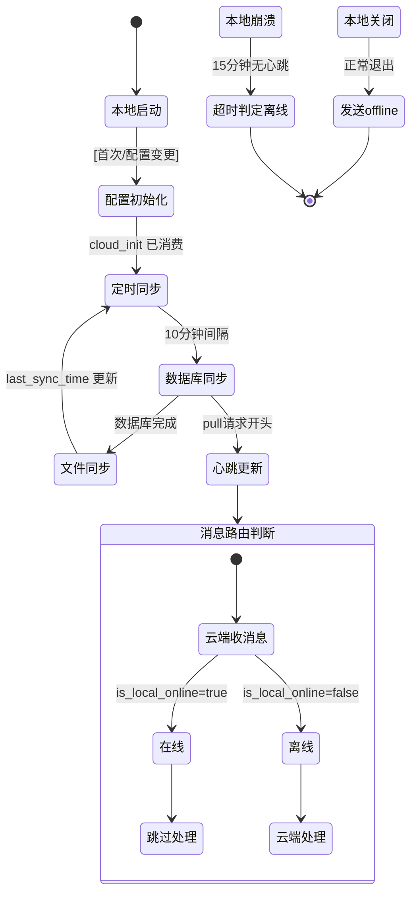

## 版本

| 版本 | 更新内容 |
| ---- | -------- |
| 1.0 | 初始版本 |

# 数据流：SyncData

**Flow 对象**：SyncData — 表示本地与云端之间的数据同步状态
**对应 Spec**：[`docs/specs/2026-07-11-data-sync-spec.md`](../specs/2026-07-11-data-sync-spec.md)

## SyncData 数据结构

```
# 同步配置
remote_url: str            # 云端服务器 URL
api_key: str               # 同步认证 Key（本地 keyring，云端 config.yaml）
last_sync_time: str        # 上次成功同步时间（ISO 8601），空字符串表示首次

# 同步范围
db_tables: list[str]       # 需同步的数据库表（静态 + 动态 custom_{slug}）
file_directories: list[str] # 需同步的目录/文件列表

# 同步状态（本地 SyncClient）
is_syncing: bool           # 当前是否正在同步中（threading.Lock 保护）

# 心跳状态（云端 HeartbeatManager）
last_heartbeat: datetime   # 最近一次心跳时间
last_event: str            # 最近生命周期事件（'online' | 'offline'）
```

**关键字段说明**：
- `last_sync_time`：所有同步步骤（数据库 pull/push + 文件 pull/push）全部成功后原子更新；任一步骤失败则不更新，下次从同一时间点重试
- `is_syncing`：原子 check-then-set 的并发控制标志，防止多任务重复同步
- `last_event`：`"offline"` 优先级最高，使 `is_local_online()` 立即返回 False，不等超时

## 与其他数据流的耦合

### SyncData ↔ ConfigInitState

**ConfigInitState 状态字段**：cloud_init.yaml 存在 / 已消费

**耦合关系**：

| SyncData 状态变化 | ConfigInitState 影响 | 触发位置 |
|-------------------|---------------------|----------|
| 首次生成 cloud_init.yaml | cloud_init.yaml 文件创建 | `CloudConfigGenerator.generate_cloud_config()` |
| 云端消费 cloud_init | cloud_init.yaml 删除 + config.yaml/providers.yaml 更新 | `CloudInitializer.initialize()` |

**说明**：SyncData 的云端配置初始化链路依赖 Config 模块的 CloudInitializer。cloud_init.yaml 是数据同步的"引导配置"，桥接了本地 config 和云端 config。

<key_function>
- lifeprism/config/cloud_config_generator.py
  - cloud_config_generator.CloudConfigGenerator.generate_cloud_config:38
  - cloud_config_generator.CloudConfigGenerator._collect_provider_keys:89
  - cloud_config_generator.CloudConfigGenerator._build_config:129
- lifeprism/config/cloud_initializer.py
  - cloud_initializer.CloudInitializer.initialize:81
  - cloud_initializer.CloudInitializer._validate:148
  - cloud_initializer.CloudInitializer._write_config_yaml:204
  - cloud_initializer.CloudInitializer._write_providers_yaml:255
</key_function>

### SyncData ↔ AgentExecutionTrace（WeChat Message）

**AgentExecutionTrace 状态字段**：消息处理中 / 已回复

**耦合关系**：

| SyncData 状态变化 | AgentExecutionTrace 影响 | 触发位置 |
|-------------------|------------------------|----------|
| 本地在线 (is_local_online=true) | 云端跳过微信消息处理 | `WeChatChannel.on_message_received()` |
| 本地离线 (is_local_online=false) | 云端接管微信消息处理 | `WeChatChannel.on_message_received()` |

**说明**：心跳状态直接影响 Agent 的消息路由决策。心跳和 Agent Loop 是并发的（各自独立的 asyncio Task / 线程），心跳管理器的线程安全通过 `threading.Lock` 保证。

<key_function>
- lifeprism/sync/heartbeat_manager.py
  - heartbeat_manager.HeartbeatManager.is_local_online:67
  - heartbeat_manager.HeartbeatManager.update_heartbeat:42
  - heartbeat_manager.HeartbeatManager.set_event:52
</key_function>

## 流程概览



## 数据流节点

**业务场景说明**：
- **链路1**：云端配置初始化 — 本地生成 cloud_init.yaml → 云端消费
- **链路2**：数据库同步 — Pull + Push 完整路径
- **链路3**：文件同步 — 增量文件 Pull + Push
- **链路4**：心跳与消息路由 — 心跳维护 + 消息处理决策

## 链路 1：云端配置初始化

### 1.1 本地生成（CloudConfigGenerator）

```
1. CloudConfigGenerator.generate_cloud_config()
   生成完整的 cloud_init.yaml 配置文件
   状态: 初始 → cloud_init.yaml 文件已创建 | 持久化: ✅ | 跨模块: config → sync
   步骤: 解析同步 API Key（keyring 已有或新生成 secrets.token_urlsafe(32)）
         → 遍历所有 provider 收集 api_key（遍历 get_all_providers → get_api_key）
         → 读取微信 Token（WechatAuth._load_token_from_keyring）
         → 构建配置 dict（_build_config: llm.provider=display_name, providers[].name=内部name）
         → YAML 写入 {lifeprism_data_path}/cloud_init.yaml
```

```
2. CloudConfigGenerator._build_config()
   构建 cloud_init.yaml 的配置字典
   状态: 无状态 | 持久化: ❌ | 跨模块: ❌
   步骤: llm.provider 直接取 settings.get("provider")（display_name，如 "Xiaomi MIMO"）
         → llm.model 取 settings.get("model")
         → providers 列表每项含 name（内部名，如 "xiaomi_mimo"）、env_key、api_key
         → monitor_type 强制为 "none"
```

### 1.2 云端消费（CloudInitializer）

```
3. CloudInitializer.should_initialize()
   检测 {data_path}/cloud_init.yaml 是否存在
   状态: 无状态 | 持久化: ❌ | 跨模块: ❌
```

```
4. CloudInitializer.initialize()
   执行云端配置初始化主流程
   状态: cloud_init 待消费 → config/providers 已写入 → cloud_init 已删除 | 持久化: ✅ | 跨模块: config
   步骤: 读取 cloud_init.yaml（_read_cloud_init）
         → 验证配置完整性（_validate：必需字段 + provider 匹配）
         → 写入 config.yaml（_write_config_yaml：合并策略，monitor_type 强制 none）
         → 写入 providers.yaml（_write_providers_yaml：按 name 匹配注入 api_key）
         → 删除 cloud_init.yaml（验证失败时保留）
```

**分支节点**：
- `_validate()` 中 llm.provider 为 display_name 时：通过 `provider_manager.get_provider_id()` 转为内部 name 后匹配 providers[].name
- `_validate()` 失败：抛出 ConfigError，不删除 cloud_init.yaml
- `_write_providers_yaml()` 中 provider name 匹配：找到 → 只注入 api_key；未找到 → 追加完整 spec（仅 name/env_key/api_key 三字段）

## 链路 2：数据库同步

```
5. SyncClient.start_scheduled_sync(600)
   启动后台定时同步（asyncio.create_task）
   状态: 无状态 | 持久化: ❌ | 跨模块: ❌
   步骤: 等待 interval_seconds → try_start_sync（原子获取锁）
         → asyncio.to_thread(sync_once)（避免阻塞事件循环）
         → finish_sync（释放锁）
```

```
6. SyncClient.sync_once()
   执行一次完整同步
   状态: last_sync_time 未更新 → last_sync_time 已更新 | 持久化: ✅ | 跨模块: 本地 → 云端
   步骤: 读取配置（remote_url、api_key、last_sync_time）
         → 获取同步表列表（get_all_sync_tables：静态表 + 动态 custom_{slug}）
         → pull_from_remote（分批拉取云端数据）
         → push_to_remote（推送本地变更到云端）
         → pull_files_from_remote + push_files_to_remote（文件同步）
         → 全部成功后 set_setting("sync.last_sync_time", current_time)
```

### 2.1 Pull 拉取

```
7. SyncClient.pull_from_remote(remote_url, api_key, last_sync_time, tables)
   从云端分批拉取增量数据
   状态: 本地数据未同步 → 本地数据已合并 | 持久化: ✅（upsert_rows） | 跨模块: 云端 → 本地 DB
   步骤: 对每张表 → 分批 POST /api/sync/pull（offset=0, limit=1000）
         → 批量查询本地已有记录的 updated_at（batch_get_existing_updated_at 单连接 IN 查询）
         → 内存 LWW 过滤（本地不存在 → 写入；本地未修改 → 覆盖；云端更晚 → 覆盖；本地更晚 → 保留）
         → upsert_rows 写入过滤后的行 → offset += 1000 继续直到返回空
```

```
8. SyncCloudAPI.sync_pull()
   云端处理 Pull 请求
   状态: 心跳时间更新 | 持久化: ❌ | 跨模块: 本地 HTTP → 云端 DB
   步骤: 更新心跳（heartbeat_manager.update_heartbeat）
         → 对每个表执行 query_incremental(table, last_sync_time, offset, limit)
         → 返回 changes 和 sync_time
```

**分支节点**：
- 表有 updated_at 列：执行 LWW 过滤
- 表无 updated_at 列（mood_types 等）：直接 upsert_rows 全量覆盖
- 返回空 rows：本表拉取完成，切换到下一张表
- rows < batch_size：最后一批，切换到下一张表

### 2.2 Push 推送

```
9. SyncClient.push_to_remote(remote_url, api_key, tables)
   推送本地变更到云端
   状态: 本地变更已推送 | 持久化: ❌（云端写入） | 跨模块: 本地 DB → 云端
   步骤: 对每张有 updated_at 的表 → query_incremental(table, last_sync_time)
         → 组装 tables_data {table_name: [rows]}
         → POST /api/sync/push → response.raise_for_status()
```

```
10. SyncCloudAPI.sync_push()
    云端处理 Push 请求
    状态: 云端数据已更新 | 持久化: ✅（upsert_rows_with_lww） | 跨模块: 本地 HTTP → 云端 DB
    步骤: 对每个表执行 upsert_rows_with_lww(table_name, rows)
          → 返回 status 和 sync_time
```

## 链路 3：文件同步

### 3.1 文件 Pull

```
11. SyncClient.pull_files_from_remote(remote_url, api_key, last_sync_time, directories)
    从云端拉取增量文件
   状态: 本地文件已更新 | 持久化: ✅（_write_file） | 跨模块: 云端 FS → 本地 FS
   步骤: POST /api/sync/pull-files（传递 last_sync_time 和 directories）
         → 对返回的 files 逐项调用 _write_file（base64 解码 + gzip 解压 + LWW mtime 比较 + 写文件）
```

```
12. SyncCloudAPI.sync_pull_files()
    云端处理文件 Pull 请求
   状态: 无状态 | 持久化: ❌ | 跨模块: 本地 HTTP → 云端 FS
   步骤: 遍历 directories → 单文件/目录递归 rglob
         → 比较 mtime > last_sync_time → gzip 压缩 + base64 编码
         → 路径安全检查（relative_to 防路径遍历攻击）
```

### 3.2 文件 Push

```
13. SyncClient.push_files_to_remote(remote_url, api_key, last_sync_time, directories)
    推送本地变更文件到云端
   状态: 本地变更文件已推送 | 持久化: ❌（云端写入） | 跨模块: 本地 FS → 云端
   步骤: _collect_changed_files（遍历 directories，找 mtime > last_sync_time 的文件）
         → 每个文件 gzip 压缩 + base64 编码
         → POST /api/sync/push-files
```

```
14. SyncCloudAPI.sync_push_files()
    云端处理文件 Push 请求
   状态: 云端文件已更新 | 持久化: ✅ | 跨模块: 本地 HTTP → 云端 FS
   步骤: 对每个文件 → 路径安全检查 → LWW mtime 比较（本地更新则跳过）
         → base64 解码 + gzip 解压 → 创建父目录 → 写入文件 → 设置 mtime
```

## 链路 4：心跳与消息路由

```
15. HeartbeatManager.is_local_online()
    判断本地是否在线
   状态: 无状态变更 | 持久化: ❌ | 跨模块: ❌
   步骤: threading.Lock → _last_event == "offline" → False
         → _last_heartbeat is None → False
         → now() - _last_heartbeat > 900s → False
         → 其他 → True
```

```
16. HeartbeatManager.update_heartbeat() / set_event()
    更新心跳状态
   状态: last_heartbeat 更新 / last_event 更新 | 持久化: ❌（纯内存） | 跨模块: ❌
```

### 消息路由路径

```
云端 WeChat Channel
    │
    ├─ 本地在线 (is_local_online=true)：
    │     logger.info("本地在线，跳过云端处理")
    │     return（本地会处理此消息）
    │
    └─ 本地离线 (is_local_online=false)：
          agent_loop.process(message)（云端接管处理）
```

**心跳触发源**：
- 本地 `SyncClient.sync_once()` 的 pull 请求 → 云端 `sync_pull()` 开头调用 `update_heartbeat()`
- 本地 FastAPI 启动时 → `POST /api/sync/heartbeat {"event": "online"}`
- 本地 FastAPI 关闭时 → `POST /api/sync/heartbeat {"event": "offline"}`

## 异常与清理

- **网络失败**：HTTP 请求异常（httpx.HTTPStatusError / RequestError）时，`sync_once()` 中的任一步骤失败会导致整个同步中断，last_sync_time 不更新，下次定时触发时从同一时间点重试
- **验证失败**：`CloudInitializer._validate()` 失败时抛出 ConfigError，cloud_init.yaml 不被删除（方便用户修复后重试）
- **并发同步**：`try_start_sync()` 返回 False 时，跳过本次定时触发，记录 WARNING 日志
- **同步锁异常释放**：`_run_sync_loop()` 中使用 try...finally 确保 `finish_sync()` 在异常时也能被调用
- **时区不一致风险**：LWW 冲突解决依赖 `updated_at` 和 `mtime` 时间戳比较。当前假设本地和云端使用相同时区（系统默认），但如果云端部署在海外服务器，时间戳可能采用不同时区（如 UTC），导致 LWW 比较失效。**潜在解决方案**：增加全局时区配置（如 `timezone: "Asia/Shanghai"`），前端和后端统一使用该时区生成时间戳

## 反常设计说明

### cloud_init.yaml 中 llm.provider 用 display_name 而 providers[].name 用内部 name

**设计意图**：cloud_init.yaml 是数据交换格式，两个字段应使用一致的命名体系。
**当前实现**：`llm.provider` 来自 `settings.get("provider")`（display_name），`providers[].name` 来自 provider spec（内部 name）。
**为什么是反常的**：同一个 YAML 文档中，同一个 provider 以两种不同的名称出现（`"Xiaomi MIMO"` vs `"xiaomi_mimo"`），增加了理解和调试成本。验证时需要做 `get_provider_id()` 转换才能匹配。
**影响范围**：`CloudInitializer._validate()` 中 provider 匹配逻辑。修复 bug 时曾因测试数据使用内部 name 而未能发现此问题。
**相关位置**：
- `lifeprism/config/cloud_config_generator.py:_build_config()` — 生成时不转换
- `lifeprism/config/cloud_initializer.py:_validate()` — 验证时手动转换
- `lifeprism/config/provider_manager.py:get_provider_id()` — 转换方法

### cloud_init.providers 中的 provider 不是完整的 ProviderSpec

**设计意图**：cloud_init.yaml 应包含足够信息让云端独立配置 provider。
**当前实现**：`CloudConfigGenerator._collect_provider_keys()` 只为每个 provider 包含 `name`、`env_key`、`api_key` 三个字段。而 `providers.yaml` 中完整的 ProviderSpec 包含 display_name、keywords、litellm_prefix 等十几个字段。
**为什么是反常的**：cloud_init 中的 provider 信息不完整，依赖云端 `providers.yaml` 中已有对应条目（通过 name 匹配注入 api_key）。如果云端 providers.yaml 中不存在该 name，会追加一个只有 3 个字段的不完整 spec。
**影响范围**：`CloudInitializer._write_providers_yaml()` 中 name 未匹配时的追加逻辑。正常情况下不会发生（云端 providers.yaml 由 DEFAULT_PROVIDER_CONFIG 生成，包含所有标准 provider）。
**相关位置**：
- `lifeprism/config/cloud_config_generator.py:_collect_provider_keys()` — 只收集 3 字段
- `lifeprism/config/cloud_initializer.py:_write_providers_yaml()` — 未匹配时追加不完整 spec

## 相关文档

### Spec 文档
- **[数据同步模块规格]**：`docs/specs/2026-07-11-data-sync-spec.md` — 数据同步模块的技术契约

### 架构文档
- **[Config 配置管理]**：`docs/specs/2026-07-06-config-settings-spec.md` — ProviderManager、双层命名体系
- **[Agent 执行引擎]**：`docs/specs/2026-07-06-llm-agent-spec.md` — AgentLoop 消息处理

### ADR
- **[Linux 部署 PRD P2]**：`.scratch/linux-deployment-discussion/linux-deployment-prd.md` — 数据同步方案原始设计
