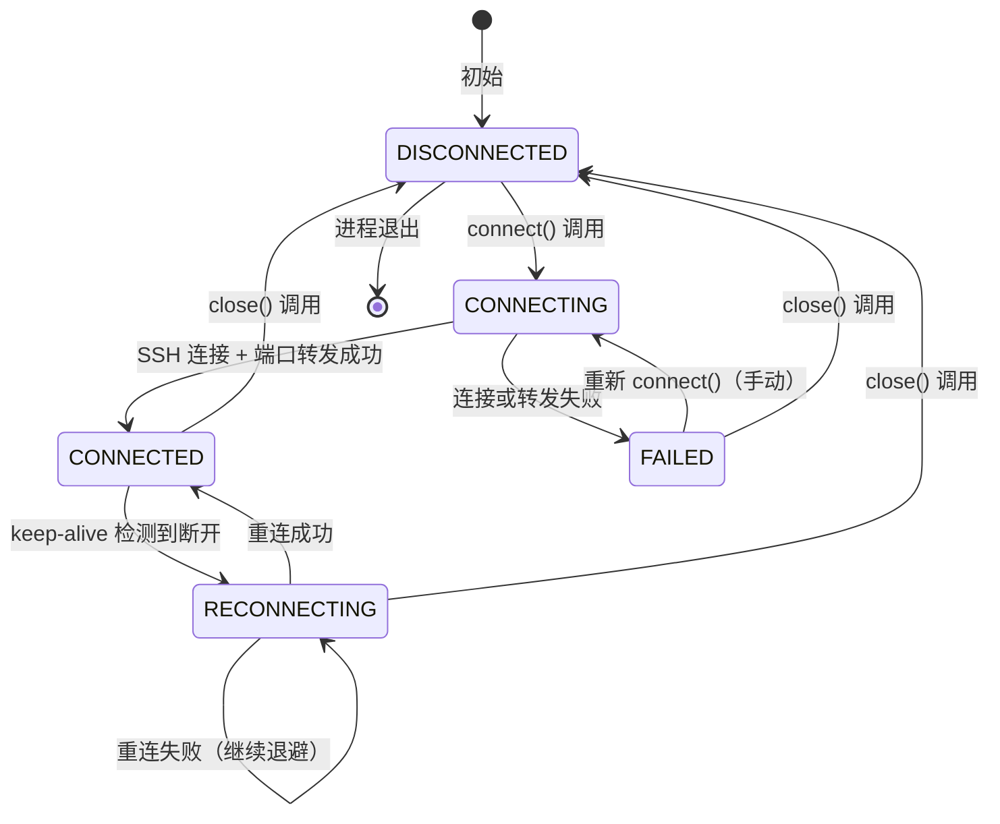

## 版本

| 版本 | 更新内容 |
| ---- | -------- |
| 1.1 | 反常设计 5 从"依赖 asyncssh 内部回退"改为"显式禁用 GSSAPI"（`asyncssh.connect` 传 `options=SSHClientConnectionOptions(gss_host='')`），修复 PyInstaller 打包环境 `No module named 'win32timezone'` 导致 SSH 隧道启动失败 |
| 1.0 | 创建文档初稿，覆盖 SSH 隧道 6 条生命周期链路 |

# 数据流：SSHTunnel 生命周期

**Flow 对象**：SSHTunnel 实例（由 SyncClient._ssh_tunnel 引用）
**对应 Spec**：[2026-07-26-data-sync-ssh-tunnel-spec](../specs/2026-07-26-data-sync-ssh-tunnel-spec.md)

## SSHTunnel 数据结构

```
# 基本信息（构造时传入）
host: str                    # SSH 服务器地址
port: int                    # SSH 端口
username: str                # SSH 用户名
private_key: str             # SSH 私钥（PEM 格式字符串）
local_port: int              # 本地监听端口
remote_host: str             # 远程目标主机（通常是 127.0.0.1）
remote_port: int             # 远程目标端口

# 状态跟踪
_state: ConnectionState      # 状态机枚举（disconnected/connecting/connected/reconnecting/failed）
_connection: SSHClientConnection | None  # asyncssh 连接对象
_forwarder: SSHListener | None           # 本地端口转发监听器
_reconnect_attempts: int                 # 重连尝试次数（成功后重置为 0）
_closed: bool                           # 控制保活循环退出的标志（close() 时置 True）
```

**关键字段说明**：
- `_state`：状态机核心字段，外部通过 `connection_state` property 观察，所有状态变化都在 `connect()` / `close()` / `start_keep_alive_loop()` / `_reconnect_with_backoff()` 内显式赋值
- `_connection` / `_forwarder`：asyncssh 库对象，需在 `close()` 时按顺序关闭（先关 forwarder 再关 connection）
- `_closed`：标志位，`close()` 设置为 True 后 keep_alive_loop 下次循环检查时退出，避免直接 cancel task 导致资源泄漏
- `_reconnect_attempts`：重连计数，用于退避序列选择 `BACKOFF_INTERVALS[min(attempts, len-1)]`，成功后重置为 0

## 与其他数据流的耦合

### SSHTunnel ↔ SyncClient

**SyncClient 状态字段**：
- `_ssh_tunnel: SSHTunnel | None`：隧道实例引用
- `_ssh_tunnel_keep_alive_task: asyncio.Task | None`：keep-alive 后台任务引用

**耦合关系**：

| SyncClient 状态变化 | SSHTunnel 影响 | 触发位置 |
|---------------------|----------------|---------|
| 启动调用 `_start_ssh_tunnel()` | 创建 SSHTunnel 实例 → connect() → start_keep_alive_loop() | `sync_client.SyncClient._start_ssh_tunnel:294` |
| 关闭调用 `_stop_ssh_tunnel()` | 调用 tunnel.close() → 等待 keep-alive 任务退出 → 清理引用 | `sync_client.SyncClient._stop_ssh_tunnel:349` |
| `_read_remote_url()` 读取隧道状态 | 通过 `tunnel.is_connected` 判断是否走 localhost | `sync_client.SyncClient._read_remote_url:382` |
| `sync_once()` 调用前 | 通过 `_ensure_tunnel_ready()` 非阻塞检查 | `sync_client.SyncClient.sync_once:430` |

**说明**：SyncClient 持有 SSHTunnel 实例的强引用，避免被 GC 回收；keep-alive 任务通过 `asyncio.create_task` 创建后也持有引用，必须在 `_stop_ssh_tunnel` 中显式 await（带超时）确保任务退出。

### SSHTunnel ↔ settings_manager

**settings_manager 配置字段**：
- `sync.connection_mode`：连接方式（http / ssh）
- `sync.ssh_tunnel.*`：SSH 隧道参数（host/port/username/local_port/remote_host/remote_port）
- storage key `ssh_tunnel_private_key`：私钥 PEM 字符串

**耦合关系**：

| SSHTunnel 操作 | settings_manager 读取 | 触发位置 |
|---------------|----------------------|---------|
| 构造时读取配置 | `_start_ssh_tunnel` 内读取 6 个 sync.ssh_tunnel.* 字段和 1 个 storage key | `sync_client.SyncClient._start_ssh_tunnel:314-320` |
| `_read_remote_url` 拦截 | 读取 `sync.ssh_tunnel.local_port` 和 `sync.connection_mode` | `sync_client.SyncClient._read_remote_url:400-405` |
| 守卫判断 | 读取 `run_mode`、`sync.connection_mode`、`ssh_tunnel_private_key` | `sync_client.SyncClient._should_use_ssh_tunnel:267-271` |

### SSHTunnel ↔ SSH 隧道管理 API

**API 层调用关系**：

| API 端点 | SSHTunnel 操作 | 触发位置 |
|---------|---------------|---------|
| `POST /enable` | 不直接调用 SSHTunnel，仅生成/派生密钥 | `ssh_tunnel_api.enable_ssh_tunnel:55` |
| `GET /public-key` | 不直接调用 SSHTunnel，仅派生公钥 | `ssh_tunnel_api.get_ssh_public_key:91` |
| `POST /test` | 创建临时 SSHTunnel 实例 → test_connection() | `ssh_tunnel_api.test_ssh_tunnel:116` |

<key_function>
- lifeprism/sync/ssh_tunnel.py
  - ssh_tunnel.SSHTunnel.__init__:92
  - ssh_tunnel.SSHTunnel.connect:138
  - ssh_tunnel.SSHTunnel.close:261
  - ssh_tunnel.SSHTunnel.start_keep_alive_loop:295
  - ssh_tunnel.SSHTunnel._reconnect_with_backoff:315
  - ssh_tunnel.SSHTunnel.test_connection:354
  - ssh_tunnel.SSHTunnel._close_resources:272
- lifeprism/sync/sync_client.py
  - sync_client.SyncClient._should_use_ssh_tunnel:254
  - sync_client.SyncClient._is_tunnel_ready:273
  - sync_client.SyncClient._ensure_tunnel_ready:281
  - sync_client.SyncClient._start_ssh_tunnel:294
  - sync_client.SyncClient._stop_ssh_tunnel:349
  - sync_client.SyncClient._read_remote_url:382
- lifeprism/server/api/ssh_tunnel_api.py
  - ssh_tunnel_api.enable_ssh_tunnel:55
  - ssh_tunnel_api.get_ssh_public_key:91
  - ssh_tunnel_api.test_ssh_tunnel:116
- lifeprism/server/main.py
  - main._start_ssh_tunnel 调用:349
  - main._stop_ssh_tunnel 调用:579
- lifeprism/config/settings_manager.py
  - settings_manager.SettingsManager.get_storage_key:483
  - settings_manager.SettingsManager.set_storage_key:502
</key_function>

## 流程概览



## 数据流节点

**业务场景说明**：
- 链路 1：用户切换到 SSH 模式（前端 enable → 后端生成密钥 → 返回公钥）
- 链路 2：用户点击测试连接（前端 test → 后端 SSHTunnel.test_connection）
- 链路 3：SyncClient 启动时建立隧道（main.py 启动 → _start_ssh_tunnel → SSHTunnel.connect + keep_alive_loop）
- 链路 4：sync_once 在 SSH 模式下执行（_read_remote_url 拦截 + _ensure_tunnel_ready 检查）
- 链路 5：隧道断开自动重连（keep_alive_loop → _reconnect_with_backoff）
- 链路 6：SyncClient 关闭时优雅关闭隧道（main.py 关闭 → _stop_ssh_tunnel → SSHTunnel.close）

## 链路 1：启用 SSH 模式（前端切换 + 密钥生成）

**业务场景**：用户在前端设置页切换到 SSH 模式，后端自动生成密钥对（如 keyring 无私钥）并返回公钥，前端展示公钥和配置命令。

**节点描述**：

1. `SyncConfigSection.handleSwitchToSsh()`
   前端切换到 SSH 模式，先调 enable 再 saveConnectionMode
   状态: 前端 connectionMode http→ssh | 持久化: ❌ | 跨模块: frontend→backend
   步骤: setConnectionMode('ssh') → 调 SyncConfigAPI.enableSshTunnel() → 加载公钥 → 调 saveConnectionMode('ssh') → 失败回滚 state

2. `enable_ssh_tunnel()`
   后端 enable 端点：检查 keyring 是否已有私钥
   状态: 无 | 持久化: ❌ | 跨模块: api→settings_manager
   步骤: 读 settings.get_storage_key('ssh_tunnel_private_key') → 有则保留 → 无则生成 ed25519 密钥对

3. `asyncssh.generate_private_key('ssh-ed25519')`
   生成 ed25519 密钥对（asyncssh 库调用）
   状态: 无 | 持久化: ❌ | 跨模块: 无
   步骤: 调用 asyncssh.generate_private_key → 导出私钥 PEM → settings.set_storage_key 存储

4. `private_key_obj.export_public_key()`
   从私钥实时派生公钥（不存储，每次实时派生）
   状态: 无 | 持久化: ❌ | 跨模块: 无
   步骤: 调用 export_public_key → 解码 utf-8 → 返回给前端

5. `SyncConfigSection` 加载公钥展示区
   前端展示公钥 + 拼接配置命令模板
   状态: 前端 publicKey state 更新 | 持久化: ❌ | 跨模块: backend→frontend
   步骤: setPublicKey(public_key) → buildConfigCommand(publicKey) → 用户复制命令执行

## 链路 2：测试连接（一次性验证）

**业务场景**：用户填写 SSH 参数后点击"测试连接"按钮，后端建立临时 SSH 隧道，验证远程健康端点可达，然后关闭连接。

**节点描述**：

1. `SyncConfigSection` 点击测试连接按钮
   前端触发测试，传入 SSH 参数
   状态: 前端 isTesting=true | 持久化: ❌ | 跨模块: frontend→backend
   步骤: 调 SyncConfigAPI.testConnection(params) → 等待响应

2. `test_ssh_tunnel()`
   后端 test 端点：创建临时 SSHTunnel 实例
   状态: 无 | 持久化: ❌ | 跨模块: api→sync
   步骤: 从 keyring 读私钥 → 创建 SSHTunnel 实例（不存到 SyncClient._ssh_tunnel） → 调 test_connection()

3. `SSHTunnel.test_connection()`
   一次性测试完整流程：建立 → 验证 → 关闭
   状态: DISCONNECTED→CONNECTING→CONNECTED→DISCONNECTED | 持久化: ❌ | 跨模块: sync→asyncssh
   步骤: 调 connect() → httpx.get('http://127.0.0.1:{local_port}/api/sync/health') → finally 调 close()

4. `SSHTunnel.connect()` 阶段 1：建立 SSH 连接
   状态: DISCONNECTED→CONNECTING→CONNECTED | 持久化: ❌ | 跨模块: sync→asyncssh
   步骤: import_private_key → asyncssh.connect → 状态变 CONNECTED

5. `SSHTunnel.connect()` 阶段 2：启动本地端口转发
   状态: CONNECTED | 持久化: ❌ | 跨模块: sync→asyncssh
   步骤: forward_local_port('127.0.0.1', local_port, remote_host, remote_port) → 状态保持 CONNECTED

6. `httpx.get('http://127.0.0.1:{local_port}/api/sync/health')`
   通过本地端口转发访问远程健康端点
   状态: 无 | 持久化: ❌ | 跨模块: sync→httpx
   步骤: 发起 GET 请求 → raise_for_status → 返回 response.json()

7. `SSHTunnel.close()` (在 finally 中)
   无论成功失败都关闭连接（不留半开连接）
   状态: CONNECTED→DISCONNECTED | 持久化: ❌ | 跨模块: sync→asyncssh
   步骤: _closed=True → _close_resources() (forwarder→connection) → 状态 DISCONNECTED

## 链路 3：SyncClient 启动隧道（生命周期开始）

**业务场景**：LifePrism 启动时，main.py 调用 SyncClient._start_ssh_tunnel()，建立持久 SSH 隧道（不同于链路 2 的临时测试连接）并启动 keep-alive 后台任务。

**节点描述**：

1. `main.py` 启动 SyncClient
   main.py 在启动 sync_once 之前调用 _start_ssh_tunnel
   状态: 无 | 持久化: ❌ | 跨模块: server.main→sync
   步骤: run_mode=='full' 守卫 → await sync_client._start_ssh_tunnel() → 启动 sync_once

2. `SyncClient._start_ssh_tunnel()`
   读取配置 + 创建 SSHTunnel + 启动 keep-alive
   状态: SyncClient._ssh_tunnel None→实例 | 持久化: ❌ | 跨模块: sync→asyncssh
   步骤: _should_use_ssh_tunnel() 守卫 → 读取 6 个 sync.ssh_tunnel.* 配置和 1 个 storage key → 创建 SSHTunnel 实例 → tunnel.connect() → asyncio.create_task(tunnel.start_keep_alive_loop())

3. `SSHTunnel.connect()`
   建立 SSH 连接 + 端口转发（同链路 2 阶段 1+2，但持久连接）
   状态: DISCONNECTED→CONNECTING→CONNECTED | 持久化: ❌ | 跨模块: sync→asyncssh
   步骤: 同链路 2

4. `asyncio.create_task(tunnel.start_keep_alive_loop())`
   启动 keep-alive 后台任务（持有引用避免 GC）
   状态: SyncClient._ssh_tunnel_keep_alive_task 创建 | 持久化: ❌ | 跨模块: sync→asyncio
   步骤: 创建 Task → 赋值给 SyncClient._ssh_tunnel_keep_alive_task → 任务在后台运行

5. 异常处理（捕获所有异常不抛出）
   隧道启动失败不阻塞 SyncClient
   状态: SyncClient._ssh_tunnel = None | 持久化: ❌ | 跨模块: 无
   步骤: except Exception → logger.error → 清理 _ssh_tunnel 和 _ssh_tunnel_keep_alive_task 为 None

## 链路 4：sync_once 在 SSH 模式下执行

**业务场景**：定时同步触发 sync_once，SSH 模式下通过 _read_remote_url 拦截获取 localhost 地址，隧道未就绪则跳过本次同步。

**节点描述**：

1. `_run_sync_loop()` 定时触发 sync_once
   定时同步入口
   状态: 无 | 持久化: ❌ | 跨模块: 无
   步骤: await _ensure_tunnel_ready() → False 则跳过 → True 则调 sync_once()

2. `SyncClient._ensure_tunnel_ready()`
   非阻塞检查隧道状态
   状态: 无 | 持久化: ❌ | 跨模块: 无
   步骤: _should_use_ssh_tunnel() 守卫 → 非 SSH 模式直接返回 True → SSH 模式返回 _is_tunnel_ready()

3. `SyncClient._read_remote_url()`
   统一拦截入口：SSH 模式返回 localhost，未就绪返回空字符串
   状态: 无 | 持久化: ❌ | 跨模块: sync→settings_manager
   步骤: _should_use_ssh_tunnel() → True → _is_tunnel_ready() → True → return 'http://localhost:{local_port}'；False → return ''

4. `sync_once()` 主流程
   使用 _read_remote_url 返回的地址发起 HTTP 请求
   状态: 无 | 持久化: ✅ last_sync_time | 跨模块: sync→httpx→云端
   步骤: remote_url = _read_remote_url() → 为空则 return（跳过） → httpx.get(f'{remote_url}/api/sync/...')

## 链路 5：隧道断开自动重连

**业务场景**：SSH 隧道因网络抖动或服务端重启断开，keep-alive 循环检测到后进入 RECONNECTING 状态，按指数退避重连。

**节点描述**：

1. `SSHTunnel.start_keep_alive_loop()`
   后台心跳循环（每 30 秒检查一次）
   状态: 无 | 持久化: ❌ | 跨模块: 无
   步骤: while not _closed → asyncio.sleep(30) → 检查 _connection.is_closed() → True 则 _state=RECONNECTING → 调 _reconnect_with_backoff()

2. `SSHTunnel._reconnect_with_backoff()`
   指数退避重连循环
   状态: RECONNECTING | 持久化: ❌ | 跨模块: 无
   步骤: while not _closed → 取退避值 BACKOFF_INTERVALS[min(attempts, len-1)] → asyncio.sleep(backoff) → connect() → 成功 return / 失败 _reconnect_attempts++

3. `SSHTunnel.connect()` (重连场景)
   重连调 connect()，与首次连接路径相同
   状态: RECONNECTING→CONNECTING→CONNECTED 或 RECONNECTING | 持久化: ❌ | 跨模块: sync→asyncssh
   步骤: 同链路 3 → 成功后 _reconnect_attempts=0 → 状态 CONNECTED → 日志 "reconnect 成功（经过 N 次尝试）"

4. 退避序列：5s → 10s → 20s → 30s（上限）
   无最大重试次数限制，直到 close() 被调用

## 链路 6：SyncClient 关闭隧道（生命周期结束）

**业务场景**：LifePrism 关闭时，main.py 调用 SyncClient._stop_ssh_tunnel()，按顺序关闭隧道和 keep-alive 后台任务。

**节点描述**：

1. `main.py` 关闭流程调用 _stop_ssh_tunnel()
   放在 sync_once 之后、offline 心跳之前
   状态: 无 | 持久化: ❌ | 跨模块: server.main→sync
   步骤: app.state.sync_client 存在 → await _stop_ssh_tunnel() → except 仅 warning 不抛

2. `SyncClient._stop_ssh_tunnel()`
   优雅关闭：tunnel.close → 等待 keep-alive 任务 → 清理引用
   状态: SyncClient._ssh_tunnel 实例→None | 持久化: ❌ | 跨模块: sync→asyncssh
   步骤: tunnel.close() → 等待 _ssh_tunnel_keep_alive_task 退出（5s 超时） → 超时则 cancel → 清理两个引用为 None

3. `SSHTunnel.close()`
   通知 keep-alive 退出 + 关闭资源
   状态: 任意→DISCONNECTED | 持久化: ❌ | 跨模块: sync→asyncssh
   步骤: _closed=True → _close_resources() → _state=DISCONNECTED

4. `SSHTunnel._close_resources()`
   关闭顺序：forwarder → connection（先关转发避免连接被关时转发卡死）
   状态: 无 | 持久化: ❌ | 跨模块: sync→asyncssh
   步骤: forwarder.close() + wait_closed() → connection.close() + wait_closed() → 各设为 None（异常仅 warning）

5. keep-alive 任务退出
   _closed 标志被设置为 True 后，下次循环检查时退出
   状态: _ssh_tunnel_keep_alive_task None | 持久化: ❌ | 跨模块: 无
   步骤: asyncio.wait_for(task, timeout=5.0) → 正常退出 or 超时 cancel

## 异常与清理

### 隧道启动失败（链路 3 异常路径）

- **触发**：`_start_ssh_tunnel()` 内 `tunnel.connect()` 抛异常（如密钥被拒绝、网络不通）
- **处理**：捕获所有异常（`except Exception`）→ `logger.error` 记录 → 清理 `_ssh_tunnel = None` + `_ssh_tunnel_keep_alive_task = None`
- **影响**：不阻塞 SyncClient 启动，其他功能（如 LLM 对话）仍可用；下次 sync_once 时 `_is_tunnel_ready()` 返回 False → 跳过同步并 WARNING

### 重连失败（链路 5 异常路径）

- **触发**：`_reconnect_with_backoff()` 内 `connect()` 抛 ExternalServiceError
- **处理**：`except ExternalServiceError` → `_reconnect_attempts++` → 保持 RECONNECTING 状态 → 等下次退避后重试
- **影响**：无最大重试次数限制，一直重试到 `close()` 被调用

### close() 资源清理异常

- **触发**：`_close_resources()` 内 forwarder 或 connection 关闭抛异常
- **处理**：单个资源关闭失败仅 `logger.warning`，不影响其他资源关闭
- **影响**：辅助操作兜底，确保 `close()` 流程不被卡住

### keep-alive 任务超时

- **触发**：`_stop_ssh_tunnel()` 等待 keep-alive 任务退出超过 5s
- **处理**：`asyncio.TimeoutError` → `task.cancel()` 强制取消 → `logger.warning("keep-alive 任务未在 5s 内退出，已强制取消")`
- **影响**：正常不应发生（close() 已通过 _closed 标志通知任务退出），仅作保底

### 测试连接远程端点不可达

- **触发**：`test_connection()` 中 httpx.get 抛 HTTPError 或 OSError
- **处理**：捕获 → 返回 `{"status": "error", "code": "REMOTE_UNREACHABLE", "error": "..."}`
- **影响**：finally 中调用 close() 确保不留半开连接

## 反常设计说明

### 反常设计 1：test_connection 创建临时 SSHTunnel 实例

**设计意图**：测试连接应独立于 SyncClient 持有的持久隧道，避免影响正在运行的同步流程。
**当前实现**：`test_ssh_tunnel` API 端点每次创建新的 SSHTunnel 实例，调用 `test_connection()` 后通过 finally 调用 close() 关闭。
**为什么是反常的**：测试连接期间会临时占用本地端口（local_port）转发到云端，如果 SyncClient._ssh_tunnel 正在使用同一个 local_port，可能导致端口冲突。
**影响范围**：测试连接通常在配置阶段执行（SyncClient 持久隧道尚未建立），实际冲突概率低；但若用户在同步进行中点击"测试连接"且使用相同 local_port，会触发 `SSH_LOCAL_PORT_IN_USE` 错误。
**相关位置**：`lifeprism/server/api/ssh_tunnel_api.py:140` 创建临时 SSHTunnel 实例。

### 反常设计 2：known_hosts=None 禁用主机密钥验证

**设计意图**：简化首次配置流程，用户无需预先获取云端 SSH 主机公钥指纹。
**当前实现**：`asyncssh.connect(known_hosts=None)` 禁用主机密钥验证，接受任意服务器公钥。
**为什么是反常的**：禁用主机密钥验证存在 MITM（中间人攻击）风险，攻击者可劫持 SSH 连接。
**影响范围**：安全性降低，但取决于部署环境网络可信度（家庭网络或 VPS 直连风险低，公共 WiFi 风险高）。
**相关位置**：`lifeprism/sync/ssh_tunnel.py:184`，记录在 [ssh-tunnel-limitations](../known-limitations/ssh-tunnel-limitations.md) 限制 8。

### 反常设计 3：重连无最大次数限制

**设计意图**：网络抖动或云端维护导致的长时间断开，重连应持续直到 close() 被调用，避免用户错过同步窗口。
**当前实现**：`_reconnect_with_backoff()` 内 `while not self._closed` 无最大重试次数，退避上限为 30s。
**为什么是反常的**：通常重连机制会设置最大重试次数（如 10 次）后转入 FAILED 状态，避免无限重试消耗资源。
**影响范围**：如云端 SSH 服务长期不可用，keep-alive 任务会持续重试（每 30s 一次），消耗少量 CPU 和网络带宽；用户通过同步失败日志感知异常，可手动重启 LifePrism 或切换到 HTTP/HTTPS 模式。
**相关位置**：`lifeprism/sync/ssh_tunnel.py:323` while 循环条件。

### 反常设计 4：隧道启动失败不阻塞 SyncClient

**设计意图**：SSH 隧道是同步功能的依赖，但不是 LifePrism 启动的依赖；其他功能（LLM 对话、本地数据处理）不应因隧道失败而不可用。
**当前实现**：`_start_ssh_tunnel()` 内 `except Exception` 捕获所有异常，仅 logger.error，不抛出。
**为什么是反常的**：通常依赖项启动失败应抛出异常让上层决策，但此处有意吞异常以隔离故障域。
**影响范围**：用户感知隧道失败的途径是同步日志中的 WARNING/ERROR（"SSH 隧道未就绪"），或主动点击"测试连接"验证；隧道状态不实时显示在前端（已知限制 7）。
**相关位置**：`lifeprism/sync/sync_client.py:342-347`。

### 反常设计 5：Windows 显式禁用 asyncssh GSSAPI

**设计意图**：asyncssh 在 Windows 上默认初始化 GSSClient（即使项目用密钥认证），触发 `sspi → win32timezone` 导入链。PyInstaller 打包环境未收集 `win32timezone`（pywin32 子模块），导致 `ModuleNotFoundError`；asyncssh `connection.py:3317` 的 try/except 只捕获 `GSSError` 不捕获 `ModuleNotFoundError`，异常直接冒泡使 SSH 隧道连接失败。

**当前实现**：`asyncssh.connect()` 传入 `options=asyncssh.SSHClientConnectionOptions(gss_host='')`，利用 asyncssh `connection.py:3314` 的 `if gss_host:` 短路判断（空字符串为 falsy）跳过 GSSClient 实例化，从源头避免触发 sspi 导入链。

**为什么是反常的**：理论上 asyncssh 应在 Windows 上自动处理 pywin32 子模块缺失（扩大 try/except 范围或运行时探测），或其 `gss.py` 顶层 try/except `ImportError` 应能兜底。但 `gss_win32.py` 顶层 `from sspi import ClientAuth` 导入成功（sspi 模块对象本身能加载），真正的 `win32timezone` 导入发生在运行时 `ClientAuth()` 调用内部，不在 `gss.py` 的 try/except 覆盖范围内。显式禁用是对 asyncssh GSSAPI 行为的 workaround。

**影响范围**：仅禁用 GSSAPI 认证（项目不使用，仅用 publickey 认证），不影响密钥认证、kex_algs、known_hosts 验证、重连逻辑。开发环境（pywin32 完整）和打包环境行为一致。

**相关位置**：
- `lifeprism/sync/ssh_tunnel.py:179`（`asyncssh.connect` 调用，传 `gss_host=''`）
- `test/core/unit/sync/test_ssh_tunnel.py::test_connect_disables_gssapi`（回归测试）
- `docs/history-bugs/2026-07-27-packaged-win32timezone-gssapi.md`（bug 历史记录）

## 相关文档

### Spec 文档
- **SSH 隧道同步模块 Spec**：`docs/specs/2026-07-26-data-sync-ssh-tunnel-spec.md` - 完整技术契约
- **数据同步总览**：`docs/specs/2026-07-16-data-sync-overview.md` - 子模块划分和依赖关系
- **数据同步核心 Spec**：`docs/specs/2026-07-16-data-sync-core-spec.md` - 数据库同步流程
- **数据同步文件 Spec**：`docs/specs/2026-07-16-data-sync-files-spec.md` - 文件同步流程

### 架构文档
- **密钥存储策略 ADR**：`docs/adr/2026-07-09-key-fallback-strategy.md` - storage key 路由机制
- **全局任务状态 ADR**：`docs/adr/2026-07-25-global-task-state.md` - LOCAL_TASK / CLOUD_SYNC 互斥

### 编码规则
- **SyncClient remote_url 访问规则**：`docs/coding-rules/sync-remote-url-access-rules.md` - 禁止绕过 _read_remote_url() 的约束
- **后端错误处理规则**：`docs/coding-rules/backend-error-handling.md` - ExternalServiceError 抛出规范

### 已知限制
- **SSH 隧道已知限制**：`docs/known-limitations/ssh-tunnel-limitations.md` - 8 项已知限制和后续增强计划
- **云端安全限制**：`docs/known-limitations/cloud-security-limitations.md` - 8102 端口暴露与 HTTPS 加密

### 部署文档
- **云端 HTTPS 部署**：`docs/deployment/cloud-https-setup.md` - 模式 C（SSH 隧道）完整部署步骤

### PRD
- **SSH 隧道集成 PRD**：`.scratch/ssh-tunnel-integration/prd.md` - 完整需求文档和设计决策
