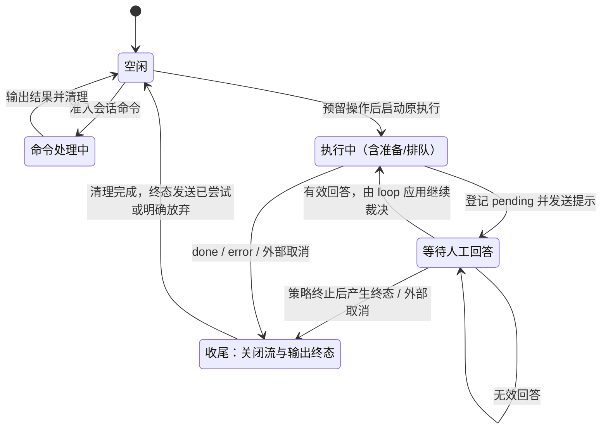
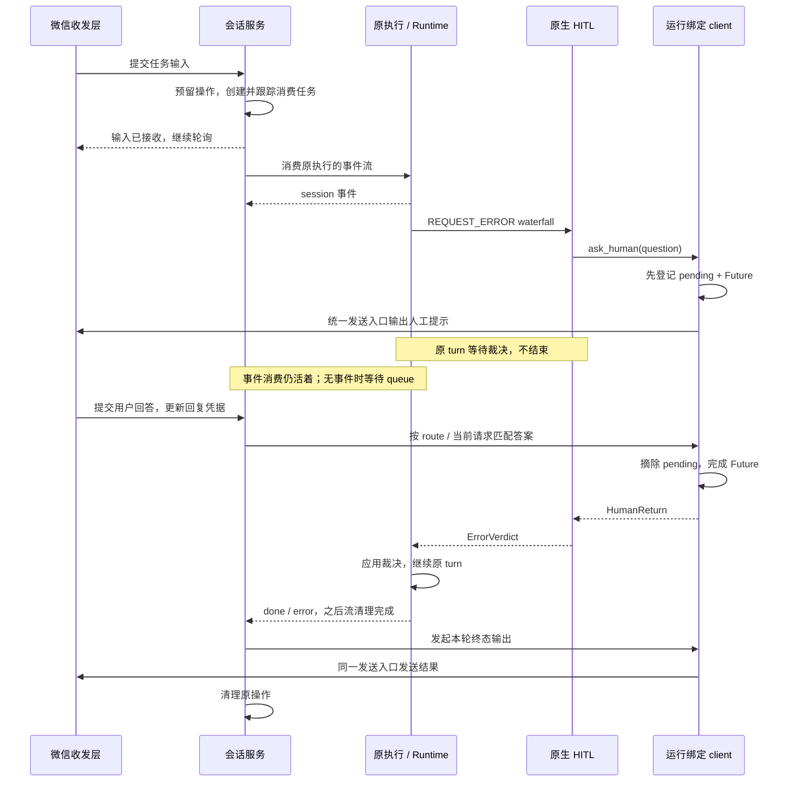

## 版本

| 版本 | 更新内容 |
| ---- | -------- |
| 1.0 | 明确会话服务、运行绑定 client、原生 HITL 和微信收发层的数据流及状态拥有者 |
| 1.1 | 实现会话服务/纯收发接线，补充已验证接口和取消/关闭清理 |

# 数据流：ConversationInteractionTrace

**Flow 对象**：ConversationInteractionTrace（一次执行及其人工交互）。
**对应 Spec**：[myagent Runtime](../specs/2026-10-03-myagent-runtime-spec.md)。
**状态**：已实施并完成离线集成验证。伪微信两批收发与真实 Runtime/myagent HITL 已验证提示、回答及原 turn 恢复；在线模型和真实微信回复额度尚未联调。

## 范围与已核实事实

- 微信只承担协议收发、认证、媒体转换、回复凭据更新；权限、云端/本地处理归属、命令、Session 引用及 Agent 调度在业务侧完成。拒绝处理的输入不得进入 Agent 或人工回答路径。
- 人在回路继续订阅 myagent 的 `REQUEST_ERROR` waterfall，通过注入的 `HITLChannel` 请求决定；业务接入层不重新实现错误裁决。
- 不引入聊天 bus，不调整 workflow 管理、旧 Session 迁移或本地 SSE 断开语义。不同渠道共用 `session/chat` 存储的决定不变。
- 微信轮询只等待输入转换与服务提交；提交预留操作后及时返回。Agent 和发送任务由服务跟踪，下一批人工回答可在原 turn 等待期间进入。
- 当前 Runtime 的 `stream` 持有原生 turn 任务，`execute` 是它的最终结果收集器。后台调用仍可保留 `execute`。
- myagent 在 step 的 `finally` 内等待错误 waterfall 的裁决，仍可继续执行；这与完成后的 `turn/end` 终态不同。
- 外部库的控制台示例已有单输入读取者、待答 Future、回答唤醒原执行的机制；微信接入沿用这一机制。

## 对象与职责

| 对象 | 拥有的数据/任务 | 不承担的职责 |
| ---- | --------------- | ------------ |
| 微信 transport | 微信连接、轮询游标、回复凭据、媒体收发 | 不解析命令、不选择 Session、不等待 Agent 最终结果 |
| ConversationService | 输入准入、当前操作、会话引用、后台任务集合 | 不决定重试、额外步数或工具熔断处置 |
| SessionCommandService | 命令识别、参数及会话管理结果 | 不导入微信 transport，不调用模型 |
| ConversationClient | 路由发送入口、短期发送锁 | 不读取微信轮询，不调用 Agent loop |
| RunClient（会话 client 的本轮绑定） | 不变的运行归属、待答请求；提供 `ask_human` | 不跨轮复用旧 Future，不直接修改 loop 状态 |
| 原生 HITL 策略 | 请求内容、人工超时、`HumanReturn` 到 `ErrorVerdict` 的转换 | 不知道微信 user ID 或协议凭据 |
| Runtime / myagent | Session 串行、turn 任务、事件流、裁决落定、记录与用量 | 不读取下一条微信消息 |

装配方向：微信 `on_message` 指向会话服务的提交入口；会话 client 的发送入口指向微信发送方法；RunClient 注入原生 HITL。

Runtime 的 slot 内使用一次注册的转接 client，原生 HITL 始终引用这个转接对象。本轮开始时它的 target 绑定到 RunClient，本轮清理时清空 target；这不是注销事件回调，也不是新增一套交互状态机。

输入提交只接收/登记工作，及时返回；命令查询、网络发送和 Agent 执行由服务跟踪的任务处理。不得让输入提交等待这些长操作，也不能创建没有关闭归属的后台任务。

## Flow 对象的数据结构

以下是逻辑字段，帮助识别拥有者；不是要求每个对象都落数据库，也不要求将所有派生状态实现为字段。

```text
Incoming
  input_id: string                  # 优先采用平台稳定消息 ID
  route: ConversationRoute
  content: content_blocks           # 归一化文本/媒体
  extra: map                      # 媒体路径等输入信息，不携带旧回复凭据
  request_id: string | null        # 结构化回答可关联请求；微信当前为纯文本

ConversationRoute
  transport_id: string              # 收发实例；当前单微信实例也有固定标识
  channel: string
  recipient_id: string

ConversationEntry
  route: ConversationRoute
  session_reference: UUID | null    # 业务存储；不是回复凭据
  active_operation: Operation | null

Operation
  operation_id: string              # 准入时生成；Runtime 尚未返回 run_id 时也存在
  kind: command | agent
  source_input_id: string
  task: owned_task                  # 命令或事件消费任务
  run_binding: RunBinding | null    # 仅 agent 操作使用

RunBinding
  operation_id: string
  runtime_run_id: string | null     # Runtime 在启动 turn 前绑定
  session_id: UUID | null           # Runtime 在启动 turn 前绑定，session 事件保存引用
  route: ConversationRoute          # 本轮固定；不能随 /continue 改变
  pending: PendingInteraction | null
  terminal: terminal_result | null  # done/error，只认 Runtime 的权威终态
  terminal_attempted: boolean       # 本进程至多发起一次终态发送

PendingInteraction
  request_id: string
  operation_id: string
  runtime_run_id: string
  session_id: UUID
  route: ConversationRoute
  question: HITLMessage
  answer_future: Future<HumanReturn>
  timeout: seconds                 # 策略层 wait_for 控制；pending 不保存 deadline 字段

Outgoing
  output_id: string
  route: ConversationRoute
  operation_id: string | null
  runtime_run_id: string | null
  session_id: UUID | null
  request_id: string | null
  kind: command | interaction | notice | terminal
  content: business_message
```

关键字段：`input_id` 去重输入，`operation_id` 防止旧任务清理新任务，`runtime_run_id` 关联 Runtime，`request_id` 关联人工回答，`route` 决定输出和答案归属。平台没有稳定消息 ID 时，不能用随机 ID 宣称已解决重复投递。

回复凭据由 transport 按 route 更新、发送时读取。RunBinding 固定接收人和执行归属，不固定一份过期微信 `context_token`。人工选择不追加成 Session 的新 user turn，裁决由原生 loop 留痕。

## 最小状态与拥有者

只以 `active_operation`、其中的 `pending`、`terminal` 推导状态；不再同时存储 `is_running`、`is_waiting`、`is_finished` 等重复标记。

| 显示状态（派生） | 判断依据 | 允许改变它的对象 |
| ---------------- | -------- | ---------------- |
| 空闲 | 无当前操作 | 会话服务准入/完成清理 |
| 命令处理中 | 当前操作是命令 | 会话服务，命令结果经同一输出入口发送 |
| 执行中 | 当前操作是 Agent，无 pending、无 terminal | 会话服务创建；Runtime 推进执行 |
| 等待回答 | 当前 Agent 操作有 pending | RunClient 登记；回答/超时/取消摘除 |
| 收尾中 | 已有 terminal，或任务取消后正在释放资源 | 原执行消费任务；不再接受答案 |

Session 锁排队属于“执行中”的细分观测，不再增加独立业务状态。原生执行和排队都仍按 Runtime 契约视为 Session 运行中。



图中的“有效回答后终止”仍先返回裁决给 loop，不能由回答处理器直接伪造 `done`。恢复也只是唤醒原协程，不创建第二个 turn。

## 与其他数据流的耦合

| 本 Flow 变化 | 关联对象的影响 | 集合点 |
| ----------- | --------------- | ------ |
| 准入 Agent 操作 | 原 Runtime 流持续存在；同 Session 在原锁上串行 | 会话服务 → Runtime |
| 获得 session 事件 | 绑定本轮 ID，持久化会话引用，失败时不假装引用已保存 | 会话服务 → 引用存储 |
| pending 建立 | step 的错误 waterfall 等待；接收与输出通道仍可工作 | HITL → RunClient |
| 回答 Future 完成 | waterfall 返回裁决，loop 放宽预算/继续/结束 | RunClient → 原生 HITL → loop |
| 等待人工回答 | Session 仍运行中；前端删除/改名和增量提取继续遵守现有互斥 | Runtime ↔ ChatSessionManager |
| 发送人工提示/等待回答 | 原 Session 执行锁持续持有；同 Session 其他 route 排队，答案路径不取此锁 | Runtime ↔ 输入路由 |
| Runtime done/error | 保存本轮终态，关闭流，结算记录/用量，再发送终态 | 原消费任务 → 输出入口 |
| 新微信输入 | 回复凭据刷新；不修改旧执行的接收人和 Session | transport → 会话服务 |
| 服务关闭 | 拒绝准入，取消并等待自有任务，随后关闭 Runtime 和 transport | 应用生命周期装配 |

## 流程概览：人在回路的完整时序



发送动作是调用微信发送 API，不是微信接收函数的返回值。事件 queue 没有内容时的等待不消耗接收循环，也不会阻止 client 主动输出提示。

## 数据流节点

以下链路对应已实现的节点；生产函数入口与源码行号列于文末。

### 链路 1：普通聊天输入与任务准入

1. **输入接入与权限/处理归属判断**
   状态：尚未准入 → 拒绝或可处理 | 持久化：回复凭据按既有存储维护 | 跨模块：微信 → 业务服务。
   步骤：协议转换 → 注入的权限/云端归属检查 → 更新凭据与下载媒体 → 统一输入路由。被拒输入不能唤醒别人的 Future。
2. **路由与操作预留**
   状态：空闲 → 执行中 | 持久化：无 | 跨模块：业务服务 → Runtime。
   步骤：检查 pending/命令/忙状态 → 在任何长 await 之前预留操作 → 创建并登记后台消费任务 → 返回接收入口。
3. **建立本轮绑定**
   状态：执行中 → 执行中 | 持久化：Session 引用 | 跨模块：Runtime → 引用存储。
   步骤：加载会话 → 获得 session/run 标识 → 更新本轮绑定与会话引用。引用保存失败须中止或明确返回失败，不能静默声称后续会话已正确选择。
4. **事件消费**
   状态：执行中 → 等待回答或收尾 | 持久化：原生执行记录、用量 | 跨模块：Runtime → client。
   步骤：持续消费同一流 → 微信不输出模型 token 分块 → 仅终态进入最终答复路径。人工提示由 HITL client 独立发出。

### 链路 2：触发人工交互与答案唤醒

1. **在错误 waterfall 上请求人工决定**
   状态：执行中 → 等待回答 | 持久化：沿用原生错误与裁决记录 | 跨模块：myagent HITL → client。
   步骤：策略认领错误 → 创建 request_id/Future → 先登记 pending → 发送问题 → 等待 Future。
2. **下一条输入匹配待答请求**
   状态：等待回答 → 等待回答或执行中 | 持久化：回复凭据；答案不作为新 user turn | 跨模块：输入路由 → RunClient。
   步骤：验证 route/当前运行/请求归属 → 检查输入重复与选项 → 无效则由跟踪任务提示重输 → 有效则无 await 地摘除匹配 pending 并完成 Future。提示重输同样是网络输出，不在微信读取循环内等待。
3. **原执行恢复**
   状态：执行中 → 执行中或收尾 | 持久化：原生 grant/error-handle 等记录 | 跨模块：HITL → loop。
   步骤：原 ask_human 返回 HumanReturn → 策略返回 ErrorVerdict → loop 落定决定 → 原事件流继续或结束。

一个 route 同时只有一个未解决交互；不同 route 的答案隔离。重复 request 或嵌套 ask 请求必须拒绝，不能覆盖已有 Future。

### 链路 3：命令与忙状态路由

`/new`、`/continue`、`/session-list` 的参数、历史回顾、上一会话指令和分页语义保持不变。下表为会话服务已实现的并发准入行为。

| 当前观测 | 输入 | 路由结果 |
| -------- | ---- | -------- |
| 等待回答 | 文本/选择 | 优先作为人工回答；无效内容提示重输，不启动 Agent |
| 等待回答 | `/new` 或 `/continue` | 按无效回答处理，不切走正在等待的运行 |
| 执行中且无 pending | 普通聊天 | 忙提示，不在微信业务层隐式排第二个普通请求 |
| 执行中且无 pending | `/new`、`/continue` | 拒绝切换，保留原运行绑定 |
| 执行中且无 pending | `/session-list` | 可作为只读命令输出；不改变运行归属 |
| 空闲 | 已知命令 | 预留命令操作 → 执行管理/持久化 → 统一输出 → 清理 |
| 空闲 | 普通聊天 | 预留 Agent 操作 → 启动执行 |
| 命令处理中/收尾中 | 新普通输入或切换命令 | 忙提示；不得抢先创建或改写当前操作 |
| 任意 | 重复 input_id | 不再次裁决、启动执行或重复执行命令 |

未新增 `/cancel` 命令。图中的外部取消指已有任务取消或服务关闭。取消选项由原生 HITL 返回裁决。

运行期间的只读命令生成自己的 operation_id，只存入服务的后台任务集合，不占用或替换该 route 的 active_operation。结束时按自身 operation_id/task 移除，不能清除原 Agent 操作；服务关闭也必须等待这些只读命令及提示输出任务。它们只是有归属的短任务，不新增一套会话状态。

`/new` 的空会话落盘与引用保存仍须保持回滚；输出发送失败不撤销已经提交的会话命令，不自动重新执行命令。

### 链路 4：终态输出与资源释放

1. **接收终态**
   状态：执行中 → 收尾中 | 持久化：Runtime 本轮结算 | 跨模块：Runtime → 原消费任务。
   步骤：保存 done/error → 阻止新 pending → 继续耗尽/显式关闭流并等待 Runtime 清理。当前 done 的 yield 早于 finally；不能将“看见 done”等同于“资源已释放”。
2. **统一输出**
   状态：收尾中 → 收尾中 | 持久化：无新业务提交 | 跨模块：client → 微信发送 API。
   步骤：标记 terminal_attempted → 在该 route 的短发送锁内尝试终态发送 → 记录发送结果。成功答复、运行错误、策略终止都只走一处终态路径。
3. **清理当前操作**
   状态：收尾中 → 空闲 | 持久化：已由 Runtime/命令完成 | 跨模块：无。
   步骤：确认流及任务释放 → 仅当 active_operation 仍是本 operation 时摘除 → 从任务集合移除。发送失败也要清理，不能占住 route 永久等待。

“至多一次终态发送尝试”是本进程去重，不是网络恰好一次送达保证。API 超时可能已经发送成功；本轮不盲目重发，也不把发送异常当 Agent 错误再发送另一份终态或重跑 Agent。

## 并发边界与不变量

| 不变量 | 避免的问题 |
| ------ | ---------- |
| 准入检查与操作预留在同一短原子段完成 | 两条首次消息同时启动两个无 Session 的任务 |
| 答案路由不获取 Runtime 的 Session 执行锁 | Agent 持 Session 锁等待答案，答案又等该锁的死锁 |
| 输出锁只覆盖单次发送，人工等待不持锁 | 提示发出后其他输出永远等待 |
| 同 route 的所有 client 共用发送锁；不同用户独立 | 人工提示、命令和最终输出互相抢发送；全局慢用户阻塞其他人 |
| pending 在发送提示前登记 | 用户快速回答却被当作普通聊天 |
| 完成/取消 Future 前校验身份与 done 状态 | 超时与回答竞争引发 InvalidStateError |
| pending 清理按对象/request_id 比较，不无条件赋空 | 旧 ask 的 finally 把下一次请求抹掉 |
| 任务清理按 operation_id 比较，不直接 pop(route) | 旧任务抹掉新任务引用 |
| 持久化 context 的转接 client 在 Session 锁内绑定本轮 target，清理时清空匹配 target | 本地/微信共用同一 Session 时发到旧接收人 |
| 提示、命令答复不标记 terminal_attempted | 提示占用程序内的终态发送资格 |

多个 route 使用同一个 Session 时，仍由现有 Runtime 锁串行。一个 route 的答案只唤醒其自己的请求，不能用 Session ID 作为唯一答案路由键。

## 异常与清理

| 场景 | Future / pending | 原执行 | 输出及入口 |
| ---- | ---------------- | ------ | ---------- |
| 用户在提示发送结束前回答 | 已登记的 Future 可完成；ask 的清理只针对本请求 | 发送确认后继续消费已完成 Future | 不再创建第二个 turn |
| 无效回答 | 保留原 pending | 继续等待，截止时间不重置 | 同入口提示有效选项 |
| 重复答案 | 已完成请求不二次 set_result | 不再执行同一裁决 | 有稳定 input_id 时去重 |
| 回答与超时同时到达 | 同一事件循环只允许一个成功完成；另一方识别失效 | 采用已确定裁决/超时策略 | 已匹配的失效答案不回退成普通聊天 |
| HITL 等待超时 | ask 取消等待并按身份清理 pending | 原生 HITL 将超时转换成终止裁决 | 等 Runtime 终态后统一输出 |
| 提示发送失败 | 清理 pending，取消未完成 Future | 失败沿原执行传播并收尾；不能一直等人 | 不递归触发另一个 ask 或循环发错误 |
| Runtime 失败/超时 | 清理本轮 pending/Future | 关闭流并等待 turn 释放 | 统一终态路径，失败发送不再重跑 |
| 外部取消 | 清理 pending，保持 CancelledError 的取消语义 | aclosing 关闭流，取消并等待 turn | 关闭场景可明确放弃发送，仍完成清理 |
| 最终答复发送失败或结果未知 | 此时应无 pending | Agent 已完成，不重跑 | 标记发送失败/未知，清理 route |
| 服务关闭 | 禁止新 pending，取消已有等待 | 拒绝准入 → 取消并 await 自有会话任务 → 关闭 transport；共享 Runtime 由应用关闭 | transport 保留到需收尾的任务停止后 |

微信处理归属在人工等待期间改变、进程重启，均不能把内存 Future 转移给另一进程。需要停止旧运行并清理，本轮不承诺跨进程继续；另进程不得将纯文本“继续”宣称已恢复旧任务。

微信纯文本回复若不带 request_id，在原运行彻底结束后到达，或在下一次同选项问题出现后到达，无法可靠辨认是否为迟到的旧答案。request_id 在内部记录并不能自动解决这个歧义：带关联 ID 的回复可以明确拒绝过期请求；纯文本模式只匹配当前待答请求，空闲时仍按普通聊天处理。微信当前使用选项编号/名称的纯文本回答，不承诺纯文本能够识别所有迟到答案。

## 原生 HITL 接线注意点

1. 复用原生 `HITLMessage`、`HumanReturn`、`ErrorVerdict`，不再定义另一套错误恢复动作。
2. 同一个 HITL 实例的最大步数和工具熔断回调放在同一 `AgentPolicySpec` 中；原生注册按对象身份去重，分开注册会跳过第二组。
3. 原生事件服务没有主动 unregister/off 接口，context 会持有注册的策略对象。因此每 slot 只注册一次 HITL 和转接 client，在 Session 锁内替换本轮 target；清理只清空匹配的 target，并非注销订阅。不能每次注册一个新策略累计旧 client，也不能在等 Session 锁之前改缓存策略的接收人。
   未绑定交互 client 的调用路径不启用人工等待，由未认领策略委托后续处理；本轮不隐式改变本地 SSE 或后台 workflow 的等待契约。
4. 原生策略拥有人工超时；RunClient 负责 Future 清理。当前 Runtime 的整体 `1000` 秒超时也包含人工等待，谁先到期谁负责结束，另一条路径随后只清理。
5. 原生最大步数取消返回不带 `as_error` 的 break，loop 正常返回但 turn 记 `interrupted`；工具熔断取消返回带 `as_error` 的 break，上抛并记 `error`。当前 Runtime 将所有非 success 的 turn 统一转换成 `error` 事件，因此两种取消都不能当作 done 成功回答。Runtime 的 error.data 保留原生 reason_type 等终态字段；会话服务将 interrupted 显示为 [CANCELLED]，工具熔断取消仍按原生 error 显示为失败。

## 微信回复凭据的未核实边界

当前源码在发送 API 中携带 `context_token`，没有实现或证明“每个输入只能发送一次”的协议额度。单发送通道、回复凭据、单次回复额度是三件不同的事。

本 Flow 保证程序侧共享输出入口和接收不中断，不保证平台接受任意次数发送。若存在一次回复额度，凭据/额度调度在 transport 内处理，不能以“调用 send 即可”掩盖限制。

真实微信上线前仍需验证：同一凭据发送人工提示后，用户回答带来的凭据能否发送最终结果；多次人工询问、无效答案提示和异步只读命令是否占用额度。额度不足时必须明确返回不可发送，不得令 Agent 等待一个从未送达的问题。

## 重构后的关键边界

旧接收函数等待最终结果和 transport 持有命令/引用的问题已移除。ConversationService.submit 预留操作并启动自有任务；RunClient.answer 同步完成 Future，不取得 Session 执行锁。回复凭据和会话引用经两种单字段写入接口更新，停止时不再批量保存旧缓存。

权限撤销导致任务在第一次调度前取消时，协程 finally 不会执行；任务 done 回调按操作身份释放占用。drain 在 gather 后主动摘除已完成任务，避免依赖尚未调度的清理回调而形成忙循环。

## 已实现代码定位

<key_function>
- lifeprism/llm/channel/__init__.py
  - __init__.wire_wechat_channel:20
- lifeprism/llm/channel/wechat/channel.py
  - channel.WechatChannel.start:66
  - channel.WechatChannel.stop:102
  - channel.WechatChannel.send:125
  - channel.WechatChannel._poll_loop:142
  - channel.WechatChannel._handle_wechat_message:165
- lifeprism/llm/channel/wechat/reply_store.py
  - reply_store.WechatReplyStore.remember:73
  - reply_store.WechatReplyStore.get_token:53
  - reply_store.WechatReplyStore.migrate_legacy:95
- lifeprism/llm/conversation/service.py
  - service.ConversationService.submit:110
  - service.ConversationService._run:198
  - service.ConversationService._command:178
  - service.ConversationService._operation_done:168
  - service.ConversationService.drain:272
  - service.ConversationService.close:280
- lifeprism/llm/conversation/client.py
  - client.ConversationClient.send:26
  - client.RunClient.bind:60
  - client.RunClient.ask_human:81
  - client.RunClient.answer:109
  - client.RunClient.close:153
- lifeprism/llm/conversation/commands.py
  - commands.SessionCommandService.handle:74
- lifeprism/llm/conversation/references.py
  - references.WechatSessionReferences.get:57
  - references.WechatSessionReferences.set:72
- lifeprism/llm/runtime/hitl.py
  - hitl.HITLPolicy.bind:24
  - hitl.HITLPolicy.clear:32
  - hitl.HITLPolicy.maxstep_continue:44
  - hitl.HITLPolicy.tool_breaker_continue:50
- lifeprism/llm/runtime/service.py
  - service.AgentRuntime.stream:338
  - service.AgentRuntime._stream:384
  - service.AgentRuntime.execute:535
  - service.AgentRuntime.close:610
</key_function>

外部库入口：myagent/agent/hitl/hitl.py 的两个原生回调与 agent/core/agent/loop.py 的 waterfall/裁决应用。默认工具配置不抛熔断错误，工具熔断人工回调只有在工具启用 raise_on_break 后触发；本轮保持工具默认配置。

## 实施验收场景

| 场景 | 必须观察到的结果 |
| ---- | ---------------- |
| 无交互正常聊天 | 输入提交及时返回；一个 turn；一个最终输出尝试 |
| 达到步数上限后继续 | 提示送达；下一批回答可进入；同 run/turn 恢复；grant 由 loop 记录 |
| 提示发送中快速回答 | 找到已登记 pending；不产生额外 user turn |
| 回答与超时竞争 | 无重复裁决、InvalidStateError 或悬挂任务 |
| 一轮先后两次人工请求 | 两个不同 request_id；第一次 finally 不清理第二次 |
| 不同用户并行/同 Session 跨渠道排队 | 答案和输出不串人；排队仍按 Runtime 现有互斥 |
| 两条首次消息并发 | 准入预留有效，不同时创建两条无归属运行 |
| 等待中 /new 或 /continue | 不切走原运行，也不启动新 turn |
| 命令引用保存失败/答复发送失败 | 前者保留回滚；后者不重执行已提交命令 |
| 提示发送失败/终态发送失败 | pending、流、任务可清理；不重新执行 Agent |
| 服务关闭及重新启动 | 无残留 Future/策略旧路由/后台任务；不宣称恢复旧协程 |

## 相关文档

- [myagent Runtime Spec](../specs/2026-10-03-myagent-runtime-spec.md)：当前执行、Session 管理及微信命令契约。
- [微信接入 Spec](../specs/2026-05-01-wechat-channel-integration-spec.md)：纯收发、输入/输出和生命周期契约。
- [旧微信消息 Flow](2026-07-06-llm-wechat-message-flow.md)：认证与媒体处理参考；其中旧 bus 执行路径不是当前迁移后的实现。
- [架构地图](../ARCHITECTURE.md)：现有分层及 Runtime/会话服务数据流。
