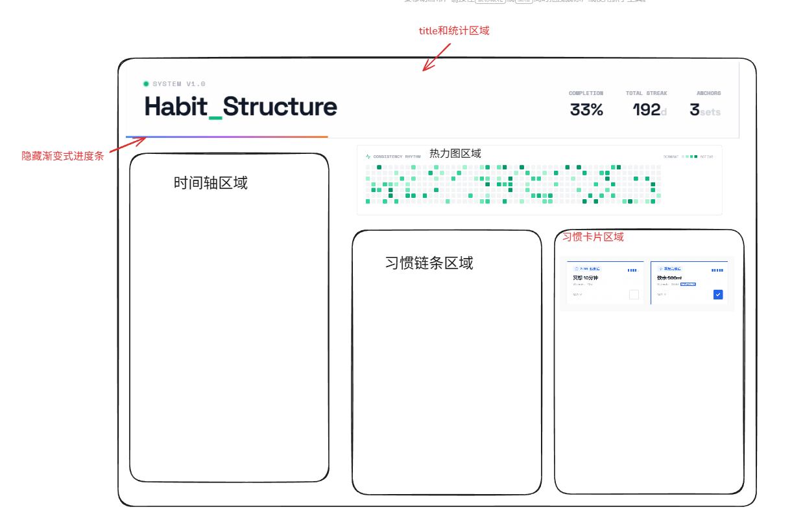

## 开始设计之前的要求

忽略当前文件夹下的所有界面安排。现在需要重新设计一个界面系统。

## 新节目布局

草图

包含元素：
1. 最上方的标题栏，统计数据：今天完成度，坚持多少天，多少激活的习惯（来源：docs\功能需求\习惯系统\habits.tsx）

2. 标题栏下方是一个渐变式的隐藏进度条，这个设计要保留（来源：docs\功能需求\习惯系统\habits.tsx）

3. 左侧是时间轴区域

4. 右侧上方是一个横向的热力图（来源：docs\功能需求\习惯系统\habits.tsx）

5. 下方由习惯链条和习惯卡片区域组成（左右布局）

6. 习惯卡片区域的风格参考（来源：docs\功能需求\习惯系统\habits.tsx），保留动作效果

## 节目整体风格

采用赛博极简风格和瑞士平面风格。

## 注意（必须重点关注这部分内容）

当前所提供的全部内容仅供参考，需要设计一个更好的更有创意的页面！！！